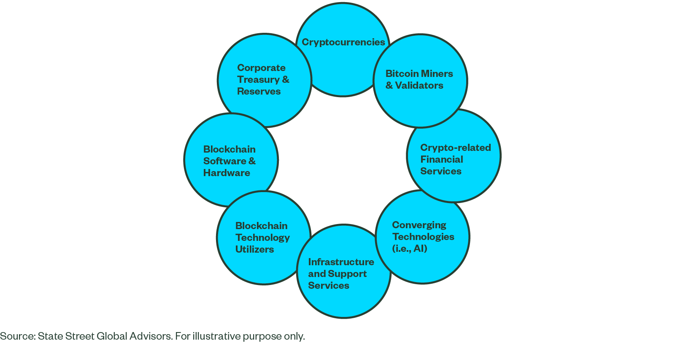

Cryptocurrency, a digital or virtual asset that uses cryptography for secure financial transactions, has emerged as a significant force in the financial markets. Unlike traditional currencies, cryptocurrencies operate on decentralized networks based on blockchain technology, which ensures transparency and security while eliminating the need for intermediaries. Bitcoin, Ethereum, and numerous other cryptocurrencies have garnered global attention, attracting investors seeking high returns and a hedge against traditional financial systems' vulnerabilities.

Investment advice plays a crucial role in successful cryptocurrency trading due to the market's inherent volatility and complexity. The rapidly evolving landscape of digital currencies necessitates informed decision-making, supported by data-driven insights and strategic thinking. Professional investment advice can help traders navigate market fluctuations, identify profitable opportunities, and mitigate risks.

Algorithmic trading, defined as the use of computer algorithms to automate trading decisions and execute transactions at superior speeds, has significantly impacted cryptocurrency investments. This method leverages historical data, quantitative analysis, and machine learning techniques to develop strategies that optimize trading outcomes. By removing human emotions and biases from the equation, algorithmic trading can enhance efficiency and accuracy.

This article intends to provide readers with a comprehensive understanding of cryptocurrency investments, highlighting the importance of credible sources of investment advice and the transformative potential of algorithmic trading. Readers will walk away with insights into the volatility and characteristics of the crypto market, different cryptocurrencies' unique profiles, and the role of exchanges. Additionally, guidance will be provided on identifying trustworthy sources for cryptocurrency investment advice and the essential skills and tools required for algorithmic trading.

Reliable investment advice is critical in the cryptocurrency domain, where misinformation and speculative behavior can lead to substantial financial losses. As investors explore strategies and sources of information, it is essential to critically assess credibility and relevance, ensuring that decisions are well-informed and aligned with individual investment goals and risk tolerance.

## Table of Contents

## Understanding Cryptocurrency Investment

Cryptocurrency, as an asset class, presents an unconventional yet compelling addition to the financial landscape. It encompasses digital currencies that operate on decentralized platforms using blockchain technology. This class of assets is characterized by attributes such as high [liquidity](/wiki/liquidity-risk-premium) and the potential for high returns, alongside significant risks. These attributes are largely driven by the fundamental principles behind blockchain technology, distributed ledgers, and the economic principles of scarcity as seen in assets like Bitcoin.

Key factors driving the popularity of [cryptocurrency](/wiki/cryptocurrency) investments include decentralization, which attracts investors seeking alternatives to conventional banking systems; the prospect of high returns, as demonstrated by the significant appreciation seen in flagship cryptocurrencies; and the technological appeal of blockchain, which promises enhanced security, transparency, and efficiency. However, the risks are equally pronounced. The lack of regulatory oversight, the potential for cyber threats, and the inherent [volatility](/wiki/volatility-trading-strategies) are crucial considerations for prospective investors.

The cryptocurrency market is notably volatile, frequently undergoing rapid price swings that can significantly impact investor portfolios. Volatility in the crypto market is driven by several factors, including speculative trades, changes in regulatory environments, technological advancements, and macroeconomic trends. While volatility presents opportunities for [arbitrage](/wiki/arbitrage) and significant gains, it also poses risks of substantial losses, necessitating a comprehensive risk management strategy for investors.

Cryptocurrencies can be categorized into different types, each offering distinct investment profiles. Bitcoin, often termed digital gold, serves as a store of value. Ethereum introduces the concept of smart contracts, enabling decentralized applications (DApps) on its blockchain. Other altcoins such as Ripple (XRP) aim to revolutionize transaction protocols, especially in cross-border payments. Each type presents unique risk-reward metrics and technological innovations, influencing investor choice irrespective of market conditions.

Crypto exchanges play a pivotal role in facilitating investments in cryptocurrencies. These platforms offer a marketplace for buyers and sellers to execute transactions, providing functionalities like fiat-to-crypto trading pairs, margin trading, and lending services. Major exchanges such as Binance, Coinbase, and Kraken have enhanced user experience and accessibility, offering robust trading interfaces and security measures. They set precedents with practices such as requiring Know Your Customer (KYC) verifications to enhance security and build trust among users.

Overall, understanding these dimensions illuminates both the potential and the challenges associated with cryptocurrency investments, framing them as a dynamic component of modern investment strategies.

## Key Sources for Cryptocurrency Investment Advice

Cryptocurrency investment requires accessing reliable sources to navigate the rapidly evolving digital asset landscape effectively. Identifying and utilizing trusted platforms, influencers, news outlets, and online communities are critical steps in ensuring informed investment decisions.

Trusted online platforms are central to cryptocurrency investment advice. Platforms such as CoinDesk, CoinTelegraph, and CryptoSlate provide comprehensive news, analysis, and educational content aimed at both novice and experienced investors. These sites offer insights into market trends, regulatory changes, and emerging technologies that impact cryptocurrency valuations. Additionally, forums such as Reddit's r/cryptocurrency and BitcoinTalk are invaluable resources where investors discuss market sentiments, share strategies, and provide peer-reviewed information.

Industry influencers and thought leaders play a significant role in shaping cryptocurrency discourse. Figures like Andreas M. Antonopoulos, Vitalik Buterin, and Anthony Pompliano offer expertise and an insider perspective on the digital currency ecosystem. Following these influencers on platforms like Twitter or subscribing to their podcasts can provide timely insights and expert opinions that help guide investment strategies.

Financial news outlets also significantly influence cryptocurrency market understanding. Established publications such as Bloomberg, Reuters, and The Financial Times frequently feature sections dedicated to digital currencies. These outlets typically have rigorous editorial standards, ensuring that the information provided is accurate and reliable. Their coverage includes critical issues such as regulatory announcements, institutional adoption, and market analysis that could impact cryptocurrency markets.

Forums and online communities contribute to the diversity of cryptocurrency investment insights. Platforms like Discord and Telegram host many groups where investors and enthusiasts share real-time information and discuss market incidents. These communities foster an atmosphere of shared learning and support, allowing individuals to glean multiple perspectives on current events and potential opportunities.

Critically assessing the credibility and relevance of various sources is essential for informed investment decisions. Investors should consider the source's reputation, the author's credentials, the presence of supporting data, and any potential biases. Cross-referencing information from multiple reputable sources is advisable to construct a well-rounded view of market conditions. Evaluating past performance and consistency in provided information can also help determine a source's reliability.

In conclusion, a careful selection of reliable sources, combined with a critical assessment of the information they provide, is crucial in navigating the complexities of cryptocurrency investments. Engaging with a blend of influential platforms, credible voices, and active communities ensures access to a wealth of knowledge that can significantly enhance investment strategies.

 to Algorithmic Trading in Cryptocurrency

Algorithmic trading, commonly referred to as algo trading, is a method of executing trading orders using automated pre-programmed trading instructions that account for variables such as time, price, and [volume](/wiki/volume-trading-strategy). These algorithms are based on mathematical models, aiming to generate profits at speeds and frequencies that are impossible for a human trader to achieve. In the context of cryptocurrency, [algorithmic trading](/wiki/algorithmic-trading) has gained prominence due to the 24/7 nature of the crypto markets, marked volatility, and the demand for rapid transaction execution.

**Definition and Basic Principles**

Algorithmic trading in cryptocurrency involves the use of algorithms to make decisions on buying and selling digital assets. The basic principle is to develop a rule-based system that replaces manual trading activities. By coding these strategies, traders can capitalize on market opportunities immediately as they arise, without the delay associated with human response times. Algorithms can be designed to execute trades based on technical indicators, price trends, arbitrage opportunities, or a combination of various financial signals.

**Benefits of Algorithmic Trading for Cryptocurrency Investors**

There are several benefits for cryptocurrency investors using algorithmic trading. First, algorithms can execute trades at high speed, ensuring the trader can engage in rapid markets efficiently. Additionally, algo trading can mitigate emotional biases that can otherwise impact decision-making, particularly in the volatile crypto markets. Precision and accuracy in trade execution are enhanced because algorithms systematically enter and [exit](/wiki/exit-strategy) trades based on predefined criteria. Moreover, trading strategies can be backtested using historical data to evaluate their effectiveness before deployment in the live market.

**Overview of Popular Algorithms and Trading Strategies**

Popular algorithmic trading strategies in the cryptocurrency markets include [market making](/wiki/market-making), [trend following](/wiki/trend-following), [statistical arbitrage](/wiki/statistical-arbitrage), and mean reversion. Market making involves simultaneously placing buy and sell orders to profit from the spread, whereas trend following looks to capture gains through analysis of a security's directional [momentum](/wiki/momentum). Statistical arbitrage leverages quantitative models to identify lead-lag relationships between cryptocurrencies, executing trades as these relationships deviate and return to equilibrium. Mean reversion strategies are based on the principle that price will revert to its average over time, allowing traders to buy low and sell high.

**The Role of Coding and Data Analysis Skills in Algo Trading**

Successful algorithmic trading requires proficiency in coding and data analysis. Python is a popular language for building trading algorithms due to its extensive libraries and ease of use. For instance, the `pandas` library is useful for data analysis and manipulation, while `NumPy` and `SciPy` provide powerful mathematical functions. Traders utilize these tools to analyze historical price data and to test their algorithms through simulations known as [backtesting](/wiki/backtesting). Additionally, understanding data retrieval from API platforms and integrating real-time feeds is essential for effective algo trading.

**Risks and Challenges Associated with Algorithmic Trading in the Crypto Market**

Despite its benefits, algorithmic trading in cryptocurrencies comes with risks and challenges. The crypto market’s extreme volatility can lead to substantial losses if algorithms are not properly managed. There is also the risk of overfitting during backtesting, where an algorithm performs well on historical data but fails in live trading due to unforeseen market conditions. Liquidity risks involve the inability to execute trades at desired prices in fast-moving markets. Moreover, technical glitches and system failures can disrupt trading operations. As the regulatory landscape evolves, traders must remain compliant with legal requirements, adding another layer of complexity to algorithmic trading. 

In summary, while algorithmic trading offers multiple advantages, such as speed and emotionless execution, it demands a deep understanding of both coding and market dynamics to navigate its inherent risks successfully.

## Top Platforms for Algorithmic Trading of Cryptocurrencies

Cryptocurrency algorithmic trading has revolutionized the way investors approach the crypto market by leveraging automation and advanced analytics. Selecting the right platform to support such trading activities is crucial for both experienced traders and newcomers alike. Here, we examine the top platforms offering robust features for algorithmic trading of cryptocurrencies.

### Leading Platforms for Algorithmic Trading

1. **Binance**  
   Binance stands out as a leading cryptocurrency exchange with a comprehensive set of tools for algorithmic trading. Its API allows users to automate trades using custom scripts and bots, providing extensive market data streams. Binance also supports a wide variety of cryptocurrencies, allowing traders to diversify their portfolios. Its fees are competitive, with tiered levels based on trading volume. 

2. **Coinbase Pro**  
   Known for its security and regulatory compliance, Coinbase Pro offers a robust platform for algorithmic trading. Though its API supports automated trading, the range of supported cryptocurrencies is slightly more limited than Binance. Coinbase Pro is a reliable choice for traders prioritizing safety and ease of use, despite slightly higher fees.

3. **Kraken**  
   Kraken is renowned for its security measures and comprehensive suite of trading features, including margin trading and their OTC desk for large trades. Their API provides advanced functionalities for algorithmic trading, including support for complex order types. Kraken’s fee structure is tiered, similar to Binance, offering reduced rates for higher trading volumes.

4. **Bitfinex**  
   Bitfinex offers versatile and powerful algorithmic trading functionalities through its Honey Framework, which allows developers to create custom strategies. It supports a large variety of cryptocurrencies and offers advanced trading tools. While Bitfinex’s fee structure is competitive, it appeals primarily to traders seeking sophisticated trading capabilities.

5. **eToro**  
   Although eToro is known primarily as a social trading platform, it supports algorithmic trading through its advanced API. It also offers a unique feature: social trading, where users can mirror the trades of successful traders. However, its fees tend to be higher, partly due to the value-added features like social insights.

### Comparison of Features, Fees, and Accessibility

While Binance and Kraken are top choices for those looking for a blend of low-cost trading and robust algorithmic support, Coinbase Pro prioritizes secure transactions, making it ideal for risk-averse traders. Bitfinex caters to tech-savvy users with its customizable Honey Framework, whereas eToro stands out due to its social trading features alongside algorithmic capabilities.

| Platform     | Key Features                                         | Fees                                    | Accessibility     |
|--------------|------------------------------------------------------|-----------------------------------------|-------------------|
| Binance      | API, Multiple cryptocurrencies, Tiered fee structure | Low to medium (based on trading volume)  | Wide access       |
| Coinbase Pro | Regulatory compliance, Strong security               | Medium to high                          | Limited by region |
| Kraken       | Margin trading, Advanced options, Secure             | Low to medium                           | Broad access      |
| Bitfinex     | Custom strategies, High liquidity                    | Medium                                  | High for experts  |
| eToro        | Social trading, Advanced API                         | High                                    | Global but restricted in some areas |

### Choosing the Best Platform

Selecting the best platform involves assessing personal trading needs, such as the importance of fees, desired cryptocurrencies, and the necessity for high-security measures. Traders who prioritize low fees and access to multiple cryptocurrencies may prefer Binance, whereas those emphasizing security and compliance might opt for Coinbase Pro.

### Integration of Techno-Analysis Tools and Data Feeds

Successful algorithmic trading relies heavily on integrating robust techno-analysis tools and real-time data feeds. Platforms like Binance provide a comprehensive suite of APIs to facilitate this integration, supporting real-time data analysis and transaction execution.

### Security Considerations

Ensuring the security of both funds and personal data is paramount. When selecting a platform, traders must evaluate the security protocols in place, such as two-[factor](/wiki/factor-investing) authentication, encryption practices, and protection against hacking attempts. Platforms like Kraken and Coinbase Pro have established themselves as leaders in implementing stringent security measures.

In summary, the choice of a trading platform should be informed by an assessment of fees, features, accessibility, and security considerations, aligned with individual trading goals and risk tolerance.

## Building and Testing Your Algorithmic Trading Strategy

Developing a successful algorithmic trading strategy for cryptocurrencies involves several critical steps, each designed to enhance decision-making, performance, and risk management in a volatile market.

### Steps to Develop a Successful Algorithmic Trading Strategy

1. **Define Objectives and Constraints**: Establish the goals of your trading strategy. These could include maximizing returns, minimizing risk, or achieving a balance between the two. Consider constraints such as investment size, market exposure limits, or preferred trading times.

2. **Select an Algorithmic Model**: Choose a suitable algorithmic model based on your objectives. Common models include mean reversion, momentum-based strategies, and arbitrage. Each model carries unique assumptions about market behavior and opportunities.

3. **Data Collection and Preparation**: Gather historical market data that your algorithms will analyze. This data typically includes price, volume, and order book information. Data quality is crucial as inaccuracies can lead to faulty strategy conclusions. 

4. **Feature Engineering**: Create relevant features from the raw data that your algorithm can use to make trading decisions. This can involve calculating technical indicators like moving averages, RSI, or Bollinger Bands.

5. **Coding the Algorithm**: Translate your strategy into a programmatic form using a programming language like Python. Python offers robust libraries such as pandas for data manipulation and backtrader for strategy development and testing.

### Backtesting Your Strategy Using Historical Data

Backtesting is foundational for evaluating the efficacy of your trading strategy under historical market conditions. The process involves:

- **Historical Data Simulation**: Run your algorithm on historical data to simulate trades. This step checks how the strategy would have performed in the past.
- **Performance Metrics**: Analyze the outputs using metrics such as Sharpe Ratio, maximum drawdown, and total return. These metrics help in quantifying the strategy's risk-adjusted returns.

### The Importance of Continuous Testing and Iteration

Algorithmic trading strategies must be adaptive to changing market conditions. Continuous testing and iteration are crucial, involving:

- **Walk-Forward Analysis**: Test the strategy on out-of-sample data by varying market scenarios to ensure robustness. This helps validate that the strategy performs well even when conditions change.
- **Parameter Optimization**: Fine-tune algorithm parameters such as stop-loss thresholds or entry/exit points through iterative testing cycles. Beware of overfitting, where a model becomes too tailored to historical data and loses generalizability.

### Managing Risks and Setting Parameters

Risk management is paramount to sustaining trading strategies. Key practices include:

- **Setting Stop-Losses and Take-Profits**: Implement automatic stop-loss and take-profit triggers to protect against unexpected market movements.

- **Position Sizing**: Determine the appropriate size of each trade to balance potential returns against risk exposure. Techniques like Kelly Criterion can aid in calculating optimal bet sizes.

### Learning from Failed Strategies to Refine Your Approach

Analyzing failed strategies is critical for improvement:

- **Identify Weaknesses**: Examine underperformance drivers, such as significant drawdowns during specific market conditions or frequent execution errors.

- **Iterative Refinement**: Use insights from failures to adjust and refine your strategy. This could involve changing trading models, enhancing data quality, or incorporating new risk management rules.

By systematically developing, testing, and refining algorithmic trading strategies, investors can better navigate the complexities and opportunities of the cryptocurrency market. This iterative process ensures that strategies remain effective and resilient across various market conditions.

## Legal and Ethical Considerations in Crypto Algo Trading

Cryptocurrency algorithmic trading operates within a complex legal and ethical framework. Understanding these considerations is crucial for traders to navigate this rapidly evolving market. Algorithmic trading in cryptocurrencies is governed by diverse regulatory landscapes across the globe. Each jurisdiction may have varying standards and compliance requirements, impacting how algorithms are developed and used.

### Understanding the Regulatory Landscape

While some countries have established clear guidelines for cryptocurrency trading, others remain ambiguous or restrictive. Jurisdictions such as the United States and the European Union have implemented regulatory frameworks that govern aspects such as market manipulation, anti-money laundering (AML), and know-your-customer (KYC) requirements. For instance, in the U.S., the Securities and Exchange Commission (SEC) and the Commodity Futures Trading Commission (CFTC) play significant roles in overseeing cryptocurrency markets. Similarly, the European Markets in Financial Instruments Directive II (MiFID II) extends its regulations to trading activities involving digital assets.

### Ethical Considerations

Responsible trading practices are paramount. Ethical concerns in algorithmic trading include ensuring fairness, transparency, and accountability. It is essential to design trading algorithms that do not exploit market inefficiencies or engage in manipulative practices such as spoofing or wash trading. Ethical trading means the strategy should consider the broader market impact, ensuring stability and integrity in trading activities.

### Impact of Market Manipulation

Market manipulation remains a critical concern in cryptocurrency trading due to the market's nascent stage and regulatory gaps. Tactics such as pump-and-dump schemes and [order book](/wiki/order-book-trading-strategies) spoofing can distort market prices and mislead investors. To avoid these pitfalls, traders and developers should employ robust monitoring and risk management systems. Continuous surveillance and validation of trading strategies against regulatory standards can mitigate the risks posed by manipulative behaviors.

### Compliance with International Regulations

Adhering to international standards involves both understanding and implementing compliance protocols that align with global regulatory practices. For example, employing AML and KYC procedures is vital across various jurisdictions. A trader's ability to comply with such regulations not only minimizes the risk of legal issues but also positions them as responsible participants in the financial ecosystem. Transparency in reporting trades and auditing algorithms can further ensure compliance and foster trust among stakeholders.

### Future Outlook of Legal Frameworks

The future of legal frameworks surrounding crypto algo trading is shaped by ongoing technological advancements and increasing regulatory scrutiny. As the cryptocurrency market matures, it is expected that regulatory bodies will develop more comprehensive and unified standards. Emerging trends indicate a focus on enhancing transaction transparency, improving security measures, and safeguarding consumer interests. Traders must stay abreast of these developments and proactively adjust their strategies to align with future regulatory landscapes.

In conclusion, legal and ethical considerations in crypto algorithmic trading require ongoing diligence and adaptation. By respecting regulatory requirements and ethical guidelines, traders can contribute to a more sustainable and trustworthy cryptocurrency market.

## Conclusion

In this article, we have explored critical aspects of cryptocurrency investment and algorithmic trading, highlighting how these tools can be leveraged effectively. Cryptocurrency, as an asset class, offers unique opportunities and considerable risk due to its inherent volatility. As such, investment advice from reliable sources is essential for informed decision-making, whether through online platforms, industry influencers, or financial news outlets.

Algorithmic trading represents a transformative approach to cryptocurrency investments, offering benefits such as increased trading speed, the ability to process large data sets, and execute complex strategies. By marrying human insight with algorithmic precision, traders can enhance decision-making, thereby improving their competitive edge. This amalgamation allows for the design of strategies that adapt to market conditions, optimising performance.

New investors should actively seek out and utilise robust resources, ensuring they remain well-informed about market developments and emerging technologies. Understanding the nuances of various cryptocurrencies, the platforms available for trading, and the strategies best suited to one's individual risk profile can significantly enhance investment outcomes.

Algorithmic trading holds substantial potential to revolutionize the digital currency investment landscape. Its ability to automate and enhance trading operations can increase market participation and sophistication in trading strategies. Investors and traders are encouraged to pursue further learning, stay abreast of regulatory developments, and continuously refine their strategies. This ongoing education can lead to enhanced capital growth and risk management, essential components of successful cryptocurrency trading.

## References & Further Reading

[1]: Bergstra, J., Bardenet, R., Bengio, Y., & Kégl, B. (2011). ["Algorithms for Hyper-Parameter Optimization."](https://papers.nips.cc/paper/4443-algorithms-for-hyper-parameter-optimization) Advances in Neural Information Processing Systems 24.

[2]: ["Advances in Financial Machine Learning"](https://www.amazon.com/Advances-Financial-Machine-Learning-Marcos/dp/1119482089) by Marcos Lopez de Prado

[3]: ["Evidence-Based Technical Analysis: Applying the Scientific Method and Statistical Inference to Trading Signals"](https://www.amazon.com/Evidence-Based-Technical-Analysis-Scientific-Statistical/dp/0470008741) by David Aronson

[4]: ["Machine Learning for Algorithmic Trading"](https://github.com/stefan-jansen/machine-learning-for-trading) by Stefan Jansen

[5]: ["Quantitative Trading: How to Build Your Own Algorithmic Trading Business"](https://www.amazon.com/Quantitative-Trading-Build-Algorithmic-Business/dp/1119800064) by Ernest P. Chan