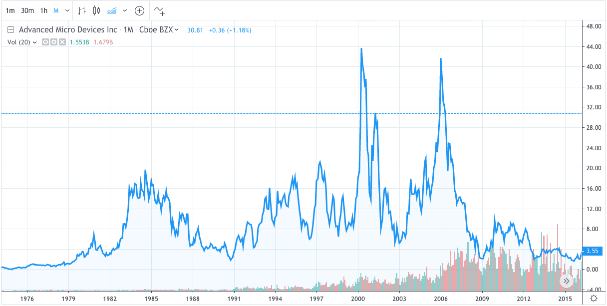

Understanding financial data is crucial for investors aiming to optimize their strategies in the ever-evolving financial markets. Historical stock and index quotes serve as foundational tools that allow investors to back-test their strategies and refine trading algorithms. By analyzing past performance data, investors can identify trends, assess risk, and enhance decision-making processes.

In the context of investing, historical data provide an empirical basis for validating investment strategies and pricing models. Back-testing strategies against historical stock quotes allows investors to simulate the effectiveness of these strategies before committing real capital. Through the use of this data, investors can gain insight into market conditions over time, helping them make more informed predictions about future price movements.



Moreover, historical data is essential for developing robust algorithms in algorithmic trading. These algorithms rely heavily on past data to predict future price actions, optimize trading strategies, and manage risk effectively. The ability to access and analyze historical stock and index quotes is, therefore, indispensable for investors engaged in algorithmic trading.

This article examines various sources available for obtaining historical stock quotes, index quotes, and data pertinent to algorithmic trading. By exploring these resources, investors can better equip themselves with the necessary information to improve their investment outcomes. Whether relying on free or paid services, the availability of comprehensive data sets offers a significant advantage to those looking to gain a competitive edge in the financial markets.

## Table of Contents

## The Importance of Historical Financial Data

Historical financial data serves as a cornerstone for understanding past market behaviors and anticipating future trends. By analyzing this data, investors and analysts gain valuable insights that aid in the validation and enhancement of investment strategies and pricing models. Historical data, often spanning decades, provides a comprehensive record of market performance, enabling stakeholders to assess how external variables such as economic changes, geopolitical events, and technological advancements have historically influenced market dynamics.

Investors utilize historical data to back-test investment strategies. Back-testing involves applying a trading strategy to historical data to evaluate its potential for future success. This process allows investors to identify patterns and indicators that validated profitable decisions while also pinpointing strategies that resulted in losses. 

In addition to strategy validation, historical data plays a critical role in technical analysis—a method of evaluating securities by analyzing statistical trends derived from trading activity, such as price movement and [volume](/wiki/volume-trading-strategy). Technical analysts study chart patterns and indicators to make informed predictions about future price movements. For example, moving averages, a widely used indicator in technical analysis, rely on historical price data to smooth out price fluctuations and identify trends over time.

Mathematically, a simple moving average (SMA) can be calculated as follows:

$$
\text{SMA} = \frac{1}{n} \sum_{i=0}^{n-1} P_i
$$

where $P_i$ is the price at the $i$-th period and $n$ is the number of periods over which the average is calculated. This calculation helps investors and analysts to recognize and act on significant trends without being misled by short-term volatility.

Furthermore, the use of historical data is pivotal in developing predictive pricing models. Pricing models such as the Black-Scholes model for options pricing depend on historical [volatility](/wiki/volatility-trading-strategies) data to estimate future price levels and determine the fair value of options. By effectively leveraging historical data, these models provide more accurate forecasts, enhancing decision-making processes in investment and risk management activities.

Overall, the importance of historical financial data extends across various aspects of financial analysis, serving as a foundational element that supports the accurate assessment, prediction, and optimization of market strategies. Its accessibility through numerous online platforms has further democratized the investment landscape, providing both institutional and individual investors with the tools needed to make informed financial decisions.

## Where to Find Historical Stock Quotes

Numerous platforms provide valuable historical stock price data, catering to both free and paid options for various user needs. Among these, Investopedia's Markets section stands out by offering historical stock quotes that are instrumental for investors and analysts. This platform provides easy access to a wide selection of historical data, covering various stocks and financial instruments. Such a resource is particularly useful for those looking to perform a thorough financial analysis or devise informed investment strategies.

Yahoo Finance is another widely used platform known for its versatility and accessibility. One of its most notable features is the ability to export historical open and close prices, along with other relevant stock data such as volume and market cap. This capability facilitates detailed analysis by allowing users to manipulate the data for custom reports or algorithmic scripting. Investors seeking to apply technical analysis or back-test trading models will find Yahoo Finance valuable due to its extensive database that spans several decades.

When working with these platforms, understanding how to programmatically access and manipulate data can greatly enhance the research process. For instance, Python's pandas library is an excellent tool for importing and analyzing historical stock quotes from CSV files exported from Yahoo Finance. Here is a simple example of how to use pandas to load and examine this data:

```python
import pandas as pd

# Load historical stock data exported from Yahoo Finance
data = pd.read_csv('historical_stock_data.csv')

# Display the first few rows
print(data.head())

# Calculate the daily returns
data['Daily Return'] = data['Close'].pct_change()

# Display descriptive statistics
print(data.describe())
```

This code snippet demonstrates how to read a CSV file of historical stock data and perform some basic analyses, such as calculating daily returns and generating descriptive [statistics](/wiki/bayesian-statistics).

For those seeking other platforms, numerous online services offer historical stock data with varying degrees of depth and analytical tools. Selecting the right provider often depends on the specific requirements such as data range, frequency, and additional features like user support and data visualization tools. It is prudent for investors to assess these options carefully to align with their analytical needs and budget considerations.

## Sources for Historical Index Quotes

Investopedia is a dependable source for accessing historical data on major U.S. stock indices, including the Dow Jones Industrial Average, S&P 500, and Nasdaq Composite. This platform offers investors and analysts a straightforward way to review and evaluate past index performances, making it a valuable tool for understanding market dynamics and developing investment strategies.

For those seeking extensive historical index quotes, the NYU Stern School of Business stands out as an authoritative resource. The school provides detailed tables of historical index returns that trace back to the year 1928. This long-term data is invaluable for thorough market analysis and for constructing robust financial models that require insights into historical patterns and trends.

Besides the aforementioned sources, other platforms cater to diverse investor needs with varying data offerings. Google Finance is a widely used platform known for its user-friendly interface which allows easy access to current and historical index data. Likewise, The Motley Fool provides valuable insights and context regarding index performance. While it primarily focuses on personal finance and investment advice, it serves as a practical starting point for investors looking to understand broader market indicators through historical context.

Overall, these platforms serve as essential tools for analysts and investors who require comprehensive historical index data to inform their investment strategies. Using such data, investors can perform more informed technical analyses, validate different pricing models, and develop more effective trading algorithms.

## Algorithmic Trading and Data Accessibility

Access to historical and real-time data is vital for developing effective [algorithmic trading](/wiki/algorithmic-trading) strategies. Algorithmic trading involves using pre-defined rules and algorithms to execute trading decisions, and the accuracy and speed of these decisions directly depend on the quality of the data used.

Data vendors such as Algoseek and Finage are prominent providers of high-frequency trading data. Algoseek offers granular data that includes tick-by-tick price movements, historical intraday data, and corporate events data. This level of detail, while advantageous for crafting intricate and refined algorithms, comes at a premium cost. Finage offers a variety of market data solutions ranging from real-time to historical data, supporting both intraday and end-of-day data, tailored to meet high-frequency trading needs.

While such premium data is indispensable for institutional traders and those requiring comprehensive datasets, amateur traders and beginners can benefit from free resources available online. Yahoo Finance is a popular platform for accessing both historical and real-time data. The platform provides easy access to historical stock prices, financial statements, and economic indicators, making it suitable for [backtesting](/wiki/backtesting) simpler trading strategies. Furthermore, Yahoo Finance allows for the exportation of data into spreadsheets, which is beneficial for conducting custom analyses.

Stock Analysis is another valuable resource offering free access to historical data. It provides users with a detailed overview of stocks, including performance metrics, valuation ratios, and profitability metrics. This information can be especially useful for beginners looking to understand trends and performance patterns before moving on to more complex trading strategies.

The contrast between paid and free data sources highlights an essential consideration for traders: the balance between the depth of data and cost. While premium data vendors provide comprehensive and high-quality data necessary for precision trading, free platforms serve as excellent starting points for newcomers and those operating with limited budgets.

## Top Websites for Historical Financial Data

Stock Analysis, Yahoo Finance, and EDGAR are among the top platforms offering extensive datasets for historical financial information. Stock Analysis provides users with a wide array of historical data that caters to both novice and experienced investors. This platform emphasizes user-friendly interfaces, making it easier to track, compare, and analyze historical stock performance.

Yahoo Finance is widely recognized for its accessibility and comprehensive data collection. It facilitates users by offering the capability to export historical open and close prices into various formats like CSV, which can be instrumental for investors conducting technical analysis or programming trading algorithms in platforms such as Python. An example of using Python to parse CSV data from Yahoo Finance might look like this:

```python
import pandas as pd

# Load CSV data into a DataFrame
data = pd.read_csv('historical_stock_data.csv')

# Display first five rows
print(data.head())
```

EDGAR, administered by the U.S. Securities and Exchange Commission (SEC), offers unparalleled access to company filings and reports. It is a critical resource for those seeking detailed information on publicly traded companies. Users can access financial statements, executive compensation data, and more, directly from EDGAR, enabling thorough analysis and due diligence for investment decisions.

Koyfin is a notable platform providing powerful tools for visualizing historical data. It allows users to generate charts and graphs, offering visual representation that can be invaluable for pattern analysis. By using Koyfin's capabilities, investors can identify trends more easily and make informed predictions about future market behaviors.

Another valuable aspect of using these platforms is their ability to facilitate the identification of significant economic events and patterns over time, which is integral for developing robust trading strategies. For instance, analyzing stock market cycles or historical volatility can offer insights into potential risks and opportunities in future market conditions.

In summary, Stock Analysis, Yahoo Finance, and EDGAR, along with visualization tools like Koyfin, equip investors with essential tools and data for effective historical financial analysis, thereby enhancing overall investment strategies.

## Conclusion

Historical financial data is more accessible than ever due to a myriad of online platforms. These platforms provide a treasure trove of information, unlocking data that can significantly enhance investment decisions. Whether you are a seasoned investor or a novice trying to grasp the stock market's intricacies, the strategic use of historical data can provide a competitive edge.

Investors should focus on leveraging these data sources effectively. A well-analyzed historical trend can lead to more informed decisions, potentially increasing returns or reducing risks. For instance, employing past stock prices, an investor can back-test trading strategies, assess their viability, and optimize them for future market conditions. By analyzing historical index movement, an investor can also understand broader market trends, making it easier to forecast future market directions.

However, the abundance of data sources necessitates a careful selection based on individual needs and budget constraints. For instance, premium services like Algoseek offer high-frequency trading data suitable for sophisticated algorithmic trading strategies, while free platforms like Yahoo Finance provide a solid foundation for those with a limited budget. The choice of a data provider should align with specific requirements, such as the need for real-time data, the range of historical data available, user interface preferences, and cost considerations.

Ultimately, by choosing the right combination of historical data sources, investors can greatly enhance their capacity to make informed, strategic, and profitable investment decisions. Balancing thorough data analysis with practical investment strategies can lead to optimal results and potentially successful financial outcomes.

## References & Further Reading

[1]: Bergstra, J., Bardenet, R., Bengio, Y., & Kégl, B. (2011). ["Algorithms for Hyper-Parameter Optimization."](https://papers.nips.cc/paper/4443-algorithms-for-hyper-parameter-optimization) Advances in Neural Information Processing Systems 24.

[2]: ["Advances in Financial Machine Learning"](https://www.amazon.com/Advances-Financial-Machine-Learning-Marcos/dp/1119482089) by Marcos Lopez de Prado

[3]: ["Evidence-Based Technical Analysis: Applying the Scientific Method and Statistical Inference to Trading Signals"](https://www.amazon.com/Evidence-Based-Technical-Analysis-Scientific-Statistical/dp/0470008741) by David Aronson

[4]: ["Machine Learning for Algorithmic Trading"](https://github.com/PacktPublishing/Machine-Learning-for-Algorithmic-Trading-Second-Edition) by Stefan Jansen

[5]: ["Quantitative Trading: How to Build Your Own Algorithmic Trading Business"](https://books.google.com/books/about/Quantitative_Trading.html?id=j70yEAAAQBAJ) by Ernest P. Chan

[6]: Yahoo Finance. ["Historical Data."](https://finance.yahoo.com/quote/%5EGSPC/history/)

[7]: SEC EDGAR. ["SEC Filings & Forms."](https://www.sec.gov/search-filings)

[8]: Investopedia. ["Investopedia's Markets."](https://www.investopedia.com/markets/)