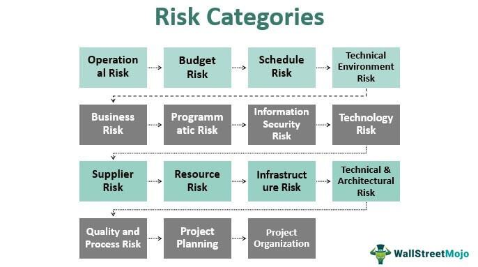

In today's fast-paced business environment, companies face a multitude of challenges that can impede growth and success. One critical area that organizations must address is risk management, particularly concerning the business risk associated with algorithmic trading. Algorithmic trading, commonly known as algo trading, has revolutionized financial markets by transforming how trades are executed and offering unprecedented speed and efficiency. This innovative approach uses automated systems and sophisticated algorithms to execute a large number of trades at speeds impossible for humans to achieve manually.

However, the rapid pace of technological advancement in algo trading introduces unique risks that businesses must carefully navigate. These risks can arise from the complexity and rapid decision-making inherent in algo trading systems. For instance, unforeseen market conditions or technical glitches can result in substantial financial losses. Furthermore, the speed at which algo trading operates means that errors can propagate quickly, potentially leading to significant negative impacts within a brief time frame.



This article aims to explore the key challenges involved in business risk management concerning algo trading. It will examine the inherent risks associated with this trading approach and provide insights into how companies can effectively mitigate these risks. By understanding and addressing these challenges, businesses can leverage the benefits of algo trading while safeguarding their operations against potential pitfalls.

## Table of Contents

## Understanding Business Challenges in Algo Trading

Algorithmic trading represents a significant transformation in financial markets, enhancing efficiency and enabling rapid execution of trades. However, it also introduces substantial challenges for businesses involved in its execution. One of the most pronounced challenges is market volatility. This volatility can have a profound impact on trading outcomes, particularly when algorithms execute trades at less than optimal moments. For instance, during periods of high market volatility, the financial instruments may experience sharp price fluctuations, leading to potential losses if the trading algorithms are not designed to account for such volatilities.

Technological failures also pose a critical challenge in algorithmic trading. This includes system outages and software glitches, which can disrupt trading operations and cause significant financial and reputational damage. For example, an unexpected system downtime can prevent timely execution of trades, resulting in missed opportunities or unintended investment positions. Additionally, software bugs might lead algorithms to execute erroneous trades, which could have costly implications.

Regulatory pressure represents another significant challenge to businesses engaging in algorithmic trading. Financial markets are subject to stringent regulatory environments that aim to ensure fairness, transparency, and stability. Businesses must navigate these regulations carefully, as non-compliance can lead to severe penalties. This requires that trading algorithms not only comply with current regulations but also quickly adapt to any regulatory changes to avoid compliance-related risks.

Understanding these challenges is imperative for businesses aiming to leverage [algorithmic trading](/wiki/algorithmic-trading) effectively. By recognizing the potential issues related to market [volatility](/wiki/volatility-trading-strategies), technological reliability, and regulatory compliance, organizations can develop more resilient trading strategies and systems. This foresight is crucial in harnessing the benefits of algorithmic trading while minimizing the associated risks.

## The Role of Risk Management in Addressing Business Risks

Effective risk management plays a crucial role in mitigating the business risks that accompany algorithmic trading. As algorithmic trading continues to accelerate financial market transactions, the potential for unforeseen adverse impacts heightens, necessitating robust risk management practices.

The process of risk management begins with identifying, assessing, and prioritizing risks that could impair trading operations. This assessment enables firms to apply resources effectively, aiming to minimize, control, or eliminate potential negative impacts. In the context of algorithmic trading, this requires the implementation of systems capable of real-time trade monitoring and anomaly detection. Such capabilities are essential to swiftly addressing issues that could lead to financial losses or reputational harm.

Algorithmic trading systems must integrate robust anomaly detection mechanisms that can rapidly identify patterns that deviate from the norm. This often involves employing advanced data analytics and [machine learning](/wiki/machine-learning) techniques to enhance the predictive ability of systems. For instance, anomaly detection algorithms can be tailored to monitor trading volumes or price movements that significantly diverge from expected behavior, flagging these instances for further evaluation. Python libraries like Scikit-learn or TensorFlow can be employed to build machine learning models designed to detect these irregularities. 

Furthermore, implementing comprehensive risk management strategies involves not only technological solutions but also establishing a governance framework that ensures consistent application of risk policies across the organization. This framework should encompass regular audits of algorithmic performance, stress testing under varied market conditions, and a feedback loop that incorporates lessons learned from previous events into future strategy adjustments.

By executing a meticulous risk management plan, companies shield themselves from unintended consequences of algorithmic decisions, thereby safeguarding financial stability and organizational reputation. As algorithms become more complex, continuous investment in technology and governance will be imperative for maintaining an edge in the fast-evolving trading landscape.

## Key Strategies for Effective Risk Management in Algo Trading

To manage risks effectively in algorithmic trading, businesses should adopt several key strategies that have proven to be effective in minimizing potential pitfalls and maximizing trading efficiency. 

First, thorough [backtesting](/wiki/backtesting) of trading algorithms is crucial for identifying potential weaknesses before they are deployed in live markets. Backtesting involves using historical data to simulate trades and evaluate the performance of algorithms under different market conditions. This process allows traders to assess risk-adjusted returns and make informed decisions based on empirical evidence. For example, by analyzing metrics such as the Sharpe Ratio, traders can determine the trade-off between risk and return, ensuring that the algorithm performs as expected in various scenarios. Here is a basic Python example for backtesting a simple moving average crossover strategy:

```python
import pandas as pd

# Load historical market data
data = pd.read_csv('market_data.csv')

# Calculate moving averages
data['SMA_50'] = data['Close'].rolling(window=50).mean()
data['SMA_200'] = data['Close'].rolling(window=200).mean()

# Generate trading signals
data['Signal'] = 0
data.loc[data['SMA_50'] > data['SMA_200'], 'Signal'] = 1
data.loc[data['SMA_50'] < data['SMA_200'], 'Signal'] = -1

# Backtest performance
data['Returns'] = data['Close'].pct_change()
data['Strategy Returns'] = data['Returns'] * data['Signal'].shift(1)

# Calculate cumulative returns
cumulative_strategy_returns = (1 + data['Strategy Returns']).cumprod()
```

Second, establishing a robust governance framework ensures that risk management policies are consistently applied across the organization. This involves defining clear roles and responsibilities for risk oversight, developing comprehensive policies, and implementing standardized processes for risk identification and mitigation. Governance frameworks also necessitate regular audits and reviews to ensure compliance and effectiveness.

Regularly updating and optimizing algorithms is paramount as market conditions are dynamic, and an algorithm well-suited for one market phase may not perform optimally in another. Continuous learning through machine learning techniques can be applied to enhance algorithm adaptability. For instance, [reinforcement learning](/wiki/reinforcement-learning) models can be employed to adjust strategies based on market feedback, thus improving decision-making processes over time.

Finally, collaboration with regulatory bodies is essential to ensure compliance and minimize legal risks. Given the evolving nature of financial regulation, firms engaged in algo trading must stay informed about regulatory changes and incorporate these into their practices. Constructive engagement with regulators can facilitate smoother compliance processes and prevent the occurrence of significant legal challenges. This proactive approach not only helps avert fines and penalties but also builds a reputation for integrity and reliability within the financial community.

By implementing these strategies, businesses can more effectively manage the inherent risks of algorithmic trading, safeguarding their interests while exploiting the substantial opportunities offered by modern trading platforms.

## Technological Solutions for Enhanced Risk Management

Advancements in technology have provided businesses engaged in algorithmic trading with innovative tools to enhance risk management strategies. One of the significant technological breakthroughs is the application of [artificial intelligence](/wiki/ai-artificial-intelligence) (AI) and machine learning (ML). These technologies offer advanced predictive capabilities that improve the timing and accuracy of trading decisions. By analyzing vast datasets, ML algorithms can identify patterns and trends that may not be immediately apparent to human analysts, allowing firms to anticipate market shifts and adjust their trading algorithms accordingly.

Real-time monitoring systems represent another critical technological solution. These systems track algorithmic trades and market conditions continuously, providing immediate alerts for any anomalies or deviations from expected patterns. Such systems enable rapid intervention, minimizing potential losses and ensuring that trading strategies remain aligned with risk management objectives.

Data analytics tools play a crucial role in enabling businesses to gain deeper insights into their trading operations. By employing sophisticated analytics, firms can dissect trading data to understand risk exposures better. This analysis can highlight vulnerabilities and guide adjustments to trading models, ensuring that they remain resilient against market fluctuations.

Investing in secure and reliable IT infrastructure is also essential for mitigating technical risks associated with algorithmic trading. As trading operations heavily depend on technology, any system failures or security breaches can lead to significant financial losses and reputational damage. Reliable infrastructure supports the integrity of trading platforms, ensuring continuous availability and optimal performance.

Together, these technological solutions provide businesses with a comprehensive framework for addressing the risks inherent in algorithmic trading. By integrating AI, real-time monitoring, advanced data analytics, and robust IT infrastructure, companies can not only safeguard their trading operations but also enhance their adaptability and competitiveness in the fast-paced financial markets.

## Case Studies: Successful Implementation of Risk Management in Algo Trading

Examining real-world examples can provide valuable insights into successful risk management practices in algo trading.

Company A successfully implemented AI-driven monitoring tools, significantly reducing trade errors by 30%. This achievement was largely due to the integration of advanced machine learning algorithms capable of real-time anomaly detection. By analyzing historical trade data and recognizing patterns indicative of potential errors, the AI systems could alert traders before costly mistakes occurred, thereby safeguarding financial assets and maintaining the company's reputation.

Firm B took another approach by establishing a dedicated risk management team. This team was composed of experts in finance, data science, and technology, enabling faster and more informed responses to market anomalies. The team's structure facilitated a cross-disciplinary approach to risk assessment and management, allowing for rapid adjustments to trading strategies in response to dynamic market conditions. This proactive stance not only minimized potential losses but also optimized trading operations for improved financial performance.

Company C opted for a strategic partnership with regulatory bodies, ensuring full compliance with evolving legal requirements. Through this collaboration, Company C was able to preemptively address any compliance issues, thus avoiding significant fines and safeguarding its market position. This partnership also provided the company with insights into forthcoming regulatory changes, allowing for timely adjustments to its algo trading practices and enhancing its institutional credibility.

These case studies underline the importance of tailored risk management strategies to achieve optimal outcomes in algo trading. They demonstrate that leveraging technology, building expert teams, and fostering strong regulatory relationships can significantly mitigate the inherent risks associated with algorithmic trading.

## Conclusion

Algorithmic trading offers companies substantial opportunities for improving their operational efficiency and gaining competitive advantage due to its ability to execute trades at high speed and precision. However, these benefits are coupled with inherent risks that stem from volatility, technological failures, and the stringent regulatory landscape. Therefore, effective risk management strategies are indispensable for successfully navigating these challenges.

To protect business interests, organizations must focus on integrating technological advancements into their risk management frameworks. Technologies such as artificial intelligence and machine learning have the potential to significantly enhance the ability of firms to predict market movements and swiftly respond to anomalies. These technologies enable dynamic adaptation to changing market conditions, thereby minimizing potential financial losses and mitigating reputational risks.

A strong governance framework is crucial in ensuring that risk management policies are consistently enforced. This involves setting clear protocols for algorithm testing and validation, ongoing monitoring, and regular updates to adapt to new market developments. By maintaining robust governance practices, companies position themselves to effectively control risks associated with algo trading.

Moreover, the key to mitigating risks lies in the development of a proactive approach. Businesses must be agile, continuously adapting their risk management strategies to align with the evolving landscape of algorithmic trading. This involves not only leveraging cutting-edge technological tools but also fostering a corporate culture of risk awareness and responsiveness.

As financial markets grow increasingly complex, staying vigilant and committed to risk management excellence becomes imperative. This encompasses not only compliance with regulatory requirements but also the anticipation and prevention of potential risks before they materialize. By doing so, companies can safeguard their competitive edge and ensure long-term success in the rapidly changing world of financial markets.

## References & Further Reading

[1]: Jansen, S. (2020). ["Machine Learning for Algorithmic Trading."](https://github.com/stefan-jansen/machine-learning-for-trading) Packt Publishing.

[2]: Lopez de Prado, M. (2018). ["Advances in Financial Machine Learning."](https://www.amazon.com/Advances-Financial-Machine-Learning-Marcos/dp/1119482089) Wiley.

[3]: Chan, E. P. (2009). ["Quantitative Trading: How to Build Your Own Algorithmic Trading Business."](https://github.com/ftvision/quant_trading_echan_book) Wiley.

[4]: Aronson, D. R. (2007). ["Evidence-Based Technical Analysis: Applying the Scientific Method and Statistical Inference to Trading Signals."](https://onlinelibrary.wiley.com/doi/book/10.1002/9781118268315) Wiley.

[5]: Bergstra, J., Bardenet, R., Bengio, Y., & Kégl, B. (2011). ["Algorithms for Hyper-Parameter Optimization."](https://proceedings.neurips.cc/paper/2011/file/86e8f7ab32cfd12577bc2619bc635690-Paper.pdf) Advances in Neural Information Processing Systems 24.