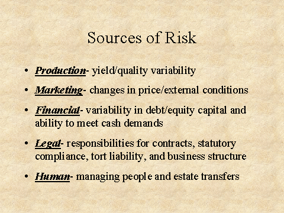

## Table of Contents

## What is business risk and why is it important to understand?

Business risk refers to the possibility that a company might not achieve its financial goals or might lose money due to various factors. These factors can include changes in the market, economic conditions, or even internal issues like poor management decisions. Essentially, it's the uncertainty that comes with running a business, and it can affect a company's ability to make profits or even stay operational.

Understanding business risk is crucial for anyone involved in a business, from owners to managers to investors. By knowing the risks, a business can take steps to manage or reduce them, which can help protect the company's future. For example, if a business knows that a new competitor might enter the market, it can plan ways to stay competitive, like improving its products or cutting costs. This understanding helps businesses make better decisions, prepare for potential problems, and ultimately, increase their chances of success.

## Can you list the main types of business risks?

There are several main types of business risks that companies need to be aware of. One type is strategic risk, which happens when a company's plan to reach its goals doesn't work out. This can happen if a company picks the wrong way to grow or if it doesn't keep up with changes in the market. Another type is financial risk, which is about money problems. This can include not having enough cash, borrowing too much, or not being able to pay back loans.

Operational risk is another big type of business risk. This happens when a company's day-to-day activities don't go smoothly. For example, if a machine breaks down or if there's a problem with the supply chain, it can hurt the business. Compliance risk is also important, and it involves following laws and rules. If a company doesn't follow these, it can face fines or other penalties.

Lastly, there's reputational risk, which is about how people see the company. If a company does something that makes people think badly of it, like having a product that's not safe, it can lose customers and money. Each of these types of risks can affect a business in different ways, so it's important for companies to understand and manage them all.

## How does economic risk affect businesses?

Economic risk is about how changes in the economy can hurt a business. This can include things like a recession, where people have less money to spend, or high inflation, which makes everything more expensive. When the economy is not doing well, people might not buy as much, and this can make it hard for businesses to make money. If a business depends a lot on borrowing money, higher interest rates can also make it more expensive to pay back loans.

Businesses need to watch out for these economic changes because they can affect how much they sell and how much it costs to run the business. For example, if prices for materials go up because of inflation, a business might have to charge more for its products. But if customers can't afford to pay more, the business might lose sales. By understanding economic risks, businesses can plan better, like saving money during good times to help them through tough times. This can help them stay strong even when the economy is not doing well.

## What are some examples of operational risks in a business?

Operational risks are problems that can happen every day in a business. For example, a machine might break down and stop the work. If a business makes things, like cars or clothes, this can mean they can't make as many products. Another example is if the people who work for the business make mistakes. If someone in the office gets the numbers wrong, it can cause big problems with money or orders.

Another type of operational risk is when the supply chain has problems. This means that the things a business needs to make its products might not come on time. For instance, if a company that makes computers can't get the computer chips it needs, it can't finish making the computers. Also, there can be risks from natural disasters, like a big storm that damages the business's building or equipment. These kinds of problems can stop the business from working normally and can cost a lot of money to fix.

## How can legal and regulatory changes pose risks to a business?

Legal and regulatory changes can create big problems for businesses. When laws change, a business might have to do things differently. For example, if there's a new rule about how to keep workers safe, a business might need to buy new equipment or change how it does things. If the business doesn't follow these new rules, it can get in trouble, like having to pay fines or even having to close down. This can cost a lot of money and time, and it can be hard for the business to keep going.

Also, if the government changes rules about taxes or how to report money, a business might need to spend more to keep up. Sometimes, these changes can make it harder for a business to make money. For instance, if new environmental laws mean a factory has to spend a lot on new ways to clean up pollution, the cost of making things can go up. This can make it tough for the business to stay competitive and can hurt its profits.

## What is financial risk and how can it impact a company's operations?

Financial risk is when a business might have money problems. This can happen if a company borrows too much money and can't pay it back, or if it doesn't have enough cash to keep running. It can also happen if the value of the money the company has goes down, like if the stock market goes down and the company loses money on its investments. These kinds of money problems can make it hard for a business to do what it needs to do every day.

When a company faces financial risk, it can affect its operations in big ways. For example, if a business can't pay its bills, it might have to stop buying the things it needs to make its products. This can slow down or even stop the business from working. Also, if a company is worried about money, it might not want to spend on new projects or ideas, which can stop it from growing. In the worst cases, financial risk can lead to a business going bankrupt and having to close down.

## How does market risk influence business strategy?

Market risk is when things outside a business, like what customers want or what other businesses are doing, can change and make it hard for a business to do well. For example, if a new company starts selling a similar product but cheaper, it can take away customers from the first business. Or if people start wanting different things, like wanting electric cars instead of gas cars, a business that makes gas cars might lose sales. Because of this, businesses need to always be watching what's happening in the market and be ready to change their plans.

When a business understands market risk, it can make better plans to stay strong. For example, if a business sees that a new competitor might come into the market, it can decide to make its product better or find a way to sell it for less. Or if it sees that what customers want is changing, it can start making new products that people will want to buy. By thinking about market risk, a business can make smart choices about what to do next, like how to spend its money or where to sell its products. This helps the business keep making money and stay ahead of problems.

## What role does technology play in creating new types of business risks?

Technology can create new kinds of risks for businesses because it changes so fast. When a business uses new technology, like computers or the internet, it can help the business do things better and faster. But it also means the business has to learn how to use this new technology and keep it safe. For example, if a business starts selling things online, it has to make sure its website is safe from hackers who might try to steal information or money. If the business doesn't protect its technology well, it can lose money or customers.

Also, technology can change what people want and how they buy things. If a business doesn't keep up with these changes, it can fall behind. For instance, if more people start using smartphones to shop, a business that doesn't have a good app or website might lose sales. On top of that, new technology can make it easier for new competitors to start up quickly. These new businesses might use technology in a better way and take customers away from older businesses. So, technology can bring both new chances and new risks for a business to handle.

## How can environmental risks impact business operations and what can be done to mitigate them?

Environmental risks can really change how a business works. Things like bad weather, like hurricanes or floods, can damage a business's buildings or stop it from working for a while. Also, if the weather changes a lot because of climate change, it can make it hard for a business to get the things it needs to make its products. For example, if there's a drought, a farm might not be able to grow as much food. These problems can cost a business a lot of money and make it hard to keep going.

To help with these risks, businesses can do a few things. One way is to make plans for what to do if something bad happens, like having a backup place to work if the main place gets damaged. Another way is to try to use less energy and make less pollution, which can help with climate change and might save money too. Businesses can also buy insurance to help pay for damage from things like storms. By thinking about these risks and doing something about them, a business can be better ready for problems and keep working well.

## What are strategic risks and how can they be managed effectively?

Strategic risks are the dangers that come when a business's plan to reach its goals doesn't work out. This can happen if a business chooses the wrong way to grow or if it doesn't keep up with changes in what people want or what other businesses are doing. For example, if a business decides to open a lot of new stores but people start shopping online more, the business might lose money because it didn't plan for this change.

To manage strategic risks well, a business needs to always be watching what's happening around it and be ready to change its plans. This means looking at the market and seeing what customers want and what competitors are doing. If a business sees that something might be a problem, like a new competitor coming in, it can decide to do things differently, like making its product better or finding a new way to sell it. By thinking about these risks and making smart choices, a business can keep moving forward and avoid big problems.

## How do businesses assess and prioritize different types of risks?

Businesses assess and prioritize different types of risks by first figuring out what risks they might face. They look at things like market changes, money problems, day-to-day issues, legal rules, and even the environment. They think about how likely each risk is to happen and how bad it would be if it did. For example, a big storm might not happen often, but if it does, it could cause a lot of damage. On the other hand, a small mistake in the office might happen more often but might not be as bad. By understanding these things, a business can see which risks are the most important to worry about.

Once they know what risks they might face, businesses need to decide which ones to focus on first. They do this by thinking about how much each risk could hurt the business and how easy it would be to do something about it. If a risk could cause a lot of problems and is easy to fix, like making sure the website is safe from hackers, the business might want to deal with that one first. But if a risk is hard to fix and might not cause as much trouble, like a small change in what customers want, the business might decide to watch it but not do much right away. By doing this, businesses can make sure they're ready for the biggest problems and keep running smoothly.

## What advanced techniques and tools are available for expert risk management in large corporations?

Large corporations use advanced techniques and tools to manage risks because they have to deal with a lot of different kinds of problems. One important tool is risk management software. This software helps businesses keep track of all their risks in one place. It can show how likely each risk is to happen and how bad it would be if it did. This helps the business see which risks are the most important to deal with. Another technique is using data analytics, which means looking at a lot of information to find patterns and predict what might happen. By doing this, businesses can see risks coming before they happen and make plans to stop them.

Another tool that big companies use is scenario planning. This means thinking about different things that could happen in the future and making plans for each one. For example, a business might think about what would happen if there was a big change in the market or if a new law was passed. By planning for these different situations, the business can be ready for whatever happens. Lastly, many large corporations use something called Enterprise Risk Management (ERM). ERM is a way of looking at all the risks a business faces at the same time, not just one by one. It helps the business see how different risks might affect each other and make a big plan to deal with them all together.

## References & Further Reading

[1]: Jansen, S. (2020). ["Machine Learning for Algorithmic Trading."](https://github.com/stefan-jansen/machine-learning-for-trading) Packt Publishing.

[2]: Lopez de Prado, M. (2018). ["Advances in Financial Machine Learning."](https://www.amazon.com/Advances-Financial-Machine-Learning-Marcos/dp/1119482089) Wiley.

[3]: Chan, E. P. (2009). ["Quantitative Trading: How to Build Your Own Algorithmic Trading Business."](https://github.com/ftvision/quant_trading_echan_book) Wiley.

[4]: Aronson, D. R. (2007). ["Evidence-Based Technical Analysis: Applying the Scientific Method and Statistical Inference to Trading Signals."](https://onlinelibrary.wiley.com/doi/book/10.1002/9781118268315) Wiley.

[5]: Bergstra, J., Bardenet, R., Bengio, Y., & Kégl, B. (2011). ["Algorithms for Hyper-Parameter Optimization."](https://proceedings.neurips.cc/paper/2011/file/86e8f7ab32cfd12577bc2619bc635690-Paper.pdf) Advances in Neural Information Processing Systems 24.