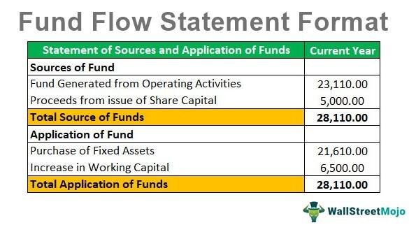

Political donations play a critical role in shaping presidential elections and campaign funding, serving as a primary channel through which individuals, corporations, and interest groups influence the electoral process. These contributions are essential not only for financing campaign activities but also for signaling political allegiances and policy preferences. The flow of financial contributions is an indicator of candidate viability and public support, often swaying both public perception and media coverage.

Understanding the impact of financial contributions on political campaigns is crucial for comprehending the broader dynamics of electoral politics. Campaigns require substantial resources to cover operational costs, advertise policies, and engage with voters. This financial necessity underscores the dependence of candidates on fundraising efforts, ultimately affecting their strategic decisions and policy priorities. Voters and policymakers alike are increasingly interested in how money shapes political agendas and future governance.

In recent years, algorithmic trading has emerged as an innovative tool in the realm of campaign funding. Traditionally associated with the financial markets, algorithmic trading involves using computer programs to execute trading strategies at speeds and volumes far beyond human capability. Its application to political donations introduces new possibilities for optimizing fundraising strategies and managing campaign finances. By employing data-driven methods, campaigns can identify potential donors more effectively, predict donation patterns, and maximize fundraising outcomes.

Examining the interconnected themes of political donations, presidential elections, and campaign funding is significant due to the increasing presence of technology in political finance. The fusion of technology and politics is reshaping traditional campaign models, influencing how candidates interact with their supporters and gather financial backing. Analyzing these trends enables a deeper understanding of contemporary electoral processes, offering insights into how candidates can leverage technology to their advantage while navigating regulatory and ethical concerns.

As technology continues to permeate political finance, it is essential to assess its implications for transparency, accountability, and public trust. The role of algorithmic trading in this context raises important questions about the accessibility of political influence and the potential for automated systems to alter the landscape of electoral competition. Understanding these developments is crucial for ensuring that innovations in campaign funding align with democratic principles, fostering fair and transparent electoral processes.

## Table of Contents

## Understanding Political Donations in Presidential Elections

Political donations in presidential elections play a crucial role in shaping the electoral process in the United States. They are financial contributions made to support a candidate or a political party during an election cycle. These donations can come from various sources, including individuals, corporations, political action committees (PACs), and more. The purpose of these funds is to cover the costs associated with running a political campaign, including advertising, rallies, staff salaries, and other operational expenses.

Historically, the landscape of campaign funding has evolved significantly. In the early 20th century, campaigns were primarily funded by wealthy individuals and large corporations. However, landmark legislation, such as the Federal Election Campaign Act (FECA) of 1971, aimed to regulate the flow of money in politics and introduced limits on contributions and expenditures. The establishment of the Federal Election Commission (FEC) in 1974 further strengthened the regulatory framework, ensuring transparency and compliance in campaign finance.

The legal framework governing contributions to presidential campaigns is complex and has been shaped by several key judicial decisions, notably the Supreme Court's 2010 ruling in Citizens United v. FEC. This decision allowed for unlimited contributions to independent expenditure-only committees, commonly known as Super PACs. These entities can raise and spend unlimited amounts of money to advocate for or against political candidates, provided they do not coordinate directly with the candidates' campaigns.

Political donations profoundly affect electoral outcomes. Candidates with substantial financial backing often have a competitive advantage due to their ability to reach a broader audience through extensive media campaigns and grassroots mobilization. The correlation between financial resources and electoral success underscores the importance of campaign finance in determining the viability of a presidential candidacy.

Recent [statistics](/wiki/bayesian-statistics) highlight the growing scale of political donations in presidential elections. The 2020 election cycle, for instance, saw record-breaking contributions, with Joe Biden's campaign raising over $1 billion and Donald Trump's campaign amassing similar figures. This increase in financial commitments reflects the heightened political engagement and the stakes associated with presidential elections in contemporary society.

Understanding the dynamics of political donations in presidential elections is essential for comprehending the broader electoral process. The interplay between money, politics, and power continues to shape the strategies and outcomes of presidential campaigns, emphasizing the need for ongoing scrutiny and potential reform in campaign finance laws.

## Campaign Funding: Sources and Strategies

Campaign funding for presidential elections involves multiple sources and strategies, each playing a significant role in shaping the dynamics of political campaigns in the United States. Understanding these sources and strategies provides insight into how candidates amass the financial resources necessary for a competitive edge.

### Overview of Campaign Funding Sources: Individual, Corporate, and PAC Donations 

Campaign funding traditionally comprises a variety of sources. Individual donations form the backbone of campaign contributions, with most candidates relying heavily on small to large contributions from private citizens. Individual donors can contribute directly to a candidate's campaign committee, subject to limits established by the Federal Election Commission (FEC).

Corporate donations, while not directly permissible, often flow through Political Action Committees (PACs). PACs are organizations typically formed by businesses, unions, or interest groups to collect political donations and contribute them to candidates who support their agendas. These entities are subject to strict contribution limits. Furthermore, Super PACs, a relatively recent development following the 2010 Citizens United v. FEC decision, can raise and spend unlimited sums of money to advocate for or against political candidates, albeit without direct coordination with the candidates' campaigns.

### Strategies Employed by Presidential Candidates to Maximize Financial Support

Presidential candidates utilize various strategies to maximize financial support. A prominent approach involves targeting high-dollar donors through exclusive fundraising events, where candidates can engage personally with donors and secure substantial contributions. Another strategy focuses on cultivating a broad base of support through online fundraising platforms, allowing candidates to efficiently reach and solicit donations from a vast pool of potential supporters.

### Role of Grassroots Fundraising in Modern Campaigns

Grassroots fundraising has become increasingly significant in modern campaigns. This strategy emphasizes small-dollar donations from a large number of donors, mobilizing broad support from diverse demographic groups. Advances in technology have facilitated the rise of grassroots fundraising, with digital platforms providing a means for individuals to contribute easily and candidates to engage directly with their supporters. This approach not only generates essential funding but also helps to build a committed voter base.

### The Impact of Major Donors and Super PACs on Campaign Strategies

Major donors and Super PACs exert considerable influence over campaign strategies. While large donations from wealthy individuals can provide candidates with immediate resources, they may also guide campaign priorities and policy stances to align with the interests of these donors. Similarly, Super PACs, with their capacity to spend vast amounts independently, can shape the media landscape and public perception, often driving the narrative of a campaign.

### Innovations and Challenges in Today’s Campaign Funding Landscape

The campaign funding landscape continues to evolve, presenting innovations and challenges. Technology-driven solutions, such as [artificial intelligence](/wiki/ai-artificial-intelligence) and data analytics, enable campaigns to optimize their fundraising efforts by identifying target donor demographics and customizing outreach strategies. However, this innovation also raises challenges, including concerns over data privacy and the potential for manipulation through automated systems.

Moreover, the increasing role of digital platforms in fundraising has opened new avenues for abuse, such as foreign interference and the proliferation of misinformation. Ensuring transparency and accountability in digital campaign finance practices remains a critical challenge for regulators and lawmakers. 

Campaign funding in presidential elections is marked by a complex interplay between diverse sources and strategic approaches. As technology advances, these dynamics are likely to continue evolving, necessitating ongoing scrutiny and adaptation to uphold the integrity of the electoral process.

## Algorithmic Trading and Its Influence on Campaign Funding

Algorithmic trading, a technique employing complex mathematical models and high-speed, automated processes, has revolutionized numerous sectors, including political finance. Here, its basic principles consist of the use of computer algorithms to conduct trading activities at speeds and frequencies in excess of what a human trader can achieve. Fundamentally, [algorithmic trading](/wiki/algorithmic-trading) aims to optimize trading outcomes by analyzing numerous variables in real-time.

In political finance, particularly for presidential campaign funding, algorithmic trading can be applied to optimize financial operations. For example, campaigns might use these algorithms to manage investments and maximize returns, ensuring a steady stream of capital for campaign activities. By automating the trading process, campaigns can potentially leverage market fluctuations to increase their funds without direct involvement in daily trading activities.

Recent campaigns have incorporated these tactics, albeit discreetly. For instance, leveraging algo trading, some campaigns have optimized the deployment of large donations or surplus funds into market positions that can yield significant returns. These operations can support various campaign efforts, from advertising to ground mobilization. 

The application of high-frequency trading ([HFT](/wiki/high-frequency-trading-strategies)) techniques has its benefits and drawbacks. Among the pros, HFT can ensure [liquidity](/wiki/liquidity-risk-premium) and rapid capital turnover, offering campaigns the flexibility to react quickly to urgent funding needs. However, the cons include the ethical implications of engaging in high-risk financial strategies with donor money, which might not align with contributors' expectations or the campaign's risk appetite.

Regarding regulatory considerations, the use of algorithmic trading in campaign funding sits in a grey area. While the Federal Election Commission (FEC) regulates direct political donations and expenditures, indirect financial maneuvers such as investment strategies are less scrutinized. This lack of specific regulatory guidance raises questions about transparency and accountability, especially concerning the disbursement and potential risk of funds raised for political campaigning.

As campaigns explore innovative fundraising methods, the integration of algorithmic trading represents both an opportunity and a challenge. Balancing these approaches with ethical considerations and transparency mandates will be crucial as political finance continues to evolve.

## Ethical Implications and Public Perception

Ethical concerns surrounding political donations and campaign funding techniques have long been a subject of intense scrutiny and debate. The influence of substantial financial contributions on political processes raises questions about fairness and the possibility of corruption. Major donors can gain disproportionate access to political figures, potentially skewing policies in their favor, thus challenging the democratic principle of equal representation (Boatright, 2014).

Public perception regarding the influence of big money in politics is generally skeptical. Many citizens view large donations as a means for wealthy individuals and corporations to exert undue influence over elected officials. This perception can erode trust in the political system, as voters may feel that their voices are marginalized compared to those who contribute large sums of money to campaigns. Surveys have shown that a significant portion of the public supports stricter regulations on campaign finances to curb the power of big money (Gilens & Page, 2014).

Transparency and accountability in automated campaign finance systems are critical concerns. As technology, including algorithmic trading, becomes more integrated into campaign funding, ensuring that these systems operate transparently is paramount. Automated systems, while potentially more efficient, can obscure the origins and destinations of funds. This lack of transparency can hinder efforts to hold political campaigns accountable for their funding sources and expenditure (Farrell, 2012).

Algorithmic trading, a form of high-frequency trading, can significantly impact voter trust and electoral integrity. By rapidly executing trades to optimize returns on financial contributions, these systems could potentially prioritize profit over ethical considerations in political finance. Such techniques might lead to inequalities in campaign funding, where candidates with access to advanced technological resources gain an unfair advantage. This could undermine voter confidence in the electoral system's integrity and fairness (Munger, 2016).

Reforming campaign finance laws to address these challenges remains a contentious issue. Advocates for reform argue that stricter regulations are necessary to preserve democratic principles and prevent the undue influence of money in politics. Possible reforms include imposing limits on the size of donations, enhancing disclosure requirements, and increasing oversight of automated trading operations within campaign finance. However, balancing these regulations with the need for innovation and efficiency in political campaigning presents a significant challenge (Lessig, 2011).

In summary, the integration of advanced technological systems into campaign funding necessitates an ongoing dialogue about ethics, transparency, and public trust. Ensuring that political campaigns remain fair and equitable while embracing technological advancements is crucial for maintaining the integrity of democratic processes.

**References:**
- Boatright, R. G. (2014). Interest Groups and Campaign Finance Reform in the United States and Canada. University of Michigan Press.
- Gilens, M., & Page, B. I. (2014). Testing Theories of American Politics: Elites, Interest Groups, and Average Citizens. Perspectives on Politics, 12(3), 564-581.
- Farrell, H. (2012). The Consequences of the Internet for Politics. Annual Review of Political Science, 15, 35-52.
- Munger, M. C. (2016). Tomorrow 3.0: Transaction Costs and the Sharing Economy. Cambridge University Press.
- Lessig, L. (2011). Republic, Lost: How Money Corrupts Congress—and a Plan to Stop It. Twelve.

## The Future of Campaign Funding and Algorithmic Trading

The future of campaign funding and algorithmic trading is poised to be shaped by several prominent trends and technological advancements. These innovations have the potential to fundamentally transform the ways political donations are solicited, managed, and utilized in presidential campaigns.

One significant trend is the increasing integration of algorithmic trading in political finance. Algorithmic trading, which involves using computer algorithms to execute a large number of trades at extremely high speeds based on pre-defined criteria, is typically associated with financial markets. Its application in campaign funding could optimize the timing and placement of financial resources, making funding strategies more efficient. For example, algorithms could be developed to identify optimal times for donation requests based on donor behavior patterns and external political events.

Emerging technologies, such as artificial intelligence and [machine learning](/wiki/machine-learning), are expected to revolutionize donor engagement and fundraising strategies. These technologies could enable campaigns to process vast amounts of data to better understand donor preferences and predict future donation behaviors. For instance, machine learning models could analyze social media interactions and past donation histories to tailor personalized communication strategies for potential donors, thus enhancing engagement.

However, the integration of such technologies in campaign funding does not come without challenges. One major challenge is the regulatory environment surrounding political donations and campaign finance. As algorithmic trading and other technologies become more embedded in political finance, new regulations may be necessary to ensure transparency, accountability, and fairness. There is also a risk that the use of high-frequency trading techniques in political fundraising could exacerbate the influence of large donors, potentially skewing the democratic process.

Opportunities also exist for campaigns to leverage these technologies to broaden their donor base beyond traditional major donors. Crowdfunding platforms, enhanced by advanced data analysis, could play a pivotal role in grassroots fundraising. These platforms can democratize the donation process, providing small donors with a means to collectively exert significant influence.

From an ethical standpoint, balancing innovation with responsible campaign practices will be crucial. As technology continues to innovate campaign strategies, ensuring that these advancements do not undermine electoral integrity will be essential. This might involve implementing robust transparency measures to assure the public of the fairness and legality of campaign funding practices.

In conclusion, while algorithmic trading and emerging technologies offer promising avenues for enhancing campaign funding strategies, the future success of these innovations will depend on thoughtful balancing between embracing technological progress and maintaining ethical standards. As political campaigns continue to evolve, ongoing dialogue, regulatory reform, and public engagement will be vital to managing these advancements responsibly.

## Conclusion

The interplay between political donations, campaign funding, and algorithmic trading is a testament to the evolving complexity of modern electoral processes. Political donations are a longstanding pillar of presidential elections, providing necessary financial backing to candidates while influencing electoral outcomes. Historically, contributions have come from various sources, including individuals, corporations, and political action committees (PACs), each with distinct legal frameworks and implications on campaign strategies.

Algorithmic trading represents a significant technological advancement with the potential to transform the landscape of campaign funding. It offers precision and efficiency in managing financial transactions, potentially optimizing the fundraising efforts of political campaigns. This integration, however, necessitates careful examination to address ethical concerns and regulatory requirements. The emergence of algorithmic techniques in political finance raises questions about transparency, voter trust, and the equitable distribution of financial influence.

The intertwined nature of politics, finance, and technology underscores the need for ongoing dialogue and reform. Ensuring fair and transparent electoral processes demands vigilance in balancing innovation with ethical considerations. Public perception and trust hinge on the accountability and openness of campaign finance systems, necessitating stringent regulatory frameworks to govern evolving practices.

As we look to the future, it is crucial to foster further research and awareness on these interconnected themes. Advancements in technology and finance will continue to shape political landscapes, offering both challenges and opportunities. Encouraging informed discourse and continuous study will aid in navigating this intricate terrain, ensuring democratic principles are upheld and electoral equitability is maintained.

## References & Further Reading

[1]: Boatright, R. G. (2014). ["Interest Groups and Campaign Finance Reform in the United States and Canada"](https://www.jstor.org/stable/10.3998/mpub.2485161). University of Michigan Press.

[2]: Gilens, M., & Page, B. I. (2014). ["Testing Theories of American Politics: Elites, Interest Groups, and Average Citizens"](https://www.cambridge.org/core/journals/perspectives-on-politics/article/testing-theories-of-american-politics-elites-interest-groups-and-average-citizens/62327F513959D0A304D4893B382B992B). Perspectives on Politics, 12(3), 564-581.

[3]: Farrell, H. (2012). ["The Consequences of the Internet for Politics"](https://www.annualreviews.org/content/journals/10.1146/annurev-polisci-030810-110815). Annual Review of Political Science, 15, 35-52.

[4]: Munger, M. C. (2016). ["Tomorrow 3.0: Transaction Costs and the Sharing Economy"](https://www.jstor.org/stable/48732808). Cambridge University Press.

[5]: Lessig, L. (2011). ["Republic, Lost: How Money Corrupts Congress—and a Plan to Stop It"](https://news.harvard.edu/gazette/story/2011/11/republic-lost-how-money-corrupts-congress-and-a-plan-to-stop-it/). Twelve.

[6]: Lopez de Prado, M. (2018). ["Advances in Financial Machine Learning"](https://www.amazon.com/Advances-Financial-Machine-Learning-Marcos/dp/1119482089). Wiley.

[7]: Chan, E. P. (2008). ["Quantitative Trading: How to Build Your Own Algorithmic Trading Business"](https://github.com/ftvision/quant_trading_echan_book). Wiley.