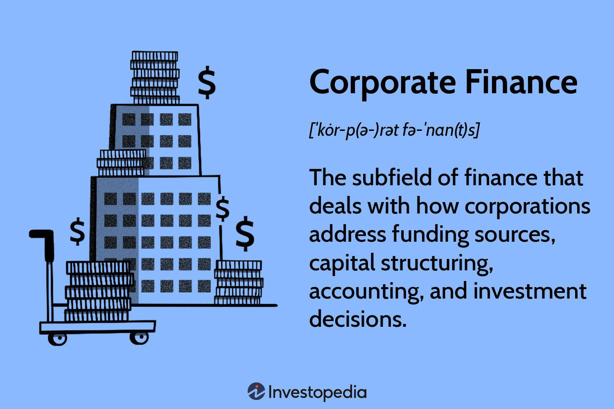

Business finance and corporate funding are vital in enhancing a company's development and facilitating its expansion. The ability to navigate various funding sources can profoundly affect a business's financial stability and growth potential. Businesses often strive to efficiently allocate resources, and choosing the right funding mechanism is paramount. Several pathways exist to secure the capital necessary for growth, each offering different benefits and challenges.

In this article, we will explore the mechanisms of retained earnings, debt capital, and equity capital as methods to fuel business growth. Retained earnings, a self-financing approach, allows companies to reinvest their profits into operations, which can lead to growth without external funding dependencies. On the other hand, debt capital involves borrowing funds, offering potential tax advantages but creating repayment obligations and risk of default. Equity capital offers another avenue by involving investors in exchange for ownership stakes, thus sharing risks and returns.

The integration of algorithmic trading into funding strategies represents a novel trend with unique opportunities and challenges. Algorithmic trading employs sophisticated computer programs to automate trading tasks, enhancing decision-making and efficiency in financial markets. Incorporating this advanced technology with traditional funding mechanisms potentially offers firms a strategic edge, facilitating more dynamic interactions with capital markets.

Understanding these funding options in the context of modern markets, where financial dynamics rapidly evolve, is crucial. Navigating these complex funding landscapes requires careful consideration of a company's specific needs and strategic trajectory. As such, this article aims to provide insights into the relevance of algorithmic trading within these financial mechanisms, highlighting their roles and interconnections in the growth and stability of businesses.

## Table of Contents

## Retained Earnings as a Funding Source

Retained earnings constitute an essential funding source for businesses, reflecting the portion of net income that is not distributed to shareholders in the form of dividends. Instead, it is reinvested in the company to bolster growth initiatives, acquire new assets, or improve existing operational capabilities. This self-financing mechanism provides a straightforward method to fuel business expansion without resorting to external funding channels.

The principal advantage of utilizing retained earnings lies in its cost-effectiveness. Since it involves reinvesting the company's profits, there are no financing costs such as interest payments associated with debt capital. Furthermore, reliance on retained earnings does not result in ownership dilution, as no additional equity is issued, ensuring that existing shareholders maintain their proportionate ownership stakes.

However, the strategic reinvestment of retained earnings demands careful planning and execution. Retaining profits rather than distributing them as dividends can potentially limit immediate shareholder returns, which may be a point of concern for those seeking regular income. Moreover, businesses must judiciously direct these funds into projects or areas that promise the best potential return, as inefficient allocation can negate the benefits.

In terms of financial health, retained earnings can bolster the company's balance sheet by increasing equity, thereby providing a financial cushion. This can be particularly advantageous during economic downturns or periods of market [volatility](/wiki/volatility-trading-strategies), as it offers an internal source of capital that does not depend on external economic conditions.

Despite these benefits, there are limitations to the reliance on retained earnings, particularly for large-scale ventures or rapid expansion needs. Retained earnings alone may not suffice for significant expenditures or investments, necessitating the exploration of alternative funding mechanisms such as debt or equity financing when larger sums are required.

The strategy for managing retained earnings involves balancing the reinvestment for growth with the expectations of dividend-seeking shareholders. Companies often aim to adopt a payout ratio that reflects a compromise between rewarding shareholders and retaining sufficient profits for long-term strategic goals. 

Overall, while retained earnings are a valuable component of corporate funding strategy, they must be integrated with other financial resources to optimize capital structure and ensure sustainable growth.

## Debt Capital and Corporate Funding

Debt capital is a vital component of corporate funding strategies, facilitating businesses to access necessary resources for growth and expansion. This method involves borrowing funds through avenues such as loans from financial institutions or the issuance of corporate bonds to investors. A key advantage of utilizing debt capital is the tax-deductibility of interest payments, which can reduce the overall cost of borrowing. This potential tax benefit is appealing to many corporations, as it effectively decreases the expense associated with financing.

The primary benefit of debt capital is the retention of full ownership by existing shareholders. This characteristic makes debt a preferred choice for companies that seek capital without diluting their equity. However, this approach also introduces an obligation to make regular repayments, which includes both principal and interest components. This can impose financial strain on businesses, particularly if cash flows are inconsistent or constrained. Furthermore, the risk of default looms if a company is unable to meet these financial obligations.

For companies experiencing rapid growth, debt capital presents an opportunity to quickly secure the funds needed to scale operations and capture market opportunities. However, such high-growth firms must carefully manage their debt levels, as economic downturns or shifts in market conditions can make debt servicing challenging. For instance, an increase in interest rates can raise the cost of borrowing, thereby impacting a company's financial health.

The formula for the cost of debt ($k_d$) is:

$$
k_d = \frac{I \times (1 - T)}{D}
$$

Where:
- $I$ is the interest expense
- $T$ is the corporate tax rate
- $D$ is the total debt

In the context of economic volatility, businesses must weigh the benefits of leveraging debt against the potential risks of added financial burdens and market unpredictability. The strategic use of debt capital necessitates prudent financial planning and risk assessment to ensure that it contributes positively to corporate value without jeopardizing financial stability.

## Equity Capital: Selling Ownership Stakes

Equity financing involves raising capital through the sale of a company's shares to investors. This method of fundraising provides businesses with the advantage of alleviating the obligation of debt repayment, allowing them to focus on growth and operational initiatives without the imminent pressure of repaying lenders. However, a significant consequence of equity financing is the dilution of ownership. When companies issue new shares, existing shareholders experience a reduction in their percentage of ownership, which translates into reduced influence over company decisions and a share in future profits.

Despite the dilution [factor](/wiki/factor-investing), equity is a cogent option for firms, particularly those with limited credit history. Such companies often find traditional debt financing challenging to secure due to perceived credit risks. Equity financing opens avenues to access capital without the stringent prerequisites of credit evaluations. Additionally, companies may opt for equity financing to cultivate long-term investor partnerships. These relationships can yield strategic benefits, as investors bring more than just capital to the table; they often contribute valuable expertise, industry connections, and advice on growth strategies. 

Effective management of investor relationships is critical for success in equity financing. Companies must continuously engage shareholders by maintaining transparent communication and aligning business endeavors with investors' strategic visions. Misalignment between a company's goals and those of its equity stakeholders can lead to conflicts that may hinder business progress. Thus, careful alignment and relationship management are essential to leveraging the full potential of equity financing, ensuring both the company's growth objectives and investors' expectations are met. 

In summary, while equity financing presents benefits such as debt alleviation and potential strategic partnerships, it requires thoughtful consideration of the trade-offs, primarily ownership dilution and the necessity of effective investor relations. For companies choosing this route, alignment on long-term strategic visions and transparent communication are vital pillars for optimizing equity-based growth strategies.

## Algorithmic Trading and Funding Strategies

Algorithmic trading utilizes computer algorithms to make trading decisions, automating the buying and selling of securities with speed and efficiency beyond human capabilities. Often employing complex mathematical models, these programs analyze market data in real-time to identify trading opportunities and execute trades at optimal prices. Algorithmic trading significantly contributes to financial markets by enhancing [liquidity](/wiki/liquidity-risk-premium) and facilitating accurate price discovery. Through executing large volumes of trades seamlessly, algorithmic systems help maintain market fluidity, allowing for more efficient transactions at lower costs.

Firms incorporating [algorithmic trading](/wiki/algorithmic-trading) into their funding strategies can potentially augment their fundraising capabilities. By leveraging sophisticated algorithms, these firms can strategically allocate investments and manage portfolios with precision. For instance, algorithms can be fine-tuned to identify undervalued assets or predict market trends, allowing firms to maximize returns on investments. The integration of algorithmic trading with retained earnings, debt capital, or equity capital can yield significant competitive advantages. For example, by efficiently managing a portfolio via algorithmic trading, a firm can improve its liquidity position, making it more attractive to potential investors and lenders.

Moreover, algorithmic trading can also be deployed to hedge risks associated with various funding sources. For instance, firms utilizing debt capital might employ algorithms to manage [interest rate](/wiki/interest-rate-trading-strategies) exposure, while those relying on equity capital could use them to stabilize share price volatility. This strategic application of algorithmic tools empowers firms to maintain balanced financial profiles, optimizing their capital structures for sustainable growth.

In a rapidly evolving financial environment, the synergy of algorithmic trading with diverse funding mechanisms provides a resilient framework for firms. By enabling data-driven decision-making, algorithmic trading offers firms the agility required to navigate complex markets and seize opportunities swiftly. As such, embracing algorithmic trading as part of comprehensive funding strategies not only enhances organizational efficiency but also positions firms for long-term success in competitive market landscapes.

## Conclusion

The choice of funding strategy is pivotal in shaping a company's growth trajectory and market positioning. Each funding option—retained earnings, debt, and equity—offers distinct advantages and potential drawbacks that must be carefully weighed. Retained earnings allow for reinvestment without external influence or dilution of ownership, but can constrain dividend distributions and may not suffice for large-scale ventures. Debt capital provides leverage and tax benefits through interest deductions, yet it imposes repayment obligations and can escalate financial risk during economic downturns. Equity capital introduces new partnerships and relieves the repayment burden, though it demands profit-sharing and can dilute control.

Integrating algorithmic trading into these funding strategies opens new avenues for financial optimization. Algorithmic trading enables firms to automate investment decisions, refine their capital allocation strategies, and enhance market operations efficiency. By leveraging data-driven algorithms, companies can optimize their fundraising efforts, strategically manage liquidity, and better navigate the complexities of modern financial markets.

For businesses aiming to strike the appropriate funding balance, it is essential to assess their unique circumstances and strategic objectives. Factors such as market conditions, the company's lifecycle stage, risk tolerance, and growth goals should guide the selection of the funding mix. As the financial environment continues to evolve and become increasingly intricate, companies must adopt a flexible approach, recognizing the interplay between traditional funding methods and innovative practices such as algorithmic trading. Continual adaptation and strategic foresight are crucial for sustained growth and competitive advantage in a dynamic marketplace.

## References & Further Reading

[1]: Bergstra, J., Bardenet, R., Bengio, Y., & Kégl, B. (2011). ["Algorithms for Hyper-Parameter Optimization."](https://dl.acm.org/doi/10.5555/2986459.2986743) Advances in Neural Information Processing Systems 24.

[2]: ["Advances in Financial Machine Learning"](https://www.amazon.com/Advances-Financial-Machine-Learning-Marcos/dp/1119482089) by Marcos Lopez de Prado

[3]: ["Evidence-Based Technical Analysis: Applying the Scientific Method and Statistical Inference to Trading Signals"](https://onlinelibrary.wiley.com/doi/book/10.1002/9781118268315) by David Aronson

[4]: ["Machine Learning for Algorithmic Trading"](https://github.com/stefan-jansen/machine-learning-for-trading) by Stefan Jansen

[5]: ["Quantitative Trading: How to Build Your Own Algorithmic Trading Business"](https://github.com/LucindaYa/quant-resources/blob/master/Quantitative%20Trading%20How%20to%20Build%20Your%20Own%20Algorithmic%20Trading%20Business.pdf) by Ernest P. Chan