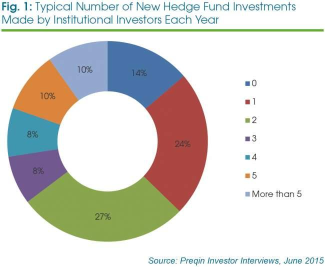

## Table of Contents

## What is a hedge fund?

A hedge fund is a type of investment fund that pools money from investors to invest in various assets, like stocks, bonds, and commodities. The goal of a hedge fund is to make money for its investors, often by using strategies that are more complex and riskier than those used by regular investment funds. Hedge funds are usually managed by experienced professionals who aim to earn high returns, even when markets are going down.

Hedge funds are different from other investment funds because they have more freedom in how they invest. They can use strategies like borrowing money to invest more (leverage), betting that certain assets will go down in value (short selling), and using derivatives, which are financial contracts that get their value from an underlying asset. Because of these strategies, hedge funds can be riskier, and they are typically only available to wealthy investors or institutions who can handle the potential losses.

## What are the primary sources of capital for hedge funds?

The main sources of money for hedge funds come from rich people and big organizations like pension funds, insurance companies, and universities. These investors are called "accredited investors" because they have a lot of money and can handle the risk of losing some of it. Hedge fund managers often have to meet certain rules set by the government, like making sure their investors have a high enough income or net worth, before they can accept their money.

Another source of capital for hedge funds can be from the managers themselves. Sometimes, the people who run the hedge fund put their own money into the fund to show they believe in what they're doing. This can also attract more investors because it shows confidence in the fund's strategies. Overall, hedge funds get their money mostly from wealthy individuals and large institutions that are looking for higher returns and are willing to take on more risk.

## How do individual investors contribute to hedge fund capital?

Individual investors play a big role in providing money to hedge funds. These investors are usually rich people who have a lot of money to invest. They are called "accredited investors" because they meet certain financial requirements set by the government. These requirements might include having a high income or a large amount of money and investments. Hedge funds can only accept money from these kinds of investors because their strategies can be risky, and the government wants to make sure that only people who can handle the risk are investing.

When individual investors put their money into a hedge fund, they hope to get higher returns than they would from regular investments like stocks or bonds. Hedge funds often use complicated strategies to try to make more money, even when the market is going down. Because of this, individual investors need to be ready to lose some of their money if things don't go well. But if the hedge fund does well, these investors can earn a lot more than they would with safer investments.

## What role do institutional investors play in funding hedge funds?

Institutional investors are big organizations like pension funds, insurance companies, and universities that put a lot of money into hedge funds. They have a lot of money to invest, so they can give hedge funds big amounts of money. This helps hedge funds to grow and try out different ways to make money. Because these organizations have a lot of money, they can handle the risk that comes with investing in hedge funds. They are looking for higher returns than they can get from regular investments like stocks or bonds.

Hedge funds like having institutional investors because they bring in a lot of money at once. This can help the hedge fund to do bigger deals and use more complex strategies. Also, when big organizations invest, it can make other people want to invest too, because it shows that experts believe in the hedge fund. So, institutional investors not only provide money but also help to make the hedge fund more popular and trusted.

## How do family offices invest in hedge funds?

Family offices are private wealth management firms that handle the money of rich families. They often invest in hedge funds because they want to make more money than they could with regular investments. Family offices usually have a lot of money to invest, so they can put big amounts into hedge funds. They like hedge funds because they use different strategies to try to make money, even when the market is going down. This can be good for family offices because it helps them keep and grow their family's wealth.

When a family office decides to invest in a hedge fund, they do a lot of research first. They look at how the hedge fund has done in the past, who is running it, and what strategies they use. Family offices want to make sure the hedge fund is a good fit for their goals and that they can handle the risk. Once they decide to invest, they might put money into one hedge fund or spread it out over several hedge funds to lower their risk. By doing this, family offices can try to get higher returns and protect their family's money for the future.

## What are fund of funds and how do they allocate capital to hedge funds?

A fund of funds is a type of investment fund that invests in other investment funds, including hedge funds. Instead of putting money directly into stocks or bonds, a fund of funds spreads its money across many different hedge funds. This helps to lower the risk because if one hedge fund does badly, the others might do well and balance it out. People who invest in a fund of funds don't have to choose which hedge funds to invest in themselves. The managers of the fund of funds do that work for them.

When a fund of funds decides how to spread its money among hedge funds, they look at many things. They think about how each hedge fund has done in the past, what strategies they use, and who is running the fund. They want to pick a mix of hedge funds that will work well together and help them reach their goals. By spreading the money across different hedge funds, a fund of funds can try to get higher returns while also keeping the risk under control. This makes it easier for people to invest in hedge funds without having to know a lot about them.

## How does the use of leverage affect hedge fund capital?

When hedge funds use leverage, they borrow money to invest more than they have. This can make their investments bigger and possibly earn more money. But it also makes things riskier. If the investments go up, the hedge fund can make a lot more money because they invested more. But if the investments go down, they can lose a lot more too. So, using leverage can change how much money the hedge fund has because it can make the ups and downs bigger.

Because of this, hedge funds need to be careful about how much they borrow. If they use too much leverage and things go badly, they might lose so much money that they can't pay back what they borrowed. This could mean they have to sell their investments quickly, which might make things even worse. So, while leverage can help hedge funds grow their capital, it can also put that capital at risk if they're not careful.

## What are the regulatory considerations for different sources of hedge fund capital?

Hedge funds have to follow certain rules when they get money from different places. For individual investors, hedge funds can only take money from people who are called "accredited investors." This means these people have to be rich enough or have a high enough income to handle the risk of losing money. The rules are set by the government to protect people who might not be able to afford to lose a lot of money. So, hedge funds have to check that their individual investors meet these rules before they can accept their money.

For institutional investors like pension funds or insurance companies, the rules can be a bit different. These big organizations usually have a lot of money and can handle more risk, so they don't have to meet the same strict rules as individual investors. But hedge funds still have to follow some rules set by the government, like reporting how they're doing and what they're investing in. This helps make sure that hedge funds are being honest and fair with their investors.

Family offices and funds of funds also have to follow rules when they invest in hedge funds. Family offices, which manage money for rich families, have to make sure they're following the rules for accredited investors if they're putting in their own money. Funds of funds, which invest in other funds including hedge funds, have to follow rules about how they report their investments and make sure they're not taking on too much risk. All these rules help keep the hedge fund industry safe and fair for everyone involved.

## How do hedge funds attract capital from high-net-worth individuals?

Hedge funds attract high-net-worth individuals by offering the chance to make more money than they could with regular investments like stocks or bonds. These funds use special strategies that can make money even when the market is going down. High-net-worth individuals are often looking for ways to grow their wealth, so hedge funds can be very appealing. The managers of hedge funds also build trust by showing good results in the past and explaining how their strategies work. They might also let these investors meet the team and see how they make decisions.

To get high-net-worth individuals to invest, hedge funds also focus on building personal relationships. They might invite potential investors to special events or meetings where they can learn more about the fund. This personal touch helps make the investors feel important and cared for. Hedge funds also show that they believe in their own strategies by putting their own money into the fund. This can make high-net-worth individuals feel more confident about investing their money too.

## What are the trends in pension fund allocations to hedge funds?

Pension funds have been changing how much money they put into hedge funds over the years. A few years ago, many pension funds were very interested in hedge funds because they thought they could make more money than with regular investments. They liked that hedge funds could use special strategies to make money even when the market was not doing well. But recently, some pension funds have started to pull back a bit. They found that hedge funds were not always making as much money as they hoped, and the fees were high. So, they started looking for other places to put their money, like in real estate or private equity.

Even though some pension funds are putting less money into hedge funds, others still see them as a good choice. They believe that hedge funds can help them balance out their other investments and protect their money when the market goes down. These pension funds often choose hedge funds that have a good track record and use strategies that fit well with their overall plan. Overall, the trend in pension fund allocations to hedge funds is mixed, with some funds reducing their investments and others staying committed or even increasing their allocations.

## How do hedge funds manage and report to their investors?

Hedge funds keep in touch with their investors by sending them regular reports. These reports tell the investors how the fund is doing, what it's investing in, and how much money it's making or losing. The reports usually come out every month or every quarter. They also have meetings or calls where the managers explain what's going on and answer any questions the investors might have. This helps the investors feel more confident about where their money is going.

Sometimes, hedge funds have special rules about how investors can get their money back. They might say that investors have to wait a certain amount of time before they can take their money out. This is called a "lock-up period." It helps the hedge fund plan better because they know the money will stay in the fund for a while. The hedge fund also has to follow rules set by the government about how they report to their investors. These rules make sure the hedge fund is being honest and fair.

## What strategies can hedge funds employ to optimize their capital structure?

Hedge funds can use different strategies to make their capital structure better. One way is by using leverage, which means borrowing money to invest more than they have. This can help them make bigger investments and possibly earn more money. But it also makes things riskier because if the investments go down, they could lose a lot more. So, hedge funds need to be careful about how much they borrow and make sure they can handle the risk. Another strategy is to diversify their investments. By spreading their money across different types of investments, hedge funds can lower the risk and make their capital structure more stable.

Hedge funds also need to think about how they attract and keep investors. They can do this by showing good results in the past and explaining their strategies clearly. Building strong relationships with investors, like inviting them to meetings and events, can also help. Hedge funds might also put their own money into the fund to show they believe in what they're doing. This can make investors feel more confident. By managing their capital well and keeping investors happy, hedge funds can optimize their capital structure and keep growing.

## What are the sources of capital for hedge funds?

Hedge funds primarily gather capital from investors, such as high net worth individuals, corporations, foundations, endowments, and pension funds. These entities seek to diversify their portfolios and generate higher returns, which hedge funds aim to deliver through sophisticated investment strategies. Small retail investors are generally excluded from direct hedge fund investments due to the high minimum investment requirements and regulatory restrictions designed to protect less-experienced investors. 

The initial performance of a hedge fund manager plays a crucial role in attracting interest from large institutional investors. A strong track record of returns compared to market benchmarks can draw significant capital from these investors. Furthermore, early successes can set the stage for long-term partnerships and instill confidence in the fund's strategies.

Hedge funds typically operate under a partnership structure, which allows for extensive capital pooling. This structure provides them with significant leverage, as pooled capital can be strategically allocated across various investment opportunities. The ability to amass and deploy large sums of money quickly is a competitive advantage, facilitating participation in more significant and potentially lucrative investments.

Good performance not only attracts new investors but also encourages existing investors to commit additional funds. This phenomenon can be explained using a basic investment model where expected return $E$ is a function of past performance $P$ and risk $R$:

$$
E = f(P, R)
$$

An excellent historical performance $P$ can increase the expected return $E$, making the fund more attractive to investors despite potential risks $R$. Consequently, this increased attractiveness often results in additional capital commitments, enabling the fund to pursue larger or more diverse investment strategies.

Overall, the capacity of hedge funds to secure substantial capital from a sophisticated investor base is a testament to their reputation and the perceived value of their strategic approaches. These capital sources enable hedge funds to maintain flexibility and responsiveness in a dynamic financial environment, ultimately enhancing their potential for successful outcomes.

## What is the Hedge Fund Fee Structure: Two and Twenty?

### The Hedge Fund Fee Structure: Two and Twenty

The 'Two and Twenty' fee structure is a prevalent model in the [hedge fund](/wiki/hedge-fund-trading-strategies) industry and has played a critical role in shaping fund manager incentives. Under this arrangement, hedge fund managers charge a 2% management fee on the total assets under management (AUM), irrespective of fund performance. Additionally, a performance fee of 20% is applied to the generated profits, aligning the interests of fund managers and investors. This incentivization is theoretically designed to encourage managers to aim for higher returns, contributing to enhanced fund performance.

The management fee serves two primary purposes: covering the operational costs of managing the fund and compensating the fund manager for their expertise. The performance fee is structured to link directly to the fund's success, thus motivating managers to achieve superior outcomes.

$$
\text{Total Fee} = 0.02 \times \text{AUM} + 0.20 \times \text{Profits}
$$

However, changes in the investment landscape have prompted scrutiny and challenges to the traditional 'Two and Twenty' model. The increasing competition from automated investment platforms, such as robo-advisors, has introduced cost-efficiency and transparency, with many such platforms offering lower fee structures. Investors are now more mindful of cost efficiency and are demanding better fee terms to maximize their net returns.

These shifts have encouraged many hedge funds to reconsider their fee structures to remain competitive and attractive to investors. This includes offering reduced management fees, tiered performance fees based on achieving significant benchmarks, or introducing hurdle rates (minimum returns a fund must earn before performance fees apply). Such adaptations reflect the hedge fund industry's ongoing need to balance incentive structures with investor expectations and market demands. 

The evolution of fee models underscores the dynamic nature of hedge fund management, necessitating consistent evaluation and adaptation to shifting competitive pressures and technological advancements in the industry.

## References & Further Reading

[1]: Bergstra, J., Bardenet, R., Bengio, Y., & Kégl, B. (2011). ["Algorithms for Hyper-Parameter Optimization."](https://dl.acm.org/doi/10.5555/2986459.2986743) Advances in Neural Information Processing Systems 24.

[2]: ["Advances in Financial Machine Learning"](https://www.amazon.com/Advances-Financial-Machine-Learning-Marcos/dp/1119482089) by Marcos Lopez de Prado

[3]: ["Evidence-Based Technical Analysis: Applying the Scientific Method and Statistical Inference to Trading Signals"](https://www.amazon.com/Evidence-Based-Technical-Analysis-Scientific-Statistical/dp/0470008741) by David Aronson

[4]: ["Machine Learning for Algorithmic Trading"](https://github.com/stefan-jansen/machine-learning-for-trading) by Stefan Jansen

[5]: ["Quantitative Trading: How to Build Your Own Algorithmic Trading Business"](https://www.amazon.com/Quantitative-Trading-Build-Algorithmic-Business/dp/1119800064) by Ernest P. Chan