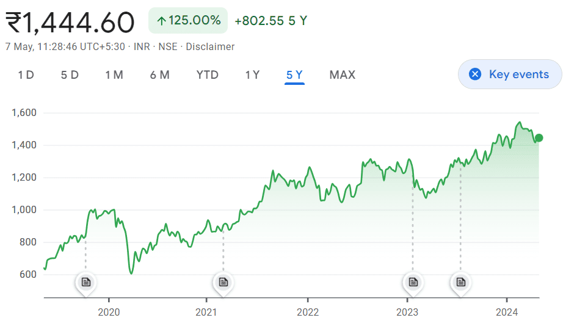

## Table of Contents

## What is market information and why is it important for fund managers?

Market information is all the data and news about what's happening in the world of business and finance. This includes things like stock prices, economic reports, company news, and trends in different industries. Fund managers need this information to make smart choices about where to invest the money they manage. Without good market information, it's like trying to drive a car with your eyes closed - you wouldn't know where you're going or what's happening around you.

This information is important for fund managers because it helps them understand which investments might do well and which ones might not. By keeping up with market information, fund managers can spot opportunities to buy stocks or other investments that are likely to increase in value. They can also see when it might be a good time to sell investments that are not doing well. In short, market information helps fund managers make better decisions, which can lead to better results for the people whose money they are managing.

## What are the primary sources of market information available to fund managers?

Fund managers get market information from many places. One big source is financial news services like Bloomberg and Reuters. These services give up-to-date news about stocks, bonds, and the economy. They also provide data about how different markets are doing around the world. Another important source is company reports. These are documents that companies must share with the public, like earnings reports and annual reports. They tell fund managers how well a company is doing and what its plans are for the future.

Another key source of market information is economic reports from governments and other organizations. These reports give details about things like unemployment rates, inflation, and how fast the economy is growing. Fund managers use this information to understand the bigger picture of the economy and how it might affect their investments. Lastly, fund managers often use research reports from investment banks and other financial institutions. These reports give expert opinions and predictions about different industries and companies, helping fund managers make more informed decisions.

## How can fund managers access financial news and data services?

Fund managers can access financial news and data services through subscriptions to platforms like Bloomberg Terminal and Reuters Eikon. These services provide real-time data, news, and analysis that help fund managers stay updated on market trends and make informed decisions. To use these services, fund managers usually need to pay a subscription fee, which can be quite expensive, but it's worth it because the information is very detailed and up-to-date.

Another way to access financial news and data is through online financial news websites like CNBC, Yahoo Finance, and The Financial Times. These websites offer free access to a lot of information, but they might not be as detailed or as fast as paid services. Fund managers often use these websites to get a quick overview of what's happening in the markets before diving deeper with their paid subscriptions.

Some fund managers also use mobile apps from financial news providers. These apps let them check market updates on their phones or tablets, which is handy when they're away from their desks. The apps usually offer a mix of free and paid content, so fund managers can choose what works best for them.

## What role do government publications play in providing market information?

Government publications are important for fund managers because they give information about the economy. These publications include things like unemployment rates, inflation numbers, and how fast the economy is growing. Fund managers use this data to understand the bigger picture of the economy. For example, if the unemployment rate is going down, it might mean the economy is getting better, which could be good for certain investments.

These government reports are often released on a regular schedule, so fund managers know when to expect new information. This helps them plan their investment strategies. For instance, the U.S. government releases a report called the Non-Farm Payrolls every month, which tells how many jobs were added or lost. Fund managers watch these reports closely because they can affect stock prices and other investments. By staying on top of these government publications, fund managers can make better decisions about where to invest their money.

## How can industry reports and analyses benefit fund managers in decision-making?

Industry reports and analyses give fund managers a lot of useful information about different sectors of the economy. These reports tell them how industries are doing right now and where they might be headed in the future. For example, a report might say that the tech industry is growing fast because more people are buying smartphones and computers. This helps fund managers decide if they should invest more money in tech companies.

These reports also help fund managers understand the risks and opportunities in different industries. If a report says that the car industry is facing challenges because of new environmental rules, fund managers might decide to be more careful about investing in car companies. By reading these reports, fund managers can make smarter choices about where to put their money, which can lead to better results for the people who have invested with them.

## What are the advantages of using real-time market data feeds?

Real-time market data feeds give fund managers information right away. This means they can see what's happening in the markets as it happens. This is important because markets can change quickly, and fund managers need to know about these changes fast. If a stock price suddenly goes up or down, they can decide to buy or sell right away. This helps them make better decisions and maybe make more money for their investors.

Also, real-time data helps fund managers stay ahead of others. If they get the information first, they can act before others do. This can give them an edge in the market. For example, if a company announces good news and the stock price starts to rise, a fund manager with real-time data can buy the stock before it gets too expensive. This way, they can take advantage of opportunities as soon as they appear.

## How do fund managers utilize expert networks and consultancy services for market insights?

Fund managers use expert networks and consultancy services to get advice from people who know a lot about certain industries or companies. These experts can be former executives, analysts, or other professionals who have inside knowledge. Fund managers talk to them to learn things that they can't find in public reports or news. This helps them understand what's really going on in a company or industry, which can be very helpful when deciding where to invest.

Consultancy services also give fund managers detailed reports and analyses. These reports can include predictions about how an industry will do in the future, or advice on which companies are good investments. By using these services, fund managers get a clearer picture of the market. This extra information can help them make better choices about where to put their money, which can lead to better results for their investors.

## What are the key considerations when evaluating the credibility of market information sources?

When fund managers look at market information sources, they need to think about how trustworthy the information is. One important thing to check is who is giving the information. If it comes from a well-known and respected place like a government agency or a big financial news service, it's usually more reliable. Fund managers also look at the history of the source. If the source has been right about things before, it's more likely to be right again. They also check if the information is backed up by facts and numbers, not just opinions.

Another thing to consider is how up-to-date the information is. Markets can change fast, so old information might not be useful anymore. Fund managers also think about if the source might have a reason to give biased information. For example, if a company is talking about itself, it might only share the good news and leave out the bad. By looking at all these things, fund managers can decide if they can trust the information they're using to make their investment choices.

## How can advanced data analytics and AI tools enhance the processing of market information?

Advanced data analytics and AI tools can help fund managers process a lot of market information quickly. These tools can look at big amounts of data from many different places, like stock prices, news articles, and social media. They can find patterns and trends that might be hard for people to see. For example, an AI tool might notice that when certain words are used a lot in news stories, stock prices tend to go up or down. This can help fund managers make better guesses about what might happen next in the market.

AI tools can also help by doing things that would take people a long time. They can read and understand reports and news articles much faster than a person could. This means fund managers can get the information they need right away, instead of waiting. Also, AI can help by making predictions based on past data. If a tool sees that certain things have happened before a stock price went up, it can tell the fund manager that it might happen again. This helps fund managers make smarter choices about where to invest their money.

## What strategies can fund managers employ to integrate diverse sources of market information effectively?

Fund managers can integrate diverse sources of market information by creating a system that brings all the data together in one place. They can use special software that pulls in information from financial news services, government reports, industry analyses, and expert networks. This software helps them see everything at once, so they don't miss important details. By having all this information in one spot, fund managers can spot trends and connections that they might not see if they looked at each source separately. This helps them make better decisions about where to invest their money.

Another strategy is to assign different team members to focus on specific types of information. For example, one person might keep up with financial news, while another looks at government reports and another talks to experts. By dividing the work, the team can cover more ground and bring all the different pieces of information together. Then, they can meet regularly to share what they've learned and discuss how it all fits together. This way, they can get a complete picture of the market and use it to guide their investment choices.

## How do regulatory changes impact the availability and type of market information accessible to fund managers?

Regulatory changes can affect what kind of market information fund managers can get and how they get it. When governments make new rules, they might require companies to share more information with the public. This can give fund managers more data to work with, like detailed financial reports or news about company changes. But sometimes, new rules can make it harder to get information. For example, if a new law says that certain information can't be shared anymore, fund managers might have less to go on when making their investment choices.

These changes can also affect the type of information available. New regulations might focus on things like environmental impact or social responsibility, so fund managers might see more reports about these topics. This can help them understand how companies are doing in these areas, which can be important for deciding where to invest. Overall, fund managers need to keep up with regulatory changes so they can adjust how they gather and use market information to make the best decisions for their investors.

## What future trends are likely to influence the sources and methods of obtaining market information for fund managers?

In the future, technology will play a bigger role in how fund managers get market information. Tools like artificial intelligence and machine learning will become even more important. These tools can look at huge amounts of data from places like social media, news articles, and financial reports. They can find patterns and make predictions faster than people can. This means fund managers will be able to get information and make decisions more quickly. Also, as more devices connect to the internet, fund managers might use data from things like smart cars or home devices to understand how people are spending money and what they want.

Another trend that will change how fund managers get market information is the focus on sustainability and social responsibility. More and more, companies will need to share information about their impact on the environment and society. This will give fund managers new types of data to look at when deciding where to invest. They will need to think about not just how a company makes money, but also how it treats the planet and people. Governments might also make new rules about what information companies have to share, which could change what kind of data fund managers can use.

## What are some references and further reading materials?

1. Statman, M. "Investment Strategies and Performance: The Case of Index Funds." *Financial Analysts Journal*. This paper explores the efficiency and performance of index funds, which are a type of passive investment strategy. It discusses the cost-effectiveness and diversification benefits associated with index funds, providing a foundation for understanding passive management strategies.

2. Sharpe, W.F. "Capital Asset Prices: A Theory of Market Equilibrium Under Conditions of Risk." *The Journal of Finance*. This seminal work introduces the Capital Asset Pricing Model (CAPM), which is foundational to modern portfolio theory. The CAPM formula is given by:
$$
   E(R_i) = R_f + \beta_i (E(R_m) - R_f)

$$

   where $E(R_i)$ is the expected return on the asset, $R_f$ is the risk-free rate, $\beta_i$ is the beta of the asset, and $E(R_m)$ is the expected return of the market.

3. Elton, E.J. and Gruber, M.J. *Modern Portfolio Theory and Investment Analysis*. John Wiley & Sons. This book provides an in-depth examination of modern portfolio theory, offering insights into risk management and optimal portfolio selection. It elaborates on key concepts such as the efficient frontier and the importance of diversification in reducing portfolio risk.

These foundational texts are critical for a deeper understanding of investment strategies, market dynamics, and the principles underpinning portfolio management. They provide both theoretical frameworks and practical insights into the ever-evolving landscape of finance.

## References & Further Reading

1. Statman, M. "Investment Strategies and Performance: The Case of Index Funds." *Financial Analysts Journal*. This paper explores the efficiency and performance of index funds, which are a type of passive investment strategy. It discusses the cost-effectiveness and diversification benefits associated with index funds, providing a foundation for understanding passive management strategies.

2. Sharpe, W.F. "Capital Asset Prices: A Theory of Market Equilibrium Under Conditions of Risk." *The Journal of Finance*. This seminal work introduces the Capital Asset Pricing Model (CAPM), which is foundational to modern portfolio theory. The CAPM formula is given by:
$$
   E(R_i) = R_f + \beta_i (E(R_m) - R_f)

$$

   where $E(R_i)$ is the expected return on the asset, $R_f$ is the risk-free rate, $\beta_i$ is the beta of the asset, and $E(R_m)$ is the expected return of the market.

3. Elton, E.J. and Gruber, M.J. *Modern Portfolio Theory and Investment Analysis*. John Wiley & Sons. This book provides an in-depth examination of modern portfolio theory, offering insights into risk management and optimal portfolio selection. It elaborates on key concepts such as the efficient frontier and the importance of diversification in reducing portfolio risk.

These foundational texts are critical for a deeper understanding of investment strategies, market dynamics, and the principles underpinning portfolio management. They provide both theoretical frameworks and practical insights into the ever-evolving landscape of finance.

