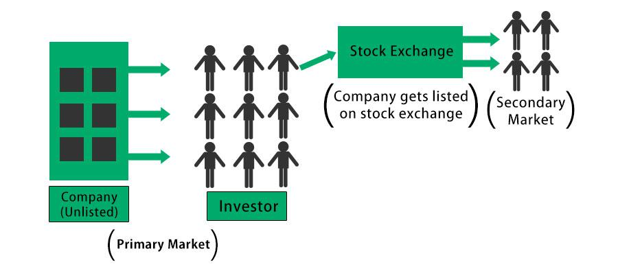

Investment strategies, market information, fund managers, and algorithmic trading are pivotal in shaping the landscape of modern finance. These elements collectively contribute to enhancing investment decisions and optimizing portfolio management, ensuring that investors can navigate the complexities of financial markets effectively. 

Investment strategies encompass a wide range of approaches tailored to adapt to varying market conditions, risk appetites, and financial goals. Market information, which consists of real-time news, economic indicators, and analytical reports, provides the necessary insights to make informed investment choices. This data serves as the foundation upon which robust investment strategies are developed and adjusted.



Fund managers play a crucial role in this ecosystem by leveraging their expertise and comprehensive resources to conduct in-depth market analysis. Their ability to interpret complex financial data and trends aids in crafting strategic investment decisions. The growing trend of specialization among fund managers and their pursuit of professional qualifications, such as the Chartered Financial Analyst (CFA) designation, underscores their commitment to ethical standards and a deep understanding of market mechanics.

Algorithmic trading introduces another layer of sophistication by using advanced mathematical models and algorithms to execute trades with unprecedented speed and precision. This technological advancement enhances market efficiency and contributes to the diversification and dynamic management of investment portfolios.

Understanding the synergy between these components is essential for both institutional and individual investors seeking to maximize returns while managing risks effectively. The integration of these elements not only streamlines decision-making processes but also allows for better adaptation to the rapid changes inherent in global financial markets. As we explore the interconnected roles of investment strategies, market information, fund managers, and algorithmic trading, this article aims to provide a comprehensive overview of how these factors collectively revolutionize finance.

## Table of Contents

## Investment Strategies and Market Information

Investment strategies are integral to achieving financial objectives and vary based on the investor's goals, risk tolerance, and market dynamics. The primary approaches include active and passive management, value and growth investing, among others. Active management involves selecting securities to outperform the market, requiring constant analysis and adjustment based on market trends. This strategy often entails frequent trading and a deep dive into individual company performance, which can lead to higher transaction costs. Conversely, passive management aims to replicate market indices, minimizing trading and generally resulting in lower costs.

Value investing is predicated on identifying undervalued stocks with strong fundamentals but trading below their intrinsic value. Growth investing focuses on companies expected to grow at an above-average rate compared to their industry. Both strategies require comprehensive analysis, but while value investors rely on a margin of safety, growth investors emphasize future earnings potential.

Market information is indispensable for formulating these strategies, encompassing news, financial reports, and economic indicators. Reliable data allows investors to assess market conditions, sector performances, and economic trends. Economic indicators such as GDP growth rates, employment figures, and inflation rates offer insights into macroeconomic conditions influencing market dynamics.

Fund managers play a pivotal role in leveraging this market information. Equipped with sophisticated tools and methodologies, they analyze data to form strategic decisions aimed at optimizing returns. This involves the assessment of financial statements, market trends, and economic forecasts. Fund managers also use advanced financial models to evaluate potential risks and returns, ultimately guiding their investment strategies.

In summary, investment strategies are diverse and heavily reliant on timely and accurate market information. Fund managers utilize this information to refine their strategies, continually adapting to changes in market conditions to maximize performance and achieve investor goals.

## The Role of Fund Managers

Fund managers play a pivotal role in the financial markets by utilizing specialized knowledge and extensive resources that are typically beyond the reach of average investors. Their expertise is instrumental in interpreting complex market information and making informed decisions that can enhance portfolio performance.

To achieve these outcomes, fund managers rely on a comprehensive set of tools and methodologies. Key among these are annual reports and financial forecasts. Annual reports provide an in-depth view of a company's financial health, including balance sheets, income statements, and cash flow statements, which help in assessing an organization's past performance and predicting future potential. Financial forecasts, on the other hand, offer projections based on current and predictive market data, enabling fund managers to anticipate market movements and strategically adjust their investment portfolios accordingly.

The competence of fund managers is often underscored by rigorous professional training and certifications. A predominant credential in this field is the Chartered Financial Analyst (CFA) designation. This certification signifies a high level of proficiency in investment management, encompassing a broad understanding of financial markets, ethics, and economics. The CFA curriculum is designed to enhance investment decision-making skills, with a strong emphasis on ethical practices and sustainable investment strategies, which are essential in maintaining trust and integrity within the financial markets.

By merging their specialized knowledge with cutting-edge analytical tools, fund managers can construct diversified and resilient portfolios. Their ability to synthesize large volumes of data and implement strategic adjustments is critical in achieving robust financial performance, ultimately benefiting investors seeking to maximize returns while mitigating risks.

 to Algorithmic Trading

Algorithmic trading has significantly transformed traditional trading by leveraging speed and precision through automated decision-making processes. By incorporating mathematical models and real-time data, [algorithmic trading](/wiki/algorithmic-trading) aims to enhance market efficiency by executing trades with minimum human intervention. This method minimizes delays associated with manual trading and takes advantage of even the slightest price discrepancies.

The core of algorithmic trading is its reliance on mathematical models and algorithms to implement strategies. These algorithms are designed to process vast amounts of data, identify trading opportunities, and execute orders to maximize returns or minimize risks. Typically, the entire cycle—from data acquisition to trade execution—occurs within fractions of a second.

Common strategies utilized in algorithmic trading include:

1. **Trend-following**: This strategy capitalizes on market momentum by identifying upward or downward trends in stock prices. Algorithms are programmed to initiate buy or sell orders when certain conditions or price levels are met, based on historical price movements. This approach often relies on indicators like moving averages or chart patterns to predict future price behavior.

2. **Arbitrage**: Arbitrage strategies seek to profit from price differentials between related securities or markets. For example, an algorithm might exploit discrepancies in the price of a stock listed on two different exchanges. By simultaneously buying the stock at a lower price on one exchange and selling it at a higher price on another, the algorithm can lock in a risk-free profit.

3. **Statistical Arbitrage**: This involves analyzing statistical correlations between different assets to identify and exploit mispricings. Algorithms assess historical price correlations and deviations to select pairs of stocks that are expected to revert to their historical pricing relationship. This strategy is typically short-term and involves numerous transactions to capture small price differences.

Python programming is frequently used in developing and testing algorithmic trading strategies due to its rich ecosystem of libraries and tools. Here is a simple Python snippet illustrating a [momentum](/wiki/momentum)-based trading strategy:

```python
import pandas as pd
import numpy as np

# Sample data: stock prices
data = pd.DataFrame({
    'price': [100, 101, 102, 105, 107, 106, 108, 110]
})

# Calculate simple moving average (SMA)
data['SMA_3'] = data['price'].rolling(window=3).mean()

# Generate trading signals
data['signal'] = np.where(data['price'] > data['SMA_3'], 1, 0)

print(data)
```

In this example, a simple moving average is calculated over a 3-day window to generate buy (1) or sell (0) signals based on whether the stock price is above or below the SMA. This basic model can be further refined and expanded with more complex algorithms and larger datasets.

Algorithmic trading continues to evolve with advancements in technology, presenting traders with powerful tools to optimize investment decisions and achieve superior market outcomes.

## Integrating Algorithmic Trading with Traditional Investing

Combining algorithmic trading with traditional investing strategies, such as those employed by mutual funds, enhances portfolio performance through several mechanisms. Algorithms facilitate optimized trade execution by leveraging high-frequency trading techniques and real-time market data. This permits transactions to be executed at optimal prices, thereby minimizing slippage and transaction costs. Additionally, algorithmic trading boosts market timing precision. Automated systems can swiftly analyze vast datasets to capture favorable entry and [exit](/wiki/exit-strategy) points in response to market movements.

Moreover, the incorporation of algorithmic trading allows for improved portfolio diversification and dynamic adjustment. Algorithms can continuously monitor and rebalance portfolios according to predetermined criteria or freshly emerging data, ensuring that asset allocations align with the investor's risk tolerance and market outlook. This adaptability is crucial for maintaining the desired mix of assets and optimizing returns in fluctuating markets.

For example, a mutual fund manager may utilize a Python-based algorithm to perform the Markowitz mean-variance optimization, where the expected returns and variances of various assets are calculated to determine the optimal portfolio allocation:

```python
import numpy as np
import cvxopt as opt
from cvxopt import blas, solvers

# Number of assets
n_assets = len(expected_returns)

# Expected returns and covariance matrix
returns = np.array(expected_returns)
covariance = np.array(cov_matrix)

# Convert to cvxopt matrices
P = opt.matrix(covariance)
q = opt.matrix(np.zeros(n_assets))
G = opt.matrix(np.diag(-np.ones(n_assets)))
h = opt.matrix(np.zeros(n_assets))

# Define the equality constraints
A = opt.matrix(np.ones(n_assets), (1, n_assets))
b = opt.matrix(1.0)

# Solve the quadratic programming problem
solution = solvers.qp(P, q, G, h, A, b)

# Extract the optimal weights
optimal_weights = np.array(solution['x']).flatten()
```

In this code snippet, `expected_returns` and `cov_matrix` represent the expected returns and the covariance matrix of asset returns, respectively. The solution provides the optimal weights for asset allocation, ensuring maximum expected return for a given level of risk, which is fundamental for portfolio management.

This integration of algorithmic and traditional techniques allows mutual funds to harness the best of both worlds, taking advantage of algorithmic efficiency while applying seasoned investment judgment. Ultimately, combining these approaches empowers fund managers to deliver enhanced performance and adaptability, catering to both short-term market dynamics and long-term investment goals.

## Challenges and Considerations

Algorithmic trading, while offering significant advantages in speed and precision, presents several challenges that must be managed to ensure its effective deployment. A fundamental requirement for success is the need for robust data management and a sound technological infrastructure. These components are essential to handle large volumes of data and execute trades efficiently.

One of the primary concerns in algorithmic trading is overfitting. Overfitting occurs when a trading model is excessively complex and tailored to specific historical data, thereby losing its predictive power on new, unseen data. This can be compared to a [machine learning](/wiki/machine-learning) model that performs exceptionally well on training data but fails during real-world application due to lack of generalization. Mitigating overfitting involves using techniques such as cross-validation, simplifying models, and imposing penalties for complexity.

Data-snooping, another challenge, happens when decisions about the model are improperly influenced by the same dataset used to assess its performance. This can lead to false discoveries of trading patterns that are merely coincidental rather than indicative of genuine market trends. To avoid data-snooping, practitioners must separate data into distinct subsets for training, validation, and testing, ensuring that the model's performance is genuinely reflective of its ability to predict unseen data.

Transaction costs are a crucial consideration in algorithmic trading. Even strategies that appear profitable on paper can become unviable when actual costs related to trading execution—such as brokerage fees, taxes, and market impact—are factored in. One approach to accounting for these costs involves simulating the trading strategy using historical bid-ask spreads and past transaction fees to evaluate its net profitability.

Ethical practices and adherence to regulatory frameworks are essential to uphold market integrity. The automation in algorithmic trading could be exploited for manipulative practices such as spoofing or layering—where orders are placed with no intention of execution to mislead market participants. Therefore, regulatory compliance and ethical considerations must be ingrained in the development and deployment of such systems. Markets around the world have implemented rules that require transparency and accountability in algorithmic trading to protect against manipulative tactics and ensure fair trading environments.

Python, being a preferred language in financial sectors, offers utilities to address these challenges. Libraries like Scikit-learn can help in model selection and validation to counter overfitting, while packages like NumPy and Pandas facilitate efficient data handling crucial for algorithmic operations. A simple example of a [backtesting](/wiki/backtesting) process to account for transaction costs in Python could look like this:

```python
import pandas as pd

# Assuming 'df' is a DataFrame with columns 'price' and 'signal' where signal is 1 for buy, -1 for sell
df['cost'] = 0.0001 * df['price']  # Example of 0.01% transaction cost per trade

# Calculate returns including transaction costs
df['net_return'] = df['price'].pct_change() * df['signal'].shift() - df['cost']

# Calculate cumulative return
df['cumulative_net_return'] = (1 + df['net_return']).cumprod()

print(df['cumulative_net_return'])
```

By acknowledging these challenges and employing appropriate strategies and tools, stakeholders in algorithmic trading can enhance their practices, ensuring that the benefits of automation in trading outweigh the potential drawbacks.

## Conclusion

The synergy between investment strategies, market information, fund managers, and algorithmic trading is at the forefront of transforming the finance industry. Each of these components contributes uniquely to the overall efficiency and effectiveness of investment management. Investment strategies, ranging from active to passive management, are crafted using precise market information—consisting of news, economic indicators, and reports—to optimize decision-making processes. Fund managers use their expertise, bolstered by sophisticated analyses and financial forecasts, to enhance portfolio management. Their role is complemented by algorithmic trading, which introduces unrivaled speed and accuracy into trading activities.

Algorithmic trading is becoming increasingly influential as technological advancements continue to elevate its role in investment management. Algorithms facilitate superior trade execution, reduce transaction costs, and improve market timing, leading to overall better returns and efficient portfolio management. For investors to fully utilize such innovations, remaining informed about ever-evolving market dynamics and technological tools is critical.

Furthermore, as the financial landscape becomes more complex and integrated with technology, it's essential for investors to adopt an adaptive mindset. Staying abreast of regulatory changes and understanding the ethical underpinnings of these technologies will safeguard market integrity. Thus, embracing this synergy enables investors to strategically navigate and benefit from the rapidly evolving financial ecosystem.

## References & Further Reading

1. Statman, M. "Investment Strategies and Performance: The Case of Index Funds." *Financial Analysts Journal*. This paper explores the efficiency and performance of index funds, which are a type of passive investment strategy. It discusses the cost-effectiveness and diversification benefits associated with index funds, providing a foundation for understanding passive management strategies.

2. Sharpe, W.F. "Capital Asset Prices: A Theory of Market Equilibrium Under Conditions of Risk." *The Journal of Finance*. This seminal work introduces the Capital Asset Pricing Model (CAPM), which is foundational to modern portfolio theory. The CAPM formula is given by:
$$
   E(R_i) = R_f + \beta_i (E(R_m) - R_f)

$$

   where $E(R_i)$ is the expected return on the asset, $R_f$ is the risk-free rate, $\beta_i$ is the beta of the asset, and $E(R_m)$ is the expected return of the market.

3. Elton, E.J. and Gruber, M.J. *Modern Portfolio Theory and Investment Analysis*. John Wiley & Sons. This book provides an in-depth examination of modern portfolio theory, offering insights into risk management and optimal portfolio selection. It elaborates on key concepts such as the efficient frontier and the importance of diversification in reducing portfolio risk.

These foundational texts are critical for a deeper understanding of investment strategies, market dynamics, and the principles underpinning portfolio management. They provide both theoretical frameworks and practical insights into the ever-evolving landscape of finance.

