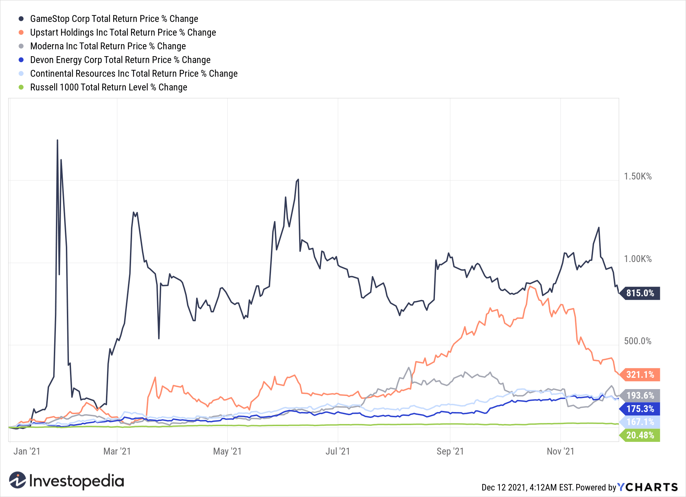

Year-To-Date (YTD) returns are a crucial metric for assessing the performance of investments. They measure the value change in an investment from the beginning of the current calendar year up to the current date. This metric allows investors to evaluate how their investments have performed within the year, offering a snapshot of growth or decline. YTD returns are vital for comparing the performance of various investments and are often used alongside financial benchmarks to determine the success of individual portfolios, funds, or institutional investments.

Understanding investment performance through YTD returns is critical for both individual and institutional investors. For individuals, it provides a metric to analyze the success of their financial decisions and adjust their strategies accordingly. Institutional investors, who manage large portfolios and funds, rely on YTD returns to report performance to stakeholders and guide future investment decisions. Clear comprehension of YTD returns enables investors to maintain or adjust holdings based on performance relative to market benchmarks, mitigating the risks associated with volatile financial markets.



Algorithmic trading, defined as the use of complex algorithms to automate trading instructions, is gaining momentum in the modern financial landscape. It involves using mathematical models and formulas to execute orders based on predetermined criteria, such as timing, price, or quantity. The growth of algorithmic trading is driven by its capacity to process vast amounts of data swiftly and accurately, reducing the latency in trade execution and minimizing human error. This technology is reshaping investment strategies by offering enhanced precision and efficiency in decision-making processes.

The interplay between YTD returns, financial benchmarks, and algorithmic trading is significant. YTD returns provide a quantifiable measure of investment success, while financial benchmarks offer a point of reference for evaluating these returns. Algorithmic trading, with its potential for high-speed and high-frequency transactions, potentially influences these returns. This integration is reshaping the landscape of investment, prompting a need for investors and traders to remain attuned to both technological advancements and market dynamics. As the financial industry continues to evolve, the synergy between YTD returns, benchmarks, and algorithmic trading will play a pivotal role in shaping investment strategies and outcomes.

## Table of Contents

## Understanding YTD Returns

YTD (Year-To-Date) returns represent the total return that an investment has generated from the beginning of the current calendar year to the present date. Typically expressed as a percentage, YTD returns are calculated using the formula:

$$

\text{YTD Return} = \frac{\text{Current Value} - \text{Value at Beginning of Year}}{\text{Value at Beginning of Year}} \times 100 
$$

where the "Current Value" is the market value of the investment on the present date, and the "Value at Beginning of Year" is the market value of the investment on the first day of the year. YTD returns provide an annualized measure of performance, offering insights into how well an investment or portfolio is performing over the current year.

The significance of YTD returns lies in their ability to offer a snapshot of short- to medium-term performance, which aids both individual and institutional investors in evaluating investment strategies. They are crucial for performance management, decision-making, and strategy adjustments. By focusing on YTD returns, investors can determine if their investments are aligned with their financial goals or if adjustments are needed.

YTD returns can be categorized into absolute and relative returns. Absolute YTD returns measure the raw percentage change in value, providing a straightforward look at how much an investment has gained or lost in the current year. Relative YTD returns, on the other hand, compare the performance of an investment against a benchmark or a set of benchmarks, offering a perspective on how the investment fared relative to the market or similar asset classes.

For example, consider an investor who began the year with a stock worth $1,000. By June 30th, the stock's value increased to $1,100. The absolute YTD return would be calculated as:

$$

\text{YTD Return} = \frac{1100 - 1000}{1000} \times 100 = 10\%
$$

To assess relative YTD returns, assume the investor's benchmark index gained 8% over the same period. The stock's relative YTD return outperformance would be 10% - 8% = 2%.

Different YTD return scenarios illustrate varying levels of performance across asset classes and market conditions. For instance, a high YTD return during a bullish market might signal strong asset performance, while a lower return in the same scenario might necessitate reevaluation of one's investment strategy. Likewise, in bear markets, negative or lower YTD returns could still be favorable if they outperform relevant benchmarks, indicating resilience or strategic acumen compared to the broader market downturn.

Understanding these returns, in both absolute and relative contexts, equips investors with crucial insights necessary for informed decision-making and enhances their capability to gauge investment efficiency effectively.

## The Role of Financial Benchmarks in Investment Performance

Financial benchmarks serve as vital tools in evaluating investment performance, providing objective standards against which the success or failure of an investment can be measured. A financial benchmark is essentially a standard index composed of securities, which is used to compare the performance of different portfolios or asset managers. They are crucial in the financial industry as they offer a reference point for tracking returns and assessing the effectiveness of investment strategies.

Common financial benchmarks include indices such as the S&P 500 and the Dow Jones Industrial Average (DJIA), both of which are prominent in the United States. The S&P 500, composed of 500 of the largest U.S. companies by market capitalization, is widely regarded as a leading indicator of U.S. equities and a barometer of overall market health. The DJIA, which includes 30 significant publicly traded companies, serves as another indicator, often used to gauge the health of corporate America and, by extension, the economy.

Global indices, such as the MSCI World Index, provide benchmarks for international markets, encompassing equities from various countries, thus offering a global perspective on market performance. These indices are crucial for investors with portfolios diversified across different geographical locations.

Benchmarks are used to evaluate investment performance by allowing investors and fund managers to compare their returns with the returns of the benchmark index. For example, if a mutual fund delivers a return of 8% while the S&P 500 posts a 10% return over the same period, the fund has underperformed relative to the benchmark. This comparison helps in assessing the skill and strategy of the fund manager.

Market [volatility](/wiki/volatility-trading-strategies) significantly impacts benchmarks and returns. During periods of high volatility, the risk of deviation between an investment's return and the benchmark can increase. This volatility can stem from economic events, geopolitical unrest, or unexpected financial developments. For instance, during the financial crisis of 2008, benchmark indices worldwide experienced massive fluctuations, affecting the returns and evaluations of numerous investment portfolios.

Investors commonly use risk-adjusted return measures, such as the Sharpe Ratio, to account for volatility when comparing portfolio performance to benchmarks. The Sharpe Ratio is calculated as:

$$
\text{Sharpe Ratio} = \frac{\text{Portfolio Return} - \text{Risk-Free Rate}}{\text{Standard Deviation of Portfolio Returns}}
$$

A higher Sharpe Ratio suggests a more attractive risk-adjusted return, considering the volatility.

By offering a point of reference for performance and allowing for the adjustment of risk factors, financial benchmarks are indispensable in the analysis and management of investment portfolios. Understanding their role and the impact of market fluctuations is critical for making informed investment decisions.

## Algorithmic Trading: Revolutionizing Investment Strategies

Algorithmic trading is a method of executing orders utilizing automated pre-programmed trading instructions that account for variables such as time, price, and [volume](/wiki/volume-trading-strategy). This technology-driven trading strategy leverages complex algorithms to make high-speed decisions, enabling traders to capitalize on market inefficiencies. The fundamental principles of [algorithmic trading](/wiki/algorithmic-trading) involve the automation of the decision-making process, reducing the need for manual intervention and allowing for emotionless, systematic executions. 

One of the most significant advantages of algorithmic trading in financial markets is its speed and precision. Algorithms can process vast amounts of market data in fractions of a second, responding to fluctuations much faster than a human trader could. This rapid execution minimizes the delay between market events and responses, often reducing slippage – the difference between the expected price of a trade and the actual price.

Algorithms are not only swift but also precise, executing trades with minimal error. The use of predetermined parameters ensures that trades are carried out exactly as planned, which is crucial in implementing complex trading strategies consistently and without deviation.

Several popular algorithmic trading strategies are used to exploit different facets of the market:

1. **Arbitrage**: This strategy involves the simultaneous purchase and sale of an asset to profit from a difference in the price in different markets. For example, if a stock is priced differently on two exchanges, an algorithm can identify and execute trades on both platforms, locking in profit from the price differential before the market adjusts.

2. **Momentum Trading**: This strategy is based on the idea that securities which have been rising will continue to rise, and those which have been falling will continue to fall. Algorithms detect pricing patterns and trends, enabling traders to enter positions that capture this momentum until an indicated reversal.

3. **Mean Reversion**: This strategy hinges on the concept that asset prices and historical returns eventually return to their long-term mean or average level. Algorithms identify overbought or oversold conditions, placing trades that anticipate a return to the mean, aiming to profit from corrections.

Algorithmic trading's impact on Year-To-Date (YTD) returns and investment benchmarks is substantial. By enhancing trading efficiency, algorithms can significantly improve the profitability of investment strategies. The precision and speed of executing numerous trades can help in achieving better returns by seizing opportunities that might be missed by manual trading methods. Moreover, algorithmic trading contributes to maintaining tighter bid-ask spreads and providing [liquidity](/wiki/liquidity-risk-premium), which can enhance overall market performance.

While algorithmic trading has demonstrated its potential to improve YTD returns by capturing short-lived market conditions and optimizing trading costs, it also poses challenges. It necessitates continuous monitoring and recalibration of algorithms to adapt to evolving market dynamics, which may affect realized returns.

Overall, the integration of algorithmic trading with traditional investment strategies offers opportunities to enhance performance relative to benchmarks. However, the benefits must be weighed against the complexities and risks associated with technology-driven trading in volatile financial landscapes.

## Analyzing Investment Performance with YTD Returns

Analyzing Year-To-Date (YTD) returns provides valuable insights for investors aiming to assess the efficiency of their investments. YTD returns represent the change in value of an investment from the beginning of the current calendar year to the present date. This performance metric is significant as it helps investors evaluate how well an investment is performing over the current year.

To calculate YTD returns, the formula used is:

$$
\text{YTD Return} = \left(\frac{\text{Current Value} - \text{Value at Start of Year}}{\text{Value at Start of Year}}\right) \times 100\%
$$

This formula quantitatively expresses the percentage growth or decline of an investment over the specified period, allowing investors to gauge performance relative to the initial investment value at the year's start.

Integrating YTD returns analysis with benchmark comparisons enhances investment insights. Benchmarks, like the S&P 500 or Nasdaq Composite, serve as standards against which individual portfolio performance can be measured. By comparing an investment's YTD return to these benchmarks, investors can determine whether the investment has outperformed or underperformed relative to the market. This comparison aids in evaluating the effectiveness of investment strategies and guiding future decisions.

Methodologies for tracking and interpreting YTD returns are crucial for investors. A straightforward approach involves creating a spreadsheet that tracks the starting value, current value, and YTD returns of each investment. Programmatically, Python can efficiently perform this task. Consider this example:

```python
def calculate_ytd_return(start_value, current_value):
    return ((current_value - start_value) / start_value) * 100

portfolio = {
    'Investment A': [1000, 1150],  # [start_value, current_value]
    'Investment B': [2000, 2100],
    'Investment C': [1500, 1400],
}

for investment, values in portfolio.items():
    start_value, current_value = values
    ytd_return = calculate_ytd_return(start_value, current_value)
    print(f"{investment}: YTD Return = {ytd_return:.2f}%")
```

This script calculates the YTD return for each investment within a portfolio, showcasing a method for tracking performance systematically.

Numerous tools and software platforms exist to assist in YTD return analysis. Financial software, such as Microsoft Excel or Google Sheets, allows for customizable tracking and analysis. More advanced portfolio management tools, like Morningstar and Bloomberg, offer comprehensive analytics and reporting features, facilitating deeper performance insights and comparisons against industry benchmarks.

Overall, by systematically analyzing YTD returns and utilizing available tools, investors can effectively monitor investment performance, identify opportunities for improvement, and make informed decisions to enhance their portfolio’s efficiency.

## The Intersection of Algorithmic Trading and YTD Returns

Algorithmic trading has increasingly influenced Year-To-Date (YTD) returns across various asset classes, altering how investors perceive and achieve performance benchmarks. At its core, algorithmic trading employs computer algorithms to execute trades based on predetermined criteria, ranging from simple execution commands to complex strategies like [arbitrage](/wiki/arbitrage) and statistical models. This adoption has enabled more precise execution of trades, which is crucial to optimizing YTD returns.

In equities, algorithmic trading has enhanced liquidity and reduced transaction costs, thereby potentially improving YTD returns. For instance, high-frequency trading ([HFT](/wiki/high-frequency-trading-strategies)), a subset of algorithmic trading, capitalizes on short-term market inefficiencies, generating incremental profits that can cumulatively influence annual returns. Similarly, in fixed income and currency markets, algorithms can swiftly adjust positions in response to [interest rate](/wiki/interest-rate-trading-strategies) changes or geopolitical events, thus managing risk and capturing arbitrage opportunities better than manual trading approaches.

Several case studies highlight the impact of algorithmic trading on YTD returns. A notable example involves Renaissance Technologies, renowned for its Medallion Fund, which has consistently outperformed market averages due to its advanced algorithmic trading models that exploit minute market discrepancies. The fund's success emphasizes how systematic trading algorithms can achieve superior returns through data-driven strategies that are less susceptible to human error and emotional biases.

While algorithmic trading presents numerous benefits, including speed and market reach, it also faces challenges in pursuit of optimal YTD returns. One major hurdle is market volatility, which can disrupt algorithmic strategies reliant on stable market conditions. Flash crashes, such as the 2010 incident, reveal how excessive reliance on algorithms can exacerbate market upheavals, thereby affecting annual performance metrics. Furthermore, the steep initial investment in technology and the continuous need for updates can pose significant barriers to entry for smaller investors.

Looking ahead, the future of algorithmic trading in relation to YTD returns appears promising given advancements in [artificial intelligence](/wiki/ai-artificial-intelligence) and [machine learning](/wiki/machine-learning). These technologies are expected to refine algorithms further, enabling more sophisticated pattern recognition and predictive analytics. An anticipated trend is the integration of [alternative data](/wiki/best-alternative-data) sources, such as social media sentiment and satellite imagery, into trading models to improve forecasting accuracy. Additionally, the democratization of algorithmic trading tools could level the playing field, allowing retail investors to harness strategies previously accessible only to large institutions.

Nonetheless, regulatory developments might impact the trajectory of algorithmic trading. Increased scrutiny and the potential for tighter controls could limit algorithmic strategies, particularly those involving high-frequency trading. As markets evolve, the interplay between technological innovation, regulatory frameworks, and market dynamics will shape how algorithmic trading continues to influence YTD returns.

## Examples and Case Studies

Algorithmic trading has become a cornerstone in the modern financial landscape, driving substantial improvements in Year-To-Date (YTD) returns for various investment portfolios. This section presents real-world examples and case studies that highlight how advanced trading technologies and sophisticated algorithms have contributed to this improvement.

One notable example of successful algorithmic trading is the implementation of [momentum](/wiki/momentum)-based strategies by quantitative hedge funds. These funds utilize algorithms to identify stocks with strong recent performance, betting on the continuation of the trend. A key player in this arena is Renaissance Technologies’ Medallion Fund. The fund employs highly sophisticated algorithms to exploit short-term price inefficiencies and has consistently achieved exceptional YTD returns, outperforming traditional benchmarks like the S&P 500.

To understand how algorithmic trading impacts benchmarks, consider the case of high-frequency trading (HFT) firms. These firms use algorithms to execute trades at ultra-high speeds, capturing minuscule price discrepancies across different exchanges. During events that cause rapid market fluctuations, such as unexpected political events or economic data releases, HFT algorithms can capitalize on market volatility to deliver enhanced YTD returns. The impact of these strategies is often evident in the outperformance of benchmarks during high volatility periods.

The Flash Crash of May 6, 2010, serves as a poignant case study. Although initially seen as a failure of algorithmic trading due to the rapid market plunge, further analysis revealed that certain algo strategies provided critical liquidity during the downturn. This incident led to the development of more robust risk controls and improved algo strategies that enhance YTD performance by stabilizing market conditions in turbulent times.

Lessons from past events have underscored the need for continuous innovation in algorithmic trading. For instance, the integration of machine learning techniques has improved the adaptability and accuracy of trading systems. Machine learning algorithms can process vast datasets and identify complex patterns that traditional algorithms might miss. This evolution was evident during the COVID-19 pandemic, where algo trading systems quickly adapted to unprecedented market conditions, helping traders achieve positive YTD returns despite global economic disruptions.

In terms of technology, algorithmic trading relies significantly on advancements in computational power and data acquisition. The use of real-time data analytics and cloud computing allows traders to backtest and optimize their strategies at an unprecedented scale. An example of this is the use of alternative data sources, such as sentiment analysis from social media, which enhances predictive capabilities and aids in achieving superior YTD performance.

In conclusion, successful algorithmic trading strategies, underpinned by advancements in technology and lessons from historical market events, have demonstrated the potential to significantly improve YTD returns. As the financial markets continue to evolve, the role of algorithmic trading in shaping investment performance will undoubtedly expand.

## Conclusion

In concluding this discussion on YTD (Year-To-Date) returns, financial benchmarks, and algorithmic trading, it is important to synthesize the critical aspects explored throughout the article. YTD returns serve as a fundamental metric for assessing investment performance, providing a temporal snapshot of an investment’s gains or losses from the beginning of the year to the present day. This measure is integral for both individual and institutional investors, offering insights into the effectiveness of various investment strategies. Financial benchmarks such as the S&P 500 and the Dow Jones Industrial Average offer a standard against which investors can compare their portfolios, ensuring alignment with broader market trends and understanding relative performance.

Algorithmic trading, at the intersection of technology and finance, has revolutionized investment strategies by harnessing speed and precision to make complex trading decisions. Though it presents significant advantages, such as executing trades at velocities beyond human capability and identifying arbitrage opportunities with high efficiency, it also carries inherent risks. These include potential systemic risks, where software errors could lead to significant market disruptions. Moreover, the dependence on vast datasets and sophisticated algorithms necessitates a rigorous approach to risk management.

As financial markets continue evolving, investors and traders are urged to stay informed about advancements in financial technology and market trends. The rapid evolution of algorithmic trading systems and the increasing accessibility of financial data emphasize the need for continuous learning and adaptation.

Investors are encouraged to critically analyze their current investment strategies, particularly how they incorporate algorithmic trading to enhance YTD returns. By balancing the inherent benefits of algorithmic strategies with their associated risks, and by aligning strategies with reliable financial benchmarks, investors can potentially optimize their portfolios for better YTD performance.

In summary, the interplay between YTD returns, financial benchmarks, and algorithmic trading offers a comprehensive framework for evaluating and enhancing investment performance. As the financial landscape becomes ever more technologically driven, embracing these tools and concepts becomes imperative for investors seeking to maintain a competitive edge.

## References & Further Reading

[1]: Bergstra, J., Bardenet, R., Bengio, Y., & Kégl, B. (2011). ["Algorithms for Hyper-Parameter Optimization."](https://dl.acm.org/doi/10.5555/2986459.2986743) Advances in Neural Information Processing Systems 24.

[2]: ["Advances in Financial Machine Learning"](https://www.amazon.com/Advances-Financial-Machine-Learning-Marcos/dp/1119482089) by Marcos Lopez de Prado

[3]: ["Evidence-Based Technical Analysis: Applying the Scientific Method and Statistical Inference to Trading Signals"](https://onlinelibrary.wiley.com/doi/book/10.1002/9781118268315) by David Aronson

[4]: ["Machine Learning for Algorithmic Trading"](https://github.com/stefan-jansen/machine-learning-for-trading) by Stefan Jansen

[5]: ["Quantitative Trading: How to Build Your Own Algorithmic Trading Business"](https://www.amazon.com/Quantitative-Trading-Build-Algorithmic-Business/dp/1119800064) by Ernest P. Chan