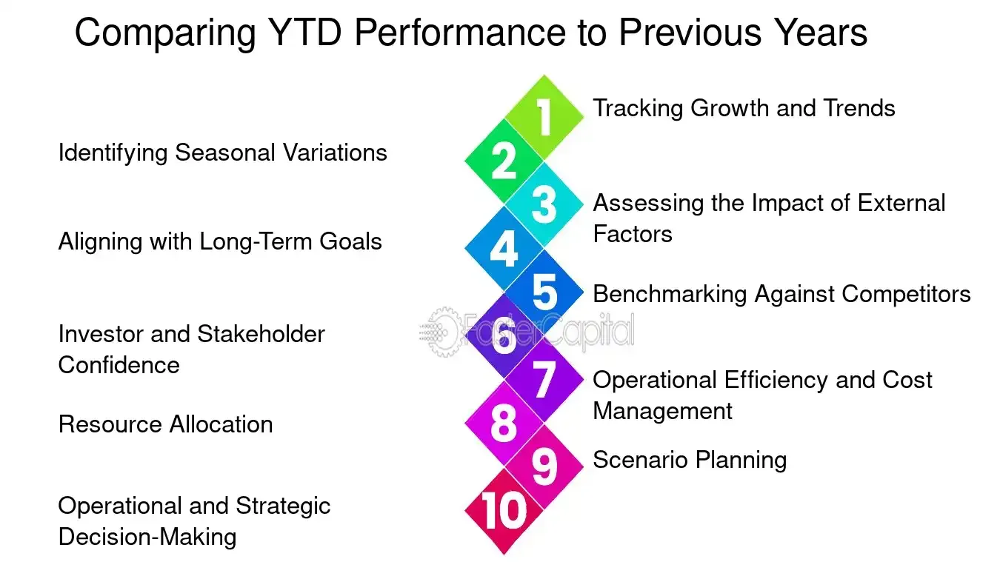

## Table of Contents

## What are year-to-date (YTD) returns?

Year-to-date (YTD) returns show how much an investment has grown or shrunk from the start of the current year until now. It's a way to see how well your investment is doing over the year so far. For example, if you bought a stock on January 1st and it's worth more today, your YTD return is positive. If it's worth less, your YTD return is negative.

YTD returns are useful because they give you a quick snapshot of performance without looking at the whole history of the investment. They are often used to compare different investments or to see how an investment is doing compared to the market. However, YTD returns don't tell the whole story. They only show what's happened this year, so they can be affected by seasonal changes or short-term events.

## Why are YTD returns important for financial benchmarks?

YTD returns are important for financial benchmarks because they help investors and analysts see how well investments are doing over the current year. Benchmarks, like the S&P 500, are used to measure the performance of investments. By looking at YTD returns, you can compare how your investments are doing against these benchmarks. This helps you understand if your investments are doing better or worse than the market as a whole during the year.

Another reason YTD returns are important is that they provide a clear and simple way to track performance over a specific period. This can be especially useful for making decisions about buying or selling investments. For example, if an investment's YTD return is much lower than the benchmark, it might be a sign to look closer at that investment or consider other options. YTD returns give you a quick snapshot that can guide your financial decisions throughout the year.

## What are some common financial benchmarks used to track YTD returns?

Some common financial benchmarks used to track YTD returns are the S&P 500, the Dow Jones Industrial Average, and the Nasdaq Composite. The S&P 500 is a popular benchmark because it includes 500 of the largest companies in the U.S. and shows how the overall market is doing. The Dow Jones Industrial Average tracks 30 large companies and is often used to get a quick sense of the market's health. The Nasdaq Composite focuses on technology and internet companies, so it's a good benchmark for tech-focused investments.

These benchmarks help investors see how their investments are doing compared to the market. For example, if your investment's YTD return is higher than the S&P 500's YTD return, it means your investment is doing better than the average of the 500 big companies in the S&P 500. This can be useful for deciding whether to keep or sell an investment. By comparing YTD returns to these benchmarks, investors can make smarter choices about their money.

## Where can beginners find YTD return data for major stock indices like the S&P 500?

Beginners can find YTD return data for major stock indices like the S&P 500 on financial websites like Yahoo Finance and Google Finance. These websites are easy to use and have a lot of information. Just type the name of the index, like "S&P 500," into the search bar, and you'll see the current YTD return right on the main page. These sites also show other useful information, like the index's price history and news about the companies in the index.

Another good place to find YTD return data is on the websites of major financial news outlets, like Bloomberg and CNBC. These sites often have sections dedicated to market data, where you can find the YTD returns for major indices. They also provide articles and videos that explain what the numbers mean, which can be helpful if you're new to investing. By checking these websites regularly, you can keep up with how the market is doing throughout the year.

## How can investors access YTD return data for bond indices?

Investors can find YTD return data for bond indices on financial websites like Bloomberg and Morningstar. These websites have sections where you can look up different types of bonds, like government bonds or corporate bonds. Just type in the name of the bond index you're interested in, and you'll see the YTD return right there. These sites are easy to use and give you a lot of other useful information about bonds, like their prices and ratings.

Another way to get YTD return data for bond indices is through financial news outlets like CNBC and Reuters. These sites often have market data sections where you can find YTD returns for different bond indices. They also have articles and videos that explain what the numbers mean, which can be helpful if you're new to investing in bonds. By checking these websites regularly, you can keep track of how bond indices are doing throughout the year.

## What sources provide YTD return data for commodity benchmarks?

Investors can find YTD return data for commodity benchmarks on financial websites like Bloomberg and Reuters. These websites have sections where you can look up different commodities, like gold, oil, or agricultural products. Just type in the name of the commodity index you're interested in, and you'll see the YTD return right there. These sites are easy to use and give you a lot of other useful information about commodities, like their prices and news that might affect them.

Another way to get YTD return data for commodity benchmarks is through financial news outlets like CNBC. These sites often have market data sections where you can find YTD returns for different commodity indices. They also have articles and videos that explain what the numbers mean, which can be helpful if you're new to investing in commodities. By checking these websites regularly, you can keep track of how commodity benchmarks are doing throughout the year.

## How can one verify the accuracy of YTD return data from different sources?

To verify the accuracy of YTD return data from different sources, you can start by comparing the numbers from multiple websites. For example, check the YTD return for the S&P 500 on Yahoo Finance and then look at the same data on Bloomberg. If the numbers are close to each other, it's a good sign that the data is accurate. If you see big differences, it might be worth looking into why the numbers don't match.

Another way to check the accuracy of YTD return data is to understand how the data is calculated. Most websites use the same formula to calculate YTD returns, so if you know the starting price of an index at the beginning of the year and its current price, you can do the calculation yourself. This can help you see if the numbers on the website make sense. Also, checking the data against official reports from the index providers, like the S&P Dow Jones Indices for the S&P 500, can give you more confidence in the numbers you're seeing.

## What are the best online platforms for real-time YTD return data?

For real-time YTD return data, Bloomberg is one of the best online platforms. It's easy to use and gives you up-to-date numbers for stocks, bonds, and commodities. Just type in the name of the index or commodity you're interested in, and you'll see the YTD return right away. Bloomberg also has news and articles that can help you understand what's happening in the market.

Another great platform for real-time YTD return data is Yahoo Finance. It's user-friendly and shows you the YTD return for major indices like the S&P 500 and Dow Jones. You can also find YTD returns for individual stocks and bonds. Yahoo Finance updates its data quickly, so you can trust that the numbers are current. Both Bloomberg and Yahoo Finance are reliable sources for keeping track of how your investments are doing throughout the year.

## How do financial news websites report on YTD returns, and which ones are most reliable?

Financial news websites report on YTD returns by showing the percentage change in an investment's value from the start of the year to the current date. They usually have a section on their homepage where you can see the YTD returns for major stock indices like the S&P 500 and Dow Jones. These websites often include charts and graphs to help you understand how the returns have changed over time. They also write articles and make videos that explain why YTD returns are important and what they mean for your investments.

Some of the most reliable financial news websites for YTD returns are Bloomberg and CNBC. Bloomberg is known for its real-time data and detailed market reports, making it a go-to source for investors who want accurate and up-to-date information. CNBC also provides reliable YTD return data, along with expert analysis and news that can help you understand market trends. Both websites are trusted by many investors because they keep their data fresh and offer lots of helpful content to make sense of the numbers.

## What APIs are available for developers to access YTD return data programmatically?

Developers can use APIs from financial data providers like Alpha Vantage and IEX Cloud to access YTD return data programmatically. Alpha Vantage offers a free API that gives you real-time and historical data for stocks, including YTD returns. You just need to sign up for an API key, and then you can make requests to get the data you need. IEX Cloud is another good option, and it also provides an API key for access. Their API is known for being reliable and easy to use, making it a popular choice for developers who want to pull YTD return data into their applications.

Both Alpha Vantage and IEX Cloud have good documentation that helps developers understand how to use their APIs. For example, Alpha Vantage's documentation shows you how to make requests for specific stock data, including how to calculate YTD returns from the data they provide. IEX Cloud's documentation is also clear and includes examples of how to fetch YTD return data for indices like the S&P 500. By using these APIs, developers can build tools and apps that show YTD returns to users in real-time, helping investors keep track of their investments throughout the year.

## How can advanced investors use YTD return data to compare performance across different asset classes?

Advanced investors can use YTD return data to compare how different types of investments, like stocks, bonds, and commodities, are doing over the year. By looking at the YTD returns for each asset class, investors can see which ones are doing better or worse. For example, if stocks have a higher YTD return than bonds, it might mean that the stock market is doing well compared to the bond market. This can help investors decide where to put their money to get the best returns. They can also see if one asset class is doing much better than others, which might be a sign to shift their investments around.

Another way advanced investors use YTD return data is to see how their own investments are doing compared to the market. They can compare the YTD returns of their portfolio to the YTD returns of major indices like the S&P 500 or bond indices. If their portfolio's YTD return is higher than the market's, it means they're doing better than average. If it's lower, they might need to make some changes. By looking at YTD returns across different asset classes, advanced investors can make smarter decisions about where to invest their money to reach their financial goals.

## What are the potential pitfalls and limitations of relying solely on YTD return data for investment decisions?

Relying only on YTD return data for investment decisions can be risky because it only shows what has happened since the start of the year. It doesn't tell you about the investment's performance over longer periods, like the past few years. For example, an investment might have a great YTD return, but if it was doing poorly before the year started, it might not be as good as it seems. Also, YTD returns can be affected by short-term events or seasonal changes, which might not give you a true picture of how the investment will do in the future.

Another problem with using just YTD return data is that it doesn't consider other important factors, like how risky the investment is or how it fits with your overall investment plan. An investment with a high YTD return might be very risky, meaning it could lose value quickly. If you're only looking at YTD returns, you might miss these risks and make choices that aren't right for your financial goals. It's better to look at a mix of information, including long-term performance, risk levels, and how the investment fits into your overall strategy, before deciding where to put your money.

## What are YTD Returns and How Can We Understand Them?

YTD (Year-To-Date) returns represent the total return that an investment has generated from the beginning of the current calendar year to the present date. Typically expressed as a percentage, YTD returns are calculated using the formula:

$$

\text{YTD Return} = \frac{\text{Current Value} - \text{Value at Beginning of Year}}{\text{Value at Beginning of Year}} \times 100 
$$

where the "Current Value" is the market value of the investment on the present date, and the "Value at Beginning of Year" is the market value of the investment on the first day of the year. YTD returns provide an annualized measure of performance, offering insights into how well an investment or portfolio is performing over the current year.

The significance of YTD returns lies in their ability to offer a snapshot of short- to medium-term performance, which aids both individual and institutional investors in evaluating investment strategies. They are crucial for performance management, decision-making, and strategy adjustments. By focusing on YTD returns, investors can determine if their investments are aligned with their financial goals or if adjustments are needed.

YTD returns can be categorized into absolute and relative returns. Absolute YTD returns measure the raw percentage change in value, providing a straightforward look at how much an investment has gained or lost in the current year. Relative YTD returns, on the other hand, compare the performance of an investment against a benchmark or a set of benchmarks, offering a perspective on how the investment fared relative to the market or similar asset classes.

For example, consider an investor who began the year with a stock worth $1,000. By June 30th, the stock's value increased to $1,100. The absolute YTD return would be calculated as:

$$

\text{YTD Return} = \frac{1100 - 1000}{1000} \times 100 = 10\%
$$

To assess relative YTD returns, assume the investor's benchmark index gained 8% over the same period. The stock's relative YTD return outperformance would be 10% - 8% = 2%.

Different YTD return scenarios illustrate varying levels of performance across asset classes and market conditions. For instance, a high YTD return during a bullish market might signal strong asset performance, while a lower return in the same scenario might necessitate reevaluation of one's investment strategy. Likewise, in bear markets, negative or lower YTD returns could still be favorable if they outperform relevant benchmarks, indicating resilience or strategic acumen compared to the broader market downturn.

Understanding these returns, in both absolute and relative contexts, equips investors with crucial insights necessary for informed decision-making and enhances their capability to gauge investment efficiency effectively.

## What is the Role of Financial Benchmarks in Investment Performance?

Financial benchmarks serve as vital tools in evaluating investment performance, providing objective standards against which the success or failure of an investment can be measured. A financial benchmark is essentially a standard index composed of securities, which is used to compare the performance of different portfolios or asset managers. They are crucial in the financial industry as they offer a reference point for tracking returns and assessing the effectiveness of investment strategies.

Common financial benchmarks include indices such as the S&P 500 and the Dow Jones Industrial Average (DJIA), both of which are prominent in the United States. The S&P 500, composed of 500 of the largest U.S. companies by market capitalization, is widely regarded as a leading indicator of U.S. equities and a barometer of overall market health. The DJIA, which includes 30 significant publicly traded companies, serves as another indicator, often used to gauge the health of corporate America and, by extension, the economy.

Global indices, such as the MSCI World Index, provide benchmarks for international markets, encompassing equities from various countries, thus offering a global perspective on market performance. These indices are crucial for investors with portfolios diversified across different geographical locations.

Benchmarks are used to evaluate investment performance by allowing investors and fund managers to compare their returns with the returns of the benchmark index. For example, if a mutual fund delivers a return of 8% while the S&P 500 posts a 10% return over the same period, the fund has underperformed relative to the benchmark. This comparison helps in assessing the skill and strategy of the fund manager.

Market [volatility](/wiki/volatility-trading-strategies) significantly impacts benchmarks and returns. During periods of high volatility, the risk of deviation between an investment's return and the benchmark can increase. This volatility can stem from economic events, geopolitical unrest, or unexpected financial developments. For instance, during the financial crisis of 2008, benchmark indices worldwide experienced massive fluctuations, affecting the returns and evaluations of numerous investment portfolios.

Investors commonly use risk-adjusted return measures, such as the Sharpe Ratio, to account for volatility when comparing portfolio performance to benchmarks. The Sharpe Ratio is calculated as:

$$
\text{Sharpe Ratio} = \frac{\text{Portfolio Return} - \text{Risk-Free Rate}}{\text{Standard Deviation of Portfolio Returns}}
$$

A higher Sharpe Ratio suggests a more attractive risk-adjusted return, considering the volatility.

By offering a point of reference for performance and allowing for the adjustment of risk factors, financial benchmarks are indispensable in the analysis and management of investment portfolios. Understanding their role and the impact of market fluctuations is critical for making informed investment decisions.

## How can we analyze investment performance using YTD returns?

Analyzing Year-To-Date (YTD) returns provides valuable insights for investors aiming to assess the efficiency of their investments. YTD returns represent the change in value of an investment from the beginning of the current calendar year to the present date. This performance metric is significant as it helps investors evaluate how well an investment is performing over the current year.

To calculate YTD returns, the formula used is:

$$
\text{YTD Return} = \left(\frac{\text{Current Value} - \text{Value at Start of Year}}{\text{Value at Start of Year}}\right) \times 100\%
$$

This formula quantitatively expresses the percentage growth or decline of an investment over the specified period, allowing investors to gauge performance relative to the initial investment value at the year's start.

Integrating YTD returns analysis with benchmark comparisons enhances investment insights. Benchmarks, like the S&P 500 or Nasdaq Composite, serve as standards against which individual portfolio performance can be measured. By comparing an investment's YTD return to these benchmarks, investors can determine whether the investment has outperformed or underperformed relative to the market. This comparison aids in evaluating the effectiveness of investment strategies and guiding future decisions.

Methodologies for tracking and interpreting YTD returns are crucial for investors. A straightforward approach involves creating a spreadsheet that tracks the starting value, current value, and YTD returns of each investment. Programmatically, Python can efficiently perform this task. Consider this example:

```python
def calculate_ytd_return(start_value, current_value):
    return ((current_value - start_value) / start_value) * 100

portfolio = {
    'Investment A': [1000, 1150],  # [start_value, current_value]
    'Investment B': [2000, 2100],
    'Investment C': [1500, 1400],
}

for investment, values in portfolio.items():
    start_value, current_value = values
    ytd_return = calculate_ytd_return(start_value, current_value)
    print(f"{investment}: YTD Return = {ytd_return:.2f}%")
```

This script calculates the YTD return for each investment within a portfolio, showcasing a method for tracking performance systematically.

Numerous tools and software platforms exist to assist in YTD return analysis. Financial software, such as Microsoft Excel or Google Sheets, allows for customizable tracking and analysis. More advanced portfolio management tools, like Morningstar and Bloomberg, offer comprehensive analytics and reporting features, facilitating deeper performance insights and comparisons against industry benchmarks.

Overall, by systematically analyzing YTD returns and utilizing available tools, investors can effectively monitor investment performance, identify opportunities for improvement, and make informed decisions to enhance their portfolio’s efficiency.

## References & Further Reading

[1]: Bergstra, J., Bardenet, R., Bengio, Y., & Kégl, B. (2011). ["Algorithms for Hyper-Parameter Optimization."](https://dl.acm.org/doi/10.5555/2986459.2986743) Advances in Neural Information Processing Systems 24.

[2]: ["Advances in Financial Machine Learning"](https://www.amazon.com/Advances-Financial-Machine-Learning-Marcos/dp/1119482089) by Marcos Lopez de Prado

[3]: ["Evidence-Based Technical Analysis: Applying the Scientific Method and Statistical Inference to Trading Signals"](https://onlinelibrary.wiley.com/doi/book/10.1002/9781118268315) by David Aronson

[4]: ["Machine Learning for Algorithmic Trading"](https://github.com/stefan-jansen/machine-learning-for-trading) by Stefan Jansen

[5]: ["Quantitative Trading: How to Build Your Own Algorithmic Trading Business"](https://www.amazon.com/Quantitative-Trading-Build-Algorithmic-Business/dp/1119800064) by Ernest P. Chan