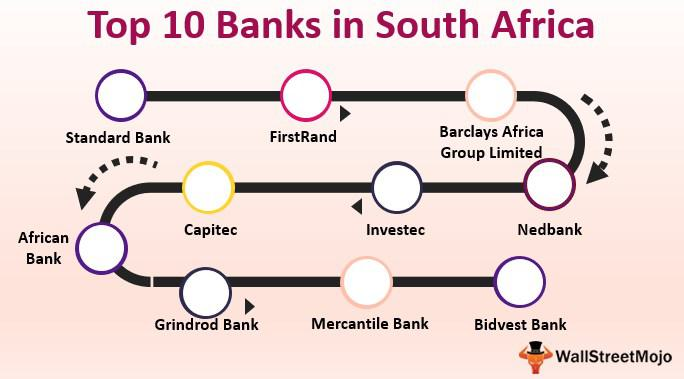

Algorithmic trading, a cornerstone of modern financial markets, employs complex algorithms to automate trading strategies. By processing vast datasets at speeds unattainable by human traders, algorithmic trading facilitates rapid execution of trades, portfolio management, and risk assessment. Its significance is underscored by its ability to enhance market liquidity, improve pricing efficiency, and reduce transaction costs. Notably, algorithmic trading dominates high-frequency trading niches, where minute price shifts are exploited for profit. According to a report by the International Organization of Securities Commissions, algorithmic trading constitutes a significant proportion of trades in major markets, reflecting its transformative impact on global finance [1].

The South African Reserve Bank (SARB) plays a pivotal role in South Africa's economy as the central bank. Established in 1921, the SARB serves as the primary authority responsible for maintaining price stability, overseeing monetary policy, and ensuring the smooth functioning of the financial system. Its key functions include issuing banknotes and coins, managing interest rates, regulating financial institutions, and overseeing the national payment system. By controlling inflation and fostering sustainable economic growth, the SARB contributes significantly to the country's economic stability.

Unique among central banks, the SARB has a distinctive ownership structure. Unlike many central banks owned outright by their governments, the SARB is privately owned by ordinary shareholders, although the South African government maintains a substantial interest. This structure has engendered debates over the years, particularly concerning the potential nationalization of the Reserve Bank. While the shareholders participate in the annual general meeting and receive dividends, they have limited influence over the bank's policies, which remain under the purview of the SARB’s governing board and management.

In terms of financials, the SARB’s stability is evidenced by its comprehensive annual reports that detail its financial performance, including net investment income and total assets. These reports highlight the SARB's role in safeguarding the integrity and soundness of the financial system amidst fluctuating economic conditions. The central bank’s conservative approach to risk management, coupled with its strategic investments, ensures a strong financial footing which underpins its policy objectives and operational efficiency.

Understanding the intricacies of algorithmic trading and the SARB’s functioning is essential for comprehending the dynamics of South Africa's financial markets. While algorithmic trading continues to reshape trading activities with its technological finesse, the SARB’s foundational policies and robust financial framework remain integral to maintaining economic stability and fostering growth within the region.

[1] "Technological Evolution in Securities Markets – The Path Ahead". International Organization of Securities Commissions. September 2011.

## Table of Contents

## Understanding the South African Reserve Bank

The South African Reserve Bank (SARB) stands as a pivotal entity within South Africa's financial architecture, established on June 30, 1921, under the Currency and Banking Act of 1920. Its formation was driven by the exigencies of post-World War I economic stabilization and the need to rectify banking inadequacies that had been exacerbated during the war. Prior to its establishment, South Africa's currency and monetary policy were under the control of commercial banks and the British government, which led to several inefficiencies and economic turbulences.

As the country's central bank, the SARB's primary roles encompass formulating and implementing monetary policy, issuing banknotes and coins, managing foreign exchange, and serving as a banker to the government. It also holds the mandate to ensure the stability of the banking system. Among its critical functions is to act as a lender of last resort to financial institutions facing [liquidity](/wiki/liquidity-risk-premium) challenges, a role exemplified during the global financial crisis of 2008 when the SARB provided necessary liquidity to stabilize the banking system.

The key objectives of the SARB are centered around maintaining price stability in the interest of sustainable economic growth. Price stability is sought to preserve the value of the currency and to contain inflation within a target range set by the government. As of the latest monetary policy framework, the SARB aims to keep inflation within a target range of 3% to 6%. This objective is crucial since high inflation can erode the purchasing power of a currency, while hyperinflation could lead to economic turmoil. Conversely, deflation can result in reduced consumer spending and economic stagnation. The SARB utilizes a range of tools including interest rates adjustments and open market operations to steer the economy towards desired inflationary targets.

Through its monetary policy committee, the SARB periodically reviews economic indicators such as gross domestic product (GDP) growth rates, unemployment data, and global economic trends to make informed decisions on interest rates. These decisions are instrumental in influencing the level of spending and investment in the economy, thereby indirectly steering the inflation trajectory.

The evolution of the SARB over the decades reflects a dynamic adaptation to both global and domestic economic challenges, retaining its core mission of fostering financial and monetary stability. The bank has adopted modern risk management and regulatory practices, which ensures its resilience against economic shocks. The SARB thus remains central to South Africa's economic policy, balancing the complex interplay between fostering economic growth and maintaining low inflation.

## Financial Operations of the SARB

The South African Reserve Bank (SARB) plays a pivotal role in maintaining the nation's financial stability through its financial operations, which are meticulously documented in its annual reports. These reports provide a detailed overview of the SARB's financial performance, focusing on its net investment income and total assets, both of which are crucial indicators of its financial health. 

Net investment income constitutes a significant portion of the SARB's revenue and is derived from its management of foreign exchange reserves and domestic investments. This income is essential for covering the operational expenses of the bank and contributes to the national treasury when a surplus is achieved. For instance, investment portfolios are often diversified to manage risks associated with currency fluctuations and [interest rate](/wiki/interest-rate-trading-strategies) changes, which can impact returns. The net investment income is typically calculated as the total revenue from investments minus the expenses incurred in managing these investments.

The SARB’s total assets include gold and foreign exchange reserves, which are vital for supporting the South African rand and ensuring economic stability. These reserves act as a buffer against external economic shocks, allowing the SARB to intervene in the foreign exchange market when necessary. The level of total assets can influence monetary policy decisions, with higher reserves providing more flexibility for the SARB to implement policies that stabilize inflation and promote economic growth.

The financial policies enacted by the SARB can have far-reaching effects on the national economy. By setting interest rates, the SARB influences borrowing costs for consumers and businesses, impacting levels of spending and investment. A lower interest rate typically encourages borrowing and spending, stimulating economic growth, while higher rates are used to curb inflation. The SARB also engages in open market operations, buying and selling government securities to influence money supply and liquidity in the financial system.

Furthermore, the SARB's policies on exchange rate management and regulatory oversight of the banking sector contribute to the economic environment within which [algorithmic trading](/wiki/algorithmic-trading) and other market activities occur. By maintaining financial stability and confidence in the financial system, the SARB supports a conducive environment for both traditional and innovative trading practices, driving economic activity and growth in South Africa.

In summary, the SARB’s financial operations are integral to its mission of achieving monetary stability. Through strategic management of its investments and assets, alongside prudent policy-making, the SARB significantly influences the economic stability and growth prospects of South Africa.

## Ownership of the South African Reserve Bank

The South African Reserve Bank (SARB) operates under a unique ownership structure characterized by private shareholding, a feature that sets it apart from many other central banks worldwide. This ownership model allows for the bank to have a diverse shareholder base, which includes both individual and institutional investors. The South African Reserve Bank Act governs the issuance of shares, limiting individual ownership to 10,000 shares in an effort to prevent excessive influence by any single entity.

Shareholder meetings are conducted regularly, allowing stakeholders to voice their interests and ensure transparency in the bank's operations. However, shareholders have limited influence over the monetary policy and operational decisions of the SARB. Their role is mainly advisory, providing oversight and contributing to the corporate governance framework of the bank. Dividends paid to shareholders are capped at 10% per annum, and the majority of profits are retained by the bank as statutory or special reserves, ensuring financial stability and resilience.

The debate surrounding the potential nationalization of the SARB has been a prominent issue in South African politics. Proponents of nationalization argue that it would enhance governmental control over monetary policy and align the bank's objectives more closely with national development goals. Conversely, critics suggest that maintaining the current ownership structure ensures independence and service to the broader economic interest rather than political pressures. This debate continues to be part of the political discourse, reflecting broader discussions about public versus private ownership of national institutions. Nationalization would require legislative changes and could potentially impact investor confidence and the perception of institutional independence.

## Algorithmic Trading in South Africa

Algorithmic trading refers to the use of computer algorithms to automate trading decisions and execute orders in financial markets. These algorithms analyze market data to make informed decisions on buying or selling securities. Traders use a variety of data, including historical prices, volumes, and different indicators, to design strategies that can operate at high speeds and large volumes. The primary advantage of algorithmic trading is the ability to execute trades at a speed and frequency that a human trader cannot match, often capitalizing on minute price discrepancies. 

In South Africa, algorithmic trading plays a significant role in the financial market by enhancing liquidity, improving [market making](/wiki/market-making), and ensuring tighter spreads. The Johannesburg Stock Exchange (JSE), being Africa's largest stock exchange, has seen a considerable increase in the adoption of algorithmic trading over the past few years. This growth is facilitated by improvements in trading technologies and infrastructure, which allow high-frequency trading firms to operate efficiently.

Algorithmic trading offers numerous benefits, including increased efficiency by automating complex trading processes and reducing human error. It can execute large-[volume](/wiki/volume-trading-strategy) trades with minimal market impact, thus maintaining price stability. Furthermore, algorithmic trading can enhance market liquidity, as it often involves market-making strategies that narrow bid-ask spreads, thereby benefiting the overall trading ecosystem.

However, algorithmic trading also comes with its set of risks. The reliance on algorithms can lead to systemic risks if a faulty algorithm causes abrupt market movements, as seen in several "flash crashes" globally. Furthermore, high-frequency trading can contribute to market [volatility](/wiki/volatility-trading-strategies), which may destabilize prices in extreme conditions. Traders also face technology-related risks, such as the failure of trading systems or network outages, which can impede the ability to execute trades promptly.

In conclusion, while algorithmic trading serves as a pivotal element in the South African financial markets, providing benefits like increased liquidity and efficiency, it equally poses challenges that necessitate comprehensive regulatory oversight to mitigate risks and ensure stability. The balance between fostering innovation and managing risk is crucial for the sustainable growth of algorithmic trading within the country.

## The Intersection of SARB Policies and Algorithmic Trading

The policies of the South African Reserve Bank (SARB) have a significant influence on the algorithmic trading landscape in the country. As the central bank, SARB's priorities include maintaining financial stability, price stability, and fostering economic growth, all of which intersect with the functioning of financial markets, including those employing algorithmic trading strategies.

### Impact of SARB Policies on Algorithmic Trading

SARB's monetary policy decisions, such as setting interest rates, directly influence market liquidity and volatility, crucial elements for algorithmic trading systems, which are designed to exploit market inefficiencies. For instance, an increase in interest rates generally results in reduced liquidity, affecting high-frequency trading ([HFT](/wiki/high-frequency-trading-strategies)) strategies that rely on rapid order execution. Conversely, rate cuts can enhance liquidity, presenting opportunities but also increasing competition among algorithmic traders.

Furthermore, SARB's policies on foreign exchange controls and capital flow management can affect the types of algorithms employed. Restrictions and controls may necessitate adjustments in algorithmic strategies, which must adapt to regulatory constraints while optimizing trading performance.

### Regulatory Framework Governing Algorithmic Trading

The regulatory framework for algorithmic trading in South Africa is shaped by SARB in conjunction with other financial regulatory bodies such as the Financial Sector Conduct Authority (FSCA). These regulations are designed to ensure market integrity, prevent abusive trading practices, and manage systemic risk. Key components of this framework include:

- **Market Conduct Rules**: Regulations tailored to prevent market manipulation and ensure fair trading practices. Trading algorithms must incorporate compliance checks to adhere to these rules.

- **Risk Management Protocols**: Requirements for robust risk management systems to monitor and mitigate potential systemic risks that high-frequency trading algorithms might pose to the financial system.

- **Transparency and Reporting Obligations**: Algorithmic traders may be required to maintain detailed records of their trading activities and algorithms, ensuring transparency and accountability.

### Future Prospects and Innovations

The trajectory of SARB policies concerning algorithmic trading is likely to evolve with advancements in technology and financial innovations. Several prospects and challenges may shape this landscape:

- **Adoption of Artificial Intelligence**: As AI continues to integrate into algorithmic trading, SARB may consider future regulations to accommodate the complexities AI introduces, such as machine learning algorithms that adapt and evolve without direct human intervention.

- **Cybersecurity Enhancements**: Given the increasing reliance on digital platforms, SARB might strengthen cybersecurity regulations to protect against threats targeting algorithmic trading systems.

- **Collaborative Frameworks**: SARB may enhance collaboration with international regulators, ensuring that domestic policies align with global standards, particularly as cross-border algorithmic trading grows.

- **Blockchain Technology**: Innovations in blockchain and distributed ledger technologies could transform transaction processing and settlement, potentially altering how algorithmic trading firms operate within SARB's regulatory framework.

The intersection of SARB policies and algorithmic trading is a dynamic area of South Africa's financial ecosystem. As technology advances and market conditions shift, SARB will play a crucial role in shaping a regulatory environment that promotes innovation while safeguarding financial stability.

## Conclusion

The South African Reserve Bank (SARB) plays a pivotal role in maintaining financial stability and driving innovation within South Africa's economy. By implementing robust monetary policies aimed at controlling inflation and ensuring price stability, SARB significantly contributes to a stable economic environment conducive to growth. This stability is crucial, as it builds confidence among investors and financial institutions, facilitating sustainable economic development.

Algorithmic trading, an increasingly significant component of modern financial markets, has transformed trading practices in South Africa. By leveraging sophisticated mathematical models and high-speed computational algorithms, traders can execute orders with remarkable speed and precision. This technology-driven approach enhances market efficiency, potentially lowering transaction costs and increasing liquidity. However, the proliferation of algorithmic trading presents its challenges, including the risk of market volatility and systemic disruptions precipitated by erroneous algorithms.

SARB's regulatory policies aim to address these challenges, ensuring that the benefits of algorithmic trading do not undermine market integrity. The intersection of SARB policies with algorithmic trading practices underscores the need for a regulatory framework that adapts swiftly to technological advancements while safeguarding against potential risks. 

Looking forward, the synergy between SARB's policy measures and innovative trading technologies like algorithmic trading suggests a dynamic trajectory for South Africa's financial markets. This synergy will likely stimulate further innovation while prioritizing economic resilience. Ultimately, achieving sustainable growth in South Africa's financial sector will require a balanced approach that fosters innovation within a sound regulatory framework, facilitating a thriving economic environment for the future.

## References & Further Reading

[1]: ["Technological Evolution in Securities Markets – The Path Ahead"](https://www.nasdaq.com/articles/technology-and-the-evolution-of-the-markets-2021-02-05). International Organization of Securities Commissions. September 2011.

[2]: Aronson, D. (2007). [Evidence-Based Technical Analysis: Applying the Scientific Method and Statistical Inference to Trading Signals](https://www.amazon.com/Evidence-Based-Technical-Analysis-Scientific-Statistical/dp/0470008741). John Wiley & Sons.

[3]: Jansen, S. (2018). [Machine Learning for Algorithmic Trading](https://github.com/stefan-jansen/machine-learning-for-trading). Packt Publishing.

[4]: Chan, E. P. (2008). [Quantitative Trading: How to Build Your Own Algorithmic Trading Business](https://github.com/ftvision/quant_trading_echan_book). John Wiley & Sons.

[5]: Lopez de Prado, M. (2018). [Advances in Financial Machine Learning](https://www.amazon.com/Advances-Financial-Machine-Learning-Marcos/dp/1119482089). John Wiley & Sons.