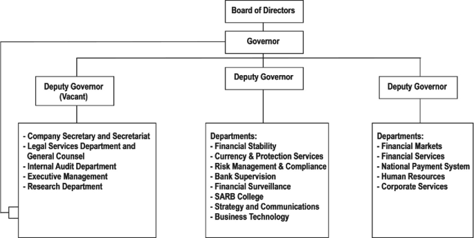

## Table of Contents

## What is the South African Reserve Bank?

The South African Reserve Bank, often called the SARB, is the central bank of South Africa. It was started in 1921 and its main job is to make sure the country's money stays stable and safe. The SARB controls the amount of money in the economy, sets interest rates, and works to keep inflation low. This helps keep prices steady and supports the economy to grow in a healthy way.

The SARB also looks after South Africa's money system. It makes sure banks and other financial places follow the rules and work properly. If there are problems, the SARB steps in to fix them. It also keeps South Africa's money safe from things like fraud and keeps the country's money strong on the world stage. By doing all these things, the SARB helps make sure that people in South Africa can trust their money and the economy.

## What are the main functions of the South African Reserve Bank?

The South African Reserve Bank, or SARB, has several important jobs. One big job is to control the amount of money in the country. They do this by setting interest rates, which is the cost of borrowing money. When they change these rates, it helps to keep the economy growing in a healthy way and stops prices from going up too fast, which is called inflation.

Another job of the SARB is to make sure the money system in South Africa works well. They watch over banks and other places that deal with money to make sure they follow the rules. If there are any problems, the SARB steps in to fix them. They also work to stop bad things like fraud from happening, which helps keep people's money safe.

The SARB also helps keep South Africa's money strong when compared to other countries' money. They do this by managing how the country's money is used around the world. By doing all these things, the SARB helps make sure that people in South Africa can trust their money and the economy stays stable.

## How is the South African Reserve Bank structured?

The South African Reserve Bank, or SARB, is run by a group called the Board of Directors. This board has between 10 and 15 people on it. They are chosen by the President of South Africa, but the Minister of Finance has to say it's okay first. The board is led by the Governor of the SARB, who is the most important person in the bank. The Governor is helped by three Deputy Governors. Together, they make big decisions about the country's money.

The SARB is split into different parts, each with its own job. There's a part that looks after the money supply and sets interest rates. Another part makes sure banks and other money places follow the rules. There's also a part that keeps an eye on how South Africa's money is doing compared to other countries' money. All these parts work together to make sure the country's money stays safe and the economy stays strong.

## Who are the key figures in the leadership of the South African Reserve Bank?

The South African Reserve Bank is led by a group of important people. The most important person is the Governor, who is in charge of the whole bank. The Governor is helped by three Deputy Governors. They all work together to make big decisions about the country's money. The Governor and the Deputy Governors are part of a bigger group called the Board of Directors, which has between 10 and 15 people.

The Board of Directors is chosen by the President of South Africa, but the Minister of Finance has to agree first. This board makes sure the bank is doing its job well. The Governor and the Deputy Governors are the key leaders who help keep the country's money safe and the economy strong.

## How does the South African Reserve Bank manage monetary policy?

The South African Reserve Bank manages monetary policy mainly by controlling the amount of money in the economy. They do this by setting interest rates, which is the cost people pay to borrow money. When the bank wants to slow down the economy and stop prices from going up too fast, they might raise interest rates. This makes borrowing money more expensive, so people and businesses borrow less and spend less. On the other hand, if the economy needs a boost, the bank might lower interest rates. This makes borrowing cheaper, so more people and businesses borrow and spend more, which helps the economy grow.

The SARB also uses other tools to manage the money supply. One way is by buying and selling government bonds. When they buy bonds, they put more money into the economy. When they sell bonds, they take money out of the economy. The bank also sets rules for how much money banks have to keep in reserve. By changing these rules, the SARB can control how much money banks can lend out. All these actions help the SARB keep the economy stable and make sure prices don't go up too fast.

## What role does the South African Reserve Bank play in financial stability?

The South African Reserve Bank, or SARB, plays a big role in keeping the country's money system stable. They do this by watching over banks and other places that deal with money to make sure they follow the rules. If there are any problems, the SARB steps in to fix them. They also work to stop bad things like fraud from happening, which helps keep people's money safe. By doing all these things, the SARB makes sure that the money system works well and people can trust their money.

Another way the SARB helps with financial stability is by managing the country's money supply. They do this by setting interest rates, which is the cost of borrowing money. When they change these rates, it helps to keep the economy growing in a healthy way and stops prices from going up too fast. The SARB also keeps an eye on how South Africa's money is doing compared to other countries' money. This helps make sure that the country's money stays strong on the world stage. By doing all these things, the SARB helps keep the economy stable and makes sure that people can trust their money.

## How are the financial statements of the South African Reserve Bank structured?

The financial statements of the South African Reserve Bank, or SARB, are made up of different parts that show how the bank is doing with money. The main parts are the balance sheet, the income statement, and the statement of changes in equity. The balance sheet shows what the bank owns and what it owes at a certain time. It lists things like money the bank has, loans it has given out, and money it needs to pay back. The income statement shows how much money the bank made and spent over a period of time. It includes things like interest earned from loans and money spent on running the bank. The statement of changes in equity shows how the bank's net worth has changed over time.

Another important part of the SARB's financial statements is the cash flow statement. This shows how money moves in and out of the bank. It includes money coming in from things like interest and money going out for things like salaries and buying new equipment. The notes to the financial statements give more details about the numbers in the statements. They explain things like how the bank figures out the value of its loans and how it handles risks. All these parts together help people understand how the SARB is managing its money and keeping the country's financial system stable.

## What are the primary sources of income for the South African Reserve Bank?

The South African Reserve Bank, or SARB, gets most of its money from interest on loans and investments. When the bank lends money to other banks or buys government bonds, it earns interest. This interest is a big part of the SARB's income. The bank also makes money from fees it charges for services like managing the country's money supply and helping with payments between banks.

Another way the SARB makes money is by selling gold and foreign exchange reserves. The bank keeps gold and other countries' money as reserves, and sometimes it sells these to make money. The SARB also earns money from other smaller things, like fees for supervising banks and other financial places to make sure they follow the rules. All these sources of income help the SARB do its job of keeping the country's money safe and the economy stable.

## How does the South African Reserve Bank handle its expenditures?

The South African Reserve Bank, or SARB, spends its money on many things to keep the country's money system working well. A big part of its spending goes to paying salaries for its workers. These workers do important jobs like setting interest rates and making sure banks follow the rules. The SARB also spends money on running its offices and buying new equipment. This includes things like computers and other tools they need to do their work.

Another part of the SARB's spending is on things that help keep the country's money safe. They spend money on watching over the money system to stop bad things like fraud from happening. The bank also spends money on managing the country's money supply, which includes buying and selling government bonds. All these expenses help the SARB do its job of keeping the economy stable and making sure people can trust their money.

## Who owns the South African Reserve Bank?

The South African Reserve Bank, or SARB, is owned by private shareholders. These shareholders own shares in the bank, but they don't get to control how the bank runs. The shareholders get a small amount of money each year from the bank's profits, but most of the profits go to the South African government.

Even though it has private shareholders, the SARB is still run by the government. The President of South Africa picks the people who are on the bank's Board of Directors, and the Minister of Finance has to agree with the choices. This means the government makes sure the bank does its job of keeping the country's money safe and the economy stable.

## How does the ownership of the South African Reserve Bank impact its operations?

The South African Reserve Bank, or SARB, is owned by private shareholders, but this ownership does not affect how the bank runs its day-to-day operations. The shareholders get a small part of the bank's profits each year, but they do not have any say in the bank's decisions. The SARB is run by a Board of Directors, which is chosen by the President of South Africa and approved by the Minister of Finance. This means the government is in charge of making sure the bank does its job well.

Even though the SARB has private shareholders, its main focus is on keeping the country's money safe and the economy stable. The bank's operations are guided by its goals of controlling the money supply, setting interest rates, and watching over the financial system. The government's control over the Board of Directors ensures that the SARB works in the best interest of South Africa, not just for the benefit of its shareholders.

## What are the recent financial performance trends of the South African Reserve Bank?

The South African Reserve Bank, or SARB, has been doing okay in recent years. They make most of their money from interest on loans and investments. But, the amount of money they make from interest can go up and down because of changes in the economy and interest rates. For example, when interest rates are low, the SARB makes less money from interest. They also make money from fees for services and selling gold and foreign exchange reserves. All these things together help the SARB keep doing its job.

The SARB spends a lot of money on salaries for its workers, running its offices, and buying new equipment. They also spend money on watching over the money system to stop bad things like fraud. Even though their income can change, the SARB has been able to keep its spending under control. This helps them make sure they have enough money to do their important work of keeping the country's money safe and the economy stable.

## References & Further Reading

[1]: ["Technological Evolution in Securities Markets – The Path Ahead"](https://www.nasdaq.com/articles/technology-and-the-evolution-of-the-markets-2021-02-05). International Organization of Securities Commissions. September 2011.

[2]: Aronson, D. (2007). [Evidence-Based Technical Analysis: Applying the Scientific Method and Statistical Inference to Trading Signals](https://www.amazon.com/Evidence-Based-Technical-Analysis-Scientific-Statistical/dp/0470008741). John Wiley & Sons.

[3]: Jansen, S. (2018). [Machine Learning for Algorithmic Trading](https://github.com/stefan-jansen/machine-learning-for-trading). Packt Publishing.

[4]: Chan, E. P. (2008). [Quantitative Trading: How to Build Your Own Algorithmic Trading Business](https://github.com/ftvision/quant_trading_echan_book). John Wiley & Sons.

[5]: Lopez de Prado, M. (2018). [Advances in Financial Machine Learning](https://www.amazon.com/Advances-Financial-Machine-Learning-Marcos/dp/1119482089). John Wiley & Sons.