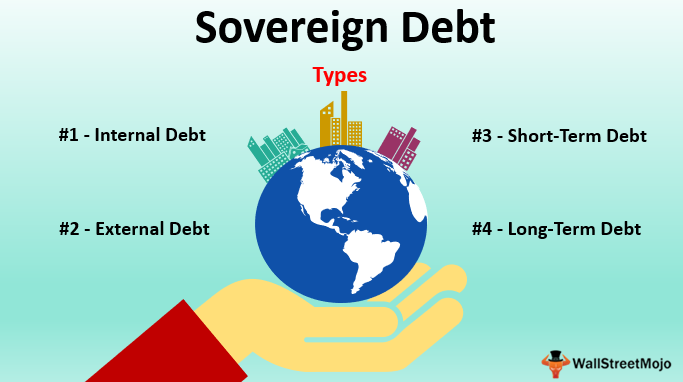

Government bonds are debt securities issued by a government to support government spending and obligations. They are one of the most prominent instruments in the financial system due to their essential role in funding government activities such as infrastructure development, social programs, and other public expenditures. As a result, they are considered a low-risk investment vehicle, often used as a benchmark for assessing the risk and return of other investments.

The bond market, where these securities are traded, is a critical component of the global economy. It includes a diverse range of participants including governments, corporations, financial institutions, and individual investors. As a platform for the issuance and trading of debt, the bond market facilitates capital allocation and liquidity. It also plays an essential role in determining interest rates, which influence economic activity by affecting borrowing costs for governments, businesses, and consumers.

Sovereign bond yields, the interest rates that governments pay on their debt, are vital indicators of economic health. They reflect the government's perceived risk and creditworthiness, influencing investors' valuation decisions. Higher yields generally indicate higher risk or inflation expectations, whereas lower yields suggest economic stability and confidence in the government's ability to meet its debt obligations. Understanding sovereign bond yields is crucial for making informed investment decisions, as they affect everything from mortgage rates to financial stability.

Algorithmic trading, or algo trading, has steadily gained influence within bond markets. This involves the use of computer algorithms to automate the trading process, optimizing speed and efficiency while reducing human error. Algo trading can process vast amounts of data faster than traditional methods, identifying patterns and executing trades more swiftly. This automation has transformed bond trading dynamics, increasing market liquidity and tightening bid-ask spreads.

Understanding these concepts is essential for anyone involved in financial investments as they interplay significantly, shaping economic trends and influencing investment returns. Awareness of how government bonds operate, the bond market's role, the significance of sovereign bond yields, and the impact of algo trading provides a comprehensive framework for evaluating potential investment opportunities and risks.

## Table of Contents

## Understanding Government Bonds

Government bonds are debt securities issued by a national government to support its spending and obligations. They are considered one of the safest investments as they are backed by the credit and taxing power of the issuing government. The key features of government bonds include their face value, coupon rate, maturity, and credit rating. The face value, also known as par value, is the amount that is paid back to bondholders at maturity. The coupon rate is the interest paid to bondholders, usually on an annual or semi-annual basis. The maturity of a bond is the date when the principal is repaid. Credit ratings, assigned by agencies such as Moody's, Standard & Poor's, and Fitch, provide an assessment of the government's ability to repay its debt.

Government bonds are issued through a process of public auctions where registered investors can bid. This procedure facilitates the setting of the [interest rate](/wiki/interest-rate-trading-strategies) or yield of the bonds, aligned with demand conditions. The primary purpose of these bonds is to raise funds for government expenditures and projects, such as infrastructure developments, social programs, and other public services. Apart from funding public spending, government bonds serve a crucial role in monetary policy operations and the regulation of money supply.

There are different types of government bonds, each with distinct characteristics. Treasury bonds (T-bonds), for example, are long-term bonds with maturities typically ranging from 10 to 30 years, offering periodic interest payments. Treasury notes (T-notes) are medium-term securities with maturities between 1 and 10 years. Additionally, Treasury bills (T-bills) are short-term bonds that mature in one year or less and are issued at a discount to their face value, meaning they generate profit upon maturity rather than through periodic interest payments. Inflation-linked bonds, such as the Treasury Inflation-Protected Securities (TIPS) in the United States, adjust the principal value in line with inflation rates to protect investors from purchasing power erosion.

Government bonds play a pivotal role in funding state activities and managing fiscal policy. By issuing these bonds, governments can finance budget deficits without raising taxes immediately, thus ensuring the continuity of public services and investments. Furthermore, the bond market acts as a mechanism for governments to gauge investor confidence and economic expectations. Effective management of government bonds is crucial for maintaining fiscal discipline and promoting economic stability. Governments must consider factors such as interest rates, inflation forecasts, and budgetary constraints when planning bond issuances.

## Exploring the Bond Market

The bond market, also known as the debt market, is a financial market where participants issue new debt or buy and sell debt securities, primarily in the form of bonds. At its core, the bond market facilitates the raising of capital by governments and corporations through the issuance of bonds, which are essentially loans made by investors (bondholders) to the issuer. 

Components of the bond market include government bonds (issued by national governments), municipal bonds (issued by local and state governments), and corporate bonds (issued by companies). Each type of bond serves different purposes and involves varying levels of risk and return, tailored to the needs of both issuers and investors.

The operation of the bond market is characterized by several key participants. These include issuers, such as governments and corporations; investors, which comprise institutional entities like pension funds, insurance companies, and mutual funds, as well as individual investors; and intermediaries like banks and broker-dealers, who facilitate the buying and selling of debt instruments. Additionally, rating agencies play a role by evaluating the creditworthiness of bond issuers, influencing investor perception and market pricing.

The significance of the bond market in maintaining global economic stability cannot be overstated. This market is a critical conduit for capital, providing governments and businesses the means to finance operations, investments, and projects. By enabling efficient capital allocation, the bond market supports economic growth and development. Moreover, it acts as a benchmark for interest rates and a tool for monetary policy implementation. Central banks, through open market operations, often engage in the buying and selling of government bonds to influence money supply and interest rates, thereby steering economic activity.

A fundamental concept linking bond market operations is the inverse relationship between interest rates and bond prices. When interest rates rise, the prices of existing bonds typically fall, and vice versa. This is because bonds pay a fixed interest rate (coupon rate), and when new bonds are issued at higher rates, the value of older bonds with lower coupon rates decreases to make them competitive. Mathematically, this relationship can be illustrated using the formula for the present value of a bond:

$$
P = \frac{C}{(1 + r)^1} + \frac{C}{(1 + r)^2} + \ldots + \frac{C}{(1 + r)^n} + \frac{F}{(1 + r)^n}
$$

where $P$ is the bond price, $C$ is the coupon payment, $r$ is the interest rate, $n$ is the number of periods, and $F$ is the face value of the bond. As $r$ increases, the present value of the bond's future cash flows decreases, leading to a decline in its price.

The bond market's role in global finance, aided by its interactions with interest rates, underscores its importance in economic policy and investment strategy, influencing not only national economies but also the global financial landscape.

## Decoding Sovereign Bond Yields

Sovereign bond yields represent the return investors earn from holding government securities, essentially reflecting the cost of borrowing for governments. These yields are pivotal in assessing the economic health of a nation, as they influence borrowing costs, investment, and economic activity.

Key factors influencing sovereign bond yields include economic policy, inflation, and credit ratings. Economic policies, such as fiscal and monetary measures, directly affect investor confidence and yield levels. Inflation expectations play a crucial role; higher inflation often leads to higher yields to compensate for reduced purchasing power. Conversely, deflationary pressures may lead to lower yields. Credit ratings, which measure a government's ability to repay its debt, are also pivotal; downgrades typically lead to rising yields due to perceived higher risk.

Changes in sovereign bond yields have significant economic implications. For example, rising yields can increase government borrowing costs, potentially leading to reduced fiscal spending or higher taxes. They also affect the private sector by influencing interest rates for loans and mortgages, thereby impacting consumer spending and business investment. Moreover, high yields may attract foreign investment, appreciating the country’s currency and affecting trade balance.

Recent trends in sovereign bond yields have been shaped by economic events such as global financial crises, quantitative easing policies, and geopolitical tensions. Historically, yields have fluctuated based on macroeconomic conditions, with periods of stability often followed by [volatility](/wiki/volatility-trading-strategies) due to shifting economic paradigms. Monitoring these yields provides insight into market expectations regarding economic growth, inflation, and government creditworthiness, offering a crucial tool for economic analysis and policy-making.

## The Rise of Algorithmic Trading in the Bond Market

Algorithmic trading, often abbreviated as algo trading, refers to the use of complex algorithms and mathematical models to execute trades at high speed and efficiency. Originating in the equity markets, this approach has increasingly permeated the bond markets, including government bonds. The primary principle behind algo trading is the use of algorithms to exploit market conditions by making swift decisions, minimizing human intervention and thus reducing latency.

In the bond market, [algorithmic trading](/wiki/algorithmic-trading) has brought about significant transformation. Traditionally, bond trading involved manual processes and over-the-counter transactions, which were often time-consuming and less transparent. With the advent of algo trading, the bond market has seen increased efficiency and [liquidity](/wiki/liquidity-risk-premium). Algorithms can analyze vast amounts of data in real-time, enabling traders to make informed decisions swiftly. This transition has enabled tighter spreads and improved price discovery in bond markets.

One of the primary advantages of implementing algorithmic trading in the bond markets is the enhanced speed of execution. Trades that would typically take hours can now be completed in milliseconds, leading to greater transaction volumes and market fluidity. Additionally, algo trading minimizes errors associated with human trading, resulting in more precise and systematic executions.

However, the implementation of algorithmic trading in bond markets is not without its challenges. One of the major concerns is the risk of market volatility due to the herding behavior of algorithms, which may lead to flash crashes. Moreover, the complexity of coding and maintaining sophisticated algorithms requires significant technological infrastructure and expertise, which can be a barrier for smaller trading firms or new entrants.

Various algorithmic strategies are employed in trading government bonds. Among the popular ones is statistical [arbitrage](/wiki/arbitrage), which involves identifying pricing inefficiencies between correlated bond securities and profiting from them. Another strategy is [trend following](/wiki/trend-following), which leverages historical data to predict future price movements and make trades accordingly. Algorithms may also employ market-making strategies, providing liquidity by quoting continuous buy and sell prices.

Overall, while algorithmic trading has revolutionized the bond market by enhancing efficiency and liquidity, it necessitates careful management and oversight to mitigate potential risks associated with market stability and fairness.

## Interconnections Between Bond Yields and Algo Trading

Algorithmic trading, commonly known as algo trading, has become a significant player in the bond markets, influencing and interacting with sovereign bond yields. The integration of algorithms in trading methodologies has provided multiple benefits, leading to faster execution, increased liquidity, and the ability to monitor complex datasets. However, this also introduces several challenges and potential risks which can affect market stability.

Algo trading impacts sovereign bond yields in several ways. Algorithms can quickly analyze market conditions, process large volumes of data, and react to changes in economic indicators that might affect bond prices and yields. By executing trades based on predefined criteria, algo trading can cause rapid fluctuations in bond yields as it amplifies the impact of news or economic data releases. In particular, algorithms can be designed to respond to interest rate movements, inflation announcements, or other macroeconomic variables that typically influence bond yields.

The role of data and technology is crucial in monitoring yield fluctuations through algorithms. Advances in [machine learning](/wiki/machine-learning) and big data have empowered algorithms to predict and react to market trends with high precision. These technologies allow for the integration of various data sources, such as economic forecasts, political events, and financial reports, which can significantly affect bond yields. Algorithms can analyze these data inputs and adjust trading strategies in real-time, contributing to the fluidity and sometimes volatility of the bond market.

However, the reliance on algorithmic trading in the bond market brings potential risks that can threaten market stability. One significant concern is the possibility of algorithmic errors or 'flash crashes,' where rapid buying and selling triggered by algorithms can lead to abrupt price swings. These scenarios can cause temporary dislocation in bond prices and yields, impacting broader financial stability. Moreover, the herd behavior induced by similar algorithms reacting to the same data can exacerbate these fluctuations.

Looking forward, the integration of algorithmic trading in managing sovereign bond yields is likely to expand, with continuous advancements in technology and data analytics. The future may see more sophisticated algorithms capable of learning and adapting to complex market scenarios with minimal human intervention. Nevertheless, regulators and market participants must remain vigilant to ensure that the benefits of algo trading do not come at the expense of market stability. Implementing robust risk management frameworks and oversight mechanisms can help mitigate potential risks associated with algorithmic activities in bond markets.

Overall, while algo trading offers the potential to enhance market efficiency and liquidity, it also necessitates careful monitoring and regulation to safeguard against systemic risks in the evolving financial market landscape.

## Conclusion

Government bonds and the bond market serve pivotal roles in the financial system, acting as fundamental instruments for fiscal management and economic policy implementation. Government bonds, which are issued by national governments, provide states with necessary funds to finance public projects and manage national debt efficiently. The bond market, where these instruments are traded, is essential for maintaining global economic stability and offers investors a secure means to preserve capital.

Sovereign bond yields offer a window into a country's economic health. They are influenced by various factors, including economic policy, inflation, and credit ratings. When yields rise, it often signifies investors’ expectation of potential inflation or economic instability, while falling yields could indicate a stable or declining economic environment. Their movements not only reflect current economic conditions but also influence interest rates and capital flows across borders, thereby impacting overall economic activity.

Algorithmic trading has increasingly become a significant part of modern financial markets, altering how trading is conducted and enhancing market efficiencies. With algorithms, traders can execute orders at high speeds and with precision that human traders cannot match. In the bond market, algo trading facilitates [volume](/wiki/volume-trading-strategy) handling, supports liquidity, and helps tighten spreads. These capabilities contribute to a more robust and responsive bond market capable of adapting to rapid changes in economic signals and investor sentiment.

Looking to the future, the bond market will likely continue to evolve with advancements in technology and data analytics. As algorithmic trading systems become more sophisticated, they will play an even more critical role in managing sovereign bond yields and ensuring market stability. The integration of technology in finance heralds a future where markets respond swiftly to information, enhancing transparency and efficiency. However, it will be crucial to continuously assess and mitigate potential risks associated with these technologies, such as systemic risks arising from automated trading systems, to ensure a stable and resilient financial ecosystem.

## Frequently Asked Questions (FAQ)

**What are government bonds and how do they work?**

Government bonds are debt securities issued by a government to finance its expenditures. These bonds promise to pay the holder a fixed interest rate, known as the coupon, and return the principal amount upon maturity. They are generally considered low-risk investments, given that they are backed by the creditworthiness of the issuing government. The issuance of government bonds involves a primary market, where they are initially sold through auctions, and a secondary market, where investors trade them. The characteristics of government bonds, such as their maturity period, interest rate, and currency denomination, vary depending on the issuing country's fiscal policies and economic environment.

**How do bond yields affect the economy?**

Bond yields, which are the returns an investor earns from holding a bond, play a critical role in the economy. They are inversely related to bond prices, meaning that when prices rise, yields fall, and vice versa. Changes in bond yields influence borrowing costs for governments and corporations, ultimately affecting economic growth. For instance, higher yields can lead to increased interest rates for loans and mortgages, slowing consumer spending and investment. Conversely, lower yields typically encourage borrowing and stimulate economic activity. Bond yields also serve as indicators of investor sentiment regarding economic conditions and monetary policy expectations.

**What is algorithmic trading and how is it applied in bond markets?**

Algorithmic trading involves using computer programs and algorithms to execute trades based on predefined criteria. In bond markets, algo trading systems can process vast amounts of data at high speed to identify trading opportunities, react to market changes, and optimize trade execution. These algorithms often utilize complex mathematical models and historical data to predict price movements and execute trades automatically. The application of algorithmic trading in bond markets enhances liquidity and efficiency by facilitating faster transactions and narrowing bid-ask spreads. However, it also necessitates robust risk management practices to mitigate potential adverse effects on market stability.

**How is the bond market different from the stock market?**

The bond market and stock market are distinct in several ways. Bonds represent a loan from the investor to an entity, typically with fixed periodic interest payments and return of principal at maturity. Stocks, on the other hand, represent ownership in a corporation, entitling the shareholder to a portion of profits, usually distributed as dividends. The bond market is generally considered less volatile compared to the stock market, owing to the predictable nature of bond returns. Furthermore, the bond market is larger in size, reflecting its role in government and institutional financing. While stocks are traded primarily on exchanges, many bonds are traded over-the-counter, characterized by direct transactions between participants.

**What risks are associated with algo trading in the bond market?**

While algorithmic trading offers various efficiency and liquidity benefits, it also carries certain risks. One primary concern is the potential for exacerbated volatility, where algorithms react simultaneously to market stimuli, leading to rapid price movements. Additionally, algo trading increases the risk of technical failures and system errors, which can result in unintended trades and significant market impact. There is also the possibility of market manipulation, where algorithms are exploited to deceive other market participants. To address these risks, regulatory bodies and market participants emphasize the need for oversight, transparency, and the implementation of circuit breakers and other safeguards.

## References & Further Reading

[1]: Fabozzi, F. J. (2007). ["Fixed Income Analysis."](https://www.amazon.com/Fixed-Income-Analysis-Frank-Fabozzi/dp/047005221X) John Wiley & Sons.

[2]: Hull, J. C. (2015). ["Options, Futures, and Other Derivatives."](https://www.amazon.com/Options-Futures-Other-Derivatives-10th/dp/013447208X) Pearson.

[3]: Lopez de Prado, Marcos. (2018). ["Advances in Financial Machine Learning."](https://www.amazon.com/Advances-Financial-Machine-Learning-Marcos/dp/1119482089) Wiley.

[4]: James, J., & Webber, N. (2000). ["Interest Rate Modelling."](https://books.google.com/books/about/Interest_Rate_Modelling.html?id=_KNzQgAACAAJ) Wiley.

[5]: Brigo, D., & Mercurio, F. (2006). ["Interest Rate Models - Theory and Practice."](https://link.springer.com/book/10.1007/978-3-540-34604-3) Springer Finance.