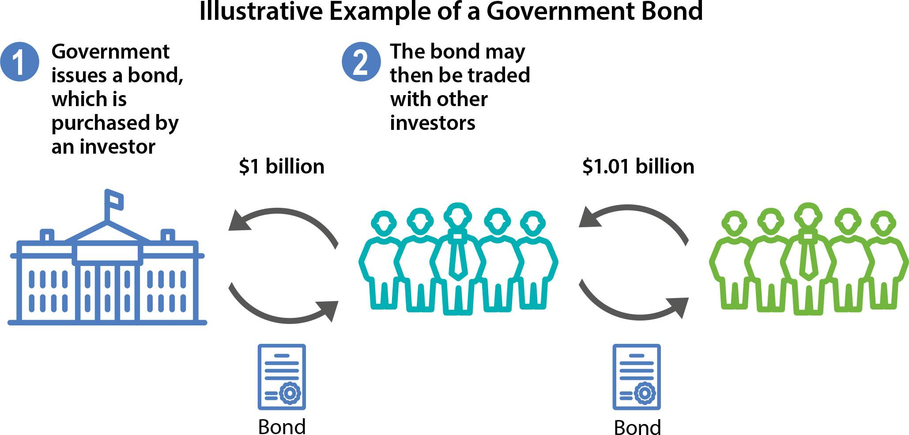

## Table of Contents

## What is a sovereign bond?

A sovereign bond is a type of debt instrument issued by a government to raise money from investors. When you buy a sovereign bond, you are lending money to the government, and in return, the government promises to pay you back the amount you lent, plus interest, over a certain period of time. These bonds are considered very safe because they are backed by the full faith and credit of the issuing government.

Sovereign bonds are used by governments to finance various projects and to manage their national debt. For example, a government might issue bonds to build new roads, schools, or hospitals. Investors, like banks, pension funds, and individuals, buy these bonds because they provide a steady stream of income through interest payments. The interest rate on a sovereign bond depends on the creditworthiness of the issuing country; countries with strong economies usually offer lower interest rates, while those with weaker economies might have to offer higher rates to attract investors.

## How is the yield of a sovereign bond determined?

The yield of a sovereign bond is like the return you get for lending money to a government. It's determined by the bond's price and its interest payments, which are called coupons. When a bond is first issued, its yield is set based on what investors expect to earn. If the bond's price goes up or down in the market after it's issued, the yield changes too. The yield goes down when the bond's price goes up, and it goes up when the bond's price goes down.

Several things can affect a sovereign bond's yield. One big factor is how safe investors think the bond is. If people believe the government might have trouble paying back the money, they'll want a higher yield to take that risk. Another factor is what's happening with interest rates in the economy. If interest rates are going up, new bonds will offer higher yields, which can make older bonds with lower yields less attractive, causing their prices to drop and their yields to rise. The overall demand for the bond also plays a role; if lots of people want to buy the bond, its price might go up, which would lower the yield.

## What factors influence sovereign bond yields?

The yield of a sovereign bond is influenced by how safe investors think the bond is. If people believe that the government might struggle to pay back the money they borrowed, they will want a higher yield to make up for that risk. This is why bonds from countries with strong economies usually have lower yields, while bonds from countries with weaker economies might have higher yields. Investors want to be rewarded more for taking on more risk.

Another big factor that affects sovereign bond yields is the general level of interest rates in the economy. When interest rates go up, new bonds come with higher yields, which can make older bonds with lower yields less attractive. As a result, the prices of those older bonds might drop, causing their yields to rise. On the other hand, if interest rates go down, new bonds will have lower yields, making older bonds with higher yields more attractive, which can push their prices up and their yields down.

The demand for sovereign bonds also plays a role in determining their yields. If lots of people want to buy a particular bond, its price might go up. When the price of a bond goes up, its yield goes down. Conversely, if fewer people want to buy the bond, its price might go down, causing the yield to rise. So, the balance between how much people want to buy the bond and how much is available can have a big impact on its yield.

## What is the relationship between sovereign bond yields and economic health?

Sovereign bond yields can tell us a lot about how healthy an economy is. When an economy is strong and growing, people believe that the government will be able to pay back its debts easily. This makes the bonds safer, so investors are okay with lower yields. On the other hand, if the economy is struggling, people might worry that the government could have a hard time paying back its debts. To get investors to buy their bonds, the government might have to offer higher yields as a way to make up for the extra risk.

Another way sovereign bond yields relate to economic health is through interest rates set by central banks. When the economy is doing well, central banks might raise interest rates to keep inflation in check. Higher interest rates mean new bonds will have higher yields, which can make older bonds less attractive, causing their prices to drop and their yields to rise. If the economy is weak, central banks might lower interest rates to encourage borrowing and spending. Lower interest rates lead to lower yields on new bonds, making older bonds with higher yields more attractive, which can push their prices up and their yields down. So, by watching sovereign bond yields, we can get a sense of the economy's health and what central banks might be doing.

## How do sovereign bonds function within a country's financial system?

Sovereign bonds are like IOUs that a government gives to people who lend it money. When a government needs money for things like building roads or schools, it can sell these bonds. People who buy the bonds are basically lending money to the government. In return, the government promises to pay back the money with some extra, called interest, over a certain time. This helps the government manage its money and do important projects without having to raise taxes right away.

Sovereign bonds also help keep the country's financial system stable. They give investors a safe place to put their money because they're backed by the government. This can help control how much money is available in the economy. When the government sells bonds, it takes money out of people's hands, which can help slow down spending if the economy is growing too fast. If the economy needs a boost, the government can buy back bonds, putting more money back into people's hands. So, sovereign bonds are a big part of how a country manages its money and keeps its economy on track.

## What are the risks associated with investing in sovereign bonds?

Investing in sovereign bonds can be pretty safe, but there are still some risks you should know about. One big risk is that the government might not be able to pay back the money it borrowed. This is called default risk. If a country's economy is struggling, it might have a hard time paying back its debts. When this happens, investors can lose money. Another risk is inflation risk. If prices start going up a lot, the money you get back from the bond might not be worth as much as when you lent it out.

Another thing to watch out for is interest rate risk. If interest rates go up after you buy a bond, new bonds will offer higher returns. This can make your bond less valuable because people might want to buy the new bonds instead. As a result, the price of your bond could go down. Finally, there's currency risk if you're buying bonds from another country. If the value of that country's money goes down compared to your own, the money you get back from the bond might be worth less when you convert it back to your currency.

## How do sovereign bond yields compare to other types of bond yields?

Sovereign bond yields are usually lower than the yields on other types of bonds, like corporate bonds or municipal bonds. This is because sovereign bonds are seen as safer. When you buy a sovereign bond, you're lending money to a government, and governments are less likely to go bankrupt than companies. So, investors are happy to accept lower returns for the safety that comes with sovereign bonds. On the other hand, corporate bonds come from companies, and there's a bigger chance that a company could run into money trouble. Because of this extra risk, investors want higher yields to make up for it.

Municipal bonds, which are issued by local governments or agencies, often have yields that fall somewhere in between sovereign and corporate bonds. They're usually safer than corporate bonds but riskier than sovereign bonds from strong countries. The yields on municipal bonds can vary a lot depending on the financial health of the local government issuing them. Sometimes, they can be close to sovereign bond yields if the local government is very stable, but they can be closer to corporate bond yields if there's more risk involved.

## What role do sovereign bonds play in monetary policy?

Sovereign bonds are really important for a country's central bank when it's trying to control the economy through something called monetary policy. When the central bank wants to put more money into the economy, it can buy sovereign bonds from banks and other investors. This gives those banks more money to lend out to people and businesses, which can help the economy grow. On the other hand, if the central bank thinks the economy is growing too fast and might cause too much inflation, it can sell sovereign bonds. This takes money out of the economy because people and banks use their money to buy the bonds instead of spending it elsewhere.

Another way sovereign bonds help with monetary policy is by setting a benchmark for interest rates. When the central bank changes its interest rates, it affects the yields on new sovereign bonds. If the central bank raises interest rates, new bonds will have higher yields, and this can make borrowing more expensive for everyone. If the central bank lowers interest rates, new bonds will have lower yields, making borrowing cheaper. By controlling these interest rates and bond yields, the central bank can guide the whole economy towards more growth or less inflation, depending on what's needed.

## How can changes in sovereign bond yields affect global financial markets?

Changes in sovereign bond yields can have a big impact on global financial markets because they are seen as a sign of how safe and stable an economy is. If yields on sovereign bonds from a big country like the United States or Germany go up a lot, it might mean people are worried about that country's economy. This can make investors nervous, and they might start selling off other investments like stocks and bonds from other countries too. This can cause prices to drop in those markets and make it harder for businesses to borrow money, which can slow down the global economy.

On the other hand, if sovereign bond yields go down, it might mean that investors think the economy is doing well and that the government can easily pay back its debts. This can make investors feel more confident, and they might start buying more stocks and bonds from other countries. This can push up prices in those markets and make it easier for businesses to borrow money, which can help the global economy grow. So, even though sovereign bond yields come from one country, they can affect how investors around the world feel and what they do with their money.

## What are the strategies for managing a portfolio of sovereign bonds?

When you're managing a portfolio of sovereign bonds, one important strategy is to spread your investments across different countries. This is called diversification. By buying bonds from different countries, you reduce the risk that one country's problems will hurt your whole portfolio. For example, if one country's economy is struggling and its bond prices drop, the bonds from other countries might still be doing well. This can help keep your portfolio stable and protect your money.

Another strategy is to pay attention to the length of time until the bonds you own mature. This is called duration management. If you think interest rates might go up, you might want to buy bonds that mature sooner. That way, you can get your money back quicker and reinvest it in new bonds with higher yields. If you think interest rates will go down, you might want to buy bonds that take longer to mature. These bonds will keep paying you the higher interest rate for a longer time, which can be good for your returns. By thinking about how long you'll have your money tied up in bonds, you can make smarter choices that fit with what's happening in the economy.

## How do sovereign bond yields impact currency valuation?

Sovereign bond yields can affect how much a country's money, or currency, is worth. When a country's bond yields go up, it often means investors think the country's economy is doing better or that there's more risk. Higher yields can attract more investors to buy those bonds, which means they need to buy the country's currency to do so. This increased demand for the currency can make it stronger compared to other currencies. On the other hand, if bond yields go down, it might mean investors are less confident in the country's economy. Lower yields might make investors sell the bonds and the currency, which can make the currency weaker.

The relationship between sovereign bond yields and currency valuation is also influenced by what's happening with interest rates set by the country's central bank. If the central bank raises interest rates, bond yields usually go up too. This can make the country's currency more attractive to investors looking for better returns, pushing its value higher. If the central bank lowers interest rates, bond yields typically fall, which can make the currency less attractive and cause its value to drop. So, changes in sovereign bond yields can have a big impact on how strong or weak a country's currency is in the global market.

## What advanced analytical tools are used to predict sovereign bond yield movements?

To predict how sovereign bond yields might change, experts use some fancy tools like econometric models. These models look at lots of numbers from the past, like how the economy has grown, what inflation has been like, and what interest rates have done. By studying these numbers, the models can guess what might happen to bond yields in the future. Another tool is called machine learning. This is like teaching a computer to find patterns in big piles of data. The computer can look at things like news articles, social media posts, and even what people are saying about the economy to predict how bond yields might move.

Another way to predict sovereign bond yields is by using something called yield curve analysis. This tool looks at the difference between the yields of short-term and long-term bonds. If the difference is big, it might mean people expect the economy to grow a lot, which can push up bond yields. If the difference is small or if short-term yields are higher than long-term yields, it might mean people are worried about the economy, and bond yields might go down. All these tools help investors and policymakers make better guesses about where bond yields are headed, which is important for making smart choices about money.

## What are the key aspects of exploring the bond market?

The bond market, also known as the debt market, is a financial market where participants issue new debt or buy and sell debt securities, primarily in the form of bonds. At its core, the bond market facilitates the raising of capital by governments and corporations through the issuance of bonds, which are essentially loans made by investors (bondholders) to the issuer. 

Components of the bond market include government bonds (issued by national governments), municipal bonds (issued by local and state governments), and corporate bonds (issued by companies). Each type of bond serves different purposes and involves varying levels of risk and return, tailored to the needs of both issuers and investors.

The operation of the bond market is characterized by several key participants. These include issuers, such as governments and corporations; investors, which comprise institutional entities like pension funds, insurance companies, and mutual funds, as well as individual investors; and intermediaries like banks and broker-dealers, who facilitate the buying and selling of debt instruments. Additionally, rating agencies play a role by evaluating the creditworthiness of bond issuers, influencing investor perception and market pricing.

The significance of the bond market in maintaining global economic stability cannot be overstated. This market is a critical conduit for capital, providing governments and businesses the means to finance operations, investments, and projects. By enabling efficient capital allocation, the bond market supports economic growth and development. Moreover, it acts as a benchmark for interest rates and a tool for monetary policy implementation. Central banks, through open market operations, often engage in the buying and selling of government bonds to influence money supply and interest rates, thereby steering economic activity.

A fundamental concept linking bond market operations is the inverse relationship between interest rates and bond prices. When interest rates rise, the prices of existing bonds typically fall, and vice versa. This is because bonds pay a fixed interest rate (coupon rate), and when new bonds are issued at higher rates, the value of older bonds with lower coupon rates decreases to make them competitive. Mathematically, this relationship can be illustrated using the formula for the present value of a bond:

$$
P = \frac{C}{(1 + r)^1} + \frac{C}{(1 + r)^2} + \ldots + \frac{C}{(1 + r)^n} + \frac{F}{(1 + r)^n}
$$

where $P$ is the bond price, $C$ is the coupon payment, $r$ is the interest rate, $n$ is the number of periods, and $F$ is the face value of the bond. As $r$ increases, the present value of the bond's future cash flows decreases, leading to a decline in its price.

The bond market's role in global finance, aided by its interactions with interest rates, underscores its importance in economic policy and investment strategy, influencing not only national economies but also the global financial landscape.

## References & Further Reading

[1]: Fabozzi, F. J. (2007). ["Fixed Income Analysis."](https://www.amazon.com/Fixed-Income-Analysis-Frank-Fabozzi/dp/047005221X) John Wiley & Sons.

[2]: Hull, J. C. (2015). ["Options, Futures, and Other Derivatives."](https://www.amazon.com/Options-Futures-Other-Derivatives-10th/dp/013447208X) Pearson.

[3]: Lopez de Prado, Marcos. (2018). ["Advances in Financial Machine Learning."](https://www.amazon.com/Advances-Financial-Machine-Learning-Marcos/dp/1119482089) Wiley.

[4]: James, J., & Webber, N. (2000). ["Interest Rate Modelling."](https://books.google.com/books/about/Interest_Rate_Modelling.html?id=_KNzQgAACAAJ) Wiley.

[5]: Brigo, D., & Mercurio, F. (2006). ["Interest Rate Models - Theory and Practice."](https://link.springer.com/book/10.1007/978-3-540-34604-3) Springer Finance.