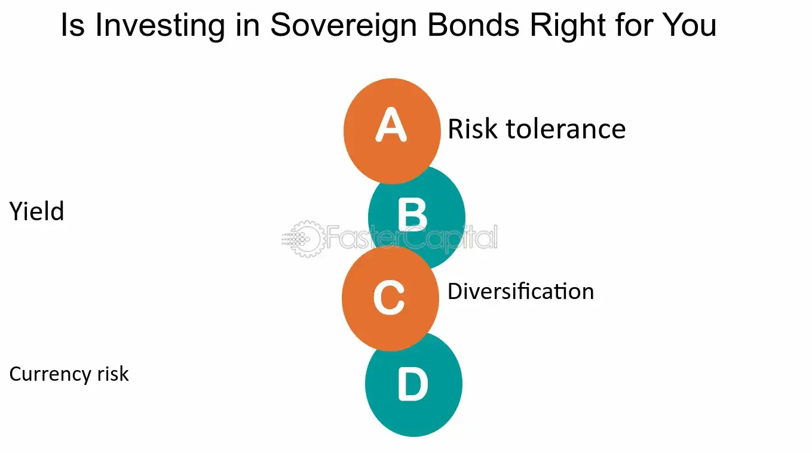

## Table of Contents

## What are sovereign bonds?

Sovereign bonds are like IOUs that a country's government issues to borrow money. When a government needs money for things like building roads, schools, or paying for other big projects, it can sell these bonds to investors. People or organizations who buy these bonds are lending money to the government. In return, the government promises to pay back the money they borrowed, plus some extra money called interest, over a certain period of time.

These bonds are considered safe because they are backed by the government. This means that the government is promising to use its power to collect taxes or print money to pay back the bondholders. However, if a country faces big financial problems, there's a small chance it might not be able to pay back the bonds. This is called defaulting. Even though this is rare, it can happen, so investors always check how stable a country's economy is before buying its sovereign bonds.

## How do sovereign bonds differ from other types of bonds?

Sovereign bonds are different from other types of bonds because they are issued by a country's government, not by companies or local governments. When you buy a sovereign bond, you're lending money to a whole country. This makes them different from corporate bonds, which are issued by companies, or municipal bonds, which are issued by cities or states. Sovereign bonds are usually seen as safer than corporate bonds because they're backed by the full faith and credit of a government. This means the government promises to use its power to pay you back, which is a big deal.

Another way sovereign bonds differ is in how they're rated and the risks involved. Credit rating agencies look at a country's economic health to decide how safe its bonds are. If a country is doing well, its bonds might get a high rating, meaning they're seen as low risk. But if a country is struggling, its bonds might get a low rating, meaning they're riskier. This is different from corporate bonds, where the focus is on the company's financial health, or municipal bonds, where the focus is on the financial health of a city or state. Also, while it's rare, there's a chance a country could default on its bonds, which is a bigger deal than a company or city defaulting because it can affect the whole country's economy.

## What are the benefits of investing in sovereign bonds?

One big benefit of investing in sovereign bonds is that they are generally seen as safe. When you buy a sovereign bond, you're lending money to a country's government. Governments have the power to collect taxes and print money, which means they can usually pay you back. This makes sovereign bonds a good choice if you want to keep your money safe. They are often called a "safe haven" for investors, especially during times when the economy is shaky.

Another benefit is that sovereign bonds can give you a steady income. When you buy a bond, the government promises to pay you interest regularly until the bond matures. This can be a good way to earn some money without taking big risks. Plus, if you buy bonds from a country with a strong economy, you might not have to worry too much about the government not paying you back. This makes sovereign bonds a good choice for people who want a reliable source of income over time.

## What are the risks associated with sovereign bonds?

One risk of investing in sovereign bonds is that the country might not be able to pay you back. This is called defaulting. It doesn't happen often, but if a country's economy gets really bad, it might struggle to pay its debts. If that happens, you could lose the money you invested. Another risk is that the value of the bond can go down if interest rates go up. When interest rates rise, new bonds might offer higher interest, making your older bonds less valuable. You might have to sell your bonds for less than you paid for them if you need your money back before the bond matures.

Another thing to watch out for is inflation. If prices start going up a lot, the money you get back from your bond might not be worth as much as when you invested it. This means your investment might not grow as much as you hoped. Also, if you're investing in bonds from a foreign country, there's a risk that changes in currency exchange rates could affect how much money you get back. If the currency of the country you invested in loses value compared to your own currency, you could end up with less money than you expected.

## How are sovereign bonds rated and what do the ratings mean?

Sovereign bonds are rated by special companies called credit rating agencies. These agencies look at how healthy a country's economy is and how likely it is that the country will be able to pay back its debts. They give the bonds a grade, kind of like how teachers give grades in school. The grades can be letters like AAA, AA, A, BBB, and so on, all the way down to D. AAA is the best grade, meaning the bond is very safe. D is the worst, meaning the country is having big problems and might not pay back the money.

The ratings help investors decide if a bond is a good investment. If a bond has a high rating like AAA or AA, it means the country is doing well and the bond is seen as safe. Investors might be happy to buy these bonds because they think they'll get their money back with interest. But if a bond has a low rating like BB or below, it means the country is struggling and the bond is riskier. Investors might want a higher [interest rate](/wiki/interest-rate-trading-strategies) to take that risk, or they might decide not to buy the bond at all.

## What is the process of issuing sovereign bonds?

When a country's government wants to borrow money, it starts by deciding how much money it needs and for how long. The government then works with a group called the central bank or a special department to create the bonds. They set things like the interest rate, which is the extra money they'll pay back to the people who buy the bonds, and the date when the bonds will be paid back, called the maturity date. Once everything is set, the government announces that it's going to sell these bonds. This is called an auction.

During the auction, the government lets investors know they can buy the bonds. Investors can be banks, big companies, or even regular people. They bid on how much they're willing to pay for the bonds and what interest rate they want. The government picks the best offers and sells the bonds to those investors. After the auction, the investors get the bonds, and the government gets the money it needs. Over time, the government pays back the money it borrowed, plus the interest, until the bonds reach their maturity date and the full amount is paid back.

## How can an investor purchase sovereign bonds?

An investor can buy sovereign bonds by taking part in an auction that the government holds. When a government wants to borrow money, it announces an auction where it sells the bonds. Investors, which can be banks, big companies, or even regular people, can bid on these bonds. They tell the government how much they're willing to pay and what interest rate they want. The government then picks the best offers and sells the bonds to those investors. Once the auction is over, the investors get the bonds, and the government gets the money it needs.

After buying the bonds, investors hold onto them until they mature, which means the government pays back the money it borrowed plus the interest. Sometimes, investors might want to sell their bonds before they mature. They can do this by selling the bonds to other investors in a special market called the secondary market. This way, even if they don't hold the bond until the end, they can still get some of their money back, depending on what other investors are willing to pay for the bond at that time.

## What are the typical yields offered by sovereign bonds?

The typical yields on sovereign bonds can change a lot depending on where the country is and how strong its economy is. For countries with really strong economies, like the United States or Germany, the yields on their bonds are usually pretty low. This is because lots of people want to buy these bonds because they think they're safe. For example, U.S. Treasury bonds might offer yields around 1% to 3%, depending on how long you're willing to wait for your money back. German bonds can be even lower, sometimes less than 1%.

On the other hand, countries with weaker economies might have to offer higher yields to get people to buy their bonds. This is because there's more risk that the country might not be able to pay back the money. For example, bonds from countries like Brazil or South Africa might offer yields of 5% to 10% or even more. The higher the risk, the higher the yield, because investors want to be rewarded for taking that risk. So, when you're thinking about buying sovereign bonds, you need to look at the country's economy and decide if the yield is worth the risk.

## How do economic conditions affect the performance of sovereign bonds?

Economic conditions can have a big impact on how well sovereign bonds do. When the economy is strong and growing, people might feel more confident and want to invest in things that could make them more money, like stocks. This can make sovereign bonds less popular because they usually offer lower returns. Also, if inflation is low, the value of the money you get back from the bond stays pretty steady. But if the economy starts to struggle, people might look for safe places to put their money, and sovereign bonds become more attractive because they're seen as safe. If the economy gets really bad, the government might have trouble paying back its bonds, which can make investors nervous and cause bond prices to drop.

Interest rates are another big part of how economic conditions affect sovereign bonds. When the economy is doing well, central banks might raise interest rates to keep inflation in check. Higher interest rates mean new bonds will offer better returns, which can make older bonds with lower rates less valuable. On the other hand, if the economy is weak, central banks might lower interest rates to encourage spending and borrowing. This can make existing bonds with higher rates more valuable because they're paying more interest than new bonds. So, the ups and downs of the economy can really change how much money investors make from their sovereign bonds.

## What are some advanced strategies for investing in sovereign bonds?

One advanced strategy for investing in sovereign bonds is called duration matching. This means you try to match the time when your bonds will pay you back with when you need the money. If you know you'll need money in 10 years, you can buy bonds that will mature in 10 years. This way, you can be sure you'll have the money when you need it. Another part of this strategy is to look at how sensitive your bonds are to changes in interest rates. If interest rates go up, the value of your bonds might go down. By choosing bonds with the right duration, you can manage this risk better.

Another strategy is called yield curve positioning. The yield curve shows how much interest you can get from bonds that mature at different times. Sometimes, the yield curve can be steep, which means long-term bonds offer a lot more interest than short-term ones. Other times, it can be flat or even inverted, where short-term bonds offer more interest. By looking at the yield curve, you can decide if you want to buy short-term or long-term bonds to get the best return. This strategy can help you make more money by taking advantage of changes in the economy and interest rates.

A third strategy is diversification. This means spreading your money across bonds from different countries. If one country's economy does badly, you won't lose all your money because you'll still have bonds from other countries that might be doing better. You can also diversify by buying bonds with different maturity dates and interest rates. This way, you can balance the risk and return of your investment. By using these strategies, you can make smarter choices about which sovereign bonds to buy and when to buy them.

## How do sovereign bonds fit into a diversified investment portfolio?

Sovereign bonds can be a great addition to a diversified investment portfolio because they are generally seen as safe investments. When you include sovereign bonds in your portfolio, you're spreading your money across different types of investments, which can help lower your risk. If the stock market goes down, the value of your sovereign bonds might stay steady or even go up because people look for safe places to put their money during tough times. This balance can help protect your overall investment from big losses.

Another way sovereign bonds help with diversification is by providing a steady income. While stocks might go up and down a lot, sovereign bonds usually pay you interest regularly. This can be really helpful if you need a reliable source of money over time. By mixing sovereign bonds with other investments like stocks or real estate, you can create a portfolio that not only grows but also gives you a steady income. This mix can make your investments more stable and help you reach your financial goals more safely.

## What are the tax implications of investing in sovereign bonds?

When you invest in sovereign bonds, you need to think about taxes. The interest you earn from these bonds is usually taxable. This means you have to pay taxes on the money the government pays you as interest. The tax rate can depend on where you live and how much money you make. In some countries, the interest from certain types of sovereign bonds might be tax-free, but this is not always the case. It's important to check the tax rules in your country to know how much you'll have to pay.

If you sell your sovereign bonds before they mature and make a profit, you might also have to pay capital gains tax. This is a tax on the money you make from selling something for more than you paid for it. The tax rate for capital gains can be different from the tax rate on interest. Some countries might have special rules or lower rates for long-term investments, so it's good to understand these rules. Talking to a tax advisor can help you figure out all the tax implications of investing in sovereign bonds and plan your investments better.

## References & Further Reading

[1]: ["Algorithmic and High-Frequency Trading"](https://www.cambridge.org/us/universitypress/subjects/mathematics/mathematical-finance/algorithmic-and-high-frequency-trading) by Alvaro Cartea, Sebastian Jaimungal, and José Penalva

[2]: ["Bond Markets, Analysis, and Strategies"](https://mitpress.mit.edu/9780262046275/bond-markets-analysis-and-strategies/) by Frank J. Fabozzi

[3]: ["Sovereign Debt: From Safety to Default"](https://www.wiley.com/en-us/Sovereign+Debt%3A+From+Safety+to+Default-p-9780470922392) edited by Robert W. Kolb

[4]: Adrian, T., & Shin, H. S. (2010). ["The Changing Nature of Financial Intermediation and the Financial Crisis of 2007-09"](https://www.newyorkfed.org/medialibrary/media/research/staff_reports/sr439.pdf). Federal Reserve Bank of San Francisco.

[5]: Aït-Sahalia, Y., & Yu, J. (2009). ["High Frequency Market Microstructure Noise Estimates and Liquidity Measures"](https://www.jstor.org/stable/30244247). The Review of Financial Studies.