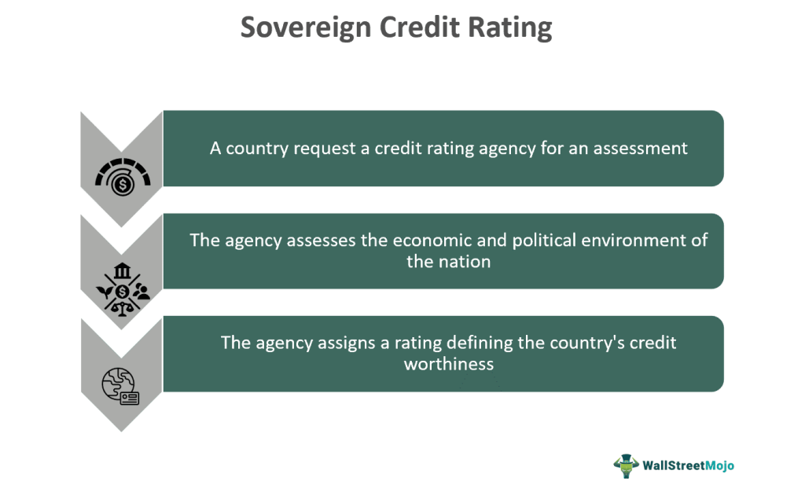

The global financial system intricately depends on sovereign credit ratings for shaping the perception of sovereign debt. These ratings, determined by independent agencies, offer a critical assessment of a country’s fiscal health and its ability to meet financial obligations. As such, they play a substantial role in influencing investor confidence and decision-making on international scales. By providing an estimate of a country's creditworthiness, sovereign credit ratings become pivotal in guiding investment flows and managing risks associated with cross-border financing.

Credit rating agencies such as Standard & Poor’s, Moody’s, and Fitch are central to this financial landscape, as their evaluations carry significant weight in global markets. These agencies assess numerous factors, including political stability, economic performance, and historical debt management. Consequently, the ratings assigned bear substantial consequences, affecting national borrowing costs, foreign direct investment, and overall economic vitality.



Another dimension to this is the role of algorithmic trading, which increasingly utilizes sovereign credit ratings to inform strategies and execute market orders. The integration of computational algorithms with credit evaluations adds a layer of complexity, potentially exacerbating market volatility when ratings change suddenly. Investors, policymakers, and financial professionals must equip themselves with a comprehensive understanding of these dynamics to navigate the evolving financial environment effectively.

## Table of Contents

## Understanding Sovereign Credit Ratings

A sovereign credit rating serves as an independent evaluation of a country's creditworthiness, reflecting its ability and willingness to meet its financial obligations. These ratings are established by dedicated credit rating agencies and are a key metric for investors when considering the potential risks associated with investing in a country's debt instruments. The agencies assign ratings that symbolize the probability of default, with higher ratings often indicating lower risk.

The ratings are expressed through letter grades; for instance, Standard & Poor's and Fitch Ratings use scales ranging from 'AAA,' the highest level of creditworthiness, to 'D,' indicating default. Moody's uses a similar scale, from 'Aaa' to 'C.' The specific criteria these agencies use to assess creditworthiness include a nation's economic policies, political stability, external debts, currency stability, and fiscal health.

The evaluation process entails rigorous analysis. Macroeconomic indicators such as GDP growth rate, inflation rate, and budget deficits play significant roles. Additionally, a country's external factors, such as trade balances and dependency on foreign currency, are scrutinized. Political risk factors, encompassing aspects like government stability, regulatory quality, and geopolitical risks, are also incorporated into the assessment process.

By assigning these ratings, agencies like Standard & Poor’s, Moody’s, and Fitch provide insights into the sovereign debt market, guiding investors in making informed decisions. For instance, a country with a "BB" rating (considered speculative) may face higher interest rates when issuing new debt compared to a country with an "AA" rating (considered more secure). This distinction influences not only investor perception but also a country's ability to secure funding at favorable terms.

Understanding sovereign credit ratings is imperative, as they serve not just as reflections of a country’s current financial status but also as tools that can determine the economic trajectory by impacting investment levels and borrowing costs.

## The Role of Credit Rating Agencies

Credit rating agencies play a pivotal role in the global financial system by providing independent evaluations of the creditworthiness of countries. These agencies, including prominent names like Standard & Poor's, Moody's, and Fitch, assess the economic and political landscapes of nations to assign them sovereign credit ratings. The criteria for these ratings encompass a wide range of factors, such as economic performance, fiscal policies, political stability, and external financial obligations.

The evaluations given by these agencies have significant implications for a country’s financial prospects. Sovereign credit ratings directly influence a nation's ability to attract foreign direct investment (FDI). Higher ratings can lead to increased investor confidence, thereby facilitating greater capital inflows into the country. Conversely, lower ratings can deter investment due to perceived higher risks, affecting the country’s economic development.

Furthermore, credit ratings are crucial in bond market dynamics as they determine the interest rates at which countries can issue bonds. A higher credit rating generally allows a country to borrow at lower interest rates, reducing the cost of financing its debt. This, in turn, impacts public spending and economic stability. Conversely, countries with lower ratings may face higher borrowing costs, which can strain their budgets and compel them to implement austerity measures or seek assistance from international financial institutions.

Despite their importance, credit rating agencies have faced scrutiny over potential conflicts of interest, particularly due to the 'issuer pays' model. This model implies that the entity seeking a credit rating (usually the country) is also the one that pays for its assessment. Critics argue that this can lead to biased evaluations, although the agencies maintain that their processes are rigorous and objective.

Credit rating agencies also influence investor behavior and capital market dynamics through the publication of outlooks and watchlists, which can signal potential future rating changes. These tools provide investors with insights into the evolving risks associated with a country and enable them to adjust their portfolios accordingly.

In summary, credit rating agencies are integral to the global financial ecosystem, affecting investment rates and bond market conditions through their assessments of sovereign creditworthiness. Their ratings provide crucial information that helps shape economic policies and investment strategies worldwide.

## Sovereign Credit Ratings and Sovereign Debt

Sovereign credit ratings represent an assessment of a country’s creditworthiness, which directly influences its ability to borrow money and the interest rates applied to its issued bonds. Higher sovereign credit ratings typically denote a lower risk of default, enabling countries to issue bonds at more favorable interest rates. For example, a country with a AAA rating—indicative of the highest credit quality—can generally secure financing at much lower interest rates compared to a country rated BBB or lower. The relationship between credit ratings and interest rates can be summarized with the formula for the yield on a bond:

$$

\text{Yield} = \text{Risk-free rate} + \text{Credit risk premium}
$$

In this context, the credit risk premium is inversely related to the sovereign credit rating. A higher rating implies a lower credit risk premium, thus reducing the yield—or interest cost—required by investors.

However, the 'issuer pays' model, wherein the entity seeking the rating pays the agency for this service, has prompted concerns over potential conflicts of interest. Critics argue that this payment structure might incentivize credit rating agencies to issue more favorable ratings to retain business. Consequently, some market observers question the objectivity of ratings provided under this model, although agencies assert strict guidelines and internal controls to preserve ratings integrity and independence.

The influence of sovereign credit ratings extends beyond merely impacting borrowing costs. A favorable credit rating can enhance investor confidence, encouraging more robust capital inflows and financial stability, while a downgrade can lead to tightened credit conditions, increased borrowing costs, and a potential outflow of capital. These dynamics highlight the pivotal role sovereign credit ratings play in shaping a country's economic and financial environment.

## Algorithmic Trading and Sovereign Credit Ratings

Algorithmic trading has transformed modern financial markets by leveraging computational algorithms to conduct trades automatically based on set criteria. These criteria can include a multitude of data points, among which sovereign credit ratings play a pivotal role. Sovereign credit ratings, which assess a country's creditworthiness, are integral to gauging the risk attached to trading a nation's financial instruments, such as bonds and other securities. The impact of these ratings on market dynamics is multifaceted.

Algorithmic trading systems are designed to interpret changes in sovereign credit ratings swiftly and efficiently. When a credit rating agency updates a country's rating, such systems can automatically trigger buy or sell orders, thereby influencing market prices almost instantaneously. This rapid response contributes to market [volatility](/wiki/volatility-trading-strategies), as sudden shifts in a country's perceived credit risk can result in increased trading activity. For instance, if a country is downgraded, its bonds might be sold off en masse, leading to a sharp decline in their prices.

The algorithms typically incorporate a range of data, including historical credit rating trends, current ratings, and real-time market conditions. Below is an example of a simple Python pseudocode that outlines how an algorithm might use credit ratings to inform trading decisions:

```python
def decide_trade(current_rating, previous_rating, market_conditions):
    if current_rating < previous_rating:
        # Downgrade detected
        if market_conditions['risk_aversion'] > 0.5:
            # High market risk aversion
            execute_sell_order()
    elif current_rating > previous_rating:
        # Upgrade detected
        if market_conditions['risk_appetite'] > 0.5:
            # High market risk appetite
            execute_buy_order()

def execute_sell_order():
    # Implementation of sell order
    pass

def execute_buy_order():
    # Implementation of buy order
    pass
```

For traders and financial analysts, understanding the interplay between [algorithmic trading](/wiki/algorithmic-trading) and sovereign credit ratings is crucial. Misinterpretation or oversight of these dynamics can lead to unexpected financial exposure and risk. Furthermore, the feedback loop created by algorithmic trading might exacerbate market movements instigated by changes in sovereign credit ratings. This makes monitoring real-time market responses and historical data vital.

In summary, the relationship between sovereign credit ratings and algorithmic trading is an area of significant financial interest, affecting market behavior and necessitating robust analysis. Traders utilizing algorithmic systems must remain vigilant to the implications of sovereign credit rating changes to exploit opportunities and mitigate risks effectively.

## Case Studies: Recent Downgrades and Their Impact

### Case Studies: Recent Downgrades and Their Impact

The recent downgrade of the U.S. credit rating by Fitch in August 2023 serves as a notable example of the substantial impact sovereign credit ratings can have on financial markets. This downgrade was largely due to political disagreements over the U.S. debt ceiling, questioned fiscal stability, and the handling of government debt. These assessments directly affected investor confidence and had multiple economic repercussions.

**Increased Borrowing Costs:**
One of the immediate effects of a downgrade in sovereign credit rating is the increase in borrowing costs. Countries with lower credit ratings generally face higher interest rates when issuing bonds. This is because investors demand greater compensation for the perceived increased risk of default. For instance, following the U.S. downgrade, the yield on U.S. Treasury bonds saw an upward adjustment, reflecting an increase in borrowing costs for the government. Increased yields translate to higher interest payments, impacting national budgets and increasing the cost of financing public projects.

**Altered Investment Strategies:**
A downgrade influences the strategies employed by institutional investors and other market players. With altered risk assessments, fund managers might reallocate assets, shifting away from downgraded debt securities toward assets with perceived lower risks. This reallocation could lead to sell-offs in the bond market, further driving up yields and impacting [liquidity](/wiki/liquidity-risk-premium). For example, pension funds and insurance firms with strict investment criteria could be required to adjust their portfolios to comply with regulatory standards, potentially affecting overall market dynamics.

**Broader Economic Implications:**
The downgrade has wider economic implications extending beyond immediate financial markets. It can undermine international confidence in the downgraded nation's financial governance, potentially affecting foreign direct investment inflows. Additionally, it might prompt austerity measures or fiscal policy adjustments as governments seek ways to mitigate increased borrowing expenses while maintaining investor confidence.

In conclusion, analyzing recent downgrades, such as the Fitch U.S. downgrade in 2023, underscores the profound effect that sovereign credit ratings can exert on markets. They influence borrowing costs, shape investment strategies, and bear significant broader economic implications which stakeholders must consider in their financial decision-making processes.

## Conclusion

Sovereign credit ratings are fundamental instruments in global finance with profound implications for debt markets and the movement of capital. These ratings, assigned by credit rating agencies, offer a measure of a nation's creditworthiness, thereby affecting the rates at which countries can borrow. Higher ratings typically equate to lower borrowing costs, enabling countries to finance their expenditures more efficiently. Conversely, a downgrade can lead to higher interest rates, increasing the cost of debt servicing and possibly deterring investment.

The integration of sovereign credit ratings with algorithmic trading introduces additional complexity to market behavior. Algorithmic trading systems can automatically execute trades based on sovereign credit rating changes, often resulting in rapid responses to upgrades or downgrades. This immediate reactivity can cause increased market volatility, amplifying the effects of ratings changes on financial markets. As such, algorithmic processes necessitate a deep understanding of the connections between credit ratings and market movements for traders and analysts.

Keeping abreast of developments in sovereign credit ratings and algorithmic trading strategies is essential for investors, policymakers, and other key participants in the financial ecosystem. As financial markets become more interconnected and technology continues to evolve, the impact of these ratings on global economics cannot be overstated. Remaining knowledgeable about these dynamics is vital in navigating the increasingly complex terrain of international finance.

## References & Further Reading

[1]: Cantor, R., & Packer, F. (1996). ["Determinants and Impact of Sovereign Credit Ratings."](https://www.newyorkfed.org/medialibrary/media/research/epr/96v02n2/9610cant.pdf) The Journal of Fixed Income, 6(3), 76-91.

[2]: Mora, N. (2006). ["Sovereign Credit Ratings: Guilty Beyond Reasonable Doubt?"](https://www.sciencedirect.com/science/article/pii/S0378426605001354) Journal of Banking & Finance, 30(7), 2041-2062.

[3]: Bannier, C. E., & Hirsch, C. W. (2010). ["The Economic Function of Credit Rating Agencies—What Does the Watchlist Tell Us?"](https://papers.ssrn.com/sol3/papers.cfm?abstract_id=1343421) Journal of Banking & Finance, 34(12), 3037-3049.

[4]: Jansen, S. (2020). ["Machine Learning for Algorithmic Trading: Predictive models to extract signals from market and alternative data for systematic trading strategies with Python."](https://github.com/stefan-jansen/machine-learning-for-trading) Packt Publishing.

[5]: Partnoy, F. (1999). ["The Siskel and Ebert of Financial Markets? Two Thumbs Down for the Credit Rating Agencies."](https://openscholarship.wustl.edu/cgi/viewcontent.cgi?article=1481&context=law_lawreview) Washington University Law Quarterly, 77(3), 619-715.

[6]: Lopez de Prado, M. (2018). ["Advances in Financial Machine Learning."](https://www.amazon.com/Advances-Financial-Machine-Learning-Marcos/dp/1119482089) Wiley.