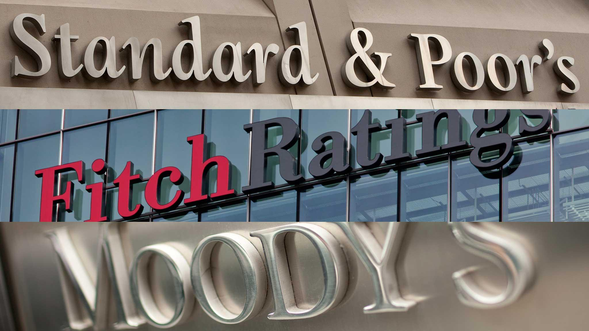

## Table of Contents

## What is a sovereign credit rating?

A sovereign credit rating is a score given to a country by a credit rating agency. It shows how likely the country is to pay back its debts. Agencies like Moody's, Standard & Poor's, and Fitch give these ratings. They look at things like the country's economy, how much debt it has, and how stable its government is. A high rating means the country is seen as safe to lend money to, while a low rating means it's riskier.

These ratings are important because they affect how much interest a country has to pay when it borrows money. If a country has a high rating, it can borrow money at lower interest rates. But if it has a low rating, it has to pay more interest. This can make a big difference in how much money the country has to spend on things like schools and hospitals. Investors and other countries also use these ratings to decide if they want to lend money or invest in a country.

## Who are the main credit rating agencies?

The main credit rating agencies are Moody's, Standard & Poor's (S&P), and Fitch Ratings. These three are known as the "Big Three" because they rate most of the world's countries and companies. They look at how likely a country or company is to pay back its debts and give them a score.

These agencies are important because their ratings can affect how much interest a country or company has to pay when it borrows money. If a country gets a high rating, it can borrow money at lower interest rates. But if it gets a low rating, it has to pay more interest. This can make a big difference in how much money a country has to spend on things like schools and hospitals.

## How do credit rating agencies assess a country's creditworthiness?

Credit rating agencies look at many things to decide if a country is good at paying back its debts. They check the country's economy, like how much money people earn and how fast businesses are growing. They also look at how much debt the country has and if it can pay it back. Another important thing is how stable the government is. If the government changes a lot, it might be harder for the country to pay back its debts. The agencies also think about things like the country's laws and if it has enough money to help people if there's a problem.

After looking at all these things, the agencies give the country a score, called a credit rating. A high score means the country is seen as safe to lend money to. A low score means it's riskier. This score is important because it affects how much interest the country has to pay when it borrows money. If the country has a high score, it can borrow at lower interest rates. But if it has a low score, it has to pay more interest. This can make a big difference in how much money the country has to spend on things like schools and hospitals.

## What are the different rating scales used by major agencies?

The major credit rating agencies use different scales to rate a country's creditworthiness. Moody's uses a scale that goes from Aaa to C, with Aaa being the highest and safest rating. Standard & Poor's (S&P) and Fitch use a scale that goes from AAA to D, with AAA being the highest and safest rating. Both scales use letters to show how safe it is to lend money to a country. The highest ratings, like Aaa or AAA, mean the country is very likely to pay back its debts. Lower ratings, like C or D, mean there's a higher chance the country might not pay back its debts.

These scales also have plus and minus signs or numbers to show smaller differences in creditworthiness. For example, S&P might give a country a rating of AA+ or AA-, and Moody's might give a country a rating of Aa1 or Aa3. These small changes show that one country might be a little safer to lend money to than another country with a similar rating. The agencies use these scales to help investors and other countries decide if they want to lend money or invest in a country.

## How often are sovereign credit ratings updated?

Sovereign credit ratings are not updated on a fixed schedule. Instead, the main credit rating agencies like Moody's, Standard & Poor's, and Fitch review and update these ratings when they think it's necessary. This could be because something big happened in the country's economy or government, or because they do regular check-ups every year or two.

When something important changes, like a big economic crisis or a new government coming in, the agencies might update the rating sooner. They want to make sure their ratings are as accurate as possible so that investors and other countries have the right information. But even without big changes, the agencies will still look at the ratings from time to time to see if anything needs to be adjusted.

## What impact do sovereign credit ratings have on a country's economy?

Sovereign credit ratings have a big impact on a country's economy. When a country has a high credit rating, it means people and other countries see it as safe to lend money to. This makes it easier for the country to borrow money at lower interest rates. With lower interest rates, the country can spend more money on important things like schools, hospitals, and roads. This can help the country's economy grow and make life better for its people.

On the other hand, if a country has a low credit rating, it's seen as riskier to lend money to. This means the country has to pay higher interest rates when it borrows money. Higher interest rates can make it harder for the country to pay back its debts and can take away money that could be used for other important things. This can slow down the country's economy and make it harder for the government to help its people.

## How do changes in sovereign credit ratings affect global financial markets?

Changes in sovereign credit ratings can shake up global financial markets. When a country's rating goes up or down, it sends a signal to investors and other countries about how safe it is to lend money to that country. If a country's rating goes down, investors might start to worry and pull their money out, causing the country's currency to lose value and its borrowing costs to go up. This can make the country's economy weaker and can even affect other countries that do business with it.

On the flip side, if a country's rating goes up, it can make investors feel more confident. They might be more willing to lend money to the country or invest in its businesses. This can help the country's economy grow and can have a positive effect on the global markets. For example, if a big economy like the United States or China gets a better rating, it can boost confidence and help the whole world's economy.

## What are the criticisms and controversies surrounding credit rating agencies?

Credit rating agencies are often criticized for being too powerful and not always getting things right. People say these agencies, like Moody's, Standard & Poor's, and Fitch, have a big impact on countries and companies, but they sometimes make mistakes. For example, before the 2008 financial crisis, these agencies gave high ratings to risky investments that ended up failing. This made a lot of people lose money and trust in the agencies. Critics also say that the agencies are slow to change ratings when things get bad, which can make problems worse.

Another big issue is that credit rating agencies might have conflicts of interest. They are paid by the same countries and companies they rate, which can make it hard for them to be fair. If an agency gives a low rating to a country or company that pays them, they might lose that business. This can make the agencies want to give better ratings than they should. Some people also think that the agencies are too focused on rich countries and don't pay enough attention to poorer ones, which can make it harder for those countries to get the help they need.

These criticisms have led to calls for more rules and oversight of credit rating agencies. Governments and international groups want to make sure the agencies are doing their job right and not causing more problems. Some people even think we need new ways to rate countries and companies that don't rely on these big agencies. But until that happens, the agencies will keep playing a big role in the world's economy.

## How do political and economic factors influence sovereign credit ratings?

Political and economic factors play a big role in deciding a country's sovereign credit rating. The economy is important because it shows how much money the country has and how well it's doing. If the country's economy is growing and people are making more money, it's more likely to pay back its debts. But if the economy is doing badly, with high unemployment and slow growth, it might be harder for the country to pay back what it owes. The amount of debt the country has also matters. If it has a lot of debt, it might struggle to pay it back, which can lead to a lower credit rating.

Politics also affects credit ratings because a stable government makes it easier for a country to manage its money. If the government keeps changing or there's a lot of fighting, it can be harder for the country to make good decisions about its debt. The laws and rules in the country are important too. If the country has good laws that help it pay back its debts, it might get a better rating. But if the laws are weak or if there's a lot of corruption, the rating might go down. In the end, both the economy and politics work together to decide if a country is good at paying back its debts.

## What role do sovereign credit ratings play in international investment decisions?

Sovereign credit ratings are very important for people and companies deciding where to invest their money around the world. When a country has a high credit rating, it means that it's seen as safe to lend money to. This makes investors feel more confident about putting their money into that country's businesses or buying its government bonds. They know there's a good chance they'll get their money back, so they're more likely to invest. On the other hand, if a country has a low credit rating, it's seen as riskier. Investors might be scared to put their money there because they're worried they might not get it back.

These ratings also affect how much money investors can make. If a country has a high credit rating, it can borrow money at lower interest rates. This means that investors who buy the country's bonds might not get as much interest, but they feel safer. But if a country has a low credit rating, it has to pay higher interest rates to borrow money. This can make the bonds more attractive to some investors because they can earn more interest, but it's also riskier. So, sovereign credit ratings help investors weigh the risks and rewards of putting their money in different countries.

## How can a country improve its sovereign credit rating?

A country can improve its sovereign credit rating by making its economy stronger and its government more stable. To do this, the country can work on growing its economy by helping businesses and creating jobs. It can also try to keep its debt low by spending money wisely and making sure it has enough money coming in to pay back what it owes. If the country can show that it's good at managing its money, credit rating agencies will see it as safer to lend to and might give it a better rating.

Another way to improve the rating is by having a stable government that makes good decisions. If the government changes a lot or there's a lot of fighting, it can be hard for the country to manage its money well. But if the government is stable and works well, it can make laws and rules that help the country pay back its debts. Having less corruption and better laws also helps because it makes the country look more trustworthy to investors and credit rating agencies. By working on these things, a country can show that it's a good place to invest and can get a better credit rating.

## What are the future trends and potential reforms in the sovereign credit rating industry?

The future of the sovereign credit rating industry might see more competition and new ways of rating countries. Right now, the "Big Three" agencies, Moody's, Standard & Poor's, and Fitch, do most of the ratings. But some people think we need more agencies to make things fairer. New technology and data might also help make ratings better. Instead of just looking at a country's economy and government, agencies could use more information to understand how safe it is to lend money to a country. This could make ratings more accurate and useful for investors.

There might also be new rules to make sure credit rating agencies do their job right. After the 2008 financial crisis, people saw that the agencies made some big mistakes. So, governments and international groups want to watch the agencies more closely and make sure they don't have conflicts of interest. Some people even think we should find new ways to rate countries that don't rely on these big agencies. But until that happens, the agencies will keep playing a big role in the world's economy, and they'll need to keep improving to stay trusted.

## What is the relationship between Sovereign Credit Ratings and Sovereign Debt?

Sovereign credit ratings represent an assessment of a country’s creditworthiness, which directly influences its ability to borrow money and the interest rates applied to its issued bonds. Higher sovereign credit ratings typically denote a lower risk of default, enabling countries to issue bonds at more favorable interest rates. For example, a country with a AAA rating—indicative of the highest credit quality—can generally secure financing at much lower interest rates compared to a country rated BBB or lower. The relationship between credit ratings and interest rates can be summarized with the formula for the yield on a bond:

$$

\text{Yield} = \text{Risk-free rate} + \text{Credit risk premium}
$$

In this context, the credit risk premium is inversely related to the sovereign credit rating. A higher rating implies a lower credit risk premium, thus reducing the yield—or interest cost—required by investors.

However, the 'issuer pays' model, wherein the entity seeking the rating pays the agency for this service, has prompted concerns over potential conflicts of interest. Critics argue that this payment structure might incentivize credit rating agencies to issue more favorable ratings to retain business. Consequently, some market observers question the objectivity of ratings provided under this model, although agencies assert strict guidelines and internal controls to preserve ratings integrity and independence.

The influence of sovereign credit ratings extends beyond merely impacting borrowing costs. A favorable credit rating can enhance investor confidence, encouraging more robust capital inflows and financial stability, while a downgrade can lead to tightened credit conditions, increased borrowing costs, and a potential outflow of capital. These dynamics highlight the pivotal role sovereign credit ratings play in shaping a country's economic and financial environment.

## References & Further Reading

[1]: Cantor, R., & Packer, F. (1996). ["Determinants and Impact of Sovereign Credit Ratings."](https://www.newyorkfed.org/medialibrary/media/research/epr/96v02n2/9610cant.pdf) The Journal of Fixed Income, 6(3), 76-91.

[2]: Mora, N. (2006). ["Sovereign Credit Ratings: Guilty Beyond Reasonable Doubt?"](https://www.sciencedirect.com/science/article/pii/S0378426605001354) Journal of Banking & Finance, 30(7), 2041-2062.

[3]: Bannier, C. E., & Hirsch, C. W. (2010). ["The Economic Function of Credit Rating Agencies—What Does the Watchlist Tell Us?"](https://papers.ssrn.com/sol3/papers.cfm?abstract_id=1343421) Journal of Banking & Finance, 34(12), 3037-3049.

[4]: Jansen, S. (2020). ["Machine Learning for Algorithmic Trading: Predictive models to extract signals from market and alternative data for systematic trading strategies with Python."](https://github.com/stefan-jansen/machine-learning-for-trading) Packt Publishing.

[5]: Partnoy, F. (1999). ["The Siskel and Ebert of Financial Markets? Two Thumbs Down for the Credit Rating Agencies."](https://openscholarship.wustl.edu/cgi/viewcontent.cgi?article=1481&context=law_lawreview) Washington University Law Quarterly, 77(3), 619-715.

[6]: Lopez de Prado, M. (2018). ["Advances in Financial Machine Learning."](https://www.amazon.com/Advances-Financial-Machine-Learning-Marcos/dp/1119482089) Wiley.