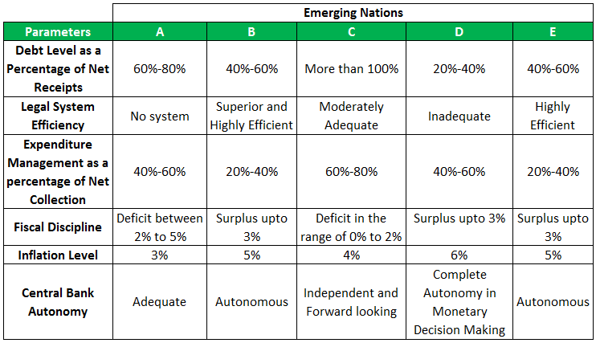

The global financial landscape offers myriad opportunities for investors seeking growth through international diversification. Cross-border investments can yield substantial returns, but they also come with a set of inherent challenges, primarily related to sovereign debt and sovereign risk. These risks arise from a nation's potential inability or unwillingness to meet its debt obligations, leading to financial instability that can ripple across global markets.

In recent years, algorithmic trading has become an essential tool for investors navigating these complex risks. By leveraging computer algorithms, traders can analyze vast amounts of market data swiftly and execute trades with precision. This technology not only reduces the chances of human error but also offers the capability to adjust strategies quickly in response to market fluctuations and emerging risks.



This article examines the critical intersection of country risk, sovereign debt, sovereign risk, and algorithmic trading. Each of these elements plays a pivotal role in shaping international investment strategies. By gaining a firm grasp of these concepts, investors can better strategize and optimize their portfolios, seizing opportunities while mitigating potential downsides in a multifaceted market environment.

## Table of Contents

## Understanding Country Risk

Country risk encompasses the potential financial losses that arise from instability within a foreign nation’s political, economic, or regulatory environment. This type of risk is a critical consideration for investors engaging in international finance, as it can significantly impact the returns on investments in foreign markets.

**Core Components of Country Risk**

1. **Political Risk**: This involves the likelihood of disruptions due to political changes or instability, such as coups, election-related violence, or abrupt policy shifts. The volatility in politics can translate into adverse effects on investment climate. Political risk can also include issues like corruption, government interventions, and civil unrest. These factors can impact property rights, contract enforceability, and repatriation of profits.

2. **Economic Instability**: Economic risk refers to potential financial losses due to economic mismanagement or downturns in a country's economy. Factors may include fluctuating exchange rates, inflation rates, and GDP growth. Economic policies that lead to high national debt or unfavorable balance of payments can deter foreign investments. Investors need to monitor economic indicators such as unemployment rates, fiscal deficits, and industrial outputs when assessing economic stability.

3. **Regulatory Shifts**: Changes in laws and regulations can pose significant risks for investors. This includes modifications in tax policies, trade barriers, foreign ownership laws, and currency controls. Regulatory changes may affect an investor's ability to operate smoothly, influencing profitability and long-term viability of investments.

**Evaluating Country Risk**

Investors utilize various tools to evaluate country risk comprehensively:

- **Political Risk Assessments**: Analytical reports that evaluate the likelihood of political disruptions. These assessments often encompass qualitative insights and quantitative ratings that predict the political stability of a nation.

- **Economic Indicators**: These include a variety of metrics that provide insights into the economic health of a country. Common indicators include inflation rates, interest rates, GDP growth, and current account balances. They help assess the economic environment's impact on investment potential.

Effectively managing country risk is paramount for making informed decisions in international finance. Investors need to balance the potential returns with the risks associated with entering or investing in foreign markets. Strategies to manage country risk may include diversifying investments geographically, purchasing political risk insurance, and employing hedging techniques to mitigate exposure to volatile markets.

By understanding the multifaceted nature of country risk and utilizing the appropriate evaluation tools, investors can strategically navigate the challenges of the global financial landscape, making informed decisions that align with their risk tolerance and investment objectives.

## The Dynamics of Sovereign Debt and Sovereign Risk

Sovereign debt is the financial obligation incurred by a country's government through borrowing from domestic or international lenders. This debt can be in the form of bonds, loans, or other financial instruments, and it is vital for facilitating government spending, infrastructure projects, and other public services. However, managing sovereign debt effectively involves careful consideration of sovereign risk—the risk associated with a government defaulting on its debt obligations.

Understanding sovereign debt involves two primary assessments: the ability and the willingness of a country to honor its debt commitments. The ability to repay hinges on the country's economic health, including GDP growth, fiscal balance, and foreign exchange reserves. A nation with robust economic fundamentals is more likely to meet its debt obligations. Conversely, a decline in these indicators can signal potential repayment difficulties.

The willingness to repay sovereign debt can be influenced by political factors, where a change in government or policy priorities might lead to diminished commitment to service debt. This willingness is also tied to the cost of servicing the debt relative to other governmental expenditures—higher costs might compel a government to prioritize other fiscal needs.

Historical events epitomize the consequences of elevated sovereign risk. The Greek debt crisis, which began in late 2009, serves as a notable example. Its origin was rooted in excessive borrowing, overestimated economic output, and failure to accurately report finances. The crisis caused significant turmoil in the Eurozone, impacting global financial markets and highlighting the interconnectedness of sovereign risk.

Analyzing sovereign risk entails a multipronged approach. Credit ratings provided by agencies like Standard & Poor's, Moody's, and Fitch offer a benchmark for evaluating sovereign creditworthiness, with ratings considering both quantitative and qualitative factors. Additionally, a country's political environment, institutional quality, and historical record of debt repayments are critical components of this analysis. Economic indicators—such as inflation rates, budget deficits, and current account balances—further inform investors about the financial health and stability of the nation's economy.

By understanding sovereign risk, investors can make more informed decisions regarding government debt securities. A comprehensive risk assessment allows investors to evaluate the trade-offs between potential returns and the likelihood of default. Proper analysis of both sovereign debt and risk provides investors with a clearer picture of the reliability of investing in government-backed financial instruments, thus aiding in constructing a resilient investment portfolio in the complex landscape of international finance. 

Overall, sovereign debt and sovereign risk remain pivotal areas of focus for investors seeking to mitigate risks while capitalizing on opportunities within the global financial system.

## Algorithmic Trading: A Modern Approach

Algorithmic trading has revolutionized the way financial markets operate by employing sophisticated algorithms to automate trading decisions. These algorithms are designed to process vast amounts of market data with remarkable speed and precision, identifying trends and opportunities that might be missed by human traders. This automation enhances both the efficiency and effectiveness of trading, as it allows for rapid execution of trades that capitalize on fleeting market conditions.

One of the significant advantages of [algorithmic trading](/wiki/algorithmic-trading) is its ability to minimize human error and psychological biases, which can be particularly detrimental in volatile markets. Human traders may succumb to emotional responses such as fear or greed, resulting in impulsive and suboptimal decisions. In contrast, algorithms execute trades based on predetermined criteria and logic, ensuring a disciplined and unbiased approach.

Several strategies are commonly implemented in algorithmic trading to optimize outcomes. For instance, moving averages strategy involves the utilization of averages calculated over varying time periods to identify potential trading signals. This approach helps smooth out price data, filtering out noise and highlighting the underlying trends. Another widely used strategy is mean reversion, which operates on the principle that asset prices tend to return to their historical averages over time. By identifying when a price deviates significantly from its mean, traders can capitalize on anticipated reversions.

Algorithmic trading also provides investors with competitive advantages in global markets. With the ability to analyze and act on market information across different regions and asset classes, algorithms can uncover opportunities that are not immediately apparent to individual traders. This capability is particularly beneficial in today's interconnected and fast-paced financial landscape, where cross-border and multi-asset considerations are becoming increasingly important.

Incorporating algorithmic trading into investment strategies enables market participants to process and respond to market dynamics with efficiency and accuracy. The competitive edge offered by this technology is grounded in its capacity to handle vast datasets, execute timely trades, and apply complex mathematical models in real-time. As a result, investors can better navigate the complexities of modern financial markets, leveraging technology to enhance their decision-making and improve overall trading performance.

## Integration of Country Risk Assessment and Algorithmic Trading

Integrating country risk assessment with algorithmic trading strategies provides a robust framework for international investing. By seamlessly combining the two, investors can better navigate complex financial landscapes. Algorithmic models have the capacity to adjust trading strategies based on real-time country risk evaluations. This adaptability enables investors to respond to volatile market conditions triggered by unprecedented political or economic events. 

Programming algorithms to automatically react to crucial economic indicators, such as GDP growth rates, inflation data, or changes in fiscal policy, enhances risk management in dynamic markets. Consider the following pseudo-Python code snippet that integrates a simple risk assessment model with an algorithmic trading strategy:

```python
import pandas as pd

def calculate_risk_score(economic_indicators):
    # Simplified risk scoring based on economic indicators
    risk_score = (economic_indicators['GDP_growth'] * 0.4 +
                  economic_indicators['inflation'] * 0.3 +
                  economic_indicators['unemployment_rate'] * 0.3)
    return risk_score

def trading_decision(risk_score, market_signal):
    if risk_score < 50 and market_signal == 'buy':
        return 'execute_trade'
    elif risk_score >= 50 and market_signal == 'sell':
        return 'hold_position'
    else:
        return 'reassess_strategy'

# Example data and signals
economic_indicators = {'GDP_growth': 3.0, 'inflation': 2.5, 'unemployment_rate': 5.0}
market_signal = 'buy'

risk_score = calculate_risk_score(economic_indicators)
decision = trading_decision(risk_score, market_signal)
print(decision)
```

The use of Python and other computational tools is instrumental in embedding sophisticated risk parameters within these models. Such tools allow for the efficient processing of data, enhancing the decision-making process. The automation and precision of algorithmic trading, coupled with real-time risk analysis, ensure a more balanced approach, optimizing trade execution while effectively mitigating exposure to diverse country-specific risks.

This integration not only supports making informed investment decisions but also balances the dual goals of maximizing returns and minimizing risks. By utilizing advanced methodologies, investors can maintain resilience and agility in response to ever-changing global financial landscapes.

## Challenges and Considerations

Integrating risk assessment and algorithmic trading, while beneficial, is fraught with various challenges that investors and financial institutions must address to ensure effectiveness and accuracy. 

One of the primary challenges is market [volatility](/wiki/volatility-trading-strategies), which can significantly impact algorithmic execution. Rapid and unpredictable market fluctuations can lead to discrepancies between expected and actual trading outcomes. Algorithms must, therefore, be designed with robust and adaptable strategies that can swiftly adjust to volatile conditions. For instance, incorporating techniques like volatility clustering or using stop-loss mechanisms can help mitigate potential disruptions.

Data quality is another crucial [factor](/wiki/factor-investing). Algorithms rely on precise and timely data to make informed trading decisions. Inaccuracies in data, whether due to outdated information or errors in market feeds, can lead to flawed trading strategies and financial losses. Ensuring high data integrity requires implementing rigorous validation processes and leveraging technologies like [machine learning](/wiki/machine-learning) to identify and rectify data anomalies.

Ethical considerations and regulatory compliance also play critical roles. As algorithmic trading becomes more prevalent, concerns regarding transparency, market manipulation, and fairness have emerged. Financial regulatory bodies, such as the U.S. Securities and Exchange Commission (SEC) and the European Securities and Markets Authority (ESMA), have instituted guidelines to govern algorithmic practices. Compliance with these regulations is essential to prevent legal repercussions and maintain market integrity.

Moreover, algorithms must be continually updated and improved to keep pace with evolving market conditions. Changes in economic indicators, geopolitical events, and technological advancements require traders to constantly refine and optimize their algorithms. This ongoing adaptation can be facilitated through continuous research and [backtesting](/wiki/backtesting), ensuring that the algorithms remain relevant and effective in achieving desired trading outcomes.

In conclusion, while the integration of risk assessment and algorithmic trading offers significant advantages, addressing these challenges is paramount. By implementing adaptable strategies, maintaining data quality, adhering to ethical standards, and regularly updating algorithms, investors can navigate the complexities of global markets more effectively.

## Conclusion

The combination of country risk analysis and algorithmic trading is essential to address the complexities of international finance. This integration equips investors with the tools necessary to remain agile and informed amidst a dynamic global financial environment. By harmonizing thorough risk assessments with sophisticated algorithmic strategies, investors can navigate volatile markets more effectively, making strategic decisions that optimize their portfolios in the face of uncertainty.

In advancing technologies and methodologies, investors gain the capability to achieve improved financial outcomes. The utilization of advanced algorithms allows for quick adaptation to shifts in economic indicators and market conditions, thus streamlining the decision-making process. For instance, algorithmic trading systems can be programmed to incorporate real-time country risk scores into their operations, enabling them to adjust automatically to changes in geopolitical or economic landscapes. Such an approach ensures that investment strategies are both responsive and resilient.

Moreover, the integration of country risk analysis with algorithmic trading serves as a cornerstone for responsible and effective international investing strategies. It provides a framework that not only enhances the potential for profit but also upholds ethical standards and regulatory compliance. As financial markets continue to evolve, maintaining a balance between risk analysis and algorithmic execution becomes increasingly vital. This balanced approach not only protects investments but also contributes positively to the stability and sustainability of the global financial system. 

The continuous development and refinement of these technologies and methodologies will be paramount in ensuring that investors can successfully manage the inherent risks and opportunities presented by international investing, ultimately contributing to more robust financial outcomes and the broader objective of sustainable and responsible investment practices.

## References & Further Reading

[1]: Reinhart, C. M., & Rogoff, K. S. (2009). ["This Time is Different: Eight Centuries of Financial Folly."](https://www.nber.org/system/files/working_papers/w13882/w13882.pdf) Princeton University Press.

[2]: Lopez de Prado, M. (2018). ["Advances in Financial Machine Learning."](https://www.amazon.com/Advances-Financial-Machine-Learning-Marcos/dp/1119482089) Wiley.

[3]: Chan, E. P. (2009). ["Quantitative Trading: How to Build Your Own Algorithmic Trading Business."](https://github.com/ftvision/quant_trading_echan_book) Wiley.

[4]: Jansen, S. (2020). ["Machine Learning for Algorithmic Trading: Second Edition."](https://github.com/stefan-jansen/machine-learning-for-trading) Packt Publishing.

[5]: Aronson, D. R. (2007). ["Evidence-Based Technical Analysis: Applying the Scientific Method and Statistical Inference to Trading Signals."](https://onlinelibrary.wiley.com/doi/book/10.1002/9781118268315) Wiley.

[6]: Hull, J. C. (2014). ["Options, Futures, and Other Derivatives."](https://www.semanticscholar.org/paper/Options%2C-Futures%2C-and-Other-Derivatives-Hull/89bdee500c8623864fc9eb7a471546aa713acc44) Pearson. 

[7]: Culp, C. L. (2002). ["The ART of Risk Management: Alternative Risk Transfer, Capital Structure, and the Convergence of Insurance and Capital Markets."](https://www.amazon.com/ART-Risk-Management-Alternative-Convergence/dp/0471124958) Wiley.