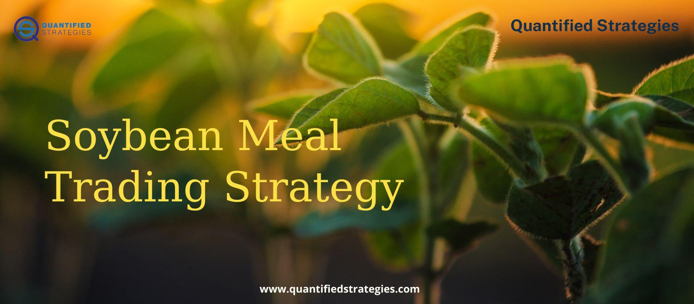

CBOT soybean meal futures play a pivotal role in the global commodities market, offering traders a tool to hedge against price fluctuations and speculate on future market trends. These futures contracts, traded on the Chicago Board of Trade (CBOT), are critical for stakeholders within the agricultural sector, providing a benchmark for pricing that impacts both local and international markets. The importance of soybean meal is underscored by its extensive use in the animal feed industry, serving as a primary protein source, which consequently influences its market demand and economic significance.

In recent years, algorithmic trading has emerged as a dominant strategy in financial markets, driven by advancements in technology and data processing capabilities. This method uses sophisticated algorithms to execute trades at high speeds, capitalizing on market inefficiencies that may not be identifiable through traditional trading methods. The integration of algorithmic trading strategies in the commodity futures market, particularly in trading soybean meal futures, presents the potential for enhanced trading efficiency and improved decision-making processes. These automated strategies historically offer benefits such as increased execution speed, improved accuracy in trade placement, and the ability to operate continuously across different time zones.



This article provides an overview of CBOT soybean meal futures, exploring their market significance and the dynamics influencing their valuation. It will further examine how algorithmic trading strategies can be effectively applied to these futures contracts and discuss the benefits and potential risks associated with this approach. The upcoming sections will cover topics such as the intricacies of soybean meal futures contracts, the role of various algorithmic trading strategies, and the challenges that traders may face in this dynamic market environment. Additionally, the potential transformative effects of technology on the agricultural commodities market will be highlighted, emphasizing the importance of continuous learning and adaptation to remain competitive in the evolving financial landscape.

## Table of Contents

## What are CBOT Soybean Meal Futures?

Soybean meal futures are financial contracts traded on the Chicago Board of Trade (CBOT), a part of the CME Group. These contracts serve as a tool for traders to speculate on or hedge against future prices of soybean meal, a crucial byproduct derived from soybeans. Soybean meal is extensively used in the livestock feed industry due to its high protein content, positioning it as a vital component of the global commodities market.

### Contract Specifications

CBOT soybean meal futures are standardized contracts, each representing a specific quantity of soybean meal—namely, 100 short tons. The price of these contracts is quoted in U.S. dollars per ton. The minimum price fluctuation, also known as the tick size, is $0.10 per ton, equating to a $10 movement per contract. The contracts are traded electronically on CME Globex with trading hours from Sunday to Friday, from 5:00 p.m. to 4:00 p.m. Central Time, with a one-hour break each day starting at 4:00 p.m.

### Significance in the Global Commodities Market

Soybean meal is a pivotal commodity due to its essential role in agriculture, especially in animal husbandry. The demand for livestock feed is directly influenced by patterns in meat consumption, primarily in rapidly developing economies where dietary habits are evolving. The prominent producers of soybeans—such as the United States, Brazil, and Argentina—have a substantial impact on the availability and pricing of soybean meal on the global market.

### Factors Driving Supply and Demand

Several factors influence the supply and demand dynamics of soybean meal. Key supply-side factors include:

- **Soybean Crop Yields**: Weather conditions affecting soybean production directly impact the availability of soybean meal.
- **Export Policies**: Tariffs, subsidies, and trade agreements between major producing and consuming countries can alter supply lines.

On the demand side, influences include:

- **Livestock Production Levels**: Increased livestock rearing raises the demand for high-quality feed, including soybean meal.
- **Economic Growth**: Rising incomes typically lead to higher meat consumption, thereby increasing demand for animal feed.

### Historical Performance and Volatility

Historically, soybean meal futures have exhibited significant price [volatility](/wiki/volatility-trading-strategies). Such fluctuations can be attributed to unpredictable factors like adverse weather conditions and geopolitical events impacting trade flows. Traders and market participants often analyze historical price data to identify patterns and make informed predictions. The inherent volatility of soybean meal futures presents both opportunities and risks, making them a popular choice for algorithmic traders seeking to capitalize on price movements through sophisticated models.

The integration of soybean meal futures into a diversified trading strategy can provide a hedge against inflation and other market fluctuations, underlining their importance within the broader commodities market.

## The Role of Algorithmic Trading

Algorithmic trading refers to the use of computer algorithms to execute trading strategies in financial markets. These algorithms autonomously analyze market data and make trading decisions based on pre-defined criteria. This approach has become increasingly prominent in the financial sector due to its ability to enhance trading efficiency and accuracy.

One of the primary advantages of [algorithmic trading](/wiki/algorithmic-trading) is its ability to process vast amounts of data at high speeds. Algorithms can quickly identify patterns and opportunities, allowing traders to exploit even the smallest market inefficiencies. This speed is crucial in high-frequency trading, where milliseconds can make a difference in profit and loss. Moreover, algorithmic trading enables round-the-clock operations, allowing traders to engage in markets across different time zones without human intervention, thus maximizing trading opportunities.

In the context of trading commodities like soybean meal futures, several types of algorithms are commonly used. Trend-following algorithms, for instance, aim to capitalize on [momentum](/wiki/momentum) by entering trades in the direction of the prevailing trend. Mean reversion algorithms, conversely, focus on identifying price levels where the asset is likely to reverse to its average value. Arbitrage algorithms exploit price differences between related financial instruments to achieve risk-free profits.

Algorithmic trading in soybean meal futures offers several benefits. It significantly enhances speed, enabling traders to capitalize on fleeting market conditions. Accuracy is another benefit, as algorithms reduce the potential for human errors caused by emotions or cognitive biases. Furthermore, automation enables 24/7 trading, ensuring that no opportunities are missed due to time zone constraints or human fatigue.

Numerous case studies highlight successful algorithmic trading strategies in the commodities market. For example, one case involved a high-frequency trading firm that used algorithms to trade various agricultural futures, including soybean meal. The firm's algorithms were designed to analyze real-time market data and execute trades within microseconds. By employing sophisticated statistical models and [machine learning](/wiki/machine-learning) techniques, the firm achieved significant gains, demonstrating the potential of algorithms to outperform traditional trading methods in commodities markets. 

The integration of algorithms in trading strategies represents a transformative shift in the commodities market, offering new opportunities for efficiency and profitability. With continuous advancements in technology and data analysis, algorithmic trading is poised to further revolutionize how soybean meal futures—and commodities as a whole—are traded.

## Developing Strategies for Soybean Meal Futures

Creating trading algorithms for CBOT soybean meal futures involves a multifaceted approach that incorporates both technical and [fundamental analysis](/wiki/fundamental-analysis). The integration of these analytical methods is crucial for constructing robust trading strategies that can respond to market dynamics effectively.

### Technical and Fundamental Analysis

Technical analysis in trading algorithms focuses on statistical trends gleaned from trading activity, such as price movement and [volume](/wiki/volume-trading-strategy). Techniques such as moving averages, relative strength index (RSI), and MACD are often employed to identify buy and sell signals. For soybean meal futures, understanding price patterns and indicators is essential to predict market direction and potential reversals.

Conversely, fundamental analysis examines economic factors affecting soybean meal prices. These factors include global soybean production, weather conditions, feed demand, and governmental agricultural policies. By understanding these fundamentals, traders can anticipate changes in supply and demand dynamics.

### The Role of Backtesting

Backtesting involves simulating a trading strategy using historical market data to evaluate its effectiveness. This process is critical in understanding how a strategy might have performed in the past, allowing for adjustments before deploying it live. In Python, libraries such as `Backtrader` or `zipline` can be employed for this purpose. An example code snippet for a simple moving average crossover strategy using `Backtrader` might look like this:

```python
import backtrader as bt

class SMACross(bt.SignalStrategy):
    def __init__(self):
        sma1 = bt.ind.SMA(period=10)
        sma2 = bt.ind.SMA(period=30)
        self.signal_add(bt.SIGNAL_LONG, bt.ind.CrossOver(sma1, sma2))

cerebro = bt.Cerebro()
cerebro.addstrategy(SMACross)

data = bt.feeds.GenericCSVData(dataname='soybean_meal.csv')
cerebro.adddata(data)

cerebro.run()
cerebro.plot()
```

### Risk Management and Position Sizing

Risk management in algorithmic trading addresses the potential financial loss inherent in trading decisions. Effective strategies will define a risk appetite and incorporate mechanisms to mitigate losses, such as stop-loss orders. Position sizing is a related concept that determines the amount of capital to allocate to each trade, based on risk tolerance and market conditions. A common approach is the Kelly Criterion, calculated as:

$$
f^* = \frac{bp - q}{b}
$$

where $f^*$ is the fraction of the portfolio to wager, $b$ is the odds received, $p$ is the probability of winning, and $q$ is the probability of losing.

### Factors in Strategy Development

Several factors should be considered when developing trading strategies for soybean meal futures:

1. **Market Volatility**: High volatility can create both opportunities and risks. Strategies must be adaptable to varying market conditions.
2. **Liquidity**: Ensuring that there is sufficient market liquidity is crucial for the execution of trades without significant price movement.
3. **Execution Costs**: An algorithm should account for transaction costs to ensure profitability net of expenses.
4. **Regulatory Environment**: Compliance with trading regulations safeguards against legal repercussions and trading halts.

Combining sophisticated algorithmic techniques with thorough analysis and robust risk management can enhance the potential for successful trading in soybean meal futures. Continuous strategy testing and adaptation to new data and market conditions will further refine these methodologies.

## Challenges and Risks in Algorithmic Futures Trading

Algorithmic trading of futures, such as CBOT soybean meal futures, presents various challenges and risks that traders must navigate to maintain profitability and compliance. Understanding these risks and implementing effective strategies to mitigate them is crucial.

### Potential Risks in Algorithmic Trading of Futures

#### Market Volatility

Market volatility is a significant risk [factor](/wiki/factor-investing) for algorithmic trading strategies. In volatile markets, price swings can be abrupt and sizable, potentially leading to large losses if algorithms are not appropriately calibrated. Algorithms based on historical data may fail to perform as expected under extreme market conditions. To combat this, traders often employ robust volatility measures such as the Average True Range (ATR) or Bollinger Bands to anticipate and adjust for market fluctuations. Additionally, employing market-neutral strategies, which aim to profit from relative price movements rather than directional moves, can mitigate the impact of volatility.

#### Data Management and Computational Resources

Efficient data management and computational resources are fundamental to successful algorithmic trading. High-frequency trading requires rapid data processing and decision-making. Challenges arise from the sheer volume of data and the need for real-time analysis. Inadequate data feeds or processing capabilities can lead to latency issues, where the algorithm's actions fall behind the market, causing missed opportunities or unintended trades. To address these challenges, implementing high-performance computing resources and reliable data feeds are essential. Utilizing cloud-based solutions or dedicated servers can ensure the necessary computational power and reduce latency.

#### Regulatory Considerations and Compliance

Algorithmic trading is subject to stringent regulatory oversight to prevent market abuse and ensure transparency. Traders must remain compliant with regulations such as the Dodd-Frank Act in the United States, which imposes requirements on algorithmic trading practices. Non-compliance can result in substantial fines and legal repercussions. Ensuring compliance involves maintaining accurate logs of trading activities, regular audits, and implementing compliance checks within algorithms. Developing algorithms that include built-in risk management controls can help traders adhere to regulatory standards.

### Solutions and Best Practices

To mitigate the risks associated with algorithmic trading, traders can adopt several practices:

1. **Backtesting and Stress Testing**: Rigorous backtesting of algorithms using historical data can identify potential weaknesses. Stress testing by simulating extreme market conditions can further ensure the resilience of strategies.

2. **Risk Management Systems**: Implementing automated risk management systems within algorithms can help control exposure. These systems can incorporate stop-loss orders, trailing stops, and position limits to minimize potential losses.

3. **Continuous Monitoring and Adaptation**: Active monitoring of algorithm performance allows for timely adjustments. Employing machine learning models can enable algorithms to learn from changing market conditions and adapt accordingly.

4. **Diversification**: Diversifying trading strategies and asset classes can reduce dependency on a single market movement, therefore spreading risk across different instruments and reducing overall exposure.

By understanding and addressing these challenges, traders can create robust algorithmic trading strategies that not only enhance performance but also maintain compliance and minimize risks. Embracing continuous innovation and technological advancements remains key to navigating the dynamic landscape of algorithmic futures trading.

## Conclusion

Trading soybean meal futures using algorithms offers significant advantages, yet it also presents several challenges that traders must navigate. The potential benefits primarily include enhanced trading efficiency, accuracy, and the capability to operate on a 24/7 basis. Algorithms can process vast amounts of market data swiftly, identify trading opportunities, and execute trades with minimal human intervention. This automated approach not only reduces emotional biases but also allows for the implementation of complex strategies that capitalize on minute price differences, thus maximizing profitability.

However, the rapidly evolving nature of markets necessitates continuous learning and adaptation. As market conditions change, so too must the algorithms that traders rely on. This dynamic environment requires traders to regularly update and refine their strategies, incorporating new research findings and market insights to maintain a competitive edge. Additionally, algorithms need to be robustly backtested and optimized, ensuring that they perform reliably under various market scenarios.

The exploration and testing of algorithmic strategies in commodity futures trading are essential for uncovering new opportunities and enhancing market understanding. By developing a thorough grasp of both technical and fundamental aspects, traders can craft strategies that are resilient to market fluctuations. Algorithmic trading's ability to process and react to complex data patterns opens prospects for innovative trading methodologies in agricultural commodities, such as soybean meal futures.

Looking forward, algorithmic trading is poised to play an increasingly pivotal role in the agricultural commodities market. Advances in technology, improved data analytics, and machine learning algorithms are likely to drive greater market participation and [liquidity](/wiki/liquidity-risk-premium). These developments promise to bring efficiency and transparency, enhancing the overall functioning of futures markets.

In conclusion, while algorithmic trading of soybean meal futures presents considerable challenges, particularly in terms of risk management, data integrity, and regulatory compliance, its benefits are compelling. The integration of technology in futures trading offers tremendous potential for profitability and innovation, encouraging market participants to continually explore and refine their strategies. As this landscape continues to evolve, the combination of human insight and algorithmic precision will be vital in shaping the future of trading in agricultural commodities.

## Frequently Asked Questions (FAQ)

**Frequently Asked Questions (FAQ)**

**1. What are CBOT soybean meal futures and why are they important?**

CBOT soybean meal futures are standardized contracts traded on the Chicago Board of Trade that represent an agreement to buy or sell soybean meal at a predetermined price and date in the future. They play a crucial role in the agricultural commodities market by providing liquidity and a means for price discovery, helping producers and consumers hedge against price volatility.

**2. How do I start with algorithmic trading in futures?**

To begin algorithmic trading in futures, follow these steps:

1. **Education**: Acquire a solid understanding of both financial markets and programming. Consider courses in finance, statistics, and programming languages like Python.

2. **Platform Selection**: Choose a trading platform that supports algorithmic trading. Platforms like MetaTrader, NinjaTrader, or Interactive Brokers offer APIs for algorithm development.

3. **Strategy Development**: Develop a strategy based on technical or fundamental analysis, and use backtesting to refine it.

4. **Risk Management**: Implement risk management techniques like stop-loss orders and position sizing to mitigate potential losses.

5. **Live Testing**: Start with a demo account before trading with real money to ensure your algorithm performs as expected.

**3. What are some common misconceptions about trading futures with algorithms?**

- **Misconception 1**: Algorithms guarantee profits. While algorithms can process data faster and more efficiently, they are not foolproof and can lead to losses, especially in volatile markets.

- **Misconception 2**: High frequency equals higher profits. While speed offers advantages, the quality of the trading strategy is paramount. Not all successful strategies rely on high-speed execution.

- **Misconception 3**: Algorithms eliminate the need for human oversight. Continuous monitoring is essential as algorithms can encounter unexpected scenarios or technical failures.

**4. Where can I find resources for further reading on soybean meal futures and algorithmic trading?**

For further reading, consider the following resources:

- **Books**: "Algorithmic Trading" by Ernie Chan and "Inside the Black Box" by Rishi K. Narang provide foundational knowledge of algorithmic trading.

- **Websites**: Investopedia and the CME Group offer articles and resources on futures trading.

- **Online Courses**: Platforms like Coursera, Udemy, and edX offer courses on algorithmic trading and financial markets.

**5. How can I get personalized advice on algorithmic trading and soybean meal futures?**

For personalized advice, consider reaching out to:

- **Financial Advisors**: Seek professionals who specialize in commodity futures.

- **Online Communities**: Engage with forums such as those on Reddit or LinkedIn dedicated to algorithmic trading.

- **Networking Events**: Attend industry conferences and webinars to connect with experts and traders.

By continuing your research and practice, you can develop a deeper understanding and effectiveness in trading soybean meal futures using algorithms.

## References & Further Reading

[1]: Chan, E. P. (2013). ["Algorithmic Trading: Winning Strategies and Their Rationale."](https://github.com/ftvision/quant_trading_echan_book) Wiley.

[2]: Narang, R. K. (2009). ["Inside the Black Box: A Simple Guide to Quantitative and High-Frequency Trading."](https://onlinelibrary.wiley.com/doi/book/10.1002/9781118267738) Wiley.

[3]: Jansen, S. (2018). ["Machine Learning for Algorithmic Trading: Second Edition."](https://github.com/PacktPublishing/Machine-Learning-for-Algorithmic-Trading-Second-Edition) Packt Publishing.

[4]: CME Group. ["Soybean Meal Futures."](https://www.cmegroup.com/markets/agriculture/oilseeds/soybean-meal.html)

[5]: Aronson, D. R., & Masters, T. (2007). ["Evidence-Based Technical Analysis: Applying the Scientific Method and Statistical Inference to Trading Signals."](https://onlinelibrary.wiley.com/doi/book/10.1002/9781118268315) Wiley.

[6]: Lopez de Prado, M. (2018). ["Advances in Financial Machine Learning."](https://www.amazon.com/Advances-Financial-Machine-Learning-Marcos/dp/1119482089) Wiley.