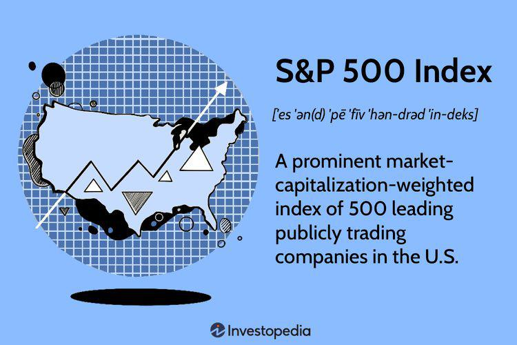

In the rapidly evolving world of finance, investors are continually seeking strategies that can yield higher returns with manageable risks. Recent trends have highlighted the prominence of the S&P 500 Buyback Index, which emerges as a compelling investment strategy by focusing on companies with the highest buyback ratios. This approach offers investors a unique avenue for growth by capitalizing on the financial health and confidence of companies that actively repurchase their own shares, thereby enhancing shareholder value and signaling strength to the market.

Complementing traditional methods, algorithmic trading (often referred to as algo trading) has become a crucial element in optimizing investment strategies. Algo trading allows for the automation of trading decisions based on a series of pre-defined criteria, reducing the influence of human error and emotions. It improves trade execution, reduces transaction costs, and facilitates the implementation of complex trading strategies at high speeds. By leveraging algorithms, investors can respond to market movements with increased agility and precision, significantly enhancing the potential for higher returns.



This article explores the potential of combining the S&P 500 Buyback Index with advanced algo trading techniques. Such a combination promises to harness the strengths of both strategies, offering a sophisticated approach to modern investment. For investors, this fusion holds the potential for unparalleled investment successes by blending the robustness of buyback-driven growth with the precision of algorithmic execution.

This discourse will embrace the intricacies of how these strategies can be integrated, providing insights for investors looking to navigate the complexities of the current financial landscape. We aim to illuminate the pathways that lead to superior investment outcomes through these innovative methodologies.

## Table of Contents

## Understanding the S&P 500 Buyback Index

The S&P 500 Buyback Index is designed to measure the performance of the top 100 stocks within the S&P 500 that exhibit the highest buyback ratios. This index is a direct reflection of companies actively engaging in stock repurchase programs, which can significantly impact both shareholder value and stock prices.

**Concept of Stock Buybacks**

Stock buybacks, or share repurchases, occur when a company buys back its own shares from the marketplace. This action reduces the number of outstanding shares, consequently increasing the ownership stake of remaining shareholders. From a financial perspective, buybacks can potentially enhance earnings per share (EPS) as the earnings of the company are distributed among fewer shares. This effect is particularly beneficial in capital markets where share price appreciation directly correlates with EPS growth.

The impact of stock buybacks on shareholder value is multifaceted. By reducing the supply of shares, buybacks can create upward pressure on stock prices. They also signal management's confidence in the intrinsic value of the firm, suggesting that the current market price undervalues the company. Additionally, buybacks can provide flexibility, allowing companies to return capital to shareholders without committing to a regular dividend increase.

**Comparison with the S&P 500 Index**

In comparison to the broader S&P 500 Index, which encompasses 500 companies from various sectors, the Buyback Index is more concentrated on firms actively returning capital to shareholders through buybacks. Historically, companies within the Buyback Index have often outperformed the broader market during bull phases as investor sentiment favors firms with shareholder-friendly policies like repurchases.

**Historical Analysis and Trends**

Analyzing historical data, firms with high buyback ratios have tended to outperform their peers in various market environments, particularly when interest rates are low and borrowing costs facilitate cheaper financing for such repurchases. Over the last decade, the prevalence of buybacks has surged, reflecting a broader trend amongst corporations to optimize capital allocation strategies towards shareholder returns rather than large scale expansion, especially in mature industries.

However, it's important to recognize that buyback-heavy firms can also experience greater [volatility](/wiki/volatility-trading-strategies) in economic downturns, as market conditions may impede their ability to finance buybacks, affecting their share prices negatively.

**Benefits and Risks Associated with the Buyback Index Strategy**

One of the primary benefits of the Buyback Index strategy is its focus on capital efficiency, promoting companies that judiciously allocate surplus capital back to their investors. This can be particularly attractive in investment portfolios seeking to maximize returns in capital-efficient markets.

However, the strategy is not without risks. High buyback ratios can sometimes mask underlying financial weaknesses, such as declining revenues, as companies may prefer financial engineering over operational performance improvements. Furthermore, relying heavily on buybacks could exacerbate financial leverage, particularly if funded through debt, thereby increasing the risk profile of such companies.

In conclusion, the S&P 500 Buyback Index offers investors a unique perspective into the performance of companies prioritizing shareholder returns. Despite the potential for enhanced returns, investors must carefully assess associated risks and market conditions when incorporating this index into their investment strategies.

## The Role of Algorithmic Trading in Modern Investment

Algorithmic trading, often referred to as algo trading, has significantly reshaped the finance industry by automating and optimizing trading decisions. Algo trading uses computer algorithms to execute a large number of trades at speeds and frequencies that human traders cannot match. This method has been transformative, allowing for quicker, more accurate trade execution while reducing the potential for human error.

Optimization of trade execution is one of the primary benefits of [algorithmic trading](/wiki/algorithmic-trading). Algorithms can scan markets and execute orders at the most advantageous times, capturing fleeting opportunities. This capability is critical in a market where milliseconds can determine the difference between a profitable and a losing trade. By capitalizing on such opportunities, algorithms can also reduce transaction costs by timing trades to avoid unfavorable market conditions and price slippage.

Moreover, algorithmic trading can mitigate manual errors, a significant source of financial loss in traditional trading. By relying on pre-set rules and criteria, this method reduces the likelihood of mistakes caused by human factors such as fatigue or emotional decision-making.

Several algorithms can enhance strategies involving the S&P 500 Buyback Index. For example, mean reversion algorithms assume that prices will revert to their average over time, an approach potentially beneficial for stocks with high buyback ratios that might temporarily deviate from historical performance. Meanwhile, [momentum](/wiki/momentum) algorithms, which invest in stocks showing an upward price trend, can be adapted to track buyback activities that signal bullish markets sentiments.

The integration of [machine learning](/wiki/machine-learning) (ML) and [artificial intelligence](/wiki/ai-artificial-intelligence) (AI) in algo trading has further elevated its capabilities. Machine learning algorithms can analyze vast datasets to detect hidden market patterns and predict future price movements, thereby facilitating more informed trading decisions. AI-driven systems can adapt to new data, continuously refining their strategies and improving their performance over time.

However, the widespread adoption of high-frequency and algorithmic trading raises several risks and ethical considerations. High-frequency trading ([HFT](/wiki/high-frequency-trading-strategies)), which relies on executing numerous trades at extremely high speeds, can lead to market volatility and flash crashes, as evidenced in incidents such as the 2010 Flash Crash. Additionally, the competitive advantage these technologies offer can lead to an uneven playing field, where only those with resources to invest in sophisticated technologies can thrive.

Ethically, algorithm developers and traders must ensure their systems comply with market regulations and do not engage in manipulative practices such as spoofing, which involves placing buy or sell orders with the intent to cancel them before execution to manipulate prices.

In summary, algorithmic trading represents a significant advancement in the efficiency and effectiveness of trading strategies. While its benefits are substantial, it requires careful management to mitigate associated risks and ethical concerns. As technology continues to evolve, its role in investment strategies will likely grow, offering further improvements in performance and accessibility.

## Synergizing Buyback Index and Algo Trading

Integrating the S&P 500 Buyback Index with algorithmic trading techniques offers a promising avenue for investors seeking enhanced returns. This synergy leverages the strengths of both strategies, aiming to optimize investment performance through precision and efficiency.

One approach to integrate these strategies is by developing algorithms that can identify optimal entry and [exit](/wiki/exit-strategy) points in buyback-heavy stocks. These algorithms can be designed to assess market conditions, stock volatility, and buyback announcements to predict price movements. For example, an algorithm could be programmed to execute trades automatically when a company's buyback activity reaches a specific threshold, aiming to capitalize on expected price increases.

Real-world case studies highlight the potential success of combining the S&P 500 Buyback Index with algorithmic trading. For instance, a quantitative investment firm implemented a strategy that monitored buyback activities across the index. By deploying machine learning models to identify patterns and predict price fluctuations, the firm reportedly achieved superior returns compared to traditional buy-and-hold strategies.

However, implementing these synergized strategies is not without challenges. One common pitfall is the risk of overfitting, where algorithms are excessively tailored to historical data, potentially reducing their effectiveness in new market conditions. To mitigate this, it is essential to employ robust [backtesting](/wiki/backtesting) techniques that include diverse market scenarios. A systematic approach to backtesting might involve the use of rolling windows or walk-forward optimization, ensuring that the algorithms are resilient to various market conditions.

Future innovations hold significant promise for enhancing this strategic combination. Advances in artificial intelligence, particularly in natural language processing, could enable algorithms to analyze news and social media sentiment, providing deeper insights into market perceptions of company buybacks. Additionally, enhancements in cloud computing and data processing capabilities could further refine the speed and accuracy of algorithmic trading.

In summary, the fusion of the S&P 500 Buyback Index with algorithmic trading techniques presents a compelling strategy for investors. By carefully designing algorithms, leveraging historical performance data, and staying attuned to technological advancements, investors can potentially unlock superior investment returns while navigating the complexities of modern financial markets.

## Crafting Your Optimal Investment Strategy

Creating a personalized investment strategy that leverages the S&P 500 Buyback Index and algorithmic trading requires a nuanced approach tailored to your unique financial situation. Key considerations include individual risk tolerance, specific investment objectives, continuous education to keep pace with market changes, and the effective use of professional resources and tools.

### Aligning Strategy with Risk Tolerance and Investment Goals

The alignment of your investment strategy with your risk tolerance and investment goals is paramount. Risk tolerance refers to the degree of variability in investment returns you are willing to withstand. Investors with a high-risk tolerance may allocate more resources to stocks within the Buyback Index, seeking potentially higher returns. Conversely, a low-risk tolerance might lead to a more conservative approach, possibly including diversification strategies to mitigate risk.

Investment goals should be precise, measurable, and time-bound. For instance, if your objective is to achieve a 7% annual return over ten years to fund retirement, your strategy should reflect this target, utilizing back-tested data and historical performance metrics of buyback-heavy stocks to predict potential outcomes.

### Key Performance Metrics

To track and evaluate the success of your strategy, employing robust performance metrics is essential. Common metrics include:

- **Return on Investment (ROI)**: Calculated as $(\text{Ending Value} - \text{Beginning Value}) / \text{Beginning Value} \times 100$.
- **Volatility**: Measured as the standard deviation of returns, it provides insight into the risk associated with your investment.
- **Sharpe Ratio**: Indicates risk-adjusted returns and is calculated as $(\text{Return} - \text{Risk-Free Rate}) / \text{Volatility}$.
- **Alpha and Beta**: Represent the performance of an investment compared to a benchmark index, where alpha indicates excess returns and beta measures market-related risks.

Monitoring these metrics enables investors to make informed adjustments to their strategy over time.

### Continuous Learning and Adapting

The financial markets are dynamic, and successful investors prioritize continuous learning. This involves staying updated on emerging trends in buyback strategies, developments in algorithmic trading, and changes in market conditions. Online courses, financial seminars, and investment forums can provide valuable insights.

Additionally, coding skills in Python or C++ can be greatly beneficial for those interested in custom algo trading strategies. An example of a simple algorithmic trading script in Python might look like:

```python
import pandas as pd
import numpy as np

def simple_moving_average_strategy(data, window=20):
    data['SMA'] = data['Close'].rolling(window=window).mean()
    buy_signals = np.where(data['Close'] < data['SMA'], 1, 0)
    sell_signals = np.where(data['Close'] > data['SMA'], -1, 0)

    data['Signal'] = buy_signals + sell_signals
    return data

stock_data = pd.DataFrame(...) # Load your historical stock data here
strategy_data = simple_moving_average_strategy(stock_data)
print(strategy_data)
```

### Utilizing Professional Advice and Tools

Incorporating professional advice into your investment strategy can provide a significant edge. Financial advisors, consultancy services, and trading platforms offer valuable guidance and tools that can enhance decision-making. These resources often provide access to sophisticated trading algorithms, market analyses, and portfolio management tools that might be beyond individual capabilities.

Combining the insights of financial experts with the analytical power of algorithmic trading tools helps in crafting a resilient strategy capable of navigating the complexities of modern financial markets. 

In conclusion, crafting an optimal investment strategy is a continuous, adaptive process that benefits from a clear understanding of personal goals and market dynamics. Leveraging advanced technologies and professional resources can significantly enhance the prospects of achieving desired financial outcomes.

## Conclusion

The S&P 500 Buyback Index stands as a pivotal element in contemporary investment strategies, offering a focused approach by emphasizing the stocks of companies actively engaging in buybacks. This index provides insight into firms that return value to shareholders by repurchasing their own shares, potentially enhancing shareholder value and boosting stock performance. This targeted strategy can lead to a higher return on investment, distinguishing the Buyback Index as a valuable tool for modern investors.

Algorithmic trading significantly enhances the effectiveness of investment strategies like the S&P 500 Buyback Index. By utilizing advanced computational techniques, algo trading optimizes trade execution, reduces costs, and minimizes manual errors, resulting in more efficient and profitable trades. The inclusion of machine learning and artificial intelligence further refines these algorithms, offering predictive insights and rapid adaptation to market shifts. As such, the transformative potential of algorithmic trading cannot be overstated in its ability to elevate the performance of buyback index-focused strategies.

Investors are encouraged to explore this synergy between the S&P 500 Buyback Index and algorithmic trading techniques. This combination offers a dynamic approach to capturing market opportunities, potentially leading to superior investment outcomes. However, succeeding in this venture requires ongoing vigilance and adaptation, given the fast-paced and ever-changing nature of the financial world.

Staying informed about emerging trends and leveraging new technologies are crucial for achieving sustained success. Investors must remain proactive, continuously learning and adjusting strategies to align with current market conditions and innovations in trading technology. By doing so, they position themselves to capitalize on future opportunities and enhance their investment portfolios effectively.

## References & Further Reading

[1]: ["The Handbook of Equity Market Anomalies: Translating Market Inefficiencies into Effective Investment Strategies"](https://www.amazon.com/Handbook-Equity-Market-Anomalies-Inefficiencies/dp/0470905905) by Leonard Zacks

[2]: ["Security Analysis"](https://www.wallstreetmojo.com/security-analysis/) by Benjamin Graham and David L. Dodd

[3]: ["Principles of Corporate Finance"](https://en.wikipedia.org/wiki/Principles_of_Corporate_Finance) by Richard A. Brealey, Stewart C. Myers, and Franklin Allen

[4]: Jegadeesh, N., & Titman, S. (1993). ["Returns to Buying Winners and Selling Losers: Implications for Stock Market Efficiency."](https://www.jstor.org/stable/2328882) The Journal of Finance, 48(1), 65-91.

[5]: ["Algorithmic Trading: Winning Strategies and Their Rationale"](https://www.amazon.com/Algorithmic-Trading-Winning-Strategies-Rationale-ebook/dp/B00CY5HC0U) by Ernest P. Chan