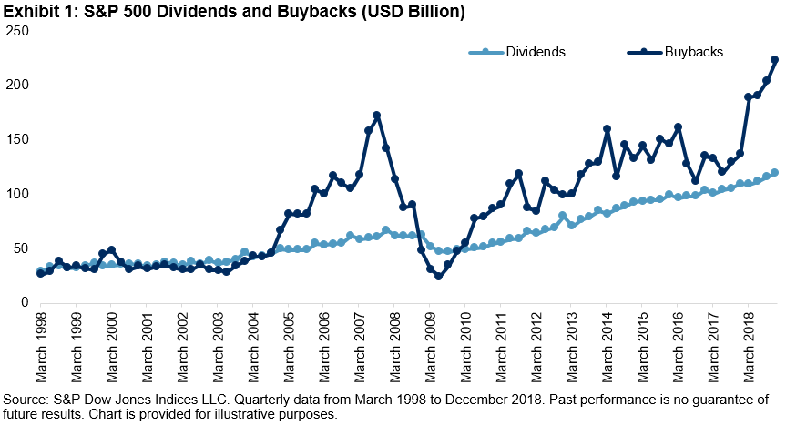

## Table of Contents

## What is the S&P 500 Buyback Index?

The S&P 500 Buyback Index is a special index that tracks the performance of companies in the S&P 500 that buy back their own shares. When a company buys back its shares, it means they are using their money to buy their own stock from the market. This can make the remaining shares more valuable because there are fewer shares available.

This index helps investors see how well companies that buy back their shares are doing compared to the whole S&P 500. It's useful for people who want to invest in companies that are actively buying back their shares, as it can show if this strategy is working well for those companies.

## How does the S&P 500 Buyback Index differ from the standard S&P 500 Index?

The S&P 500 Buyback Index and the standard S&P 500 Index both include companies from the S&P 500, but they focus on different things. The standard S&P 500 Index tracks the overall performance of 500 large companies in the U.S. It gives a broad picture of how the biggest companies in the country are doing. On the other hand, the S&P 500 Buyback Index only includes companies from the S&P 500 that are buying back their own shares. This means it focuses on a specific group of companies that are using their money to buy their own stock.

The main difference is in what they measure. The standard S&P 500 Index is a general indicator of the market's health, showing how the economy is doing overall. The S&P 500 Buyback Index, however, is more specialized. It helps investors see how well companies that buy back their shares are performing compared to the whole market. This can be useful for people who want to invest in companies that are actively buying back their shares, as it can show if this strategy is working well for those companies.

## What is the purpose of a buyback in the context of the S&P 500?

A buyback in the context of the S&P 500 happens when a company uses its money to buy its own shares from the stock market. This is done for a few reasons. One reason is to increase the value of the remaining shares. When a company buys back its shares, there are fewer shares available in the market. This can make each share more valuable because the company's earnings are now spread over fewer shares.

Another reason for a buyback is to show that the company believes its stock is undervalued. By buying back its shares, the company signals to investors that it thinks the stock price is too low and that it's a good investment. This can boost investor confidence and sometimes lead to a rise in the stock price. The S&P 500 Buyback Index tracks companies in the S&P 500 that do this, helping investors see how well these companies are doing compared to the broader market.

## How are companies selected for inclusion in the S&P 500 Buyback Index?

Companies are picked for the S&P 500 Buyback Index based on how much they buy back their own shares. The index looks at the S&P 500 companies and chooses the ones that have bought back the most shares over the past year. This is measured by something called the "buyback ratio," which is the total value of shares bought back divided by the company's market value.

The index is updated every quarter to make sure it always includes the companies that are doing the most buybacks. If a company stops buying back a lot of shares, it might be taken out of the index, and a new company that is buying back more shares might be added. This way, the index stays focused on the companies that are actively using this strategy.

## What are the criteria used to measure buyback activity for the index?

The S&P 500 Buyback Index uses a specific measure called the "buyback ratio" to decide which companies to include. This ratio is calculated by taking the total value of shares a company bought back over the past year and dividing it by the company's market value. The companies with the highest buyback ratios are chosen for the index. This way, the index focuses on companies that are actively buying back their own shares.

The index is updated every three months to make sure it always includes the companies doing the most buybacks. If a company's buyback activity drops, it might be removed from the index. At the same time, a new company that has started buying back a lot of shares might be added. This regular update keeps the index current and focused on the companies using the buyback strategy the most.

## How often is the S&P 500 Buyback Index rebalanced?

The S&P 500 Buyback Index is rebalanced every three months. This means that every quarter, the index is updated to make sure it includes the companies that are doing the most buybacks.

During this rebalancing, companies that have been buying back a lot of their shares over the past year are chosen for the index. If a company stops buying back as many shares, it might be taken out, and a new company that has started buying back more shares might be added. This keeps the index focused on the companies that are actively using the buyback strategy.

## What are the historical performance trends of the S&P 500 Buyback Index?

The S&P 500 Buyback Index has generally done well over time, often beating the regular S&P 500 Index. When companies buy back their shares, it can make their stock prices go up because there are fewer shares available. This has helped the Buyback Index perform better than the overall market in many years. For example, in some years, the Buyback Index has had higher returns than the S&P 500, showing that buying back shares can be a good strategy for companies.

However, the performance of the Buyback Index can change a lot from year to year. Sometimes, it does better than the S&P 500, and other times, it doesn't. This can depend on how the economy is doing and how well the companies in the index are doing. Even though the Buyback Index has had good years, it's not always a sure thing. Investors need to look at the bigger picture and think about how buying back shares fits into their overall investment plan.

## How does the S&P 500 Buyback Index correlate with overall market performance?

The S&P 500 Buyback Index often moves in the same direction as the overall market, but it can sometimes do better. This is because when the market goes up, companies usually have more money to buy back their shares. Buying back shares can make the remaining shares more valuable, which can help the Buyback Index do better than the regular S&P 500. But, the Buyback Index can also go up more than the market when companies are buying back a lot of shares.

Even though the Buyback Index often follows the market, it can be different at times. If the market is not doing well, companies might not buy back as many shares, and the Buyback Index might not do as well as the overall market. So, while the Buyback Index can be a good way to see how companies doing buybacks are doing, it's important to remember that it's still connected to what's happening in the whole market.

## What are the potential benefits of investing in the S&P 500 Buyback Index?

Investing in the S&P 500 Buyback Index can give you some good benefits. One big benefit is that companies that buy back their shares often see their stock prices go up. When a company buys back its shares, there are fewer shares left in the market. This can make each share more valuable because the company's earnings are spread over fewer shares. So, if you invest in the Buyback Index, you might see higher returns than if you just invested in the regular S&P 500.

Another benefit is that the Buyback Index can show you which companies are confident about their future. When a company buys back its shares, it's often a sign that the company thinks its stock is a good deal and that it expects to do well in the future. This can be a good signal for investors. Plus, the Buyback Index is updated every three months to make sure it always includes the companies that are buying back the most shares, which can help you stay on top of which companies are doing this strategy well.

## What are the risks associated with the S&P 500 Buyback Index?

Investing in the S&P 500 Buyback Index can have some risks. One risk is that the performance of the index can be up and down. Even though it often does better than the regular S&P 500, it doesn't always do well. If the market goes down, companies might not buy back as many shares, and the Buyback Index might not do as well as the overall market. This means your investment could lose value if the market takes a turn for the worse.

Another risk is that focusing only on companies that buy back shares might not be the best strategy for everyone. Sometimes, companies buy back shares when they don't have better ways to use their money, like investing in new projects or paying down debt. If a company is buying back shares for the wrong reasons, it might not be a good investment. So, it's important to look at the bigger picture and not just focus on buybacks when deciding where to put your money.

## How can investors gain exposure to the S&P 500 Buyback Index?

Investors can gain exposure to the S&P 500 Buyback Index by buying exchange-traded funds (ETFs) or mutual funds that track this index. These funds are designed to follow the performance of the companies in the S&P 500 that are buying back their own shares. By investing in these funds, you can easily get the benefits of the Buyback Index without having to pick individual stocks yourself.

Another way to get exposure is through financial products like options or futures that are based on the S&P 500 Buyback Index. These are more complex and usually used by experienced investors who want to bet on the future performance of the index. No matter which method you choose, it's important to understand the risks and rewards of investing in the Buyback Index and how it fits into your overall investment plan.

## What advanced strategies can be used to optimize returns from the S&P 500 Buyback Index?

One advanced strategy to optimize returns from the S&P 500 Buyback Index is to use dollar-cost averaging. This means you invest a fixed amount of money into the index at regular intervals, like every month. By doing this, you buy more shares when the price is low and fewer shares when the price is high. Over time, this can help you get a better average price for your shares and might lead to higher returns.

Another strategy is to use options to hedge your investments. Options are contracts that give you the right to buy or sell shares at a certain price in the future. If you think the market might go down, you can buy put options on the S&P 500 Buyback Index. This can help protect your investment if the index goes down, but it also costs money to buy the options. So, you need to think about the cost and how much protection you want.

A third strategy is to look at the companies in the index and see if any are buying back shares for the right reasons. Some companies might buy back shares because they think their stock is undervalued and they have a good future ahead. Others might do it because they don't have better ways to use their money. By understanding why companies are buying back shares, you can pick the ones that are more likely to do well and adjust your investments in the index accordingly.

## References & Further Reading

[1]: ["The Handbook of Equity Market Anomalies: Translating Market Inefficiencies into Effective Investment Strategies"](https://www.amazon.com/Handbook-Equity-Market-Anomalies-Inefficiencies/dp/0470905905) by Leonard Zacks

[2]: ["Security Analysis"](https://www.wallstreetmojo.com/security-analysis/) by Benjamin Graham and David L. Dodd

[3]: ["Principles of Corporate Finance"](https://en.wikipedia.org/wiki/Principles_of_Corporate_Finance) by Richard A. Brealey, Stewart C. Myers, and Franklin Allen

[4]: Jegadeesh, N., & Titman, S. (1993). ["Returns to Buying Winners and Selling Losers: Implications for Stock Market Efficiency."](https://www.jstor.org/stable/2328882) The Journal of Finance, 48(1), 65-91.

[5]: ["Algorithmic Trading: Winning Strategies and Their Rationale"](https://www.amazon.com/Algorithmic-Trading-Winning-Strategies-Rationale-ebook/dp/B00CY5HC0U) by Ernest P. Chan