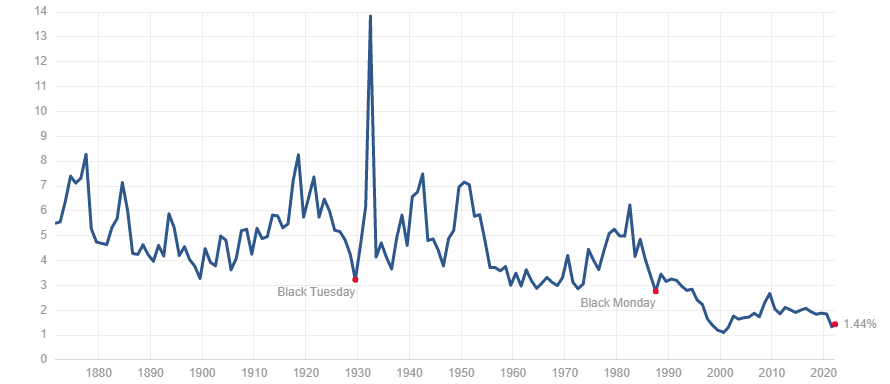

## Table of Contents

## What is the S&P 500?

The S&P 500 is a stock market index that measures the performance of 500 large companies listed on stock exchanges in the United States. It is considered a good indicator of how the overall U.S. stock market is doing because it includes companies from many different industries. People often use the S&P 500 to see if the market is going up or down and to compare their own investments.

The index is maintained by a company called Standard & Poor's, which is why it's called the S&P 500. The companies in the index are chosen based on their market size, liquidity, and industry representation. When you invest in a fund that tracks the S&P 500, you're essentially investing in a little bit of all those 500 companies. This can be a good way to spread out your risk because if one company does poorly, the others might do well and balance it out.

## What does dividend yield mean?

Dividend yield is a way to measure how much money you get back from a company just for owning its stock. It's like a percentage that shows how much of the stock's price you get as a dividend every year. If a stock costs $100 and the company pays a $5 dividend each year, the dividend yield would be 5%. That means for every $100 you spend on the stock, you get $5 back each year.

Dividend yield can help you see which stocks might give you more money back compared to others. If you're looking for income from your investments, you might pick stocks with higher dividend yields. But remember, a high dividend yield isn't always better. Sometimes it can mean the stock price has gone down a lot, or the company might not be able to keep paying those dividends in the future. So, it's important to look at the whole picture before deciding.

## How is the dividend yield of the S&P 500 calculated?

The dividend yield of the S&P 500 is calculated by taking the total dividends paid by all the companies in the index over a year and dividing that by the total value of the index. This gives you the average dividend yield across all the companies in the S&P 500. So, if the total dividends paid by the companies in the S&P 500 in a year are $500 billion and the total value of the index is $25 trillion, the dividend yield would be 2% ($500 billion divided by $25 trillion).

This number can change from year to year because the dividends companies pay can go up or down, and the value of the S&P 500 can also change. It's a useful number because it helps investors see how much income they might get from investing in the S&P 500. But remember, the dividend yield is just one part of the picture. You also need to think about how the value of the stocks might go up or down over time.

## Why is the dividend yield of the S&P 500 important for investors?

The dividend yield of the S&P 500 is important for investors because it tells them how much money they can expect to get back from their investment just for holding onto the stocks. If the dividend yield is high, it means investors can earn more money without selling their stocks. This is especially useful for people who want to live off the income from their investments, like retirees. They can use the dividends to pay for their everyday needs.

But the dividend yield is not the only thing investors should look at. It's also important to think about how the value of the stocks in the S&P 500 might change over time. Sometimes, a high dividend yield can mean that the stock prices have gone down a lot, which might be a sign of trouble for the companies. So, investors need to look at the whole picture, including the dividend yield and the potential for the stocks to grow in value, to make smart choices about where to put their money.

## What has been the average dividend yield of the S&P 500 over the past decade?

Over the past decade, the average dividend yield of the S&P 500 has been around 2%. This number can change from year to year, but over the long term, it has stayed pretty steady. The dividend yield is important because it shows how much money investors can get back just for holding onto the stocks in the S&P 500.

There are a lot of things that can affect the dividend yield, like how well companies are doing and what's happening in the economy. Sometimes, if the economy is doing really well, companies might pay more dividends, which could make the yield go up. Other times, if the economy is not doing so well, the yield might go down. But over the past 10 years, the average has been around 2%, which gives investors a good idea of what to expect.

## How does the current S&P 500 dividend yield compare to historical averages?

The current dividend yield of the S&P 500 is a bit lower than its historical average. Over the last few years, it has been around 1.5% to 2%, which is less than the long-term average of about 2% to 3% over the past several decades. This means that right now, investors are getting a bit less money back from their investments in the S&P 500 compared to what they used to get.

There are a few reasons why the dividend yield might be lower now. One big reason is that stock prices have gone up a lot over the past few years, which makes the yield go down because the yield is calculated as a percentage of the stock price. Also, some companies have been choosing to use their money to buy back their own stocks instead of paying out more dividends. But even though the current yield is lower, the S&P 500 can still be a good choice for investors who want a mix of income and growth.

## What factors influence changes in the S&P 500 dividend yield?

Several things can make the S&P 500 dividend yield go up or down. One big factor is the price of the stocks in the index. If the stock prices go up a lot, the dividend yield goes down because the yield is calculated as a percentage of the stock price. If the stock prices go down, the yield goes up. Another factor is how much money companies are making. If companies are doing well and making more money, they might decide to pay more dividends, which would make the yield go up. If they're not doing so well, they might pay less, making the yield go down.

Another thing that can change the dividend yield is what companies decide to do with their money. Sometimes, companies choose to use their money to buy back their own stocks instead of paying dividends. This can make the dividend yield go down. Also, the overall economy can play a role. If the economy is doing great, companies might feel more comfortable paying out more dividends. But if the economy is struggling, they might cut back on dividends to save money, which would lower the yield. So, the dividend yield of the S&P 500 can change because of a mix of stock prices, company profits, what companies decide to do with their money, and what's happening in the economy.

## How do sector compositions affect the S&P 500's dividend yield?

The kinds of companies in the S&P 500 can change how much money investors get back as dividends. Some sectors, like utilities and consumer staples, usually pay out more dividends because they make steady money and want to give some of it back to their shareholders. So, if there are a lot of companies from these sectors in the S&P 500, the overall dividend yield might be higher. On the other hand, sectors like technology and healthcare often pay less in dividends because they might use their money to grow their businesses instead. If there are more companies from these sectors in the index, the dividend yield might be lower.

Changes in which sectors are doing well can also affect the S&P 500's dividend yield. For example, if tech companies start doing really well and their stock prices go up a lot, they might take up a bigger part of the index. Since tech companies usually pay less in dividends, this could make the overall dividend yield go down. On the flip side, if sectors that pay higher dividends, like energy or utilities, become a bigger part of the index, the dividend yield could go up. So, the mix of sectors in the S&P 500 plays a big role in deciding how much money investors get back as dividends.

## Can you provide a graph showing the S&P 500 dividend yield over the last 50 years?

Here is a simple explanation of how the S&P 500 dividend yield has changed over the last 50 years. Imagine a graph that shows the dividend yield from 1974 to 2024. At the start, in the 1970s, the dividend yield was pretty high, around 4% to 5%. This was because the economy was going through some tough times, and stock prices were not as high as they are now. As time went on, the yield started to go down. By the 1980s and 1990s, it was around 3% to 4%. This happened because the economy got better, and stock prices went up.

From the 2000s to now, the dividend yield has been even lower, usually between 1.5% and 2.5%. There were some ups and downs, like during the financial crisis in 2008 when the yield went up a bit because stock prices fell. But overall, the trend has been for the yield to go down. This is because companies have been using more of their money to buy back their own stocks instead of paying dividends, and stock prices have been going up a lot. So, if you look at the graph, you'll see a line that starts high and slowly goes down over the years, showing how the dividend yield has changed over the last 50 years.

## How do economic cycles impact the S&P 500 dividend yield?

Economic cycles can really change the S&P 500 dividend yield. When the economy is doing well and growing, companies usually make more money. They might decide to pay more dividends to their shareholders, which can make the dividend yield go up. But at the same time, when the economy is good, stock prices often go up too. This can make the dividend yield go down because the yield is calculated as a percentage of the stock price. So, during good economic times, the dividend yield might not go up as much as you might think because stock prices are also going up.

On the other hand, when the economy is not doing so well, like during a recession, companies might make less money. They might cut back on dividends to save money, which would make the dividend yield go down. But if stock prices also go down during a recession, the dividend yield might actually go up because the same amount of dividends now makes up a bigger percentage of a lower stock price. So, economic cycles can push the dividend yield in different directions depending on what companies do with their dividends and how stock prices change.

## What are the implications of a high vs. low S&P 500 dividend yield for future market performance?

A high S&P 500 dividend yield can mean different things for the future of the market. If the yield is high because companies are paying more dividends, it might be a good sign. It could mean that companies are doing well and making more money, which could be good for the market. But if the yield is high because stock prices have gone down a lot, it might not be so good. It could mean that the market is worried about something and people are selling their stocks, which could lead to a tough time ahead for the market.

On the other hand, a low S&P 500 dividend yield might also have different meanings. If it's low because stock prices have gone up a lot, it could mean that investors are feeling good about the future and are buying more stocks. This could be a sign that the market might keep doing well. But if the yield is low because companies are paying less in dividends, it might mean that companies are not making as much money or are choosing to use their money in other ways, like buying back their own stocks. This could be a warning sign that the market might not do as well in the future. So, it's important to look at why the dividend yield is high or low to understand what it might mean for the market.

## How do international indices' dividend yields compare to the S&P 500's?

The S&P 500's dividend yield is often compared to other big stock market indices around the world. Right now, the S&P 500's dividend yield is around 1.5% to 2%. This is lower than some other indices. For example, the FTSE 100 in the UK has a higher dividend yield, usually around 3% to 4%. This is because many companies in the FTSE 100, like those in the energy and mining sectors, pay out more dividends to their shareholders. In Europe, the Euro Stoxx 50 also has a higher yield, often around 2.5% to 3.5%. These higher yields can make these indices more attractive to investors who are looking for income from their investments.

In Asia, the dividend yields can be different too. The Nikkei 225 in Japan has a lower yield, similar to the S&P 500, usually around 1.5% to 2%. This is because many Japanese companies focus on growing their businesses instead of paying out dividends. On the other hand, the Hang Seng Index in Hong Kong has a higher yield, often around 2.5% to 3.5%. This is because many companies in Hong Kong, especially in sectors like real estate and utilities, pay out more dividends. So, when you compare the S&P 500's dividend yield to other international indices, you can see that it's on the lower side, but each index has its own reasons for why its yield is high or low.

## What is the S&P 500 Dividend Yield and how can it be understood?

The S&P 500 Index serves as a pivotal benchmark for large-cap equities within the United States, comprising a wide array of companies, many of which regularly distribute dividends to shareholders. The dividend yield is a critical metric used by investors to assess the income-generating potential of these investments. It is calculated by taking the total annual dividends paid by a company and dividing them by its current share price. Mathematically, this can be expressed as:

$$
\text{Dividend Yield} = \left( \frac{\text{Annual Dividends per Share}}{\text{Price per Share}} \right) \times 100
$$

This formula provides a percentage that represents how much income an investor can expect in relation to the amount they have invested in the stock.

Throughout its history, the dividend yields of the S&P 500 have exhibited significant fluctuation. These variations are often driven by shifts in economic conditions and changes in market dynamics. For instance, during economic downturns, companies may reduce dividend payouts to conserve cash, leading to lower yields. Conversely, in a robust economic environment, companies might increase dividends, resulting in higher yields for investors.

In recent years, the dividend yields observed in the S&P 500 have fallen below historical averages. This decline has sparked discussions about potential trajectories of these yields in the future. Some attributing factors include changes in corporate payout strategies and the increasing prevalence of high-growth technology companies, which traditionally offer lower or no dividends. This shift has altered investor expectations and required a reevaluation of traditional dividend investment strategies.

Despite the recent trend of lower yields, the S&P 500 continues to attract dividend-focused investors. This is largely due to the index's composition, which includes a diverse array of large, well-established companies with a history of paying dividends. These companies offer stability and a potential for income, making the S&P 500 an appealing choice for those seeking to generate returns through dividends.

In conclusion, understanding the dynamics of the S&P 500 dividend yield is vital for investors aiming to optimize their portfolios. By analyzing historical yield trends and considering current economic factors, investors can better assess the income potential of their investments within the S&P 500. This analysis remains an essential part of forming a comprehensive investment strategy.

## References & Further Reading

[1]: Siegel, J. J. (1998). ["Stocks for the Long Run: The Definitive Guide to Financial Market Returns & Long-Term Investment Strategies."](https://archive.org/details/stocksforlongrun0000sieg_o4p9) McGraw-Hill.

[2]: ["The Little Book of Common Sense Investing: The Only Way to Guarantee Your Fair Share of Stock Market Returns"](https://www.amazon.com/Little-Book-Common-Sense-Investing/dp/1119404509) by John C. Bogle

[3]: Bodie, Z., Kane, A., & Marcus, A. J. (2014). ["Investments"](https://www.mheducation.com/highered/product/Investments-Bodie.html) (10th ed.). McGraw-Hill Education.

[4]: ["Quantitative Momentum: A Practitioner's Guide to Building a Momentum-Based Stock Selection System"](https://books.google.com/books/about/Quantitative_Momentum.html?id=K2npCgAAQBAJ) by Wesley R. Gray & Jack R. Vogel

[5]: Black, F., & Scholes, M. (1973). ["The Pricing of Options and Corporate Liabilities."](https://www.cs.princeton.edu/courses/archive/fall09/cos323/papers/black_scholes73.pdf) Journal of Political Economy, 81(3), 637-654.

[6]: ["Artificial Intelligence in Finance: A Review"](https://link.springer.com/article/10.1007/s43546-023-00618-x) by Martin Seward

[7]: ["High-Frequency Trading: A Practical Guide to Algorithmic Strategies and Trading Systems"](https://www.ahmetbeyefendi.com/wp-content/uploads/2020/07/High-Frequency-Trading-Irene-Aldridge.pdf) by Irene Aldridge