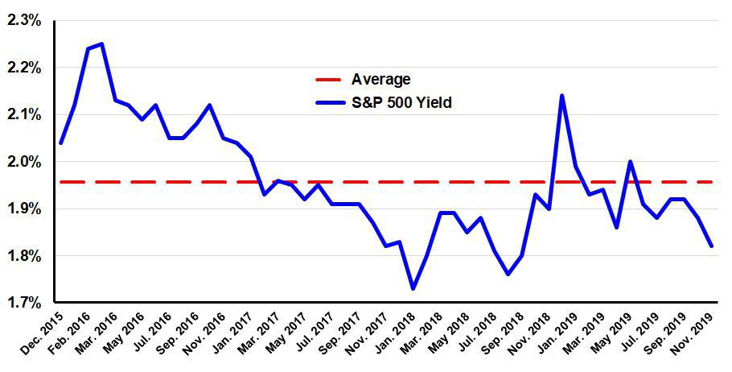

The S&P 500, a critical measure of the U.S. equity market, has long served as a benchmark for investors assessing financial performance and opportunities. This article intends to explore the intricate ties between the S&P 500's financial history, its dividend yield dynamics, and the burgeoning influence of algorithmic trading in contemporary investment practices. By understanding the evolving patterns of the S&P 500's dividend yields, investors can gain valuable insights to optimize their portfolios, balancing risk and potential returns effectively.

Dividend yield, a key indicator of an investment's income-generating potential, is calculated by dividing the annual dividends paid per share by the stock's current price. Historically, the S&P 500's dividend yields have exhibited variability, shaped by economic changes and market developments. These trends offer a foundation for analyzing future possibilities, helping investors navigate through periods of both high and low yield environments.



In recent years, algorithmic trading, commonly referred to as algo trading, has established itself as a formidable approach within the financial landscape. This method employs sophisticated algorithms to exploit market inefficiencies, including those related to dividend yields. As algo trading continues to gain traction, it presents a data-driven strategy for investors eager to refine their approach and potentially enhance their portfolio's performance.

This article will specifically focus on the evolution of S&P 500 dividend yields over time, assessing the implications for both traditional and algorithmic investors. It will consider various influencing factors, ranging from economic alterations to technological progressions, which have played substantial roles in shaping the dividend yield landscape. Through this examination, investors can acquire a comprehensive understanding of the dynamics at play, enabling them to make informed decisions in an increasingly complex market environment.

## Table of Contents

## Understanding the S&P 500 Dividend Yield

The S&P 500 Index serves as a pivotal benchmark for large-cap equities within the United States, comprising a wide array of companies, many of which regularly distribute dividends to shareholders. The dividend yield is a critical metric used by investors to assess the income-generating potential of these investments. It is calculated by taking the total annual dividends paid by a company and dividing them by its current share price. Mathematically, this can be expressed as:

$$
\text{Dividend Yield} = \left( \frac{\text{Annual Dividends per Share}}{\text{Price per Share}} \right) \times 100
$$

This formula provides a percentage that represents how much income an investor can expect in relation to the amount they have invested in the stock.

Throughout its history, the dividend yields of the S&P 500 have exhibited significant fluctuation. These variations are often driven by shifts in economic conditions and changes in market dynamics. For instance, during economic downturns, companies may reduce dividend payouts to conserve cash, leading to lower yields. Conversely, in a robust economic environment, companies might increase dividends, resulting in higher yields for investors.

In recent years, the dividend yields observed in the S&P 500 have fallen below historical averages. This decline has sparked discussions about potential trajectories of these yields in the future. Some attributing factors include changes in corporate payout strategies and the increasing prevalence of high-growth technology companies, which traditionally offer lower or no dividends. This shift has altered investor expectations and required a reevaluation of traditional dividend investment strategies.

Despite the recent trend of lower yields, the S&P 500 continues to attract dividend-focused investors. This is largely due to the index's composition, which includes a diverse array of large, well-established companies with a history of paying dividends. These companies offer stability and a potential for income, making the S&P 500 an appealing choice for those seeking to generate returns through dividends.

In conclusion, understanding the dynamics of the S&P 500 dividend yield is vital for investors aiming to optimize their portfolios. By analyzing historical yield trends and considering current economic factors, investors can better assess the income potential of their investments within the S&P 500. This analysis remains an essential part of forming a comprehensive investment strategy.

## Historical Trends in S&P 500 Dividend Yields

The historical dividend yields of the S&P 500 offer a lens through which to observe broader economic conditions over time. Since 1871, these yields have experienced significant fluctuations, shaped by a variety of factors.

Before the 1990s, the dividend yields of the S&P 500 typically hovered above 3%, sometimes even exceeding 5%. This pattern reflected an economic environment where companies prioritized regular dividend payouts, providing investors with a stable income stream. During this period, industries such as utilities and manufacturing, which consistently generated surplus cash, dominated the index, allowing for robust dividend distributions.

The 1990s marked a noticeable shift. Several factors combined to reduce dividend yields significantly below their historical averages. One key influence was monetary policy, as lower interest rates encouraged a focus on capital gains over income through dividends. Companies favored reinvesting earnings into growth ventures rather than returning them to shareholders as dividends. For example, during the dot-com boom, companies invested heavily in expanding their businesses, reducing the cash available for dividends.

Moreover, the rise of technology and Internet companies, characterized by their lower dividend payouts, changed the yield landscape. These companies, including major tech firms like Microsoft and Apple, have traditionally preferred reinvesting profits into research, development, and expansion rather than paying dividends. As these technology giants became a more substantial part of the S&P 500, the average dividend yield naturally declined.

Understanding these historical shifts is crucial for investors. For instance, while lower yields may seem less attractive, they often coincide with periods of significant capital growth in companies investing in innovation and expansion. Thus, investors need to reevaluate strategies, considering not just the immediate income from dividends but also potential long-term gains through capital appreciation. Historical patterns underscore the importance of a diversified investment approach, factoring in both current yields and future growth potential.

In summary, the evolution of S&P 500 dividend yields reflects a complex interplay of economic policies, market dynamics, and shifts in corporate strategies. These trends highlight the necessity for investors to adapt strategies in response to changing economic landscapes, particularly given today's era of lower average yields.

## The Role of Algorithmic Trading in Dividend Yield Strategies

Algorithmic trading has revolutionized the way investors engage with the stock market, particularly in crafting and executing dividend yield strategies. By leveraging complex algorithms, this trading approach automates the execution of buy and sell orders in the market, allowing traders to respond swiftly to market movements and identify lucrative opportunities in dividend stocks. 

At its core, [algorithmic trading](/wiki/algorithmic-trading) relies heavily on data analysis, processing vast amounts of information in real-time to pinpoint optimal entry and [exit](/wiki/exit-strategy) points for dividend stocks. This capability arises from sophisticated mathematical models and quantitative analysis techniques, enabling traders to react to even the minutest of market shifts. For instance, an algorithm might be designed to capitalize on seasonal variations in dividend payouts, buying shares just before dividend distribution dates and selling afterwards to benefit from price adjustments.

Risk mitigation is another fundamental advantage offered by algorithmic trading. Algorithms can swiftly execute trades with precision, reducing the likelihood of human error and emotional decision-making, which are typical in traditional trading. Moreover, by continuously analyzing market data, they can exploit market anomalies and inefficiencies, such as under- or overvaluations in dividend stocks, thus potentially enhancing returns.

With a noticeable decline in yields from traditional assets, algorithmic trading strategies have emerged as a significant supplement to conventional dividend investing. These strategies are particularly adept at managing diversified portfolios, ensuring that investors maintain an optimal risk-return balance even in a low-yield environment. Algorithmic trading's adaptability is further bolstered by the integration of [artificial intelligence](/wiki/ai-artificial-intelligence) (AI) and [machine learning](/wiki/machine-learning) technologies. These advancements allow trading systems to learn from historical data and improve their performance over time. For example, machine learning algorithms can identify patterns in stock behavior preceding dividend payouts, adjusting trading strategies dynamically to maximize gains.

The efficiency of algorithmic trading can also be illustrated through a simple Python example that simulates a trading strategy for dividend stocks. This code might involve setting thresholds for trading based on historical price and dividend data, identifying stocks that typically exhibit a price surge post-dividend announcement.

```python
import pandas as pd
import numpy as np

# Load historical dividend data
data = pd.read_csv('dividend_data.csv')
data['Date'] = pd.to_datetime(data['Date'])
data.set_index('Date', inplace=True)

# Simple moving average strategy
short_window = 40
long_window = 100

# Create trading signals
data['Short_MA'] = data['Price'].rolling(window=short_window, min_periods=1).mean()
data['Long_MA'] = data['Price'].rolling(window=long_window, min_periods=1).mean()
data['Signal'] = 0
data['Signal'][short_window:] = np.where(data['Short_MA'][short_window:] > data['Long_MA'][short_window:], 1, 0)   

# Generate trading orders
data['Position'] = data['Signal'].diff()

# Print positions to be taken
print(data.loc[data['Position'] == 1, ['Price', 'Short_MA', 'Long_MA']])
```

This script provides a simplistic framework for deciding when to buy stocks based on moving average crossovers, a common algorithmic trading strategy. Such techniques can be refined further to include dividend-specific criteria, enhancing their effectiveness for yield-oriented investments. Consequently, the merger of algorithmic trading with dividend investment strategies offers a robust approach to navigating today's complex financial markets.

## Key Factors Affecting Dividend Yields and Trading

The decline in S&P 500 dividend yields can be primarily attributed to several key factors, including aggressive monetary policies, technological advancements, and shifts in corporate payout policies.

One of the most significant influences comes from the [interest rate](/wiki/interest-rate-trading-strategies) policies implemented by the Federal Reserve. These policies play a crucial role in determining not only the dividend decisions made by companies but also how stocks are priced. When interest rates are low, as they have been in recent years, the cost of borrowing for companies decreases, allowing more capital to be reinvested into growth opportunities instead of being distributed as dividends. This scenario often leads to lower dividend yields across the market. Additionally, lower interest rates make dividend-paying stocks less attractive in comparison to other investment vehicles, potentially reducing demand and further impacting yields.

The growing prominence of the tech sector in the S&P 500 has also had a considerable effect on average dividend yields. Technology companies often prioritize reinvestment in innovation and growth over distributing profits to shareholders. This approach is evident in major tech firms, which may offer low or even zero dividend payouts. As these firms have gained significant weight in the S&P 500, they have contributed to the overall reduction in average dividend yields.

In addition to these sectoral changes, broader macroeconomic factors such as economic growth and inflation have a direct impact on dividend yields. In periods of strong economic growth, companies might retain earnings to finance expansion rather than increasing dividends. Conversely, high inflation can erode the purchasing power of dividends, making them less attractive if they do not increase at a commensurate rate. These macro conditions influence not only the yields themselves but also trading strategies. Investors might shift their focus from dividend income to capital gains, depending on the economic climate.

Investors must consider these elements carefully to navigate the dynamic market and enhance trade outcomes. A comprehensive understanding of how interest rates, sectoral shifts, and macroeconomic factors interplay can help investors to strategically position their portfolios. Embracing technology-driven approaches, such as algorithmic trading, could be a beneficial strategy in adapting to these evolving market conditions. Such strategies can optimize investment decisions by analyzing data more efficiently and effectively than traditional methods, providing a potential edge amid shifting dividend landscapes.

## Conclusion: Strategic Takeaways for Investors

Understanding the historical context of S&P 500 dividend yields and effectively integrating algorithmic trading strategies might provide a significant competitive advantage for investors. Over time, the S&P 500's dividend yields have experienced notable shifts due to various economic dynamics and pressures, compelling investors to constantly adapt their strategies to maximize returns.

Despite the trend of declining yields, particularly evident in recent years, the landscape presents opportunities for innovative, technology-driven investment methodologies. Leveraging algorithmic trading can uncover inefficiencies in the market, allowing investors to capitalize on dividend opportunities that might otherwise go unnoticed. Algorithms can process large volumes of data and identify profitable trading signals with greater speed and accuracy than traditional methods.

Furthermore, it's crucial for investors to assess the impact of broader economic policies, such as interest rates, inflation, and technological advancements, which play vital roles in shaping dividend strategies. The Federal Reserve's monetary policy and technological shifts can significantly impact corporate payout decisions, hence influencing dividend yield strategies.

A hybrid investment approach that effectively combines traditional dividend investing techniques with algorithmically-driven methodologies holds potential for optimal yields. This strategy can marry the stability and historical perspective of classical methods with the efficiency and data-driven insights of modern algorithmic trading.

In such a rapidly evolving financial landscape, continuous market assessment and adaptability are key. Investors should remain vigilant to market changes and be ready to adjust their strategies accordingly. This adaptability allows them to leverage dividend yield benefits effectively, optimizing their investment portfolios despite the challenges posed by lower average yields. By embracing both historical insights and technological advancements, investors can strategically position themselves to navigate current and future market conditions successfully.

## References & Further Reading

[1]: Siegel, J. J. (1998). ["Stocks for the Long Run: The Definitive Guide to Financial Market Returns & Long-Term Investment Strategies."](https://archive.org/details/stocksforlongrun0000sieg_o4p9) McGraw-Hill.

[2]: ["The Little Book of Common Sense Investing: The Only Way to Guarantee Your Fair Share of Stock Market Returns"](https://www.amazon.com/Little-Book-Common-Sense-Investing/dp/1119404509) by John C. Bogle

[3]: Bodie, Z., Kane, A., & Marcus, A. J. (2014). ["Investments"](https://www.mheducation.com/highered/product/Investments-Bodie.html) (10th ed.). McGraw-Hill Education.

[4]: ["Quantitative Momentum: A Practitioner's Guide to Building a Momentum-Based Stock Selection System"](https://books.google.com/books/about/Quantitative_Momentum.html?id=K2npCgAAQBAJ) by Wesley R. Gray & Jack R. Vogel

[5]: Black, F., & Scholes, M. (1973). ["The Pricing of Options and Corporate Liabilities."](https://www.cs.princeton.edu/courses/archive/fall09/cos323/papers/black_scholes73.pdf) Journal of Political Economy, 81(3), 637-654.

[6]: ["Artificial Intelligence in Finance: A Review"](https://link.springer.com/article/10.1007/s43546-023-00618-x) by Martin Seward

[7]: ["High-Frequency Trading: A Practical Guide to Algorithmic Strategies and Trading Systems"](https://www.ahmetbeyefendi.com/wp-content/uploads/2020/07/High-Frequency-Trading-Irene-Aldridge.pdf) by Irene Aldridge