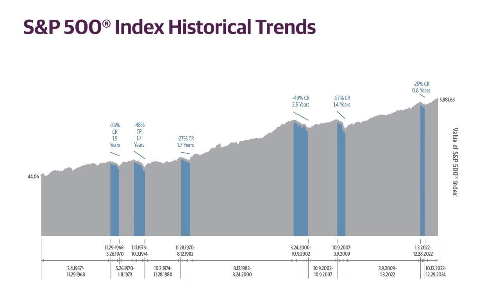

## Table of Contents

## What is the S&P 500 Growth Index?

The S&P 500 Growth Index is a part of the broader S&P 500, which is a stock market index that measures the stock performance of 500 large companies listed on stock exchanges in the United States. The Growth Index specifically focuses on companies within the S&P 500 that are expected to grow at an above-average rate compared to other companies. These companies are selected based on certain financial metrics like sales growth, earnings growth, and momentum in their stock price.

The index is used by investors who want to invest in companies that have strong potential for future growth. By tracking the S&P 500 Growth Index, investors can get an idea of how well growth-oriented companies are doing in the market. This can help them make decisions about where to put their money to potentially earn higher returns. The index is also used as a benchmark to compare the performance of growth-focused investment funds and portfolios.

## How does the S&P 500 Growth Index differ from the S&P 500?

The S&P 500 is a big group of 500 large companies in the United States. It shows how well these companies are doing in the stock market. The S&P 500 Growth Index is a smaller group made up of only some of these 500 companies. The companies in the Growth Index are chosen because they are expected to grow faster than others. They look at things like how fast the company's sales and earnings are growing, and how their stock price is moving.

The main difference is that the S&P 500 includes all kinds of companies, both those that are growing fast and those that are not. The S&P 500 Growth Index, on the other hand, only includes the companies that are expected to grow a lot. This makes the Growth Index a good choice for people who want to invest in companies that might make more money in the future because they are growing quickly.

## What criteria are used to select companies for the S&P 500 Growth Index?

The S&P 500 Growth Index picks companies based on three main things: how fast their sales are growing, how fast their earnings are growing, and how their stock price is moving. These are called growth factors. The index looks at all the companies in the S&P 500 and chooses the ones that score high on these growth factors. This means the companies in the Growth Index are expected to do better than average in the future.

The index uses a special way to figure out which companies are growing the most. It gives each company a score based on their sales growth, earnings growth, and stock price [momentum](/wiki/momentum). Companies with the highest scores make it into the Growth Index. This helps investors find companies that are likely to keep growing and make more money over time.

## How is the performance of the S&P 500 Growth Index measured?

The performance of the S&P 500 Growth Index is measured by looking at how the stock prices of the companies in the index change over time. If the stock prices go up, the index goes up, and if the stock prices go down, the index goes down. This helps investors see how well the companies that are expected to grow are doing in the market.

The index is also compared to other indexes, like the S&P 500, to see if the growth companies are doing better or worse than the average company. If the S&P 500 Growth Index is going up more than the S&P 500, it means that the growth companies are doing better than the average. This helps investors decide if they want to put their money into growth companies or other types of companies.

## What are the historical returns of the S&P 500 Growth Index?

The S&P 500 Growth Index has done well over the years, but its returns can change a lot from year to year. Over the last 20 years, up to 2023, the index has had an average yearly return of about 10%. This means that if you had put $100 into the index 20 years ago, it would be worth around $600 today, not counting any fees or taxes. But, some years the index did much better, and some years it did worse. For example, in really good years, it might go up by 30% or more, and in bad years, it might go down by 20% or more.

Looking at longer periods, like 10 years, the S&P 500 Growth Index has often done better than the regular S&P 500. This is because the companies in the Growth Index are picked for their fast growth, so they can sometimes grow faster than the average company in the S&P 500. But, because these companies are growing fast, they can also be riskier. So, while the Growth Index might give you higher returns, it can also go down more in bad times. It's important to remember that past returns don't tell you what will happen in the future, but they can give you an idea of how the index has done over time.

## How can investors gain exposure to the S&P 500 Growth Index?

Investors can gain exposure to the S&P 500 Growth Index by buying exchange-traded funds (ETFs) or mutual funds that track this index. These funds are designed to mimic the performance of the S&P 500 Growth Index, so when the index goes up, the value of the fund goes up too. You can buy these funds through a brokerage account, which is like an online bank account for buying and selling investments. Some popular ETFs that track the S&P 500 Growth Index include the iShares S&P 500 Growth [ETF](/wiki/etf-trading-strategies) and the SPDR Portfolio S&P 500 Growth ETF.

Another way to get exposure to the S&P 500 Growth Index is by investing directly in the individual stocks that make up the index. This means you would buy shares of the companies that are in the S&P 500 Growth Index. This can be more work because you have to pick and choose which companies to buy, but it can also give you more control over your investments. You would still need a brokerage account to buy these stocks, and you might want to do some research to figure out which companies in the index you think will do the best.

## What are the risks associated with investing in the S&P 500 Growth Index?

Investing in the S&P 500 Growth Index can be risky because it focuses on companies that are expected to grow fast. These companies can be more affected by changes in the economy. For example, if the economy slows down, growth companies might see their profits drop more than other companies. This means the value of the S&P 500 Growth Index could go down a lot during tough economic times. Also, because these companies are growing fast, they might be more expensive to buy, which could mean less room for their stock prices to go up even more.

Another risk is that the S&P 500 Growth Index might not always do better than the regular S&P 500. Sometimes, the companies in the Growth Index might not grow as fast as expected, or other types of companies might do better. This can lead to the Growth Index underperforming compared to the broader market. It's important for investors to remember that even though the index has done well in the past, there's no guarantee it will keep doing well in the future. So, it's a good idea to think about how much risk you're okay with before you invest in the S&P 500 Growth Index.

## How does the S&P 500 Growth Index rebalance and reconstitute its holdings?

The S&P 500 Growth Index rebalances and reconstitutes its holdings twice a year, in June and December. Rebalancing means the index checks the weight of each company in the index and adjusts it to make sure it matches the index's rules. For example, if one company's stock price has gone up a lot, it might take up too much of the index, so the index will sell some of that company's stock and buy more of other companies to keep things balanced. Reconstitution is when the index looks at all the companies in the S&P 500 and decides which ones should be in the Growth Index based on their growth scores. If a company's growth score has changed a lot, it might be added to or removed from the index.

During the reconstitution process, the index uses the same three growth factors—sales growth, earnings growth, and momentum—to pick the companies. If a company has a high growth score, it gets added to the index, and if its score is low, it might get taken out. This helps make sure the index always has the companies that are expected to grow the fastest. Both rebalancing and reconstitution are important to keep the S&P 500 Growth Index up to date and focused on growth companies.

## What role does the S&P 500 Growth Index play in portfolio diversification?

The S&P 500 Growth Index can help with portfolio diversification by giving investors a way to focus on companies that are growing fast. When you invest in different types of companies, you spread out your risk. The S&P 500 Growth Index is made up of companies that are expected to grow more than others, so adding it to your portfolio can balance out investments in slower-growing or more stable companies. This can help your overall investments do better if the growth companies do well.

But, it's important to know that the S&P 500 Growth Index can also make your portfolio riskier. Because it focuses on fast-growing companies, it might go up and down more than the regular S&P 500. So, while it can help diversify your portfolio, it's a good idea to mix it with other types of investments, like value stocks or bonds, to keep your risk level in check. This way, you can have a mix of different investments that can help protect your money and possibly make it grow.

## How does the S&P 500 Growth Index compare to other growth indices?

The S&P 500 Growth Index is one of many growth indices out there, but it's special because it focuses on the biggest and most well-known companies in the U.S. that are expected to grow fast. Other growth indices, like the Russell 1000 Growth Index, also look at big companies but might include different ones based on their own rules for what makes a company a "growth" company. The S&P 500 Growth Index uses three main things to pick its companies: how fast their sales are growing, how fast their earnings are growing, and how their stock price is moving. Other indices might use different ways to decide which companies to include, so the companies in the S&P 500 Growth Index might not be the same as those in other growth indices.

Another growth index to compare with is the NASDAQ-100 Growth Index. This index focuses on technology and internet companies, which are often seen as growth companies. The NASDAQ-100 Growth Index might have more tech companies than the S&P 500 Growth Index, which looks at a wider range of industries. Because of this, the NASDAQ-100 Growth Index might go up and down more than the S&P 500 Growth Index, depending on how the tech sector is doing. So, while both indices aim to track growth companies, they might perform differently based on the types of companies they include and the sectors they focus on.

## What are the sector weightings within the S&P 500 Growth Index?

The S&P 500 Growth Index has different amounts of money put into different types of businesses, called sectors. The biggest part of the index is usually in the technology sector. This means that a lot of the companies in the index are tech companies, like those that make computers, software, or internet services. The next biggest part is often the health care sector, with companies that make medicines or medical equipment. These two sectors together make up a big part of the index because they are seen as areas where companies can grow a lot.

Other sectors in the S&P 500 Growth Index include consumer discretionary, which are companies that sell things people want but don't need, like clothes or cars, and communication services, which include companies like phone and internet providers. There are also smaller amounts in sectors like industrials, which are companies that make things like airplanes or heavy machinery, and financials, which include banks and insurance companies. The exact amounts in each sector can change over time as the index is updated to keep focusing on the companies that are growing the fastest.

## How do macroeconomic factors influence the performance of the S&P 500 Growth Index?

Macroeconomic factors, like the overall health of the economy, interest rates, and inflation, can have a big impact on how the S&P 500 Growth Index does. When the economy is doing well, people and businesses have more money to spend, which can help the companies in the Growth Index grow even faster. This is because these companies often need money to invest in new projects or expand their business. Also, when interest rates are low, it's cheaper for these companies to borrow money, which can help them grow even more. But, if the economy is not doing well, or if interest rates go up, it can be harder for these companies to grow, and the value of the Growth Index might go down.

Inflation is another big [factor](/wiki/factor-investing). When prices are going up a lot, it can make it harder for companies to keep growing because their costs go up too. This can hurt the companies in the Growth Index, especially if they can't raise their prices to match the higher costs. Also, if people think inflation will keep going up, they might want to put their money into things that will protect them from inflation, like bonds, instead of stocks. This can make the stock prices of the companies in the Growth Index go down. So, keeping an eye on these big economic factors can help investors understand why the S&P 500 Growth Index is doing well or not so well.

## References & Further Reading

[1]: ["S&P 500® Growth Index Methodology"](https://www.spglobal.com/spdji/en/indices/equity/sp-500-growth/) - S&P Dow Jones Indices.

[2]: ["Advances in Financial Machine Learning"](https://www.amazon.com/Advances-Financial-Machine-Learning-Marcos/dp/1119482089) by Marcos Lopez de Prado.

[3]: Chan, E. P. (2008). ["Quantitative Trading: How to Build Your Own Algorithmic Trading Business"](https://github.com/ftvision/quant_trading_echan_book). Wiley.

[4]: Jansen, S. (2020). ["Machine Learning for Algorithmic Trading"](https://github.com/stefan-jansen/machine-learning-for-trading).

[5]: Aronson, D. R. (2006). ["Evidence-Based Technical Analysis: Applying the Scientific Method and Statistical Inference to Trading Signals"](https://www.amazon.com/Evidence-Based-Technical-Analysis-Scientific-Statistical/dp/0470008741). Wiley.