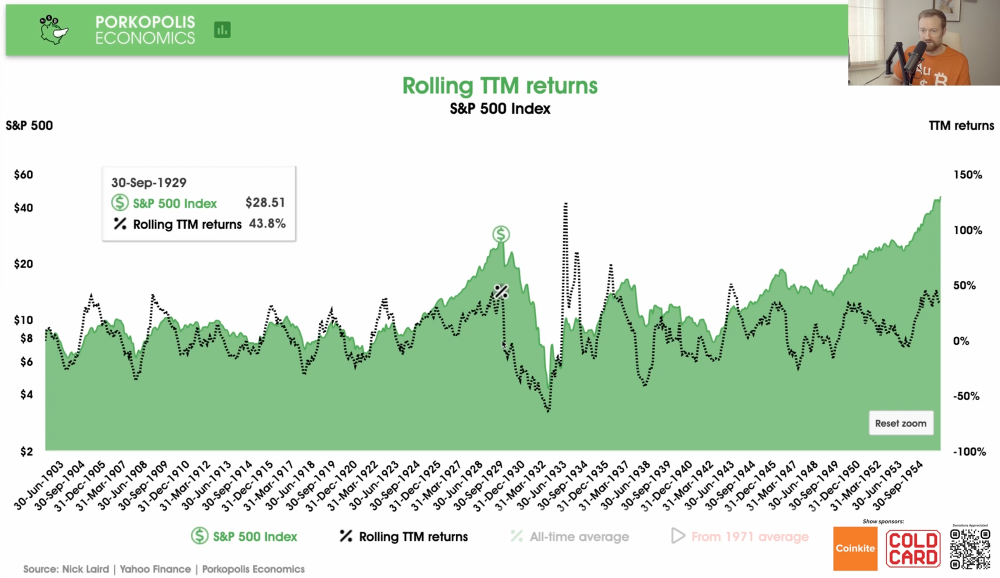

## Table of Contents

## What is the S&P 500 and why is it important?

The S&P 500 is a stock market index that measures the stock performance of 500 large companies listed on stock exchanges in the United States. It is maintained by S&P Dow Jones Indices, a division of S&P Global. The companies in the S&P 500 are chosen because they are big, important, and represent many different parts of the economy, like technology, healthcare, and finance.

The S&P 500 is important because it gives people a good idea of how the overall U.S. stock market and economy are doing. When the S&P 500 goes up, it usually means that the economy is doing well, and when it goes down, it might mean that the economy is struggling. Many investors use the S&P 500 to compare their own investments and see if they are doing better or worse than the market as a whole. It's also used as a benchmark for many investment funds and retirement accounts.

## How is the S&P 500 calculated?

The S&P 500 is calculated using a method called market capitalization weighting. This means that the bigger a company is, the more it affects the index. To find the market capitalization of a company, you multiply the number of its shares by the price of one share. Then, you add up the market capitalizations of all 500 companies in the index. Each company's weight in the index is its market capitalization divided by the total market capitalization of all the companies.

Once you have the weights, you calculate the S&P 500's value. You do this by taking the price of each company's stock, multiplying it by the company's weight, and then adding up all those numbers. This gives you the total value of the index. The S&P 500 is updated in real-time as stock prices change throughout the trading day, so its value is always current.

## What is the average annual return of the S&P 500 over the past 10 years?

Over the past 10 years, the S&P 500 has had an average annual return of about 12%. This number can change a bit depending on which years you look at and how you calculate it, but it gives a good idea of how well the index has done. The return is based on how much the index's value has grown each year, including any dividends that companies pay out to their shareholders.

This average return shows that investing in the S&P 500 over the long term has been a good way to grow money. But it's important to remember that the stock market can go up and down a lot in the short term. Some years, the S&P 500 might go up a lot, and other years it might go down. That's why it's a good idea to keep your money in the market for a long time if you want to see the best results.

## How does the S&P 500's performance vary across different decades?

The S&P 500's performance changes a lot from one decade to another. For example, in the 1990s, the S&P 500 did really well, with an average annual return of about 18%. This was because of the big growth in technology companies and the dot-com boom. But then, in the 2000s, the S&P 500 had a much lower average annual return of around 0%. This was because of the dot-com bubble bursting at the start of the decade and the big financial crisis in 2008.

In the 2010s, the S&P 500 bounced back and had an average annual return of about 13%. This was a time when the economy was recovering from the financial crisis and technology companies were growing again. The 2020s started with a lot of ups and downs because of the COVID-19 pandemic, but the S&P 500 still managed to have strong returns in the early years of the decade. These changes show how the S&P 500 can be affected by different things happening in the world and the economy.

## What are the factors that influence S&P 500 returns?

The S&P 500's returns are influenced by many things. One big factor is the overall health of the economy. When the economy is doing well, companies make more money, and their stock prices go up, which makes the S&P 500 go up too. On the other hand, if the economy is struggling, like during a recession, companies make less money, and the S&P 500 goes down. Another important factor is interest rates. When interest rates are low, it's cheaper for companies to borrow money to grow their business, which can help their stock prices and the S&P 500. But when interest rates are high, it can slow down the economy and make the S&P 500 go down.

Another thing that affects the S&P 500 is what's happening in different parts of the world. If there's a big event like a war or a global health crisis, it can make the stock market go up and down a lot. Also, how people feel about the economy can make a big difference. If investors think the economy is going to do well, they'll buy more stocks, which can push the S&P 500 higher. But if they're worried, they might sell their stocks, which can make the S&P 500 go down. Finally, changes in technology and what industries are doing well can also affect the S&P 500. For example, if tech companies are growing a lot, the S&P 500 might go up because tech companies are a big part of the index.

## How does inflation affect the real returns of the S&P 500?

Inflation can change how much money you really make from the S&P 500. When inflation goes up, the prices of things like food and gas go up too. This means that the money you get from your investments might not be worth as much as it used to be. If the S&P 500 goes up by 5% in a year, but inflation is also 5%, then your real return, or the actual increase in your money's value, is zero. So, even though the numbers on your investment statement might look good, inflation can eat away at what you can actually buy with that money.

To figure out the real return of the S&P 500, you need to take away the inflation rate from the S&P 500's return. If the S&P 500 goes up by 10% in a year and inflation is 2%, then your real return is 8%. This means your money's buying power has grown by 8%. It's important to think about inflation when you're looking at how well your investments are doing, because it helps you understand if your money is really growing or if it's just keeping up with the rising prices.

## What is the risk-adjusted return of the S&P 500 and how is it measured?

The risk-adjusted return of the S&P 500 is a way to see how much money you make from the index compared to how risky it is. One common way to measure this is by using something called the Sharpe Ratio. The Sharpe Ratio looks at the S&P 500's return and then takes away the return you could get from a safe investment, like a savings account. Then, it divides that number by how much the S&P 500's returns go up and down, which is called its volatility. A higher Sharpe Ratio means the S&P 500 is giving you a better return for the amount of risk you're taking.

Over time, the Sharpe Ratio for the S&P 500 has been around 0.4 to 0.5. This means that for the risk you're taking by investing in the S&P 500, you're getting a pretty good return compared to just putting your money in a safe place. But remember, the Sharpe Ratio can change a lot from one year to the next because the stock market can be very unpredictable. So, it's a good idea to look at the S&P 500's risk-adjusted return over many years to get a better idea of how it's doing.

## How do S&P 500 returns correlate with other major global indices?

The S&P 500's returns often move together with other major global stock market indices, like the Dow Jones Industrial Average in the U.S., the FTSE 100 in the U.K., and the Nikkei 225 in Japan. This is because many big companies in these indices do business all over the world. When the global economy is doing well, these companies make more money, and their stock prices go up, which makes the indices go up too. But if something bad happens in one part of the world, it can affect the whole global economy and make all these indices go down.

For example, the S&P 500 and the MSCI World Index, which tracks stocks from all over the world, usually move in the same direction. If the S&P 500 goes up by a lot, the MSCI World Index often goes up too, but maybe not by as much. This is because the S&P 500 is a big part of the MSCI World Index. But sometimes, things can be different. For instance, if there's a problem in one country, like a big political change, it might affect that country's stock market more than the S&P 500. So, while the S&P 500's returns are often linked to other global indices, they don't always move exactly the same way.

## What are the best and worst years for S&P 500 returns, and what caused them?

The best year for the S&P 500 was 1933, when it went up by about 54%. This happened during the Great Depression, a really tough time for the economy. In 1933, people started to feel a bit better about the economy because President Franklin D. Roosevelt started new programs to help fix things. Also, the government did things to make the banks safer, which made people more confident about investing their money in the stock market. So, the S&P 500 had a big jump that year.

The worst year for the S&P 500 was 1931, when it went down by about 47%. This was also during the Great Depression, but things were getting worse at that time. Banks were failing, businesses were closing, and lots of people were out of work. All of this made the stock market go down a lot. The bad news kept coming, and it made people very scared to invest, so the S&P 500 had its biggest drop ever that year.

## How have different sectors within the S&P 500 performed historically?

Different sectors within the S&P 500 have had their ups and downs over the years. For example, the technology sector has done really well in the last few decades, especially in the 1990s during the dot-com boom and more recently with the growth of big companies like Apple and Microsoft. The tech sector can grow a lot when new technology comes out or when people start using the internet more. But it can also go down a lot if there's a big problem, like the dot-com bubble bursting in the early 2000s. On the other hand, sectors like utilities and consumer staples, which include things like electricity companies and food producers, usually don't go up or down as much. These sectors are more stable because people always need electricity and food, no matter what's happening in the economy.

Another sector that has had big changes is the energy sector, which includes oil and gas companies. When oil prices are high, the energy sector can do really well, like it did in the 2000s before the financial crisis. But when oil prices go down, the energy sector can struggle, like it did in the 2010s when oil prices dropped a lot. The financial sector, which includes banks and insurance companies, can also have big swings. It did really badly during the 2008 financial crisis because many banks were in trouble, but it bounced back in the years after that. Each sector in the S&P 500 can be affected by different things, so their performance can be very different from one another.

## What predictive models are used to forecast S&P 500 returns?

Predicting S&P 500 returns is a tricky thing to do, but people use different models to try and guess what might happen. One common model is the economic indicator model, which looks at things like how fast the economy is growing, how many people have jobs, and what interest rates are doing. These models think that if the economy is doing well, the S&P 500 will probably go up too. Another model is the technical analysis model, which looks at past stock prices and patterns to try and predict what will happen next. People who use this model think that if they can find patterns in the past, they can guess what the future might bring.

Another way to predict S&P 500 returns is by using statistical models like regression analysis. These models use math to look at how different things, like inflation or company earnings, affect the S&P 500. They try to find a formula that can help predict future returns based on what's happening right now. There are also machine learning models, which are a bit more complicated. These models use computers to learn from a lot of data and try to find patterns that might help predict the S&P 500's future performance. But no matter which model you use, it's important to remember that predicting the stock market is never perfect, and there's always a chance you could be wrong.

## How can investors use historical S&P 500 data to optimize their portfolio?

Investors can use historical S&P 500 data to learn about how the market has moved in the past and make better choices about their investments. By looking at past returns, they can see how the S&P 500 has done over different times, like during good years or bad years. This can help them understand what might happen in the future and how much risk they are willing to take. For example, if they see that the S&P 500 has always bounced back after a big drop, they might feel more comfortable keeping their money in the market even when it goes down.

Another way to use historical data is to look at how different sectors within the S&P 500 have performed. Some sectors, like technology, might grow a lot during certain times, while others, like utilities, might be more stable. By knowing this, investors can choose to put more money into sectors that fit their goals. They might decide to spread their money across different sectors to lower their risk or focus on sectors that have done well in the past. Using historical data helps investors make smarter choices and build a portfolio that matches what they want to achieve.

## What has been the historical performance of the S&P 500?

The S&P 500 Index, comprising 500 of the largest publicly traded companies in the United States, is a pivotal indicator of U.S. stock market performance. Historically, the index has provided insights into the overall health of the U.S. economy, especially since it reflects diverse sectors including technology, healthcare, and finance.

### Analysis of Long-Term Historical Returns

The S&P 500 has demonstrated consistent growth over the decades, with average annual returns generally ranging between 7% and 10% when accounting for inflation. This long-term upward trajectory, despite short-term [volatility](/wiki/volatility-trading-strategies), renders the S&P 500 an attractive investment for those seeking stable returns over time.

If we consider the historical performance, the compound annual growth rate (CAGR) formula becomes useful:

$$
\text{CAGR} = \left( \frac{\text{Ending Value}}{\text{Starting Value}} \right)^{\frac{1}{\text{Number of Years}}} - 1
$$

Using historical data, investors can recognize that while some years see declines, the general trend is positive, underpinning the index's role as a reliable growth instrument over long periods.

### Key Historical Events Impacting Index Performance

Several significant events have left their mark on the S&P 500. The Great Depression, for instance, saw substantial declines, while the post-World War II boom led to significant gains. The dot-com bubble of the late 1990s and the subsequent crash, the housing market collapse in 2008, and the COVID-19 pandemic each uniquely shaped the index's trajectory through volatility and market corrections. 

Specific examples include the 2008 financial crisis, where the S&P 500 lost approximately 38.49% of its value that year alone. Similarly, during the March 2020 COVID-19 shock, the index saw one of its fastest declines in history but subsequently recovered, demonstrating resilience and adaptability.

### Statistical Summary of Average Annual Returns

Calculating the average annual returns of the S&P 500 over specific time frames offers insight into expected performance. For example, during the 20-year period from 2001 to 2020, the average annual return stood approximately at 7.47%. However, when considering the more extended span from 1928 to 2020, the average annual return adjusts closer to 10%, showcasing the importance of time horizon in investment assessments.

### Comparison with Other Major Indices

When compared to other major indices, such as the Dow Jones Industrial Average (DJIA) and the NASDAQ Composite, the S&P 500 strikes a balance in diversification and sector representation. The DJIA, which contains only 30 stocks, often exhibits less volatility but potentially lower growth, focusing on industrial and blue-chip components. Meanwhile, the NASDAQ, with its heavy tech concentration, can outperform during tech booms but also face sharper corrections during downturns.

In summary, the S&P 500's long-term performance underscores its significance in financial markets, both as a benchmark and as an investment vehicle. Its mix of stability and growth potential attracts a broad range of investors, from individual retail investors to institutional players, making its historical performance crucial to understanding market dynamics and informing future investment strategies.

 to Algorithmic Trading

Algorithmic trading involves using computer algorithms to execute trading orders at speeds and frequencies that are impossible for human traders. These algorithms can analyze vast amounts of market data, identify trading signals based on pre-set criteria, and execute trades automatically. Algorithmic trading relies on mathematical models and complex formulas to make investment decisions, with minimal human intervention. 

### Types of Algorithmic Trading Strategies

Algorithmic trading encompasses a variety of strategies, each designed to exploit different market conditions:

1. **Trend Following**: This strategy involves algorithms that identify and capitalize on upward or downward trends within a market. It focuses on moving averages and market momentum to generate trading signals.

2. **Arbitrage**: Involves the simultaneous purchase and sale of an asset in different markets to exploit price differences. Algorithms can quickly identify and act on these price discrepancies.

3. **Market Making**: Algorithms facilitate transactions by simultaneously posting buy and sell orders. They profit from the bid-ask spread between the buying and selling price.

4. **Mean Reversion**: This is based on the assumption that the price of an asset will revert to its mean over time. Algorithms identify assets deviating significantly from their historical average and execute trades to capitalize on the expected reversion.

5. **Statistical Arbitrage**: Uses statistical models to identify opportunities in trading pairs or a set of securities. It focuses on statistical mispricing in instruments relative to their fundamental value.

### Advantages and Disadvantages of Algo Trading

**Advantages**

- **Speed and Efficiency**: Algorithms can process market data and execute orders in fractions of a second, which is crucial in volatile markets.
- **Reduced Transaction Costs**: By automating trades, algo trading can minimize the impact of human errors and reduce costs associated with manual trading.
- **Backtesting Capability**: Before being deployed live, trading strategies can be backtested on historical data to evaluate and optimize their effectiveness.
- **Consistency**: Algorithms follow predefined rules without being influenced by human emotions like fear or greed.

**Disadvantages**

- **Complexity and Cost**: Developing and maintaining sophisticated algorithms can require significant technical expertise and financial resources.
- **System Failures**: Algo trading systems are prone to technical glitches, which can lead to substantial losses if not managed properly.
- **Market Impact**: High-frequency trading, a form of algo trading, has been criticized for contributing to market volatility and creating liquidity problems during stressed market conditions.

### Current Trends and Technologies in Algorithmic Trading

Recent advancements in technology continue to shape [algorithmic trading](/wiki/algorithmic-trading). **Machine Learning (ML) and Artificial Intelligence (AI)** are increasingly integrated into trading algorithms to enhance their prediction accuracy. These technologies enable systems to learn from data, improving their decision-making capabilities over time.

**Cloud Computing** offers scalable and cost-effective solutions for processing vast amounts of trading data and backtesting strategies, facilitating broader access to algo trading tools. Additionally, **quantum computing** is being explored for its potential to revolutionize the speed and efficiency of algorithms due to its superior processing power.

Python is widely used for developing algorithmic trading strategies due to its extensive libraries and frameworks, such as `pandas` for data manipulation, `NumPy` for numerical computations, and `Scikit-learn` for [machine learning](/wiki/machine-learning).

```python
import pandas as pd

# Example of a simple moving average crossover strategy
def generate_signals(data, short_window=40, long_window=100):
    signals = pd.DataFrame(index=data.index)
    signals['signal'] = 0.0

    # Compute short and long moving averages
    signals['short_mavg'] = data['close'].rolling(window=short_window, min_periods=1, center=False).mean()
    signals['long_mavg'] = data['close'].rolling(window=long_window, min_periods=1, center=False).mean()

    # Create signals
    signals['signal'][short_window:] = np.where(
        signals['short_mavg'][short_window:] > signals['long_mavg'][short_window:], 1.0, 0.0
    )

    # Generate trading orders
    signals['positions'] = signals['signal'].diff()

    return signals
```

This foundational understanding of algorithmic trading, its strategies, advantages, and emerging technologies provides a base for further exploration of its applications and implications in today's complex financial markets.

## How can we analyze the S&P 500 average returns using algorithmic trading?

Algorithmic trading leverages statistical models and computational algorithms to execute trades in financial markets. Calculating the average returns of the S&P 500 using such methods involves deploying these models to analyze historical price data, optimize trading strategies, and simulate possible outcomes. Typically, this process includes backtesting strategies against past data, where traders use algorithms to determine potential profits and gauge the risk of their trades.

One of the common methods for calculating average returns using algorithmic trading strategies is the **Exponential Moving Average (EMA)**. The EMA is a type of moving average that places a greater weight and significance on the most recent data points. In Python, the EMA can be calculated using a simple pandas function:

```python
import pandas as pd

# Assuming 'data' is a DataFrame with a 'Close' column for S&P 500 closing prices
def calculate_ema(data, span):
    return data['Close'].ewm(span=span, adjust=False).mean()

ema = calculate_ema(data, span=10)  # Example span of 10 days
```

**Case Studies**

Several studies have reported on the performance of algorithmic trading strategies applied to the S&P 500. For instance, a momentum-based strategy may indicate buying stocks when their short-term moving average crosses above the long-term moving average, generating buy and sell signals. Outperformance in such strategies can sometimes be achieved by identifying periods of strong market trends.

**Outperformance or Underperformance**

Certain algorithmic trading strategies may outperform the S&P 500 in bullish markets by capitalizing on extended upward trends. However, they may underperform during sideways or bearish markets when trends are not easily identifiable. The risk-reward ratio, variance in returns, and transaction costs are critical variables that contribute to the success or failure of such strategies.

A straightforward approach to compare algorithmic strategies with historical index returns is to calculate the Sharpe Ratio:

$$
\text{Sharpe Ratio} = \frac{\text{Average Portfolio Return} - \text{Risk-Free Rate}}{\text{Standard Deviation of Portfolio Return}}
$$

This measure helps quantify the return of an investment compared to its risk, providing a metric to assess performance against the index's historical data.

**Challenges**

Investors face several challenges when using algorithmic trading to analyze or enhance S&P 500 returns. These include:

1. **Market Volatility**: The unpredictability of market movements can introduce unexpected losses.

2. **Overfitting**: Algorithms tailored too closely to historical data may perform poorly on new, unseen data.

3. **Latencies and Execution Speeds**: Ensuring trades are executed at the desired time and price is crucial but can be hindered by technological or market inefficiencies.

In conclusion, while algorithmic trading offers sophisticated tools for calculating and potentially enhancing returns on the S&P 500, investors must be wary of the inherent risks and limitations associated with these strategies. Comprehensive backtesting, optimization, and continuous strategy refinement are essential to maximizing the effectiveness of algorithmic approaches.

## References & Further Reading

[1]: ["Advances in Financial Machine Learning"](https://www.amazon.com/Advances-Financial-Machine-Learning-Marcos/dp/1119482089) by Marcos Lopez de Prado

[2]: ["Quantitative Trading: How to Build Your Own Algorithmic Trading Business"](https://www.amazon.com/Quantitative-Trading-Build-Algorithmic-Business/dp/1119800064) by Ernest P. Chan

[3]: ["Machine Learning for Algorithmic Trading"](https://github.com/stefan-jansen/machine-learning-for-trading) by Stefan Jansen

[4]: ["Evidence-Based Technical Analysis: Applying the Scientific Method and Statistical Inference to Trading Signals"](https://www.amazon.com/Evidence-Based-Technical-Analysis-Scientific-Statistical/dp/0470008741) by David Aronson

[5]: Bergstra, J., Bardenet, R., Bengio, Y., & Kégl, B. (2011). ["Algorithms for Hyper-Parameter Optimization."](https://dl.acm.org/doi/10.5555/2986459.2986743) Advances in Neural Information Processing Systems 24.