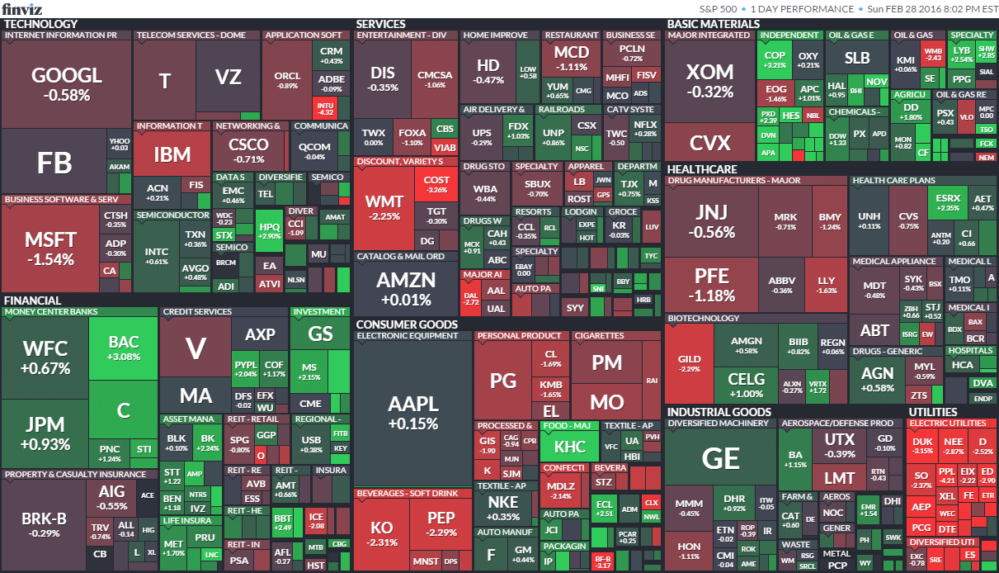

## Table of Contents

## What is the S&P 500 Index?

The S&P 500 Index is a stock market index that measures the performance of 500 large companies listed on stock exchanges in the United States. It is considered a good indicator of how the overall U.S. stock market is doing because it includes companies from many different industries, like technology, healthcare, and finance. The index is maintained by a company called Standard & Poor's, which is why it's called the S&P 500.

Investors and financial experts often use the S&P 500 to see how the market is performing and to compare the performance of their own investments. If the S&P 500 goes up, it usually means that the stock market is doing well, and if it goes down, it might mean the market is struggling. Many people also invest in funds that try to match the performance of the S&P 500, called index funds, because it's a simple way to invest in a broad range of the U.S. economy.

## How is the S&P 500 Index calculated?

The S&P 500 Index is calculated using a method called market capitalization weighting. This means that the bigger a company is, the more it affects the index's value. To find a company's market capitalization, you multiply the total number of its shares by the price of one share. Then, you add up the market capitalizations of all 500 companies in the index. Each company's weight in the index is its market cap divided by the total market cap of all 500 companies.

Once the weights are figured out, the index value is calculated. They start with a base value, which was set at 10 in 1957. To find the current value, they take the total market value of the 500 companies and divide it by a special number called the divisor. This divisor changes over time to account for things like stock splits or companies being added or removed from the index. This way, the index can show how the market is doing without being affected by these changes.

## What companies are included in the S&P 500?

The S&P 500 includes 500 of the biggest companies in the United States. These companies come from all kinds of industries, like technology, healthcare, finance, and more. Some well-known companies in the S&P 500 are Apple, Microsoft, Amazon, and Johnson & Johnson. The list of companies changes sometimes, as new companies grow big enough to join, and others might shrink or have problems that make them leave the index.

To be part of the S&P 500, a company has to meet certain rules. It needs to be based in the U.S., have a lot of its shares available for the public to buy, and be worth a lot of money. The people who run the S&P 500, called the S&P Dow Jones Indices, decide which companies are in and which are out. They look at things like how much the company is worth, how many shares it has, and how often its stock is traded.

The companies in the S&P 500 are picked to give a good picture of the whole U.S. economy. That's why it includes companies from so many different industries. If a lot of people are buying and selling the stocks of these companies, it usually means the economy is doing well. If not, it might mean the economy is struggling. So, the S&P 500 is a big deal for people who want to know how the U.S. stock market and economy are doing.

## How often is the S&P 500 Index updated?

The S&P 500 Index is updated all the time. It changes every time the stock prices of the companies in it change. This means it's updated throughout the trading day, from when the stock market opens until it closes. So, if you check the S&P 500 at different times during the day, you might see different numbers because the stock prices are always moving.

The list of companies in the S&P 500 doesn't change as often as the stock prices. The people who run the index, called the S&P Dow Jones Indices, look at the companies every now and then to see if they should add new ones or take some out. They might do this a few times a year, but it's not a set schedule. They only make changes if they think it will make the index a better picture of the U.S. economy.

## What is the historical performance of the S&P 500?

The S&P 500 has been around since 1957, and over the years, it has shown that it can go up and down. If you look at the long run, the S&P 500 has usually gone up. From 1957 to now, it has grown a lot, even though there have been times when it dropped a lot, like during the financial crisis in 2008 or the dot-com bubble in the early 2000s. But, after those big drops, it usually came back and kept growing. This shows that the U.S. economy can be strong and keep going, even when there are tough times.

Looking at shorter periods, like a year or a few years, the S&P 500 can be more up and down. Some years it might go up a lot, and other years it might go down. For example, in 2020, it dropped a lot because of the COVID-19 pandemic, but then it came back and ended the year higher than it started. This shows how the stock market can be unpredictable in the short term but can still grow over time. People who invest in the S&P 500 often do so because they believe in the long-term growth of the U.S. economy.

## How does the S&P 500 compare to other stock market indices?

The S&P 500 is just one of many stock market indices out there. It's different from others because it focuses on 500 of the biggest companies in the U.S. This makes it a good way to see how the U.S. economy is doing overall. For example, the Dow Jones Industrial Average (often just called the Dow) is another famous index, but it only tracks 30 big companies. So, the S&P 500 gives a broader picture of the market because it includes more companies from different industries.

Another index, the Nasdaq Composite, includes all the companies listed on the Nasdaq stock exchange, which has a lot of tech companies. So, if you're interested in how tech stocks are doing, the Nasdaq might be more useful than the S&P 500. On the other hand, the S&P 500 gives you a more balanced look because it includes companies from many different sectors, not just tech. Each index has its own way of showing how the market is doing, and they can be useful for different reasons depending on what you want to know.

## What are the benefits of investing in an S&P 500 index fund?

Investing in an S&P 500 index fund is a good way to spread your money across many big companies in the U.S. Instead of picking just one or a few stocks, you get a little piece of 500 different companies. This helps lower your risk because if one company does badly, it won't hurt your whole investment as much. Also, since the S&P 500 includes companies from many different industries, you're not betting all your money on just one type of business. This makes it easier to have a balanced investment that can handle ups and downs in the market.

Another big benefit is that S&P 500 index funds usually have lower fees than other types of investments. When you buy an index fund, you're not paying someone to pick stocks for you, so the costs are lower. Over time, these lower fees can add up to a lot of savings. Plus, the S&P 500 has a good track record of growing over the long term. This means that if you keep your money in an S&P 500 index fund for many years, you're likely to see your investment grow, even if there are some rough patches along the way.

## How can an investor gain exposure to the S&P 500?

An investor can gain exposure to the S&P 500 by buying an S&P 500 index fund or an exchange-traded fund (ETF) that tracks the S&P 500. These funds are designed to match the performance of the S&P 500, so when the index goes up, the value of your investment goes up too. You can buy these funds through a brokerage account, which is like a special bank account for buying and selling investments. This way, you don't have to pick individual stocks; the fund does it for you by including all the companies in the S&P 500.

Another way to get exposure to the S&P 500 is by investing in mutual funds that focus on the S&P 500. These funds work a lot like index funds and ETFs, but they might be managed by a person who makes decisions about which stocks to buy or sell. Some investors also choose to buy futures or options contracts based on the S&P 500. These are more advanced investments and can be riskier, but they let you bet on whether the S&P 500 will go up or down without owning the actual stocks. No matter which method you choose, getting exposure to the S&P 500 is a way to invest in a big part of the U.S. economy.

## What are the risks associated with investing in the S&P 500?

Investing in the S&P 500 comes with some risks, just like any other investment. One big risk is that the whole market can go down. If a lot of people start selling their stocks because they're worried about the economy, the S&P 500 can drop a lot. This happened during times like the 2008 financial crisis and the early days of the COVID-19 pandemic in 2020. If you need to take your money out during a big drop, you might lose a lot. Also, even though the S&P 500 has grown over the long term, there's no promise it will keep doing that. The future can be hard to predict, and there could be new problems or changes that hurt the market.

Another risk is that the S&P 500 is made up of big companies, and big companies can have their own problems. If a lot of the companies in the S&P 500 start doing badly at the same time, it can pull the whole index down. For example, if there's a big problem in the tech industry, and a lot of the big tech companies in the S&P 500 are affected, it can hurt the index's performance. Also, while index funds and ETFs that track the S&P 500 are usually cheaper than other types of investments, you still have to pay some fees. Over time, these fees can add up and eat into your returns.

## How does the S&P 500 react to economic cycles?

The S&P 500 goes up and down with the different stages of the economy. When the economy is doing well, like during a boom, more people are buying things, and companies are making more money. This makes their stock prices go up, which pushes the S&P 500 higher. But when the economy starts to slow down or goes into a recession, people might stop buying as much, and companies might not make as much money. This can make their stock prices drop, and the S&P 500 goes down too.

Sometimes, the S&P 500 can even predict what's going to happen in the economy. If people think the economy is going to get better, they might start buying more stocks, which makes the S&P 500 go up before the economy actually improves. On the other hand, if people are worried about a coming recession, they might start selling their stocks, and the S&P 500 can go down before the economy actually gets worse. This means the S&P 500 can be a helpful tool for understanding where the economy might be headed.

## What role does the S&P 500 play in portfolio diversification?

The S&P 500 helps people spread out their investments by including 500 big companies from different parts of the U.S. economy. When you invest in an S&P 500 index fund or ETF, you're not just betting on one company or one industry. Instead, you're getting a little piece of all those companies. This means if one company or one industry does badly, it won't hurt your whole investment as much. It's like not putting all your eggs in one basket, which makes your investment safer.

Also, the S&P 500 covers a lot of different kinds of businesses, like tech, health care, and finance. This mix helps balance out the ups and downs in the market. When one industry is struggling, another might be doing well, which can help keep your investment steady. So, including the S&P 500 in your portfolio can make it stronger and more likely to grow over time, even when the market is bumpy.

## How are changes to the S&P 500 Index determined and announced?

Changes to the S&P 500 Index are decided by a group of people called the S&P Dow Jones Indices Committee. They look at the companies in the index to make sure it still shows a good picture of the U.S. economy. They might add a new company if it's big enough and important enough, or take out a company if it's not doing well or if it's not as important anymore. They think about things like how much the company is worth, how many shares it has, and how often its stock is traded. The committee wants to make sure the index stays balanced and fair.

When the committee decides to make a change, they tell everyone about it before it happens. They usually announce the change a few days before it actually takes place. This gives investors time to get ready for the change. The announcement is made through official news channels and on the S&P Dow Jones Indices website. This way, everyone knows what's happening and can plan their investments accordingly.

## What is the S&P 500 and how can it be understood?

The S&P 500 is a prominent stock market index comprising 500 of the largest companies listed on United States stock exchanges. The index serves as a critical economic indicator and is globally revered by investors for its comprehensive representation of the U.S. economy's health and trends. It provides insight into the overall performance of stocks in the U.S. markets, acting as a benchmark for many investment portfolios and funds.

One of the defining features of the S&P 500 is its weighting by float-adjusted market capitalization. This approach allows the index to provide a more accurate picture of the public market's movements by focusing only on shares available for trading. The float-adjusted market cap for a company is calculated using the formula:

$$
\text{Float-adjusted Market Cap} = \text{Share Price} \times \text{Number of Shares Available for Public Trading}
$$

This methodology excludes shares restricted from trading, such as those held by company insiders, which might include executives, employees, or large stakeholders. By concentrating on public-traded shares, the index reflects market conditions more precisely, shedding light on how broader market forces impact stock prices.

For a company to be included in this influential index, it must satisfy specific criteria, including market capitalization thresholds, sufficient [liquidity](/wiki/liquidity-risk-premium), and consistent profitability. The eligibility for inclusion mandates a minimum market cap of $14.6 billion (as of 2023), ensuring that only large and financially stable companies are considered. Liquidity requirements dictate that the company should have a high trading [volume](/wiki/volume-trading-strategy) over extended periods, ensuring easy buying and selling of its shares without dramatically affecting price levels. Profitability requirements include the demonstration of positive earnings over the most recent quarter and cumulative positive earnings over the last four consecutive quarters.

The S&P 500's design and criteria make it an indispensable tool for investors seeking to understand economic conditions and make informed decisions. The inclusion and frequent updates to maintain current economic landscapes highlight the dynamic nature of the index, preserving its relevance and fidelity to reflecting the U.S. economy accurately.

## What are the mechanics of the S&P 500's calculation?

The S&P 500 index differentiates itself from simple price-weighted indices like the Dow Jones Industrial Average by employing a market capitalization-weighted methodology. This approach is designed to provide a comprehensive reflection of the economic landscape represented by its 500 constituents. The calculation process begins with determining each company's market capitalization, which is the product of its stock price and the total shares outstanding. 

However, the S&P 500 further refines this calculation through float adjustment. Float adjustment is an integral aspect that adjusts the market capitalization by considering only the shares available to public investors. This exclusion applies to shares held by insiders, such as company executives and large institutional investors, which are not readily available for trading. The underlying rationale for float adjustment is to ensure that the index better represents the active portion of the market, thereby offering a more accurate representation of the actual market conditions.

Mathematically, the calculation of the S&P 500 index can be expressed as:

$$
\text{Index Level} = \frac{\sum(\text{Float-Adjusted Market Cap of each company})}{\text{Divisor}}
$$

The divisor acts as an index scaling [factor](/wiki/factor-investing), ensuring the continuity of the index in light of changes such as stock splits, company additions or deletions, and significant corporate actions. Adjustments to the divisor are occasionally necessary to maintain the index's integrity and representativeness over time. These adjustments preserve the index level's continuity, ensuring that it solely reflects organic market movements rather than structural changes to the index composition.

The perpetual monitoring and recalibration of the S&P 500 guarantee that it remains a precise barometer of the U.S. stock market's health and direction. This methodology ensures that the index accurately mirrors the economic forces within the marketplace, providing investors and analysts with reliable data for decision-making.

 to Algorithmic Trading

Algorithmic trading, often referred to as algo trading, employs computer programs to execute trades automatically based on predefined criteria. This approach is fundamentally different from traditional manual trading, which relies heavily on human intuition and decision-making. By leveraging the power of computers, [algorithmic trading](/wiki/algorithmic-trading) processes complex calculations and vast datasets at speeds and precision levels impossible for humans.

One of the primary advantages of algorithmic trading is speed. Computers can react to market changes in fractions of a second, enabling traders to capitalize on even the smallest market movements. This speed is particularly beneficial in high-frequency trading ([HFT](/wiki/high-frequency-trading-strategies)) environments where execution time is crucial.

Another core advantage is precision. Humans are prone to errors, particularly in repetitive and fast-paced tasks. Algorithmic trading eliminates this risk by adhering strictly to predefined criteria, ensuring that trades are executed exactly as intended without deviation caused by emotional or psychological factors.

In addition to speed and precision, algorithmic trading's capacity to process large datasets enhances its appeal. The modern financial markets generate a staggering amount of data that can contain valuable insights for trading strategies. Algorithms can analyze historical market data, real-time price feeds, and other quantitative metrics to identify trading signals. This capability enables sophisticated strategies that consider a multitude of factors, including but not limited to price, volume, [volatility](/wiki/volatility-trading-strategies), and time.

Algorithmic trading has found its place among both institutional and retail investors. Institutional investors leverage these strategies on a large scale, managing substantial funds and implementing complex trading programs. Many hedge funds, mutual funds, and pension funds rely on algorithmic trading to conduct various strategies, including [market making](/wiki/market-making), [arbitrage](/wiki/arbitrage), and [trend following](/wiki/trend-following). Retail investors, although dealing with smaller volumes, also engage in algorithmic trading, made possible by advancements in technology and the availability of user-friendly trading platforms.

Python, a popular programming language among finance professionals, is often used to create and test trading algorithms due to its extensive libraries and ease of use. For example, a basic moving average crossover strategy can be implemented in Python as follows:

```python
import numpy as np
import pandas as pd

# Example S&P 500 price data
prices = pd.DataFrame()  # Assume this DataFrame contains historical price data

# Calculate moving averages
short_window = 40
long_window = 100

signals = pd.DataFrame(index=prices.index)
signals['signal'] = 0.0

# Generate signals
signals['short_mavg'] = prices['Close'].rolling(window=short_window, min_periods=1).mean()
signals['long_mavg'] = prices['Close'].rolling(window=long_window, min_periods=1).mean()

signals['signal'][short_window:] = np.where(signals['short_mavg'][short_window:] > signals['long_mavg'][short_window:], 1.0, 0.0)

# Compute the trading orders
signals['positions'] = signals['signal'].diff()

# Display signals
print(signals.head())
```

In this code, we use historical price data to calculate short- and long-term moving averages. A signal to buy or sell is generated based on the crossover of these averages. This is a simple example of how algorithmic trading strategies can be automated and backtested to evaluate their effectiveness. 

Overall, algorithmic trading offers transformative possibilities for engaging with indices like the S&P 500, characterized by its efficiency and ability to handle complex data-driven strategies.

## References & Further Reading

[1]: ["The S&P 500® Index"](https://www.marketwatch.com/investing/index/spx) - S&P Dow Jones Indices

[2]: Narang, R. K. (2013). ["Inside the Black Box: A Simple Guide to Quantitative and High Frequency Trading"](https://onlinelibrary.wiley.com/doi/book/10.1002/9781118662717). Wiley.

[3]: Aldridge, I. (2013). ["High-Frequency Trading: A Practical Guide to Algorithmic Strategies and Trading Systems"](https://www.ahmetbeyefendi.com/wp-content/uploads/2020/07/High-Frequency-Trading-Irene-Aldridge.pdf). Wiley.

[4]: Chincarini, L. B., & Kim, D. (2006). ["Quantitative Equity Portfolio Management: An Active Approach to Portfolio Construction and Management"](https://www.mhebooklibrary.com/doi/book/10.1036/9781264268931). McGraw-Hill.

[5]: Heston, S. L. (1993). ["A Closed-Form Solution for Options with Stochastic Volatility with Applications to Bond and Currency Options."](https://wwwf.imperial.ac.uk/~ajacquie/IC_Num_Methods/IC_Num_Methods_Docs/Literature/Heston.pdf) The Review of Financial Studies.