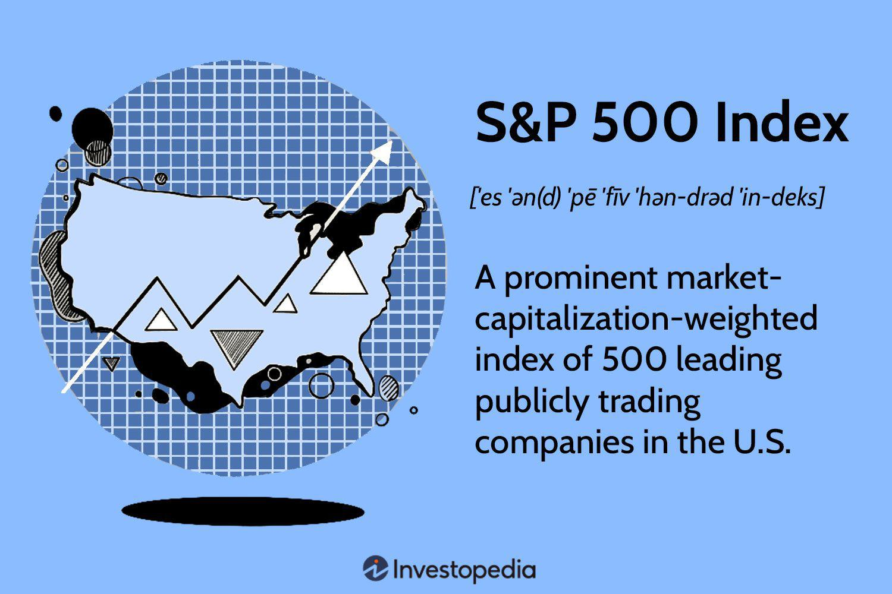

## Table of Contents

## What is the S&P 500 Index?

The S&P 500 Index is a stock market index that measures the performance of 500 large companies listed on stock exchanges in the United States. It is one of the most widely followed equity indices, providing a broad indicator of how the U.S. stock market is doing. The companies included in the S&P 500 are chosen by a committee and represent about 80% of the total market value of the U.S. stock market. This makes it a good benchmark for the overall health of the economy.

Investors often use the S&P 500 as a way to gauge the market's direction and as a standard for comparing the performance of their own investments. Many mutual funds and exchange-traded funds (ETFs) are designed to mimic the performance of the S&P 500, allowing investors to easily invest in a diversified portfolio that reflects the market as a whole. The index is updated regularly to ensure it continues to represent the largest and most influential companies in the U.S. economy.

## How is the S&P 500 Index calculated?

The S&P 500 Index is calculated using a method called market capitalization weighting. This means that companies with a larger total value, or market cap, have a bigger impact on the index's performance. To find a company's market cap, you multiply the number of its shares by the price of each share. The S&P 500 adds up the market caps of all 500 companies and uses this total to figure out how much each company should influence the index. 

To keep the index fair and accurate, it's adjusted for changes like stock splits, dividends, and new companies joining or leaving the index. When a company's stock splits, its price per share goes down, but the total market cap stays the same. The index adjusts for this to make sure the company's impact on the S&P 500 doesn't change just because of the split. This way, the S&P 500 gives a clear picture of the overall market's performance over time.

## Why is the S&P 500 considered a benchmark for the U.S. stock market?

The S&P 500 is considered a benchmark for the U.S. stock market because it includes 500 of the largest and most important companies in the country. These companies come from many different industries, so the index gives a good overall picture of how the whole market is doing. When people want to know if the stock market is going up or down, they often look at the S&P 500 to get a quick answer.

Also, the S&P 500 is used by many investors to compare their own investments. If someone's investments are doing better than the S&P 500, they might feel good about their choices. If they're doing worse, they might think about changing their strategy. Because the S&P 500 is so widely watched and used, it's a standard way to measure the health of the U.S. economy and the stock market.

## What types of companies are included in the S&P 500?

The S&P 500 includes big companies from all kinds of industries in the United States. You'll find companies that make things like cars, computers, and food, as well as companies that provide services like banks, insurance, and health care. This mix of industries helps make the S&P 500 a good way to see how the whole economy is doing.

The companies in the S&P 500 are chosen because they are important and have a big impact on the market. They are the leaders in their fields and have a lot of money and influence. This means that when you look at the S&P 500, you're seeing how these big, important companies are doing, which gives a good idea of the overall health of the U.S. stock market.

## How often is the S&P 500 Index updated?

The S&P 500 Index is updated all the time during the trading day. This means that as the prices of the stocks in the index change, the value of the S&P 500 changes too. It's like watching a live scoreboard that shows how all the companies are doing right now.

The companies that are included in the S&P 500 can change, but this doesn't happen every day. A special group of people called the Index Committee decides when to add new companies or take out old ones. They usually do this a few times a year, when they think it's important to keep the index showing a good picture of the market.

## What are the criteria for a company to be included in the S&P 500?

To be included in the S&P 500, a company needs to meet certain rules. The most important rule is that the company must be big, which means it needs to have a high market value. This is figured out by multiplying the number of shares the company has by the price of each share. The company also needs to be based in the United States and have most of its shares available to the public, not just held by a few people.

Another rule is that the company must be profitable. This means it should be making money, not just spending it. The Index Committee, a group of people who decide which companies go in the S&P 500, also looks at other things like how much the company is traded on the stock market and if it fits well with the other companies already in the index. They want the S&P 500 to show a good picture of the U.S. economy, so they pick companies that are important and well-known.

## How does investing in an S&P 500 index fund benefit an investor?

Investing in an S&P 500 index fund is a smart way to grow your money because it spreads your investment across many big and important companies in the U.S. Instead of picking just one or a few stocks, you get a piece of 500 different companies. This means if one company does badly, it won't hurt your whole investment too much because the other companies might do well. This is called diversification, and it helps make your investment safer.

Another benefit is that the S&P 500 has a good track record of growing over time. Over many years, the stock market usually goes up, and the S&P 500 is a good way to be part of that growth. Plus, it's easy to invest in an S&P 500 index fund. You don't need to be an expert in picking stocks. You just buy the fund, and it does the work for you by following the S&P 500. This makes it a simple and effective way to invest for the long term.

## What is the historical performance of the S&P 500?

The S&P 500 has had a good track record over many years. Since it started in 1957, it has grown a lot. If you had invested in the S&P 500 a long time ago and kept your money in it, you would have seen your investment grow over time. There have been ups and downs, but overall, the S&P 500 has gone up. For example, over the last 30 years, it has had an average yearly return of about 10%. This means if you started with $100, it would be worth about $1,745 after 30 years, not counting inflation or taxes.

Even though the S&P 500 has grown a lot over time, it can be bumpy along the way. There have been times when it dropped a lot, like during the financial crisis in 2008 or the early days of the COVID-19 pandemic in 2020. But after these big drops, the S&P 500 usually came back and kept growing. This shows that while there can be scary times in the stock market, the S&P 500 has a history of recovering and moving forward. So, if you can wait and not panic during the tough times, investing in the S&P 500 can be a good way to grow your money over the long run.

## How does the S&P 500 compare to other major indices like the Dow Jones and Nasdaq?

The S&P 500, Dow Jones Industrial Average (DJIA), and Nasdaq Composite are three major stock market indices, but they are different in some important ways. The S&P 500 includes 500 large companies from many different industries, giving a broad view of the U.S. stock market. The DJIA, on the other hand, only includes 30 big companies, mostly from traditional industries like finance and manufacturing. This makes the DJIA a narrower look at the market. The Nasdaq Composite includes all the companies listed on the Nasdaq stock exchange, which has a lot of technology and internet companies. So, the Nasdaq is often seen as a good measure of how tech stocks are doing.

Even though these indices look at different parts of the market, they all show how the stock market is doing overall. But because they focus on different types of companies, they can sometimes move in different ways. For example, if tech companies are doing really well, the Nasdaq might go up a lot more than the S&P 500 or the DJIA. On the other hand, if traditional industries like banks or manufacturing are doing well, the DJIA might go up more than the other two. So, looking at all three can give you a fuller picture of what's happening in the stock market.

## What are the risks associated with investing in the S&P 500?

Investing in the S&P 500 can be a good way to grow your money over time, but it also comes with risks. One big risk is that the stock market can go down, and when it does, the S&P 500 goes down too. This means you could lose money, especially if you need to take it out during a time when the market is low. Also, the S&P 500 is made up of big companies, and if something bad happens to a lot of these companies at the same time, like a big economic problem, the whole index could drop a lot.

Another risk is that the S&P 500 might not grow as fast as you hope. Sometimes, other parts of the market or different kinds of investments might do better. If you put all your money in the S&P 500 and other investments are doing better, you might feel like you missed out. Plus, even though the S&P 500 is spread out across many companies, it's still focused on the U.S. economy. If the U.S. economy has problems, it could affect the whole index, even if other countries are doing okay.

## How can investors use the S&P 500 to diversify their portfolios?

Investors can use the S&P 500 to diversify their portfolios by buying an S&P 500 index fund or ETF. This means instead of picking just a few stocks, they get a piece of 500 big companies from different industries. This spread-out approach helps lower the risk because if one company or industry does badly, the others might do well and balance things out. It's like not putting all your eggs in one basket, but spreading them around so that if one egg breaks, you still have plenty of others.

Adding an S&P 500 index fund to a portfolio can also help investors who want to keep things simple. Instead of trying to pick the best stocks or time the market, they can just invest in the S&P 500 and let it do the work. This way, they're investing in the overall growth of the U.S. economy, which has a good track record over time. By doing this, investors can build a solid foundation for their portfolio and then add other investments like bonds, international stocks, or real estate to make it even more diverse.

## What advanced strategies can be employed using S&P 500 futures and options?

Using S&P 500 futures and options can help investors do more than just buy and hold. Futures are agreements to buy or sell the S&P 500 at a set price on a future date. Investors can use futures to guess where the market is going. If they think the S&P 500 will go up, they can buy futures and make money if they're right. If they think it will go down, they can sell futures and still make money if the market drops. This way, they can make money whether the market goes up or down, but it's risky because if they guess wrong, they could lose a lot of money.

Options give investors even more choices. An option is like a ticket that lets you buy or sell the S&P 500 at a certain price before a certain date. There are two kinds of options: calls and puts. A call option lets you buy the S&P 500, and a put option lets you sell it. Investors can use options to protect their investments. For example, if they own the S&P 500 and are worried it might go down, they can buy a put option to sell it at a good price if it does drop. This can help limit their losses. Options can also be used to make money if the market moves a lot in either direction, but like futures, they are risky and can lead to big losses if the market doesn't go the way the investor expects.

## What is the S&P 500 Index and how can it be understood?

The S&P 500 Index, or the Standard & Poor's 500, is a stock market index that measures the stock performance of 500 large companies listed on stock exchanges in the United States. It is widely regarded as one of the best representations of the U.S. stock market and economy. The S&P 500 encompasses a diverse range of industries, including technology, healthcare, financial services, and consumer goods, offering a comprehensive view of the market.

Historically, the S&P 500 was introduced in 1957 by Standard & Poor's, an American financial services company. Over the years, the index has evolved to become a primary benchmark for U.S. equities. Its importance lies in its ability to provide a snapshot of the market's overall health and trends. Unlike the Dow Jones Industrial Average (DJIA), which consists of only 30 companies, the S&P 500 includes 500 companies, offering a broader perspective on the market's performance. The index is often used by investors and analysts to gauge investor sentiment and economic conditions.

The S&P 500 is constructed and weighted using a market capitalization-weighted method. This means that companies in the index are weighted according to their total market value (calculated as current stock price multiplied by the total number of outstanding shares). The formula for calculating the S&P 500 Index value is:

$$
\text{Index Value} = \frac{\Sigma (P_i \times S_i)}{\text{Divisor}}
$$

where $P_i$ is the price of stock $i$, $S_i$ is the number of shares of stock $i$, and the Divisor is a constant that is adjusted for stock splits, dividends, and additions or deletions of companies, to ensure continuity in the index value.

Compared to other indices, the S&P 500 is often juxtaposed with the Dow Jones Industrial Average and the Nasdaq Composite. The DJIA is price-weighted and contains only 30 large publicly traded companies, making it less representative of the broader market. In contrast, the Nasdaq Composite includes all stocks listed on the Nasdaq stock exchange, around 3,000 stocks, with a tech-heavy focus, differing from the broader industrial composition of the S&P 500.

In summary, the S&P 500 plays a crucial role in assessing the performance of U.S. stocks, with its comprehensive coverage and market capitalization weighting offering an accurate reflection of the market's movements and trends.

## References & Further Reading

[1]: Siegel, J. J. (2008). ["Stocks for the Long Run: The Definitive Guide to Financial Market Returns & Long-Term Investment Strategies."](https://www.amazon.com/Stocks-Long-Run-Definitive-Investment/dp/0071800514) McGraw-Hill.

[2]: Chan, E. (2009). ["Quantitative Trading: How to Build Your Own Algorithmic Trading Business."](https://github.com/ftvision/quant_trading_echan_book) Wiley.

[3]: Lewis, M. (2014). ["Flash Boys: A Wall Street Revolt."](https://en.wikipedia.org/wiki/Flash_Boys) W. W. Norton & Company.

[4]: Aronson, D. R. (2007). ["Evidence-Based Technical Analysis: Applying the Scientific Method and Statistical Inference to Trading Signals."](https://onlinelibrary.wiley.com/doi/book/10.1002/9781118268315) Wiley.

[5]: Lopez de Prado, M. (2018). ["Advances in Financial Machine Learning."](https://books.google.com/books/about/Advances_in_Financial_Machine_Learning.html?id=oU9KDwAAQBAJ) Wiley.

[6]: Jansen, S. (2020). ["Machine Learning for Algorithmic Trading: Predictive models to extract signals from market and alternative data for systematic trading strategies with Python."](https://github.com/stefan-jansen/machine-learning-for-trading) Packt Publishing. 

[7]: QuantConnect. [QuantConnect website](https://www.quantconnect.com/)

[8]: Metatrader 5. [MetaTrader 5 website](https://www.metatrader5.com/en/download)