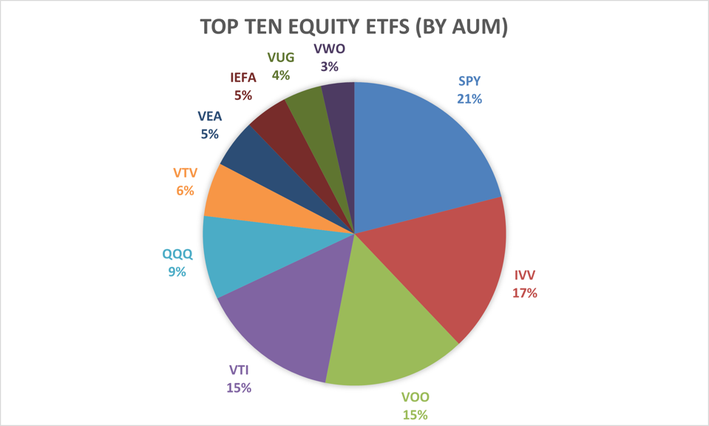

## Table of Contents

## What is the S&P 500?

The S&P 500 is a stock market index that measures the performance of 500 large companies listed on stock exchanges in the United States. It is considered a good indicator of how the overall U.S. economy is doing because it includes companies from many different industries, like technology, healthcare, and finance. The index is maintained by a company called Standard & Poor's, which is why it's called the S&P 500.

People often use the S&P 500 to see how the stock market is doing as a whole. If the S&P 500 goes up, it usually means that the stock market is doing well, and if it goes down, it might mean the market is struggling. Many investors also use the S&P 500 as a benchmark to compare their own investments. For example, if their investments are doing better than the S&P 500, they might feel they are doing a good job.

## Why is the S&P 500 considered a good investment benchmark?

The S&P 500 is considered a good investment benchmark because it represents a broad section of the U.S. economy. It includes 500 of the largest companies from different industries, like technology, healthcare, and finance. This diversity means that the S&P 500 can give a good overall picture of how the stock market is doing. When people want to know if their investments are doing well, they often compare them to the S&P 500. If their investments are doing better than the S&P 500, they might feel good about their choices.

Another reason the S&P 500 is a good benchmark is that it is widely recognized and used by many investors and financial professionals. This makes it easy for people to understand and use as a comparison tool. Also, the S&P 500 is updated regularly to make sure it still represents the biggest and most important companies in the U.S. This helps keep it relevant and useful for investors who want to see how their investments stack up against the market as a whole.

## How is the S&P 500 calculated?

The S&P 500 is calculated using a method called market capitalization weighting. This means that the bigger a company is, the more it affects the index. To find the value of the S&P 500, you add up the total value of all the stocks in the index. The total value of a company's stock is found by multiplying the number of its shares by the price of each share. Then, you divide this total value by a special number called the divisor. The divisor is adjusted to keep the index stable even when companies are added or removed, or when there are stock splits or dividends.

The S&P 500 is updated in real-time during trading hours, so its value changes as the prices of the stocks in the index change. At the end of each trading day, the final value of the S&P 500 is calculated and reported. This daily value is important because it shows how the market did that day. Over time, the S&P 500 can go up or down, reflecting the overall performance of the 500 companies it includes. This makes it a useful tool for investors to track the health of the U.S. economy and the stock market.

## What types of companies are included in the S&P 500?

The S&P 500 includes 500 of the biggest companies in the United States. These companies come from many different industries, like technology, healthcare, finance, and more. Some well-known companies in the S&P 500 are Apple, Microsoft, and Amazon from the technology sector, while others like Johnson & Johnson represent healthcare, and JPMorgan Chase stands for finance.

To be part of the S&P 500, a company needs to be big and important. It must have a lot of its stock available for people to buy and sell, and it needs to be based in the U.S. The companies in the S&P 500 are chosen by a group of people who look at how big the company is and how well it's doing. This helps make sure the S&P 500 shows a good picture of the whole U.S. economy.

## How can an individual invest in the S&P 500?

An individual can invest in the S&P 500 by buying a mutual fund or an exchange-traded fund ([ETF](/wiki/etf-trading-strategies)) that tracks the S&P 500. These funds are made up of the same stocks as the S&P 500, so when you buy shares in the fund, you are essentially buying a little bit of all the companies in the index. Two popular choices for this are the Vanguard S&P 500 ETF and the SPDR S&P 500 ETF Trust. You can buy these funds through a brokerage account, which is like an online bank account for buying and selling investments.

To start, you'll need to open a brokerage account with a company like Fidelity, Charles Schwab, or Robinhood. Once your account is set up, you can search for the S&P 500 ETF you want to buy, enter the amount of money you want to invest, and place your order. Investing in the S&P 500 is a good way to spread out your risk because you're not putting all your money into one company, but instead into hundreds of different companies across many industries.

## What are the historical returns of the S&P 500?

The S&P 500 has had good returns over time. From 1928 to 2022, the average yearly return of the S&P 500 was about 10%. This means if you had invested $100 at the start of 1928, by the end of 2022, your investment would be worth around $700,000. But, these returns are not the same every year. Some years the S&P 500 goes up a lot, and other years it goes down. For example, in 2020, the S&P 500 went up by about 18%, but in 2008, it went down by about 37%.

Looking at shorter periods can also help understand the S&P 500's performance. Over the last 10 years, from 2013 to 2022, the average yearly return was about 12%. This shows that the S&P 500 can have different returns depending on the time you look at. It's important to remember that past returns don't tell us exactly what will happen in the future, but they can give us an idea of what might happen. Investing in the S&P 500 over a long time has usually been a good way to grow your money, even though there can be ups and downs along the way.

## How does the S&P 500 compare to other market indices?

The S&P 500 is often compared to other market indices like the Dow Jones Industrial Average (DJIA) and the Nasdaq Composite. The DJIA is made up of 30 large companies, mostly from the industrial sector, and is one of the oldest and most well-known indices. Unlike the S&P 500, which is weighted by market capitalization, the DJIA is a price-weighted index, meaning companies with higher stock prices have a bigger impact on the index. The Nasdaq Composite, on the other hand, includes all the stocks listed on the Nasdaq stock exchange, with a heavy focus on technology and internet companies. The S&P 500 is broader and more diverse than the DJIA and less tech-focused than the Nasdaq, making it a good overall measure of the U.S. economy.

Another index often compared to the S&P 500 is the Russell 2000, which tracks 2,000 smaller companies in the U.S. The Russell 2000 is used to gauge the performance of small-cap stocks, which can be more volatile but also offer higher growth potential compared to the larger companies in the S&P 500. While the S&P 500 gives a good picture of how big companies are doing, the Russell 2000 shows how smaller companies are performing. This can be useful for investors who want to understand different parts of the market. Overall, the S&P 500 is often seen as a balanced and reliable benchmark for the U.S. stock market because of its size and diversity.

## What are the risks associated with investing in the S&P 500?

Investing in the S&P 500, like any investment, comes with risks. One big risk is that the value of the S&P 500 can go down. This means if you need to sell your investment when the market is down, you might get less money than you put in. The stock market can be unpredictable, and even though the S&P 500 has done well over many years, it can still have bad years where it loses value. For example, during the financial crisis in 2008, the S&P 500 lost a lot of value, which hurt many investors.

Another risk is that the S&P 500 might not grow as fast as you hope. While it has averaged around a 10% return per year over the long term, there can be long periods where it doesn't do as well. If you need your money to grow quickly, the S&P 500 might not meet your goals. Also, even though the S&P 500 includes many different companies, it's still affected by what's happening in the U.S. economy. If the economy has problems, the S&P 500 can go down, which means your investment could lose value.

## How does the S&P 500 adjust for inflation?

The S&P 500 itself doesn't adjust for inflation. It just shows the total return of the stocks in the index. But, you can adjust the returns of the S&P 500 for inflation to see how much the value of your investment has really grown. To do this, you take the yearly return of the S&P 500 and subtract the inflation rate for that year. This gives you the "real" return, which tells you how much your investment grew after accounting for the rising cost of things.

For example, if the S&P 500 went up by 10% in a year and inflation was 2%, the real return would be about 8%. This means your investment grew by 8% in terms of what it could actually buy. Over time, inflation can eat away at the value of your money, so looking at the real return helps you understand if your investment is keeping up with or beating inflation.

## What role does the S&P 500 play in portfolio diversification?

The S&P 500 plays an important role in helping people diversify their investment portfolios. Diversification means spreading your money across different investments to reduce risk. When you invest in the S&P 500, you are buying a little bit of 500 big companies from many different industries. This means if one company or industry does badly, it won't hurt your whole investment too much because the other companies can help balance it out.

Including the S&P 500 in your portfolio can be a good way to get a broad exposure to the U.S. economy without having to pick individual stocks. It's like putting your eggs in many different baskets instead of just one. This can help protect your money from big drops in value because the ups and downs of different companies and industries can even out over time. By investing in the S&P 500, you can have a more stable investment that still has the chance to grow as the economy grows.

## How often is the S&P 500 rebalanced and what criteria are used for inclusion?

The S&P 500 is rebalanced regularly to make sure it still represents the biggest and most important companies in the U.S. This happens when there are changes like a company getting bigger or smaller, or when a new company needs to be added or an old one removed. The S&P 500 committee, which is a group of people who decide what companies should be in the index, looks at these changes and makes updates. They don't have a set schedule for rebalancing, but they do it whenever it's needed to keep the index accurate.

To be included in the S&P 500, a company needs to meet certain rules. It has to be based in the U.S., and it must have a lot of its stock available for people to buy and sell. The company also needs to be big, which means it should have a high market value. The S&P 500 committee looks at how big the company is and how well it's doing to decide if it should be part of the index. This helps make sure the S&P 500 shows a good picture of the whole U.S. economy.

## What advanced strategies can investors use to leverage the S&P 500 performance?

Investors can use advanced strategies like options trading to try to make more money from the S&P 500. Options are like bets on whether the S&P 500 will go up or down. You can buy options that let you buy or sell the S&P 500 at a certain price in the future. If you think the S&P 500 will go up, you can buy a "call" option. If you think it will go down, you can buy a "put" option. This can help you make money even if the S&P 500 only moves a little bit, but it's also riskier because you can lose money if you guess wrong.

Another strategy is to use leverage, which means borrowing money to invest more in the S&P 500. This can make your gains bigger if the S&P 500 goes up, but it also makes your losses bigger if it goes down. You can use things like margin accounts to borrow money from your broker to buy more S&P 500 stocks or ETFs. This can be a good way to try to make more money, but it's important to be careful because the risks are higher.

## References & Further Reading

[1]: Cowles, M. (1933). ["Can Stock Market Forecasters Forecast?"](https://www.jstor.org/stable/1907042) Econometrica, 1(3), 309-324.

[2]: ["Advances in Financial Machine Learning"](https://www.amazon.com/Advances-Financial-Machine-Learning-Marcos/dp/1119482089) by Marcos Lopez de Prado

[3]: ["Algorithmic Trading: Winning Strategies and Their Rationale"](https://www.amazon.com/Algorithmic-Trading-Winning-Strategies-Rationale-ebook/dp/B00CY5HC0U) by Ernie Chan

[4]: Barberis, N., & Thaler, R. (2003). ["A Survey of Behavioral Finance."](https://www.semanticscholar.org/paper/A-Survey-of-Behavioral-Finance-Barberis-Thaler/a4ab7d7161deac0f532d121b1614cf7b97d90e78) Handbook of the Economics of Finance.

[5]: Brynjolfsson, E., & McAfee, A. (2014). ["The Second Machine Age: Work, Progress, and Prosperity in a Time of Brilliant Technologies."](https://psycnet.apa.org/record/2014-07087-000)

[6]: Fama, E. F., & French, K. R. (1993). ["Common risk factors in the returns on stocks and bonds."](https://www.sciencedirect.com/science/article/pii/0304405X93900235) Journal of Financial Economics, 33(1), 3-56.

[7]: ["Quantitative Trading: How to Build Your Own Algorithmic Trading Business"](https://www.amazon.com/Quantitative-Trading-Build-Algorithmic-Business/dp/1119800064) by Ernest P. Chan