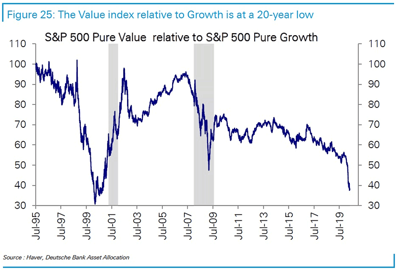

## Table of Contents

## What is the S&P 500 Pure Value Index?

The S&P 500 Pure Value Index is a stock market index that focuses on companies that are considered to have "value" characteristics. These companies are typically seen as being undervalued by the market, meaning their stock prices are lower than what their actual worth might suggest. The index selects its components from the broader S&P 500, but it only includes the stocks that score highest on value metrics, such as low price-to-earnings ratios and high dividend yields.

This index is part of a family of indices created by Standard & Poor's, designed to help investors focus on specific investment styles. By concentrating on value stocks, the S&P 500 Pure Value Index aims to offer investors a way to potentially achieve higher returns if these undervalued stocks increase in price as the market recognizes their true value. It is often used by investors who believe in value investing, a strategy that involves picking stocks that appear to be trading for less than their intrinsic or book value.

## How does the S&P 500 Pure Value Index differ from the S&P 500 Index?

The S&P 500 Pure Value Index and the S&P 500 Index both come from the same family of indices created by Standard & Poor's, but they have different focuses. The S&P 500 Index includes the 500 largest publicly traded companies in the U.S., representing a broad range of industries. It's meant to give a general picture of how the overall market is doing. On the other hand, the S&P 500 Pure Value Index is a smaller, more specific index. It only includes companies from the S&P 500 that are considered "value" stocks, which means they are thought to be undervalued or cheaper than they should be based on certain financial metrics.

The main difference between these two indices is their approach to selecting companies. The S&P 500 Index aims to represent the entire market by including a wide variety of companies, while the S&P 500 Pure Value Index focuses only on those companies that meet specific value criteria. This makes the Pure Value Index useful for investors who want to focus on value investing, which is a strategy that looks for stocks that might be a good deal. Because of this focus, the performance of the S&P 500 Pure Value Index can be quite different from the broader S&P 500 Index, depending on how value stocks are doing in the market.

## What criteria are used to select stocks for the S&P 500 Pure Value Index?

The S&P 500 Pure Value Index selects stocks based on certain value characteristics. These characteristics are measured using three main factors: book value to price ratio, earnings to price ratio, and sales to price ratio. Each stock in the S&P 500 is scored on these factors, and the scores are combined into a single value score. Stocks with the highest value scores are chosen for the index. This means the index only includes companies that are considered the best value investments from the larger S&P 500.

The selection process is done every quarter to make sure the index always reflects the current value stocks in the market. By focusing on these specific value metrics, the S&P 500 Pure Value Index aims to identify companies that are undervalued and have the potential for price appreciation. This makes it different from the broader S&P 500, which includes all types of stocks regardless of their value characteristics.

## How often is the S&P 500 Pure Value Index rebalanced?

The S&P 500 Pure Value Index is rebalanced every three months, or quarterly. This means that every few months, the stocks in the index are checked to see if they still meet the value criteria. If a stock no longer fits the value characteristics, it might be removed from the index. New stocks that have high value scores might be added to take their place.

Rebalancing helps keep the index focused on the best value stocks at any given time. By doing this regularly, the index can stay true to its goal of representing the most undervalued companies in the S&P 500. This way, investors who use the index can be sure they are always investing in stocks that fit the value investment strategy.

## What are the benefits of investing in the S&P 500 Pure Value Index?

Investing in the S&P 500 Pure Value Index can be a good choice for people who want to follow a value investing strategy. This index picks stocks that are thought to be undervalued, which means they might be cheaper than they should be. If these stocks become more popular and their prices go up, investors could make more money. It's like finding a good deal at a store and then selling it later for a higher price. This can be a smart way to grow your money over time, especially if you believe in buying stocks when they are undervalued.

Another benefit is that the S&P 500 Pure Value Index is updated every three months. This means it always includes the newest and best value stocks from the S&P 500. By regularly checking and changing the stocks in the index, it stays focused on the companies that fit the value criteria. This can help investors feel confident that they are always investing in stocks that match their value investing goals. Plus, because it's based on the S&P 500, it includes well-known and big companies, which can make it a safer choice than investing in smaller or less known stocks.

## How has the S&P 500 Pure Value Index performed historically compared to the S&P 500?

The S&P 500 Pure Value Index has had different performance compared to the S&P 500 over time. Sometimes, the Pure Value Index does better, especially when value stocks are popular in the market. For example, during times when people are looking for good deals on stocks, the Pure Value Index might go up more than the S&P 500. But other times, it might not do as well, especially when people are more interested in growth stocks or when the overall market is doing really well.

Over the long term, the S&P 500 Pure Value Index can be a good choice for investors who believe in value investing. Studies show that value stocks can sometimes beat the overall market over many years. But it's important to remember that the performance can go up and down a lot more than the S&P 500. This means that while you might make more money with the Pure Value Index in some years, it can also be riskier because its value can change a lot more quickly.

## What are the risks associated with investing in the S&P 500 Pure Value Index?

Investing in the S&P 500 Pure Value Index can be riskier than investing in the broader S&P 500. One big risk is that value stocks can go up and down a lot more than the overall market. This means that if you invest in the Pure Value Index, the value of your investment might change a lot more quickly. Sometimes, the stocks in the index might not go up as much as you hope, even if they are undervalued. This can happen if the market doesn't recognize the true value of these stocks for a long time, or if something unexpected happens to the companies in the index.

Another risk is that the S&P 500 Pure Value Index might not do as well as the S&P 500 during times when growth stocks are more popular. Growth stocks are companies that people think will grow a lot in the future, and when these stocks are doing well, value stocks might not keep up. Also, because the Pure Value Index is rebalanced every three months, there can be more trading and costs involved. This means you might have to pay more in fees, which can eat into your returns. So, while the Pure Value Index can be a good choice for some investors, it's important to understand these risks before you decide to invest.

## Can you explain the methodology behind the value scores used in the S&P 500 Pure Value Index?

The S&P 500 Pure Value Index uses a special way to pick stocks that are considered good value investments. It looks at three main things to decide if a stock is a good value: the book value to price ratio, the earnings to price ratio, and the sales to price ratio. These are all ways to see if a stock is cheap compared to what the company is worth or how much money it makes. Each stock in the S&P 500 gets a score for each of these things, and then those scores are put together into one big value score. The stocks with the highest value scores get to be in the Pure Value Index.

This method helps make sure the index only has the stocks that are the best deals according to these value measures. By focusing on these specific things, the index tries to find companies that the market might not be paying enough attention to yet. The scores are checked every three months to make sure the index always has the best value stocks from the S&P 500. This regular check helps keep the index up to date and focused on finding undervalued companies that could grow in value over time.

## How does the S&P 500 Pure Value Index fit into a diversified investment portfolio?

The S&P 500 Pure Value Index can be a good part of a diversified investment portfolio. It focuses on value stocks, which means it picks companies that might be cheaper than they should be. Adding this index to your portfolio can help you spread out your investments. Instead of putting all your money into one type of stock or one part of the market, you can mix it up. This can lower your risk because if one type of stock does badly, the others might do better and balance things out.

Using the S&P 500 Pure Value Index can also help you follow a value investing strategy. This means you're looking for stocks that might be undervalued and could go up in price later. By including this index in your portfolio, you can take advantage of these potential deals. But remember, it's important to mix it with other types of investments, like growth stocks or bonds, to make sure your portfolio is well-rounded and can handle different market situations.

## What are some ETFs or mutual funds that track the S&P 500 Pure Value Index?

There are a few ETFs and mutual funds that track the S&P 500 Pure Value Index. One popular ETF is the Invesco S&P 500 Pure Value ETF (RPV). This ETF tries to match the performance of the S&P 500 Pure Value Index by investing in the same stocks that are in the index. Another ETF is the SPDR S&P 500 Value ETF (SPYV), but this one tracks a slightly different value index from the S&P 500, so it's not exactly the same but still focuses on value stocks.

For mutual funds, options are more limited, but some funds might use the S&P 500 Pure Value Index as a benchmark. For example, the Fidelity Value Fund (FDVLX) aims to invest in value stocks, although it doesn't specifically track the S&P 500 Pure Value Index. It's always a good idea to check the fund's prospectus to see if it matches your investment goals and how closely it follows the index you're interested in.

## How does sector allocation in the S&P 500 Pure Value Index compare to the broader S&P 500?

The S&P 500 Pure Value Index and the S&P 500 have different ways of picking which companies to include, and this can change how much of each industry, or sector, is in each index. The S&P 500 tries to show a picture of the whole market, so it includes a bit of everything. It has companies from all sorts of industries like technology, health care, and finance, and the amount of each industry in the index is based on how big those companies are in the market. This means that if tech companies are really big, they might take up a bigger part of the S&P 500.

The S&P 500 Pure Value Index, on the other hand, only picks companies that are thought to be good value investments. This can make the mix of industries in the Pure Value Index very different from the S&P 500. Sometimes, certain industries like finance or energy might have a lot of companies that are seen as good value, so they might make up a bigger part of the Pure Value Index. This means that if you invest in the Pure Value Index, you might end up with more money in some industries than if you invested in the whole S&P 500.

## What are the tax implications of investing in funds that track the S&P 500 Pure Value Index?

Investing in funds that track the S&P 500 Pure Value Index can have different tax effects compared to other investments. When you invest in these funds, you might get dividends, which are payments from the companies the fund owns. These dividends are usually taxed as regular income. Also, if the fund sells stocks and makes a profit, you might have to pay capital gains tax on that profit. The tax rate for capital gains can be lower than the tax rate for regular income, but it depends on how long the fund held the stocks before selling them.

Another thing to think about is that the S&P 500 Pure Value Index is rebalanced every three months. This means the fund might buy and sell stocks more often than other funds. More buying and selling can lead to more capital gains, which means you might have to pay more in taxes. It's a good idea to talk to a tax advisor to understand how these taxes might affect your investment and to see if there are ways to lower your tax bill.

## Is Value Investing Effective in the S&P 500?

Value investing in the S&P 500 involves selecting stocks that the market has underestimated in terms of their intrinsic worth. This investment style rests on the principle that stocks possess an inherent value based on company fundamentals, such as assets, earnings, and dividends, which may not always reflect their current market prices. The goal is to acquire these undervalued stocks and benefit from price correction as the market realizes their true value.

Key indicators for value investors include low price-to-earnings (P/E) ratios, high dividend yields, and sound financial fundamentals. A low P/E ratio, calculated as the market price per share divided by earnings per share (EPS), suggests that a stock may be undervalued relative to its earnings. 

$$
\text{P/E Ratio} = \frac{\text{Market Price per Share}}{\text{Earnings per Share}}
$$

A high dividend yield, indicating a higher income return on the price paid for a stock, can also be a sign of undervaluation. 

$$
\text{Dividend Yield} = \frac{\text{Annual Dividends per Share}}{\text{Price per Share}}
$$

Fundamental analysis is a critical tool for value investors to evaluate whether an S&P 500 stock is genuinely undervalued. This analysis examines financial statements, market conditions, industry trends, and economic factors to estimate a company's true value. For instance, analyzing a company's balance sheet, income statement, and cash flow statement provides insights into its financial health and profitability potential.

Additionally, the S&P 500 Pure Value Index serves as a valuable resource for investors. This index is a subset of the S&P 500, comprising stocks with compelling value characteristics as determined by metrics such as book value, earnings, and sales. By focusing on the Pure Value Index, investors can pinpoint companies with strong value attributes, streamlining the process of identifying potentially undervalued assets.

Incorporating these strategies within the S&P 500 framework allows value investors to exploit the potential for intrinsic value discovery, realizing gains as the market adjusts to more accurate valuations of company stocks.

## References & Further Reading

[1]: ["Value Investing: From Graham to Buffett and Beyond"](https://www.amazon.com/Value-Investing-Graham-Buffett-Beyond/dp/0471463396) by Bruce Greenwald, Judd Kahn, Paul Sonkin, and Michael van Biema

[2]: Brunnermeier, M. K. (2001). ["Asset Pricing under Asymmetric Information: Bubbles, Crashes, Technical Analysis, and Herding"](https://www.princeton.edu/~markus/research/papers/book0.pdf). Oxford University Press.

[3]: Narang, R. K. (2009). ["Inside the Black Box: The Simple Truth About Quantitative Trading"](https://onlinelibrary.wiley.com/doi/book/10.1002/9781118267738). Wiley.

[4]: ["Financial Markets and Trading: An Introduction to Market Microstructure and Trading Strategies"](https://archive.org/details/financialmarkets0000schm) by Anatoly B. Schmidt

[5]: ["Technical Analysis of the Financial Markets: A Comprehensive Guide to Trading Methods and Applications"](https://www.amazon.com/Technical-Analysis-Financial-Markets-Comprehensive/dp/0735200661) by John J. Murphy