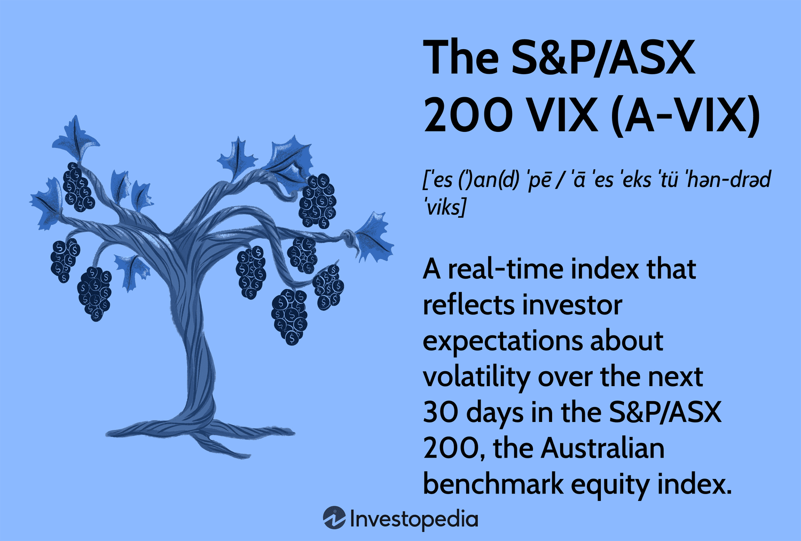

The Australian stock market, with the S&P/ASX 200 index prominently at its helm, serves as a pivotal benchmark reflecting the nation’s economic vitality and investment environment. Comprising the top 200 stocks listed on the Australian Securities Exchange (ASX) by market capitalization, this index is instrumental for both institutional and individual investors seeking to gauge the performance and trends of the Australian equities market. Its liquidity and index composition make it an attractive reference point for a diversified portfolio, spanning sectors such as financials, materials, and more.

In recent years, algorithmic trading (algo trading) has emerged as a transformative technique in trading, providing investors with a technological advantage to navigate the complexities of financial markets. Through the use of sophisticated algorithms, traders can execute buy and sell orders rapidly and efficiently, often optimizing both timing and pricing. This technique is particularly advantageous for trading indices like the S&P/ASX 200, where the ability to manage large orders with minimal market impact and reduced execution time can significantly enhance trading outcomes.



In this article, we aim to not only outline the fundamental aspects of the S&P/ASX 200 index but also to elucidate how algorithmic trading strategies can be effectively utilized to trade within this domain. We will cover the structural composition of the index, its economic significance, and delve into the advantages that algorithmic trading offers for modern investors and traders. The objective is to furnish a thorough guide that empowers investors with insights and strategies advanced enough to navigate the Australian stock market while embracing cutting-edge technological methodologies.

## Table of Contents

## Understanding the S&P/ASX 200 Index

The S&P/ASX 200 Index is a pivotal financial benchmark representing the top 200 stocks listed on the Australian Securities Exchange (ASX) by market capitalization. Market capitalization is calculated as the stock price multiplied by the total number of outstanding shares. This formula ensures that the index reflects the market influence of each constituent company based on size.

As an essential indicator, the S&P/ASX 200 offers insights into market trends within the Australian economy. Investors utilize the index to gauge overall market health and economic conditions, enabling informed decision-making processes. The index's composition provides a robust snapshot of the market's sectoral distribution, including a substantial representation of financials, materials, and healthcare, among other sectors.

One of the defining characteristics of the S&P/ASX 200 is its liquidity and tradability. The index's liquidity indicates that shares can be bought or sold with minimal price impact, making it attractive to institutional investors. These characteristics facilitate significant trading volumes, resulting in efficient price discovery.

Launched in 2000, the S&P/ASX 200 has established itself as the preferred measure of market performance in Australia. It serves as a benchmark for fund managers, allowing them to compare their portfolio performance against a widely recognized standard. Over the years, the index has anchored various financial products, including Exchange-Traded Funds (ETFs) and futures, further underlining its significance in both domestic and international markets.

The historical performance and reliability of the S&P/ASX 200 reinforce its status as an integral component of the Australian financial landscape, providing investors both a comprehensive view of the market and a vehicle for investment and hedging strategies.

## The Importance of the S&P/ASX 200 Index

The S&P/ASX 200 Index plays a vital role in illustrating the health and performance of Australia's economy by providing a comprehensive overview of its various sectors, including financials and materials. This benchmark index encompasses the 200 largest stocks listed on the Australian Securities Exchange (ASX) according to market capitalization. As such, it offers a representative snapshot of the most economically significant companies in Australia.

Institutional asset managers frequently employ the S&P/ASX 200 as a benchmark due to its notable [liquidity](/wiki/liquidity-risk-premium) and tradability. The index's composition allows investors to gauge overall market trends while facilitating comparisons of fund performance against the broader market backdrop. This use is further supported by the index's active rebalancing process. Regular adjustments ensure the index accurately reflects the evolving landscape of Australia's corporate sector, consistently capturing the top-performing large-cap stocks.

The S&P/ASX 200 Index's importance extends into its foundational role for numerous financial products, including exchange-traded funds (ETFs) and futures. The development of these products based on the index allows investors and traders to gain exposure to a broad segment of the Australian market or hedge positions with relative ease. By underpinning these instruments, the index enhances its economic significance, not only serving as a benchmark but also facilitating diverse investment strategies, risk management, and broader market liquidity.

In summary, the S&P/ASX 200 Index serves as an essential barometer for both the Australian economy and financial markets, sturdily anchoring asset management strategies and financial products that define investment activities in and around Australia.

 to Algorithmic Trading

Algorithmic trading is a method of executing trades on financial markets by programming computers to follow pre-defined instructions or criteria. These criteria often rely on factors like timing, price, or [volume](/wiki/volume-trading-strategy) that are systematically parsed by algorithms, enabling efficient trade execution without the need for direct human intervention. The primary advantage of this approach is the execution of trades at optimal times and prices, leveraging various technical and statistical models that ensure precise and timely responses to market fluctuations.

Efficient order management is a core competency of [algorithmic trading](/wiki/algorithmic-trading), particularly in dealing with large orders that could significantly impact market dynamics if not handled with care. By segmenting large trades into smaller, strategically timed transactions, algorithms can distribute the transactions across a given period, thereby minimizing their impact on the market and reducing the associated transaction costs.

Algorithmic trading also provides the advantage of rapid response capabilities to market events, outpacing manual trading methods. The underlying technology allows for real-time analysis of extensive datasets, enabling algorithms to identify and react to trading opportunities within milliseconds. This swift response time is critical in modern financial markets, where the ability to execute trades quickly and accurately can be the difference between profit and loss.

In technical terms, the use of algorithms in trading can be illustrated through simple principles or complex models. For instance, a common implementation involves using moving averages to determine trade signals. Consider a scenario where a short-term moving average crosses above a long-term moving average, generating a buy signal. This can be implemented in Python using libraries such as pandas for data handling and NumPy for numerical computations:

```python
import pandas as pd
import numpy as np

# Example function to calculate moving averages
def moving_average_strategy(prices, short_window=40, long_window=100):
    signals = pd.DataFrame(index=prices.index)
    signals['signal'] = 0.0

    # Calculate short and long moving averages
    signals['short_mavg'] = prices['close'].rolling(window=short_window, min_periods=1).mean()
    signals['long_mavg'] = prices['close'].rolling(window=long_window, min_periods=1).mean()

    # Generate signals
    signals['signal'][short_window:] = np.where(signals['short_mavg'][short_window:] 
                                                > signals['long_mavg'][short_window:], 1.0, 0.0)
    signals['positions'] = signals['signal'].diff()

    return signals
```

This type of algorithmic strategy ensures that trading decisions are made based on quantitative analysis rather than emotional bias, promoting disciplined and consistent decision-making. By automating processes, traders can focus on strategy optimization rather than execution details, enhancing overall market participation efficiency.

## Benefits of Algo Trading on the S&P/ASX 200

Algorithmic trading, commonly referred to as algo trading, brings significant advantages when applied to the S&P/ASX 200, primarily due to its ability to handle complex strategies and analyze large datasets efficiently. The S&P/ASX 200, known for its high liquidity, provides the perfect environment for these advanced trading techniques. One of the primary benefits of algo trading is its capacity to remove emotional biases that can often lead to erratic trading decisions. By automating trades based on pre-set parameters, investors can make more disciplined and consistent investment decisions, reducing the likelihood of impulsive actions that may result from emotional responses to market fluctuations.

Additionally, algo trading facilitates precise back-testing of trading strategies. Before executing a strategy in the live market, traders can simulate it against historical data to evaluate its performance. This process allows for the identification and refinement of strategies, ensuring their effectiveness and reducing the risk of loss. For instance, using Python's pandas and [backtrader](/wiki/backtrader) libraries, traders can easily analyze how a strategy would have performed in the past:

```python
import pandas as pd
import backtrader as bt

# Load historical data
data = bt.feeds.YahooFinanceData(dataname='AAPL', fromdate=pd.Timestamp('2020-01-01'), todate=pd.Timestamp('2021-01-01'))

# Define strategy
class MyStrategy(bt.Strategy):
    def next(self):
        if self.data.close[0] > self.data.close[-1]:
            self.buy(size=1)
        elif self.data.close[0] < self.data.close[-1]:
            self.sell(size=1)

# Run backtest
cerebro = bt.Cerebro()
cerebro.addstrategy(MyStrategy)
cerebro.adddata(data)
cerebro.run()
```

Furthermore, algo trading enables traders to exploit minute price movements and spread differences with high speed and efficiency, capitalizing on market conditions that might only be profitable within short time frames. This rapid execution is particularly valuable in the S&P/ASX 200, where liquidity ensures that trades can be executed promptly without significant market impact.

By leveraging technology in this manner, investors can maximize their returns while minimizing risks, offering a substantial competitive edge in trading on the S&P/ASX 200.

## Developing Algorithmic Trading Strategies for the ASX 200

Developing algorithmic trading strategies for the S&P/ASX 200 requires a comprehensive approach rooted in detailed market analysis and the effective use of technical tools. Successful algorithmic trading leverages both historical data and predictive models to make informed trading decisions.

Traders can utilize a range of technical indicators to design robust trading algorithms. Indicators such as moving averages, the Relative Strength Index (RSI), and Bollinger Bands provide insights into price trends and [momentum](/wiki/momentum), facilitating informed decision-making. For example, a simple moving average crossover strategy can be implemented to signal buy and sell points. In Python, this can be done using the pandas library:

```python
import pandas as pd

# Import price data into a DataFrame
data = pd.read_csv('stock_data.csv')
data['SMA_50'] = data['Close'].rolling(window=50).mean()
data['SMA_200'] = data['Close'].rolling(window=200).mean()

# Generate buy and sell signals
data['Signal'] = 0
data.loc[data['SMA_50'] > data['SMA_200'], 'Signal'] = 1
data.loc[data['SMA_50'] < data['SMA_200'], 'Signal'] = -1
```

Statistical models, such as regression analysis and [machine learning](/wiki/machine-learning) algorithms, are also integral to predictive modeling efforts. These models can forecast future price movements by analyzing patterns within the data. Machine learning models, including decision trees, random forests, and support vector machines, have proven effective in capturing complex patterns and relationships in market data.

Risk management is a critical component of any trading strategy, designed to mitigate potential losses and protect capital. Techniques such as position sizing, stop-loss orders, and diversification can help manage risk. For instance, implementing a stop-loss mechanism ensures that a position is automatically liquidated when a price level is reached, limiting the financial impact of adverse price movements.

Continuous adjustment and optimization of algorithms are vital to maintaining their effectiveness in the ever-changing market environment. Backtesting strategies on historical data allows for fine-tuning algorithms and validating their performance. This iterative process includes adjusting parameters, optimizing algorithm logic, and incorporating new data elements to enhance predictive accuracy.

In conclusion, developing efficient algorithmic trading strategies for the S&P/ASX 200 involves a combination of technical analysis, risk management, and continual optimization. Emphasizing meticulous data analysis and adaptive strategies will position traders to effectively capitalize on opportunities in the Australian stock market.

## Challenges and Considerations

Algorithmic trading presents several challenges that practitioners must carefully manage to optimize performance and mitigate risks. One prevalent issue is system errors, which can arise from software bugs, hardware malfunctions, or network failures. These errors can lead to unintended trades, resulting in substantial financial losses. Therefore, implementing robust error-checking mechanisms and redundant systems is essential to minimize these risks.

High-frequency noise, stemming from rapid price fluctuations and large volumes of data, poses another significant challenge. This noise can obscure genuine market trends and lead to inaccurate trading signals. Advanced filtering techniques, such as statistical noise reduction and signal processing algorithms, are required to separate noise from valuable market data effectively.

Proper infrastructure is vital for algorithmic trading success. Reliable data feeds ensure real-time access to market information, which is crucial for timely decision-making. Additionally, adequate processing power is necessary to execute complex algorithms swiftly. Traders often invest in high-performance computing resources and low-latency networks to gain a competitive advantage.

Regulatory compliance remains a crucial consideration in algorithmic trading. Financial regulations are continually evolving to address the technological changes within the industry. Algorithmic traders must stay informed about current regulations and ensure their trading strategies comply with legal requirements. This includes adhering to market manipulation and fair trading rules, which are pivotal to maintaining market integrity.

Furthermore, high-frequency trading ([HFT](/wiki/high-frequency-trading-strategies)) introduces additional risks. HFT strategies, which rely on executing a large number of orders at incredibly fast speeds, can exacerbate market [volatility](/wiki/volatility-trading-strategies) and lead to phenomena such as flash crashes. Traders using HFT must be vigilant about the potential for amplifying market disturbances and take steps to control their strategies' market impact.

In conclusion, while algorithmic trading offers considerable benefits, it also requires careful navigation of various challenges. By addressing system errors, high-frequency noise, infrastructure needs, regulatory compliance, and the risks of high-frequency trading, traders can harness the full potential of algorithmic strategies while mitigating potential downsides.

## Conclusion

The S&P/ASX 200 Index remains an essential tool for investors seeking to tap into the Australian market. Its comprehensive representation of diverse sectors provides a reliable gauge of the broader economic landscape. For traders, the integration of algorithmic trading introduces a significant competitive advantage. By leveraging technology, traders can optimize their strategies, ensuring precise timing and execution of trades within the dynamic environment of the S&P/ASX 200.

Algorithmic trading's precision and efficiency allow market participants to systematically exploit market opportunities with reduced emotional influence, leading to more consistent execution of strategies. This capability is particularly significant in a liquid market like the S&P/ASX 200, where speed and accuracy are paramount.

The potential rewards of algorithmic trading in the Australian stock market are substantial, contingent upon meticulous planning and strategic implementation. Investors must focus on developing robust algorithms that undergo continuous evaluation and refinement to adapt to ever-evolving market conditions. By dedicating appropriate resources and attention to these areas, participants can enhance their trading performance.

Ultimately, the fusion of sophisticated trading techniques with the intrinsic dynamism of the S&P/ASX 200 offers a promising avenue for portfolio growth and risk management. Investors are encouraged to consider this innovative approach, integrating technology and market expertise to achieve greater trading success.

## References & Further Reading

[1]: ["Algorithms for Hyper-Parameter Optimization."](https://dl.acm.org/doi/10.5555/2986459.2986743) Advances in Neural Information Processing Systems 24, Bergstra, J., Bardenet, R., Bengio, Y., & Kégl, B. (2011).

[2]: Lopez de Prado, M. (2018). ["Advances in Financial Machine Learning."](https://www.amazon.com/Advances-Financial-Machine-Learning-Marcos/dp/1119482089) Wiley.

[3]: Aronson, D. R. (2006). ["Evidence-Based Technical Analysis: Applying the Scientific Method and Statistical Inference to Trading Signals."](https://www.amazon.com/Evidence-Based-Technical-Analysis-Scientific-Statistical/dp/0470008741) Wiley.

[4]: Jansen, S. (2020). ["Machine Learning for Algorithmic Trading."](https://github.com/stefan-jansen/machine-learning-for-trading) Packt Publishing.

[5]: Chan, E. P. (2009). ["Quantitative Trading: How to Build Your Own Algorithmic Trading Business."](https://github.com/ftvision/quant_trading_echan_book) John Wiley & Sons.