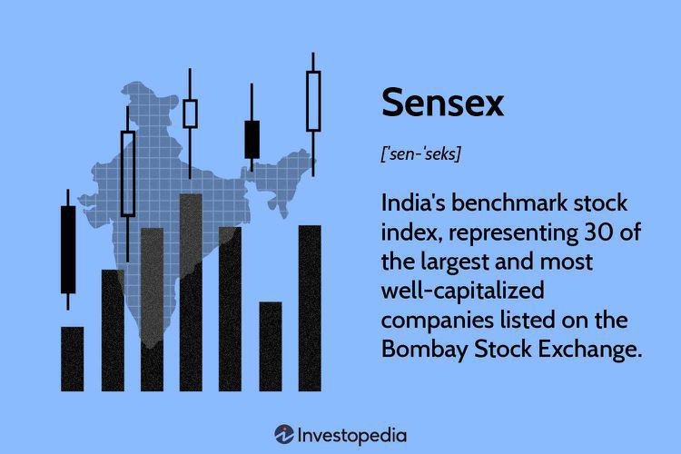

Stock markets serve as vital platforms for the trading of financial securities, and they play a critical role in the global financial ecosystem. Among these, the Bombay Stock Exchange (BSE) stands out as a cornerstone of financial activity in India. Established in 1875, BSE is the oldest stock exchange in Asia and has since grown to become one of the most significant financial markets worldwide. The BSE facilitates the trading of diverse financial instruments, including equities, derivatives, and mutual funds, making it an essential hub for traders, investors, and financial institutions within India and internationally.

At the heart of the BSE's influence is the S&P BSE Sensex, a benchmark index that encapsulates the performance of the 30 largest and most financially sound companies listed on the exchange. Comprising a variety of sectors, the Sensex is a crucial barometer for the economic health and investor sentiment in India. By tracking the top-tier companies, the Sensex provides a comprehensive overview of market trends, serving as a guide for both domestic and international investors looking to understand or invest in the Indian economy. The index’s movement is closely monitored as it reflects broader economic changes and investor confidence.

In recent years, the landscape of financial markets has been significantly transformed by the advent of algorithmic trading, or algo trading. This innovative trading strategy relies on complex algorithms and computerized systems to execute trades at speeds and volumes that surpass human capabilities. The rise of algo trading is attributed to its advantages, such as enhanced speed, improved accuracy, and the efficient processing of vast amounts of data. These benefits have made algo trading an integral component of modern financial markets, shifting how trades are executed and strategies are developed.

The progression from traditional stock trading to modern technological practices epitomizes the synergy between established trading methods and recent technological advancements. While conventional trading relies heavily on human intuition and decision-making, algo trading integrates data analytics, machine learning, and artificial intelligence to make precise trading decisions. This integration not only enhances the capacity of market participants to execute trades but also contributes to market liquidity and efficiency, leading to more dynamic and responsive financial markets.

In this context, exploring the role of algorithmic trading within the Bombay Stock Exchange and the S&P BSE Sensex offers valuable insights into how technology is reshaping financial markets. The interplay between the established structures of the BSE and the innovative approaches of algo trading highlights the ongoing evolution of market practices. This article aims to dissect this integration, focusing on how the BSE and Sensex are adapting to include advanced trading technologies and what this means for the future of trading in India and beyond.

## Table of Contents

## Understanding the Bombay Stock Exchange

The Bombay Stock Exchange (BSE) is a pivotal institution in the landscape of financial markets, not only in India but across Asia as well. Founded in 1875, it stands as one of the oldest exchanges on the continent, symbolizing the longstanding tradition of financial trading in the region. Over the years, the BSE has transitioned from a traditional outcry-based exchange to a modern, technologically advanced trading platform, reflecting a broader trend of evolution in global financial markets.

The structure of the BSE is designed to support a comprehensive range of financial instruments, including equities, derivatives, bonds, and mutual funds. This diverse array of offerings caters to various investor needs and supports a broad spectrum of trading activities. The exchange's pivotal role in the Indian financial ecosystem is underscored by its function as a facilitator of capital formation, market [liquidity](/wiki/liquidity-risk-premium), and price discovery—essential components for the robust functioning of financial markets. By acting as an intermediary between buyers and sellers, the BSE enhances market liquidity, providing participants with the ability to buy and sell securities with ease. This liquidity is crucial for maintaining market stability and attracting both domestic and international investors.

Transparency is another cornerstone of the BSE's operations. The exchange has consistently adhered to stringent regulatory standards and implemented systems that ensure fair and transparent trading practices. Real-time data dissemination and adherence to global best practices further bolster its reputation as a credible market facilitator. This adherence to transparency and regulatory compliance fortifies investor confidence, which is vital for the sustainable growth of the financial markets.

Supporting various types of securities, the BSE plays a fundamental role in the broader financial ecosystem. In the equities market, it enables the trading of shares for numerous listed companies, ranging from large-cap corporations to smaller, emerging enterprises. Derivatives, including futures and options, are also actively traded on the BSE, offering market participants instruments for risk management and speculation. Additionally, the BSE's bond market facilitates the trading of government and corporate bonds, contributing to the effective allocation of debt capital. Mutual funds listed on the BSE provide investors with avenues for collective investment schemes, further diversifying their investment options.

In conclusion, the Bombay Stock Exchange is more than just a trading venue; it is an integral part of India's financial architecture and a critical player in the global market landscape. Its historical evolution, market structure, and multifaceted offerings underscore its importance in fostering an environment of liquidity and transparency. As it continues to embrace and integrate technological advancements, the BSE is well-positioned to enhance its value proposition for investors worldwide.

## Decoding the S&P BSE Sensex

The S&P BSE Sensex, often referred to simply as the Sensex, is a prominent stock market index that offers invaluable insights into the Indian economy and financial markets. Functioning as a barometer for the performance of the Indian stock market, the Sensex was introduced on January 1, 1986, providing a critical reference point for investors, analysts, and policymakers alike.

The methodology behind the composition of the Sensex is designed to reflect the broad spectrum of the Indian corporate sector. It consists of the 30 largest and most financially robust companies listed on the Bombay Stock Exchange (BSE). These companies are selected based on their market capitalization, liquidity, and financial soundness, among other factors. The index employs the "free-float market capitalization" method, which adjusts the market capitalization of the companies by only considering shares readily available for trading, excluding locked-in shares held by promoters, government, or strategic investors. This approach ensures that the Sensex provides a more accurate reflection of market sentiments and dynamics.

The inclusion criteria for companies in the Sensex are quite stringent. A company must be listed on the BSE and must feature prominently in terms of individual stock index market capitalization and trading frequency. The emphasis is on sectoral balance to ensure that the index remains representative of the larger economic landscape, thereby better mirroring the health and trajectory of India's stock markets.

Historically, the Sensex's performance highlights have served as indicators of the larger economic trends within India. For instance, the index's ascents and descents dovetail with the ebbs and flows of the Indian economy—rising in periods of robust economic growth fueled by sectors like information technology and pharmaceuticals, and contracting during economic slowdowns such as the 2008 global financial crisis. For investors, tracking the Sensex offers a snapshot of the economic pulse, helping them to form strategic decisions based on historical data and prevailing market conditions.

Globally, the Sensex serves as an important gauge of economic and market conditions in India for international investors. As one of the leading indices from an emerging market economy, it attracts significant international attention, with movements in the Sensex often prompting reassessments of India's economic prospects and influencing foreign investment strategies. Many international exchange-traded funds (ETFs) and mutual funds track the Sensex, further underlining its relevance as a metric of economic performance.

In sum, the S&P BSE Sensex stands as a vital instrument for understanding and engaging with the Indian stock markets. Its construction and historical significance not only reflect the intricacies of India's evolving economy but also position it as a pivotal point of reference for both domestic and international stakeholders.

## The Rise of Algorithmic Trading

Algorithmic trading, often referred to as algo trading, is a method of executing trades using automated and pre-programmed trading instructions to account for variables such as timing, price, and [volume](/wiki/volume-trading-strategy). With the advent of computational technologies, algo trading has become an integral part of modern financial markets. At its core, [algorithmic trading](/wiki/algorithmic-trading) utilizes mathematical models and algorithms to make decisions and execute trades at high speeds—far beyond human capability. These systems can analyze a vast array of market data, identify trading opportunities, and execute trades within milliseconds.

The primary advantage of algorithmic trading lies in its speed and precision. Computers can react to market conditions and trade opportunities almost instantaneously, reducing the likelihood of human delay and error. This swift execution permits traders to capitalize on minute price disparities, a strategy often utilized in high-frequency trading ([HFT](/wiki/high-frequency-trading-strategies)). The algorithms can manage large volumes of data and execute high-frequency trades at a scale that would be unmanageable manually. Furthermore, the accuracy of these algorithms allows for complex strategies to be implemented consistently and without emotion, which often influences human decision-making.

Globally, algorithmic trading has revolutionized financial markets over the last decades, evolving from simple strategies to more sophisticated models. In established markets like the United States and Europe, algo trading accounts for a significant proportion of trading volume, often exceeding 50% of total trades. These markets have witnessed an increase in market efficiency and liquidity due to the widespread use of algorithmic strategies. Furthermore, advanced algorithms have enabled the development of strategies such as pairs trading, statistical [arbitrage](/wiki/arbitrage), and [market making](/wiki/market-making), leading to more robust and resilient markets.

Emerging markets, including India, are witnessing a burgeoning adoption of algorithmic trading. The Bombay Stock Exchange (BSE), for instance, has embraced technological advancements to support the use of such strategies. As infrastructure improves and regulatory frameworks develop, algo trading is progressively being integrated into these markets. In India, the penetration of algorithmic trading has been bolstered by the liberalization of markets, advancements in technology, and increasing participation by institutional investors. As a result, algo trading now constitutes a significant portion of the trading volume in these markets, enhancing liquidity and market depth.

In conclusion, algorithmic trading marks a paradigm shift in the finance industry. With its ability to process complex datasets efficiently and execute trades with precision and speed, it continues to influence trading practices across global markets, including emerging economies like India. As markets evolve, the role of algorithmic trading is likely to expand further, driven by technological advancements and increased adoption by financial institutions and individual traders alike.

## Algo Trading on the Bombay Stock Exchange

The Bombay Stock Exchange (BSE) has made significant strides in integrating algorithmic trading into its ecosystem, responding to the growing global trend of technology-driven financial markets. Leveraging cutting-edge technology, the BSE has established a robust infrastructure to support high-frequency trading activities. The institution provides co-location facilities that allow traders to place their servers within or near the exchange's data centers, drastically reducing latency and ensuring real-time data transmission. This proximity is crucial for algorithmic trading, where milliseconds can make a significant difference in trading outcomes.

The BSE operates under the regulatory framework set by the Securities and Exchange Board of India (SEBI), which has introduced stringent guidelines to govern algorithmic trading. These regulations aim to maintain market integrity and minimize risks associated with high-speed trades. SEBI mandates pre-approval of trading algorithms and imposes stringent checks on order-to-trade ratios, thereby ensuring a level playing field for all market participants.

Algorithmic trading on the BSE employs various strategies, each leveraging mathematical models and pre-programmed instructions to execute trades autonomously. Arbitrage is a popular strategy wherein algorithms exploit price differentials of identical or similar financial instruments in different markets to secure risk-free profits. For example, an algorithm might detect a price discrepancy of a stock listed on both the BSE and National Stock Exchange (NSE) of India and execute simultaneous buy-sell orders to profit from the difference.

Scalping, another widely used strategy, involves making high volumes of small profits by taking advantage of small price gaps created by order flows or spreads. Algorithms execute trades in rapid succession, capitalizing on minute market movements often unnoticed by human traders. Meanwhile, market making involves placing buy and sell orders for a particular security simultaneously, enabling a steady flow of liquidity and reducing [volatility](/wiki/volatility-trading-strategies) for the asset.

The adoption of algorithmic trading has significantly impacted the BSE's liquidity and market efficiency. High-frequency algorithms contribute to increased trading volumes and tighter bid-ask spreads, enhancing market depth and price discovery processes. Furthermore, the ability to process vast quantities of data at lightning speeds has made the BSE more resilient to abrupt market shifts, ensuring smoother transaction flows even during periods of high volatility.

In summary, the BSE's embracement of algorithmic trading has modernized India's financial markets, rendering them more dynamic and competitive on the global stage. The technological advancements fused with regulatory oversight ensure that while efficiency and liquidity are maximized, market stability and fairness are sustained.

## Future Prospects and Challenges

Algorithmic trading is increasingly becoming a vital component of the global financial ecosystem, and the Bombay Stock Exchange (BSE) is no exception. As digital technologies advance and trading strategies become more sophisticated, the integration of algorithmic trading into the BSE offers significant growth potential while posing certain challenges.

### Potential Growth and Future Trends

Algorithmic trading is expected to continue its upward trajectory in the BSE due to the numerous advantages it offers, including execution speed, reduced transaction costs, and the ability to handle large volumes of transactions. The integration of [artificial intelligence](/wiki/ai-artificial-intelligence) and [machine learning](/wiki/machine-learning) techniques is likely to further enhance these capabilities, allowing for more predictive and adaptive trading strategies. These advancements could lead to increased participation in the BSE by both domestic and international investors, thereby enhancing the liquidity and attractiveness of the S&P BSE Sensex.

Moreover, the growing emphasis on data analytics and high-frequency trading (HFT) is anticipated to propel algorithmic trading in ways not seen before. As computational technology becomes more advanced and data access becomes more real-time, algorithms will certainly gain a competitive edge, interpreting market trends more efficiently and making trading decisions with minimal human intervention.

### Challenges and Risks

Despite its prospects, algorithmic trading introduces a set of challenges and risks that must be addressed. One primary concern is market volatility. The high-speed nature of algorithm trading, particularly high-frequency trading, can exacerbate sharp market movements, leading to sudden crashes or destabilizations. Technological failures or software bugs could lead to erroneous trades, causing significant financial losses.

Additionally, the complexity of algorithms may lead to opaqueness, where traders and regulators find it difficult to understand or predict trading behaviors. This can pose a systemic risk to the market, especially if a fault in a widely-used algorithm goes undetected.

### Regulatory Developments

To mitigate these risks, regulatory bodies have been actively working on frameworks to oversee and control algorithmic trading. The Securities and Exchange Board of India (SEBI) has implemented several regulations aimed at increasing transparency and reducing systemic risk. These measures include mandatory audits of algorithms, circuit breakers to prevent extreme price volatility, and requirements for trading firms to have risk management controls in place.

Moreover, there are ongoing discussions about implementing stricter regulations on high-frequency trading to curb its most adverse impacts. Such measures may involve limits on the number of orders a trader can place within a certain time frame and enhanced scrutiny of algorithm trading strategies to ensure they adhere to fair trading practices.

### Evolving Investor Behavior and Technological Influence

Investor behavior is also evolving with technological advancements. Modern investors increasingly rely on data-driven insights and automated platforms to make informed decisions. This shift is prompting firms to incorporate advanced technologies, such as blockchain and machine learning, into their trading practices, offering more personalized and efficient services to the investor community.

In essence, the landscape of algorithmic trading on the BSE is one of both immense opportunity and intricate challenge. As technology continues to evolve, so too will the strategies and practices of investors and regulators alike, shaping a dynamic future for the BSE and the S&P BSE Sensex. Embracing these changes while maintaining market integrity will be crucial for the sustainable growth and stability of India's stock markets.

## Conclusion

The Bombay Stock Exchange (BSE), as one of Asia's oldest exchanges, plays a crucial role in the Indian and global financial ecosystems. The S&P BSE Sensex, its flagship index, serves as a vital benchmark, reflecting the health and performance of India's economic landscape. This index is composed of the 30 most substantial and financially robust companies listed on the BSE, providing investors with a reliable gauge of market conditions.

Algorithmic trading has emerged as a transformative force within the financial markets, integrating seamlessly with traditional stock trading. On the BSE, it offers advantages such as speed, accuracy, and the capability to process large volumes of data efficiently. By leveraging technological advancements, algorithmic trading has enhanced market liquidity and efficiency, supporting a more vibrant trading environment on the BSE.

However, the integration of technology into stock trading necessitates a delicate balance. While the benefits of algorithmic trading are substantial, maintaining market stability is paramount. The risks, including market volatility and potential technological failures, must be meticulously managed through robust regulatory frameworks and infrastructure.

For aspiring traders and market enthusiasts, further exploration and education in algorithmic trading are essential. Understanding the nuances of these advanced trading technologies can open new perspectives and opportunities within the stock market.

Looking ahead, the continued evolution of stock markets in India and globally will be significantly shaped by the adaptation of advanced trading technologies. Future developments are likely to bring increased efficiency and connectivity, fostering deeper market integration worldwide. As such, the convergence between traditional financial markets and technology-driven innovations will remain a dynamic and pivotal aspect of the financial landscape.

## References & Further Reading

[1]: Bergstra, J., Bardenet, R., Bengio, Y., & Kégl, B. (2011). ["Algorithms for Hyper-Parameter Optimization."](https://papers.nips.cc/paper/4443-algorithms-for-hyper-parameter-optimization) Advances in Neural Information Processing Systems 24.

[2]: ["Advances in Financial Machine Learning"](https://www.amazon.com/Advances-Financial-Machine-Learning-Marcos/dp/1119482089) by Marcos Lopez de Prado

[3]: ["Evidence-Based Technical Analysis: Applying the Scientific Method and Statistical Inference to Trading Signals"](https://www.amazon.com/Evidence-Based-Technical-Analysis-Scientific-Statistical/dp/0470008741) by David Aronson

[4]: ["Machine Learning for Algorithmic Trading"](https://github.com/stefan-jansen/machine-learning-for-trading) by Stefan Jansen

[5]: ["Quantitative Trading: How to Build Your Own Algorithmic Trading Business"](https://www.amazon.com/Quantitative-Trading-Build-Algorithmic-Business/dp/1119800064) by Ernest P. Chan