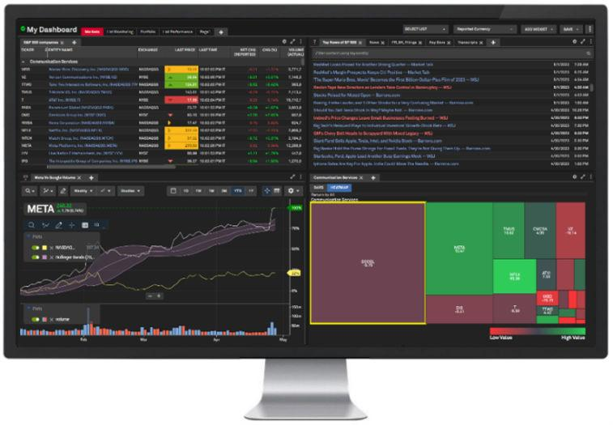

## Table of Contents

## What is S&P Capital IQ and what does it do?

S&P Capital IQ is a company that provides financial information and data to businesses and investors. It is part of S&P Global, which is a big company that gives out financial information and analysis. S&P Capital IQ helps people make smart choices about investing and managing money by giving them detailed information about companies, markets, and the economy.

The company collects a lot of data from different places and puts it all together in one place. This makes it easier for people to find the information they need quickly. S&P Capital IQ offers tools and reports that help users understand financial trends, analyze companies, and see how different investments might perform. This can be really helpful for people working in finance, like bankers, investors, and analysts.

## What are the main products offered by S&P Capital IQ?

S&P Capital IQ offers several main products that help people in the financial world. One of their key products is the Capital IQ Platform, which is a big database full of financial information about companies, markets, and the economy. People can use this platform to look up data, make reports, and do research. It's really helpful for understanding how companies are doing and making smart investment choices.

Another important product is S&P Global Market Intelligence, which gives detailed information and analysis about different industries and markets. This helps users see trends and understand what's happening in the world of business. They also offer tools like the Credit Analytics, which helps people figure out the credit risk of companies, and the SNL Financial, which focuses on specific sectors like real estate and energy.

Lastly, S&P Capital IQ provides services like the Xpressfeed, which lets users get data directly into their own systems. This can save a lot of time and make things more efficient. All these products together help people in finance make better decisions by giving them the information and tools they need.

## How can S&P Capital IQ's data and analytics services benefit a business?

S&P Capital IQ's data and analytics services can help a business in many ways. They give businesses a lot of information about other companies, markets, and the economy. This information can help a business understand how well other companies are doing, which can be useful when deciding to invest in them or work with them. It also helps businesses see what's happening in their industry and the bigger market, so they can make better plans and decisions.

Using S&P Capital IQ's tools, a business can also save time and work more efficiently. For example, the Xpressfeed service lets businesses get data straight into their own systems, so they don't have to spend time looking for information. The Credit Analytics tool helps businesses understand the risk of working with other companies, which can keep them safe from bad financial decisions. Overall, S&P Capital IQ's services give businesses the information and tools they need to make smart choices and grow.

## What industries does S&P Capital IQ primarily serve?

S&P Capital IQ mainly helps people in the finance industry. This includes banks, investment firms, and people who work as financial analysts. They use S&P Capital IQ's information and tools to make smart decisions about where to invest money and how to manage their finances. The data and reports from S&P Capital IQ help them understand how different companies and markets are doing, which is really important for their work.

The company also serves other industries like real estate and energy. For real estate, S&P Capital IQ provides information that helps people understand the property market and make good investment choices. In the energy sector, their data helps companies see trends and plan for the future. By giving detailed information and analysis, S&P Capital IQ helps businesses in these industries make better decisions and grow.

## Can you explain the features of the S&P Capital IQ Pro platform?

The S&P Capital IQ Pro platform is a powerful tool that helps people in finance get the information they need quickly. It has a big database with lots of data about companies, markets, and the economy. Users can search for information easily and make reports to help them understand how companies are doing. The platform also has tools that let users see financial trends and analyze data in different ways. This makes it easier for people like bankers and investors to make smart decisions about where to put their money.

Another great thing about the S&P Capital IQ Pro platform is that it's easy to use and can be changed to fit what each user needs. People can set up their own dashboards with the information they use most often. This saves time and makes their work more efficient. The platform also connects with other systems, so users can get data right into their own tools. This is really helpful for big businesses that need to use a lot of data quickly. Overall, the S&P Capital IQ Pro platform helps people in finance get the information they need to make good choices and do their jobs well.

## How does S&P Capital IQ integrate with other financial software?

S&P Capital IQ makes it easy to work with other financial software by using something called Xpressfeed. This tool lets users take data from S&P Capital IQ and put it right into their own systems. This means that people don't have to spend a lot of time moving data around. It saves time and helps them work faster. For example, if someone is using a special program for their financial analysis, they can get all the data they need from S&P Capital IQ without any extra work.

The platform also has something called APIs, which are like special ways for different software to talk to each other. This lets users connect S&P Capital IQ with other tools they use every day. Whether it's for making reports, analyzing data, or managing investments, these connections make everything smoother. By working well with other financial software, S&P Capital IQ helps people in finance do their jobs better and make smarter decisions.

## What kind of financial data does S&P Capital IQ provide?

S&P Capital IQ gives out a lot of different financial information. It has data about companies, like how much money they make, how much they owe, and how their stock is doing. This helps people see if a company is doing well or not. They also have information about markets, like stock prices, interest rates, and how different industries are doing. This can help people understand what's happening in the world of business and make better choices about where to invest their money.

The data from S&P Capital IQ covers many different areas. It includes things like financial statements, which show a company's income and expenses, and credit ratings, which tell you how likely a company is to pay back its debts. They also have information about mergers and acquisitions, which is when companies buy or join with other companies. All this data is put together in one place, so it's easy for people to find what they need and use it to make smart decisions about their money.

## How does S&P Capital IQ ensure the accuracy and reliability of its data?

S&P Capital IQ works hard to make sure its data is accurate and reliable. They collect information from many different places, like company reports, government records, and news sources. Then, they check this information carefully to make sure it's correct. They also update their data all the time, so it stays current. If they find any mistakes, they fix them quickly to keep the information trustworthy.

To keep their data reliable, S&P Capital IQ uses special systems and processes. They have teams of people who are experts in checking and verifying data. These teams use special tools and methods to make sure the information is right. They also work with other companies and organizations to get the best and most accurate data possible. By doing all these things, S&P Capital IQ helps people trust the information they use to make important financial decisions.

## What are the pricing models for S&P Capital IQ's services?

S&P Capital IQ has different pricing models to fit the needs of different users. They offer subscription plans that can be monthly or yearly. The cost depends on what kind of information and tools you need. For example, if you just want basic data, it might be cheaper than if you need advanced tools and detailed reports. They also have different packages for different industries, like finance, real estate, and energy, so you can choose the one that's best for your job.

Some businesses might want to use S&P Capital IQ's data in their own systems. For them, there's a service called Xpressfeed, which lets you get data directly into your own tools. This service can be priced differently based on how much data you need and how often you want it updated. Overall, S&P Capital IQ tries to make their pricing flexible so that different users can find a plan that works for them.

## Can you describe a case study where S&P Capital IQ's services led to significant business improvements?

A big investment bank was looking to improve its investment strategies and needed better data to make smarter decisions. They started using S&P Capital IQ's services and saw a big change. With the detailed company data and market analysis from S&P Capital IQ, the bank could find new investment opportunities faster. They used the platform's tools to make reports that showed them which companies were doing well and which ones might be good to invest in. This helped them make better choices and grow their investments.

The bank also saved a lot of time by using S&P Capital IQ's Xpressfeed service. This service let them get data right into their own systems, so they didn't have to spend time looking for information. The bank's analysts could focus more on analyzing the data and less on collecting it. As a result, they were able to work more efficiently and make more money for their clients. Overall, using S&P Capital IQ's services helped the bank improve its investment strategies and grow its business.

## What advanced analytical tools does S&P Capital IQ offer to expert users?

S&P Capital IQ offers several advanced analytical tools that help expert users dive deep into financial data. One of these tools is the Financial Modeling tool, which lets users build detailed models to predict how companies might perform in the future. This is really helpful for making investment decisions because it shows what might happen based on different scenarios. Another tool is the Screening and Analytics, which helps users find companies that meet certain criteria, like high growth or low debt. This makes it easier to find good investment opportunities quickly.

The platform also has a tool called Credit Analytics, which is great for understanding the risk of lending money to companies. It uses a lot of data to figure out how likely a company is to pay back its debts. This is important for banks and investors who need to know if a company is a safe bet. Lastly, the Excel Plugin is a powerful tool that lets users pull data directly into Excel, where they can do their own analysis and create custom reports. This makes it easier for expert users to work with the data in a way that fits their needs.

## How does S&P Capital IQ stay ahead of market trends and technological advancements?

S&P Capital IQ stays ahead of market trends by always collecting and updating a lot of data from different places. They have teams of people who watch what's happening in the world of business and finance. These teams use special tools to look at the data and find new trends. When they see something important, they quickly add it to their platform so users can see it too. This helps people make smart decisions based on the latest information.

They also keep up with new technology by working with experts and using the latest tools. S&P Capital IQ is always trying to make their platform better and easier to use. They listen to what their users need and add new features that help them work faster and better. By doing this, they make sure their services are always up-to-date and useful for people in finance.

## References & Further Reading

[1]: ["Advances in Financial Machine Learning"](https://www.amazon.com/Advances-Financial-Machine-Learning-Marcos/dp/1119482089) by Marcos Lopez de Prado

[2]: ["Evidence-Based Technical Analysis: Applying the Scientific Method and Statistical Inference to Trading Signals"](https://www.amazon.com/Evidence-Based-Technical-Analysis-Scientific-Statistical/dp/0470008741) by David Aronson

[3]: ["Machine Learning for Algorithmic Trading"](https://github.com/stefan-jansen/machine-learning-for-trading) by Stefan Jansen

[4]: ["Quantitative Trading: How to Build Your Own Algorithmic Trading Business"](https://www.amazon.com/Quantitative-Trading-Build-Algorithmic-Business/dp/1119800064) by Ernest P. Chan

[5]: Bergstra, J., Bardenet, R., Bengio, Y., & Kégl, B. (2011). ["Algorithms for Hyper-Parameter Optimization."](https://dl.acm.org/doi/10.5555/2986459.2986743) Advances in Neural Information Processing Systems 24.