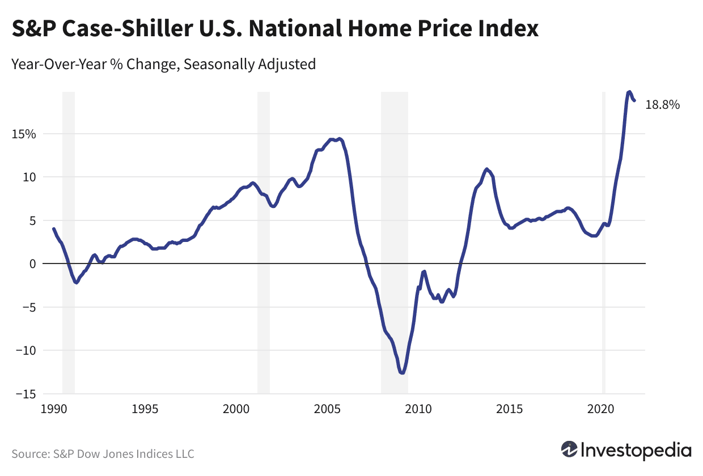

The real estate market serves as a dynamic component of the global economy, mirroring broader financial trends and offering a window into overall economic health. This sector exhibits significant impacts on various facets of life, from individual wealth and consumption patterns to broader policy and investment strategies. Home price indices are crucial tools in this domain, providing vital insights into the pricing trends of residential properties over time. Among these, the S&P CoreLogic Case-Shiller Home Price Indices stand out for their comprehensive coverage and reliability in the United States. 

These indices are indispensable for various stakeholders, including investors, policymakers, and researchers, as they assess housing conditions and predict future market behaviors. They offer a means to quantify changes in property values, assisting in the evaluation of market health and helping forecast economic activity linked to real estate. Understanding the mechanics and implications of these indices is essential for anyone involved in real estate markets.

This article examines the intersection of home price indices, particularly the Case-Shiller Index, with algorithmic trading—a modern investment methodology that utilizes computer algorithms to automate trading decisions. The integration of such data-driven approaches within real estate investment promises enhanced efficiency and data analysis capabilities. By exploring these components and their interactions, the article aims to shed light on past and potential future trends within the real estate market. Additionally, it investigates how these indices operate, their significance in assessing market conditions, and their potential role in sophisticated trading strategies like algorithmic trading.

## Table of Contents

## Understanding Home Price Indices

Home price indices are quantitative tools that capture changes in the prices of residential properties over time. These indices are indispensable for various stakeholders, such as investors, policymakers, and researchers, as they provide a comprehensive view of the real estate market dynamics. By analyzing these indices, one can discern past trends, understand current market conditions, and predict future movements, offering essential insights into the overall health and activity of the market.

Home price indices are primarily constructed using data from property transactions. They reflect the average price change over a specified period and can be adjusted to account for factors such as inflation or seasonal variations. A common methodology used in constructing these indices is the repeat-sales method, which focuses on properties that have been sold more than once. This method ensures that the index is tracking the price change of the same property, thus providing a more accurate representation of the market's movement.

One widely recognized index in the United States is the S&P CoreLogic Case-Shiller Home Price Indices. This index encompasses various components, such as the 10-City and 20-City Composite Indices, which offer insights into regional market trends. Each component of the index is a weighted average of various city-specific indices, calculated to reflect the proportional importance of each city in the housing market.

The significance of these indices extends beyond real estate transactions. They serve as critical inputs for economic forecasts, influencing monetary policy decisions, risk management, and investment strategies. Investors use home price indices to gauge market conditions and devise strategies that align with anticipated market trends. Policymakers leverage these indices to craft regulations and interventions aimed at stabilizing the housing market.

Overall, home price indices are a vital component of market analysis, facilitating a deeper understanding of residential real estate dynamics and enabling data-driven decision-making across the board.

## The S&P CoreLogic Case-Shiller Home Price Indices

The S&P CoreLogic Case-Shiller Home Price Indices provide a detailed analysis of U.S. residential real estate prices, offering insights into both national trends and those specific to major metropolitan areas. These indices were developed in the 1980s by economists Karl Case and Robert Shiller, initially to serve as a reliable statistical tool for tracking changes in real estate prices. The indices focus on repeated sales, meaning they are derived from properties that have been purchased or sold multiple times. This method provides a more accurate reflection of true market values, eliminating discrepancies caused by differences in property size, upgrades, or location.

The Case-Shiller Indices comprise several components, most notably the 10-City and 20-City Composite Indices. The 10-City Composite Index tracks housing prices in 10 major cities, including New York, Los Angeles, and Chicago. Meanwhile, the 20-City Composite Index expands the scope to include an additional ten cities, such as Denver and Detroit. These indices are particularly valuable as they offer a spectrum of real estate market conditions across varied urban environments.

The methodology underpinning the Case-Shiller Indices is a repeat sales model. This approach compares the prices of the same property in two different periods, thus gauging price changes in the market effectively. This model is mathematically represented as follows:

$$
Price \, Index = \frac{Current \, Sale \, Price}{Previous \, Sale \, Price}
$$

To ensure accuracy, the indices adjust for factors like six-month moving averages and seasonal variations. Data sources include county assessor and recorder offices, ensuring comprehensive coverage and reliability. Moreover, any extreme price changes that suggest anomalies—like renovations or severe property damage—are filtered out. By using this robust methodology, the Case-Shiller Indices offer precise insights into housing trends and provide stakeholders with essential tools for market analysis, helping economists, policymakers, and investors to understand past market behavior and predict future trends.

## Significance of the Case-Shiller Index in Real Estate

The Case-Shiller Index is an integral tool in understanding the economic implications of real estate price fluctuations. It serves as a critical reference for market analysis, allowing stakeholders to make informed investment decisions and conduct comprehensive risk assessments. By providing detailed data on price trends, it assists investors in forecasting market directions and evaluating the economic health of the housing sector.

Economists and analysts often rely on the Case-Shiller Index to gauge housing market health. Its historical price data is invaluable for tracking recovery rates after economic downturns and for identifying signs of potential future declines. This systematic approach to monitoring real estate trends helps stakeholders formulate strategic responses to market changes.

The Case-Shiller Index's utility extends to financial markets through its influence on futures and options. On platforms like the Chicago Mercantile Exchange, the index supports the trading of derivatives, which are financial instruments whose value is dependent on the price movements of underlying assets, such as home prices in this case. This derivative market provides hedging opportunities for investors, allowing them to mitigate risks associated with real estate investments. Consequently, the Case-Shiller Index not only reflects real estate trends but also actively influences market activities by shaping trading strategies.

In summary, the Case-Shiller Index remains a pivotal element in the financial analysis and trading of real estate, using its comprehensive data to inform market participants and support sophisticated investment and hedging strategies. Its impact underscores the interconnectedness between real estate markets and broader economic trends.

## The Rise of Algorithmic Trading in Real Estate Investing

Algorithmic trading (algo trading) is transforming real estate investing by leveraging advanced data analytics to enhance decision-making processes. This innovative approach allows investors to parse vast datasets, identify patterns, and execute transactions with increased efficiency and accuracy. In particular, the integration of home price indices, such as the S&P CoreLogic Case-Shiller Home Price Indices, into algorithmic models is reshaping strategies and improving trading performance.

Home price indices provide a reliable quantitative measure of real estate market trends, which can be crucial in [algorithmic trading](/wiki/algorithmic-trading). The Case-Shiller Index, for example, offers granular insights into price fluctuations across different metropolitan regions. By inputting such data into algorithmic models, investors can track historical price changes, establish price trends, and forecast future value movements. This capability enables more informed investment strategies, reducing the risks associated with market [volatility](/wiki/volatility-trading-strategies).

One of the primary benefits of algorithmic trading in real estate is its ability to process data at high speed and [volume](/wiki/volume-trading-strategy), significantly outperforming traditional human analysis. For instance, by employing [machine learning](/wiki/machine-learning) algorithms, traders can identify correlations and anomalies within the market that would be virtually impossible to discern manually. The ability to act on these insights swiftly leads to optimized transaction timing, often resulting in better pricing and enhanced returns.

Despite its advantages, the integration of algorithmic trading in real estate investing also presents challenges. Data quality and availability can influence the effectiveness of algorithmic models. Furthermore, real estate markets are subject to various exogenous factors, such as regulatory changes and economic shifts, which may not always be accurately captured by historical data. Thus, the development and refinement of robust, adaptive algorithms are essential to address these uncertainties.

The future potential of algo trading in real estate is promising as technology continuously evolves. Advanced computational methods, such as [artificial intelligence](/wiki/ai-artificial-intelligence) and neural networks, are expected to further enhance the predictive power of trading models. Additionally, the increasing availability of real-time data feeds and improved computational capacity will support more dynamic and responsive trading strategies.

In summary, the advent of algorithmic trading marks a significant evolution in real estate investing, driven by the ability to leverage comprehensive data analytics. Stakeholders can realize substantial gains by embracing these technologies while remaining cognizant of the inherent challenges and adapting their strategies accordingly.

## Conclusion

The combination of comprehensive home price data and advanced trading strategies is reshaping the landscape of real estate investment. The S&P CoreLogic Case-Shiller Home Price Indices, in particular, serve as pivotal tools in market analysis, offering in-depth insights into housing trends and guiding both investment and policy decisions. By accurately reflecting historical price fluctuations, these indices enable investors to make informed decisions, thus bolstering the stability and growth of real estate portfolios.

As algorithmic trading gains [momentum](/wiki/momentum), its integration with home price data introduces a transformative approach to real estate investing. Algorithms can assimilate and analyze vast datasets—including those provided by the Case-Shiller Index—at unprecedented speeds, optimizing transaction efficiency and enhancing strategic decision-making. The adoption of such technologies presents significant opportunities, including the potential for more precise market predictions and timely investment actions. However, this evolution is not without its challenges. The real estate market's inherent complexities—such as [liquidity](/wiki/liquidity-risk-premium) issues, regulatory considerations, and the socio-economic factors influencing property values—necessitate ongoing refinement and adaptation of algorithmic models.

For stakeholders in the real estate sector—from investors and analysts to policymakers—remaining informed about these technological advancements is crucial. By understanding and leveraging these emerging trends, stakeholders can position themselves advantageously, potentially yielding greater investment returns and fostering more resilient market environments. 

Looking forward, continued research and technological development are poised to further enhance market efficiency and investment outcomes. Innovations in data analytics, machine learning, and artificial intelligence promise to refine real estate investment strategies, making them more responsive to dynamic market conditions. As these technologies mature, they will likely catalyze a new era of data-driven decision-making, ultimately contributing to a more predictable and robust real estate market.

## References & Further Reading

[1]: Case, K.E., & Shiller, R.J. (1987). ["Prices of Single Family Homes Since 1970: New Indexes for Four Cities."](https://www.nber.org/papers/w2393) National Bureau of Economic Research Working Paper No. 2393.

[2]: Shiller, R.J. (1991). ["Arithmetic Repeat Sales Price Estimators."](https://www.sciencedirect.com/science/article/pii/S1051137705800282) Journal of Housing Economics, 1(1), 110-126.

[3]: ["Algorithmic and High-Frequency Trading"](https://www.amazon.com/Algorithmic-High-Frequency-Trading-Mathematics-Finance/dp/1107091144) by Álvaro Cartea, Sebastian Jaimungal, and José Penalva

[4]: Lo, A.W., & MacKinlay, A.C. (1999). ["A Non-Random Walk Down Wall Street."](https://www.jstor.org/stable/j.ctt7tccx) Princeton University Press.

[5]: Chincarini, L.B., & Kim, D. (2006). ["Quantitative Equity Portfolio Management: An Active Approach to Portfolio Construction and Management."](https://archive.org/details/quantitativeequi0000chin_c9d6) McGraw-Hill Education.