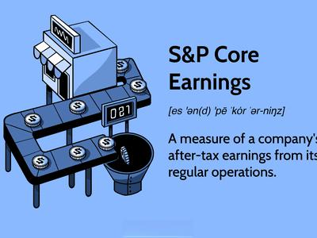

The landscape of corporate earnings analysis has experienced a profound transformation over the years, driven by an increasing demand for more accurate and comprehensive evaluations of a company's profitability. Traditional methods of earnings analysis have often relied heavily on net income figures, which can be distorted by one-time items and non-operational factors. In response to these limitations, S&P Core Earnings have emerged as a pivotal tool, enabling analysts to assess a company's profitability by concentrating on its core operations. Unlike conventional net income, S&P Core Earnings exclude non-recurring items and extraordinary charges, providing a more transparent view of a company's financial health by focusing on its ongoing operational capabilities.

As the accuracy and relevance of financial metrics have improved, they have become integral to advanced trading strategies, particularly in algorithmic trading. Algorithmic trading refers to the use of computer programs and algorithms to execute trades at speeds and frequencies beyond what is possible for human traders. These programs leverage refined financial metrics, such as S&P Core Earnings, to make data-driven decisions that aim to capitalize on market efficiencies and fluctuations. By integrating precise and reliable financial indicators, algorithmic trading systems can optimize trading strategies to achieve superior returns.



This article investigates the emerging synergy between S&P Core Earnings, financial metrics, corporate earnings, and algorithmic trading. It sheds light on how these elements collectively contribute to a more robust trading environment, offering a refined understanding of corporate financial health and aiding in the development of sophisticated trading models. As market dynamics and technologies continue to evolve, the integration of refined earnings metrics and algorithmic trading promises substantial advancements in investment strategies.

## Table of Contents

## Understanding S&P Core Earnings

S&P Core Earnings represent a refined measure of a company's profitability, focusing primarily on the earnings derived from its core business operations. This approach distinguishes itself by stripping away non-recurring items and unusual gains or losses, which can skew the perception of a company's financial performance. By concentrating on the sustainable components of earnings, S&P Core Earnings offer a clearer picture of a firm's long-term financial health and operational efficiency.

Traditional net income, used widely in financial reporting, often includes extraordinary and non-operational items. These can encompass one-time events such as asset sales, restructuring charges, or litigation settlements, which do not reflect a business's regular operational capabilities. Consequently, relying on net income alone could lead to misinterpretation of financial results if these items substantially distort profitability metrics. S&P Core Earnings mitigate this risk by excluding such items, offering a purer view of a company's recurring earnings potential.

Stock options and other non-cash expenses also play a critical role in the calculation of S&P Core Earnings. Stock options, when exercised, lead to equity dilution, which impacts earnings per share calculations. Including the cost of stock-based compensation in adjusted earnings ensures that shareholders understand the economic impact of such incentives provided to executives and employees. This adjustment aligns reported earnings more closely with the cash flows available to shareholders.

Numerous case examples illustrate the practical advantages of using S&P Core Earnings over traditional measures. For instance, a company reporting a significant gain from the sale of an asset might show inflated net income for a specific period. When such a non-recurring gain is excluded, S&P Core Earnings would reveal the company's true operational performance during that period. Similarly, a firm incurring substantial restructuring costs may appear less profitable using net income alone, whereas S&P Core Earnings would adjust for these costs, providing a more accurate insight into its ongoing earnings power.

In conclusion, the focus on core operational metrics makes S&P Core Earnings a valuable tool for investors and analysts seeking to assess a company's sustainable profitability. By eliminating the noise created by non-recurring and non-operational items, this measure offers a more stable and consistent financial outlook, which is critical for making informed investment decisions.

## Key Financial Metrics in Performance Evaluation

Financial metrics serve as critical tools for evaluating a company's performance and financial health. Among these, the Price-to-Earnings (P/E) ratio, Return on Equity (ROE), and Debt-to-Equity ratio stand out due to their widespread usage and significance.

The Price-to-Earnings (P/E) ratio is a valuation metric that indicates the amount investors are willing to pay for each dollar of earnings. It is calculated as:

$$
\text{P/E Ratio} = \frac{\text{Market Value per Share}}{\text{Earnings per Share (EPS)}}
$$

A high P/E ratio may suggest that a company’s stock is overvalued, or that investors are expecting high growth rates in the future. Conversely, a low P/E might indicate undervaluation or low growth expectations. However, the P/E ratio has its limitations as it does not account for debt and can be skewed by non-recurring items affecting earnings.

Return on Equity (ROE) measures a company's profitability by revealing how much profit a company generates with the money shareholders have invested. The formula is:

$$
\text{ROE} = \frac{\text{Net Income}}{\text{Shareholder's Equity}}
$$

ROE is a key indicator of financial efficiency, offering insights into management’s ability to utilize equity capital effectively. However, ROE can be inflated by high levels of debt, as more leverage increases returns, which necessitates caution in interpretation.

The Debt-to-Equity ratio provides an indication of financial leverage by comparing a company’s total liabilities to its shareholders' equity:

$$
\text{Debt-to-Equity Ratio} = \frac{\text{Total Liabilities}}{\text{Shareholder's Equity}}
$$

This ratio helps analyze a company's financial structure and risk level, where a high ratio may indicate potential difficulties in servicing debt, yet the optimal balance varies across industries. Despite its usefulness, it does not account for nuances such as the quality of assets or the terms of debt agreements.

Each of these metrics offers valuable insights, yet their individual limitations highlight the necessity of a holistic approach. Relying solely on one financial metric may overlook critical aspects of a company’s financial situation. For instance, while the P/E ratio focuses on earnings relative to stock price, it does not account for capital structure variations that the Debt-to-Equity ratio highlights. Similarly, while ROE paints a picture of profitability, it may obscure risk embedded in high leverage.

A comprehensive analytical framework integrates these key financial metrics with qualitative assessments and other financial indicators to offer a more complete picture of a company's financial performance. By understanding the strengths and constraints of each metric, investors and analysts can make more informed decisions, aligning their strategies with the genuine financial health and operational efficiency of the entities they evaluate.

## Algorithmic Trading: Integrating Financial Metrics

Algorithmic trading employs computer algorithms to automate trading decisions, relying heavily on quantitative financial metrics to inform strategies. These metrics, such as S&P Core Earnings, provide traders with refined insights into a company's operational performance by focusing on sustainable income and excluding one-time items, thereby improving the accuracy of predictions and trading outcomes.

The integration of S&P Core Earnings into algorithmic strategies offers substantial advantages. By prioritizing core earnings, algorithms can filter out market noise, reducing errors in trading decisions caused by unusual or rare accounting items. This focus allows for a clearer analysis of recurring profitability, vital for constructing models that anticipate future performance more reliably.

Algorithmic trading models often incorporate financial ratios like the Price-to-Earnings ratio (P/E), Return on Equity (ROE), and Debt-to-Equity ratio alongside S&P Core Earnings. An example of such an integration is a [momentum](/wiki/momentum) trading strategy, which uses historical data and financial metrics to forecast future price movements. In Python, an algorithm might employ these metrics as follows:

```python
import pandas as pd
import numpy as np

# Function to calculate core earnings
def calculate_core_earnings(financial_data):
    core_earnings = financial_data['net_income'] - financial_data['one_time_items']
    return core_earnings

# Example calculation of a momentum strategy incorporating financial ratios
def momentum_strategy(data):
    data['momentum'] = data['price'].pct_change(periods=5) * 100
    data['pe_ratio'] = data['price'] / data['core_earnings']
    data['trade_signal'] = np.where((data['momentum'] > 5) & (data['pe_ratio'] < 15), 1, 0)
    return data

# Sample financial data
financial_data = pd.DataFrame({
    'price': [100, 105, 110, 120, 130],
    'net_income': [10, 12, 11, 15, 18],
    'one_time_items': [2, 1, 3, 0, 1]
})

financial_data['core_earnings'] = calculate_core_earnings(financial_data)
strategy_output = momentum_strategy(financial_data)
print(strategy_output)
```

The use of multiple metrics enriches [algorithmic trading](/wiki/algorithmic-trading) by providing diverse indicators of a company's health and market behavior. Adopting a multi-metric approach helps in distributing risk across various factors, thus enhancing the robustness of predictions. It also facilitates a comprehensive view of potential trading opportunities, which might be overlooked if single metrics were relied upon.

Moreover, using S&P Core Earnings within algorithmic models aligns trading strategies with [fundamental analysis](/wiki/fundamental-analysis). This integration offers a synergistic way to mitigate risks associated with market [volatility](/wiki/volatility-trading-strategies) and to capitalize on returns through well-informed decisions based on stable, recurring profit metrics. As a result, traders can achieve a balanced approach, optimizing trades while safeguarding against erratic market shifts.

## Challenges and Considerations in Financial Metrics and Algo Trading

The application of financial metrics in the context of algorithmic trading presents a range of challenges primarily due to market variations and diverse accounting practices. Market variations can lead to fluctuating financial metrics that may not accurately reflect a company's sustainable financial health. For instance, during periods of economic instability, metrics such as Price-to-Earnings (P/E) ratios may vary widely, potentially misguiding trading algorithms that rely strictly on static thresholds without considering broader economic indicators.

Accounting practices further complicate the use of financial metrics. Different accounting standards and methods, such as historical cost versus fair value accounting, can result in varied interpretations of financial data. These disparities may affect earnings reports and other financial metrics, leading to discrepancies that algorithmic models must be equipped to handle. To mitigate these issues, algorithmic strategies should incorporate adjustable parameters that account for variations in accounting practices.

Algorithmic trading inherently carries risks, primarily revolving around the potential for abrupt market movements and the susceptibility of algorithms to unforeseen market conditions. These risks underscore the necessity of implementing robust safeguards within trading systems. Safeguards might include circuit breakers that halt trading in response to erratic market behaviors, as well as mechanisms for real-time monitoring that can override automated decisions under specific conditions.

Backtesting is crucial in optimizing algorithmic trading strategies. It involves simulating a trading algorithm on historical data to evaluate its performance. Advanced statistical tools are often employed during [backtesting](/wiki/backtesting) to ensure that the observed results are statistically significant and not due to random chance. An effective backtesting process can be illustrated using Python:

```python
import pandas as pd
import numpy as np

# Example: Simple backtesting framework
def backtest_strategy(data, strategy_fn):
    results = []
    for date, price in data.iterrows():
        decision = strategy_fn(price)
        results.append(decision)
    return results

def example_strategy(price):
    # Sample strategy that triggers buy when price falls below a threshold
    return 'Buy' if price < 100 else 'Sell'

# Sample price data
data = pd.Series([95, 102, 97, 104, 101, 99, 98], index=pd.date_range('2023-01-01', periods=7))

# Backtest the example strategy
backtest_results = backtest_strategy(data, example_strategy)
print(backtest_results)
```

Regularly updating algorithms is essential to adapting to new patterns and maintaining performance efficiency. This involves continuously feeding algorithms with fresh data and recalibrating their parameters to reflect current market conditions. Combining these strategies with advanced statistical analysis can help reinforce the robustness of algorithmic trading systems and enhance their capacity to manage risks and optimize returns.

## Conclusion

The integration of S&P Core Earnings with financial metrics in algorithmic trading represents a significant advancement in the precision of investment strategies. By emphasizing core operations and excluding volatile and one-time items, S&P Core Earnings furnish a clearer, more consistent gauge of a company’s financial performance. When coupled with traditional financial metrics such as the Price-to-Earnings (P/E) ratio, Return on Equity (ROE), and Debt-to-Equity ratio, traders can derive a nuanced understanding of a company’s value and operational efficiency.

The implementation of these refined metrics in algorithmic trading enhances these strategies by providing a robust framework to analyze volatility and market trends. Algorithmic models, which utilize these insights, are capable of making data-driven decisions that optimize returns and mitigate risks. Utilizing a multi-metric approach thereby increases the depth of evaluation, empowering traders to discern patterns and execute trades with enhanced precision.

As financial markets and technology evolve, the potential for further advancements in this integration becomes evident. Developments in [machine learning](/wiki/machine-learning) and big data analytics offer opportunities to refine algorithms, improving both accuracy and speed in decision-making. These advancements are anticipated to further integrate real-time data processing, increasing the agility of trading systems in response to fluctuating market dynamics.

Investors are encouraged to leverage this comprehensive analytical framework. The synergy between S&P Core Earnings and other traditional financial metrics facilitates a robust strategy that is adaptive to innovation and informed by tangible performance data. By embracing these refined metrics, traders can optimize their strategies, aligning investment decisions more closely with genuine corporate health and market conditions.

## References & Further Reading

[1]: Bogle, J. C. (2009). ["Common Sense on Mutual Funds: New Imperatives for the Intelligent Investor."](https://books.google.com/books/about/Common_Sense_on_Mutual_Funds.html?id=KZbOlCjj9dEC) John Wiley & Sons.

[2]: Damodaran, A. (2012). ["Investment Valuation: Tools and Techniques for Determining the Value of Any Asset, University Edition."](https://books.google.com/books/about/Investment_Valuation.html?id=5SRHAAAAQBAJ) Wiley Finance.

[3]: Fabozzi, F. J., & Markowitz, H. (2011). ["Equity Valuation and Portfolio Management."](https://onlinelibrary.wiley.com/doi/book/10.1002/9781118267028) John Wiley & Sons.

[4]: Shreve, S. E. (2004). ["Stochastic Calculus for Finance I: The Binomial Asset Pricing Model."](https://www.amazon.com/Stochastic-Calculus-Finance-Binomial-Springer/dp/0387249680) Springer.

[5]: Wilmott, P. (2006). ["Paul Wilmott Introduces Quantitative Finance."](https://www.amazon.com/Paul-Wilmott-Quantitative-Finance-Set/dp/0470018704) John Wiley & Sons.