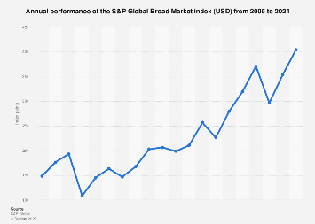

## Table of Contents

## What is the S&P Global Broad Market Index?

The S&P Global Broad Market Index is a stock market index that measures the performance of a large number of companies from around the world. It includes thousands of stocks from different countries, giving investors a broad view of the global market. This index is useful for people who want to understand how the overall global stock market is doing, rather than focusing on just one country or region.

The index is made up of companies of all sizes, from small to large. This makes it different from other indexes that might only include the biggest companies. By including a wide range of companies, the S&P Global Broad Market Index gives a more complete picture of the global economy. Investors often use this index to compare their own investments to the overall market or to create investment products that track the global market's performance.

## What types of securities are included in the S&P Global Broad Market Index?

The S&P Global Broad Market Index includes different types of securities, mainly common stocks from companies around the world. These stocks come from a variety of countries and industries, making the index very diverse. The index covers companies of all sizes, from small to large, which means it includes stocks that might not be part of other, more focused indexes.

In addition to common stocks, the index might also include other types of equity securities. These could be things like preferred stocks or real estate investment trusts (REITs), though common stocks make up the majority. By including a wide range of securities, the S&P Global Broad Market Index aims to give a complete picture of the global stock market's performance.

## How is the S&P Global Broad Market Index constructed?

The S&P Global Broad Market Index is built to show how the whole world's stock market is doing. It includes lots of companies from different countries, big and small. To make this index, they first pick companies that meet certain rules, like being listed on a stock exchange and having enough shares available for trading. They also make sure the companies are from different parts of the world to give a good overall picture.

After picking the companies, they figure out how much each company should count in the index. This is done by looking at the total value of each company, which is called market capitalization. Companies with a bigger market cap will have a bigger part in the index. This way, the index shows what's happening in the global market, with bigger companies having more impact on the index's performance.

## What are the eligibility criteria for inclusion in the S&P Global Broad Market Index?

To be included in the S&P Global Broad Market Index, a company must meet certain rules. It needs to be listed on a stock exchange that S&P Dow Jones Indices recognizes. The company also needs to have enough shares available for trading, so investors can easily buy and sell them. Another rule is that the company must be from a country that S&P includes in their global coverage. This helps make sure the index covers many different parts of the world.

The index also looks at the size of the company. It includes companies of all sizes, from small to big, but they must have a certain minimum market value. This value can change depending on the country the company is from. By including a wide range of company sizes, the index gives a complete picture of the global market. The goal is to show how the whole world's stock market is doing, not just a small part of it.

## How often is the S&P Global Broad Market Index rebalanced?

The S&P Global Broad Market Index is rebalanced every quarter. This means that every three months, they check and adjust the companies in the index to make sure it still shows a good picture of the global market. They might add new companies that meet the rules or take out companies that no longer fit.

Rebalancing helps keep the index up to date. It makes sure that the index still includes a good mix of companies from around the world and of different sizes. By doing this every quarter, the index can better show how the global stock market is doing over time.

## What is the historical performance of the S&P Global Broad Market Index?

The S&P Global Broad Market Index has shown steady growth over the years, reflecting the overall health of the global economy. Since its inception, the index has experienced periods of strong gains, but also times of downturns, especially during global financial crises like the one in 2008 and the economic impact of the COVID-19 pandemic in 2020. Despite these challenges, the long-term trend of the index has been upward, driven by the growth of companies around the world and the increasing interconnectedness of global markets.

Over the past decade, the S&P Global Broad Market Index has generally performed well, with annual returns that often outpaced inflation. This performance is due to the broad diversification of the index, which includes companies from various sectors and regions, helping to spread out risk. Investors who have tracked the index over long periods have typically seen their investments grow, although past performance does not guarantee future results.

## How does the S&P Global Broad Market Index compare to other global indices?

The S&P Global Broad Market Index is different from other global indices because it includes a lot more companies. While some global indices, like the MSCI World Index, focus on bigger companies from developed markets, the S&P Global Broad Market Index includes companies of all sizes from both developed and emerging markets. This makes it a more complete picture of the global market. For example, the MSCI World Index might not include smaller companies from countries like Brazil or Indonesia, but the S&P Global Broad Market Index does.

When we look at performance, the S&P Global Broad Market Index often has a different return compared to other indices because it covers a wider range of companies. The FTSE All-World Index is another global index that includes a broad range of stocks, but it might have a slightly different mix of countries and sectors. Over time, the S&P Global Broad Market Index might grow at a different pace than these other indices because it captures the performance of more companies across the world. This can be good for investors who want to spread their risk across a larger number of stocks.

## What are the sector weightings within the S&P Global Broad Market Index?

The S&P Global Broad Market Index includes companies from many different sectors, and the weight of each sector in the index depends on the total value of the companies in that sector. Some of the biggest sectors in the index are technology, financials, and healthcare. These sectors have a lot of big companies, so they make up a larger part of the index. For example, technology companies like Apple and Microsoft from the U.S., or Samsung from South Korea, can have a big impact on the index because they are very valuable.

Other important sectors in the index include consumer goods, industrials, and energy. These sectors might not be as big as technology or financials, but they still play a key role in showing how the global economy is doing. The weight of each sector can change over time as companies grow or shrink, or as new companies are added to the index. This means the index always tries to give a good picture of what's happening in the world's stock markets, with a mix of different industries.

## How can investors gain exposure to the S&P Global Broad Market Index?

Investors can gain exposure to the S&P Global Broad Market Index by buying exchange-traded funds (ETFs) or mutual funds that track the index. These funds are designed to mimic the performance of the index, so when the index goes up, the value of the fund usually goes up too. You can find these funds on stock exchanges, and they are easy to buy and sell, just like stocks. Some popular ETFs that track the S&P Global Broad Market Index include the SPDR Portfolio S&P Global BMI ETF and the iShares MSCI ACWI ETF, though the latter tracks a similar but not identical index.

Another way to get exposure to the index is through index funds offered by investment companies. These funds also aim to match the performance of the S&P Global Broad Market Index by holding a similar mix of stocks. They are often a good choice for people who want to invest for the long term and don't want to pick individual stocks. By investing in these funds, you can spread your money across many different companies and countries, which can help reduce risk. Just make sure to check the fees and other costs, as they can affect your returns over time.

## What are the risks associated with investing in the S&P Global Broad Market Index?

Investing in the S&P Global Broad Market Index comes with some risks. One big risk is that the whole global market can go down. If there's a big problem like a financial crisis or a global health scare, the value of the index can drop a lot. This means your investment could lose value, even if you're spread out across many different companies and countries. Another risk is that some countries or sectors in the index might not do well. If a big part of the index, like technology or financials, has a bad year, it can pull down the whole index.

Another thing to think about is currency risk. Since the index includes companies from all over the world, changes in exchange rates can affect your returns. If the currency of a country where many companies in the index are based gets weaker, it can make your investment worth less when you convert it back to your home currency. Also, even though the index is very diverse, it's not perfect. Some companies might not be as good at managing their business, and if they do poorly, it can hurt the index's performance. So, while investing in the S&P Global Broad Market Index can be a good way to spread out your risk, it's not without its challenges.

## How does the S&P Global Broad Market Index account for currency fluctuations?

The S&P Global Broad Market Index includes companies from all around the world, so it has to deal with different currencies. When the value of one country's money goes up or down compared to another, it can change how much the companies in the index are worth. The index doesn't do anything special to stop this from happening. Instead, it just shows the real value of the companies, even if their currency changes. This means if a country's money gets weaker, the value of the companies from that country in the index might go down too.

Investors who put money into the S&P Global Broad Market Index need to think about this currency risk. If they live in one country but invest in the index, the money they get back might be worth less if their home currency gets stronger. But it can also work the other way around. If their home currency gets weaker, the money they get from the index might be worth more. So, while the index itself doesn't do anything to fix currency changes, investors need to be ready for their returns to go up or down because of this.

## What advanced metrics and analytics are used to evaluate the S&P Global Broad Market Index's performance?

To understand how well the S&P Global Broad Market Index is doing, people use different advanced metrics and analytics. One important metric is the total return, which looks at how much the index has grown over time, including any money paid out as dividends. Another useful tool is the risk-adjusted return, which helps investors see if the index's growth is worth the risk they're taking. This is often measured using something called the Sharpe Ratio, which compares the index's returns to a safe investment like a government bond. Analysts also look at the index's volatility, which shows how much the index's value goes up and down. A high volatility means the index can change a lot in a short time, which can be risky.

Another way to evaluate the index is by looking at its sector performance. This means checking how different parts of the economy, like technology or healthcare, are doing within the index. By comparing these sectors, investors can see which parts of the market are growing or shrinking. Analysts also use something called factor analysis to understand what's driving the index's performance. Factors like company size, value, and momentum can help explain why the index is moving in a certain way. All these metrics and analytics help investors make smarter choices about whether to invest in the S&P Global Broad Market Index and how it fits into their overall investment plan.

## References & Further Reading

[1]: Bergstra, J., Bardenet, R., Bengio, Y., & Kégl, B. (2011). ["Algorithms for Hyper-Parameter Optimization."](https://dl.acm.org/doi/10.5555/2986459.2986743) Advances in Neural Information Processing Systems 24.

[2]: ["Advances in Financial Machine Learning"](https://www.amazon.com/Advances-Financial-Machine-Learning-Marcos/dp/1119482089) by Marcos Lopez de Prado.

[3]: ["Evidence-Based Technical Analysis: Applying the Scientific Method and Statistical Inference to Trading Signals"](https://www.amazon.com/Evidence-Based-Technical-Analysis-Scientific-Statistical/dp/0470008741) by David Aronson.

[4]: ["Machine Learning for Algorithmic Trading"](https://github.com/stefan-jansen/machine-learning-for-trading) by Stefan Jansen.

[5]: ["Quantitative Trading: How to Build Your Own Algorithmic Trading Business"](https://www.amazon.com/Quantitative-Trading-Build-Algorithmic-Business/dp/1119800064) by Ernest P. Chan.

[6]: Aldridge, I. (2013). ["High-Frequency Trading: A Practical Guide to Algorithmic Strategies and Trading Systems"](https://books.google.com/books/about/High_Frequency_Trading.html?id=6l0DDQAAQBAJ). John Wiley & Sons.

[7]: S&P Global. (n.d.). ["S&P Global Broad Market Index."](https://www.spglobal.com/spdji/en/indices/equity/sp-global-bmi/) S&P Dow Jones Indices.

[8]: Hendershott, T., Jones, C. M., & Menkveld, A. J. (2011). ["Does Algorithmic Trading Improve Liquidity?"](https://onlinelibrary.wiley.com/doi/full/10.1111/j.1540-6261.2010.01624.x) The Review of Financial Studies.