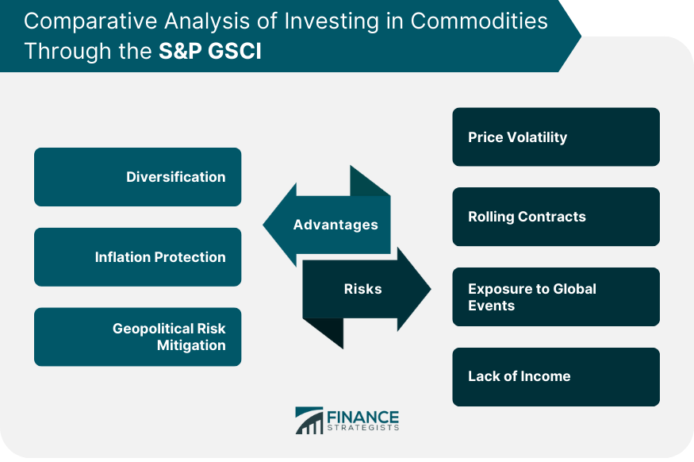

## Table of Contents

## What is the S&P GSCI?

The S&P GSCI, or the S&P Goldman Sachs Commodity Index, is a widely used benchmark for measuring the performance of commodity markets. It includes a diverse range of commodities like energy, agriculture, livestock, industrial metals, and precious metals. The index is designed to be a reliable measure of commodity price movements and is often used by investors to track the overall performance of the commodity market.

The S&P GSCI is calculated based on the value of futures contracts on the commodities it includes. This means it reflects the expected future prices of these commodities rather than their current market prices. The index is weighted towards energy commodities, with oil and its derivatives making up a significant portion of the index. This weighting reflects the importance of energy in the global economy and its impact on commodity prices.

## What types of commodities are included in the S&P GSCI?

The S&P GSCI includes many different types of commodities. These are grouped into categories like energy, agriculture, livestock, industrial metals, and precious metals. This means the index covers things like oil, wheat, cattle, copper, and gold.

Each category has several specific commodities. For example, in the energy category, you'll find [crude oil](/wiki/crude-oil), heating oil, and natural gas. In agriculture, there are commodities like wheat, corn, and soybeans. Livestock includes live cattle and lean hogs. Industrial metals cover things like copper and aluminum, while precious metals include gold and silver. This wide range helps the S&P GSCI give a good overall picture of the commodity market.

## How are the commodities weighted in the S&P GSCI?

In the S&P GSCI, commodities are not all given the same importance. Instead, they are weighted based on how much they are produced and traded around the world. This means that commodities that are produced in larger amounts and traded more often have a bigger impact on the index's value. For example, oil is a big part of the index because it is produced and traded a lot.

The biggest group in the S&P GSCI is energy, making up about 60% of the index. This is because energy commodities like oil, heating oil, and natural gas are very important to the world economy. Other groups like agriculture, livestock, industrial metals, and precious metals make up the rest of the index, but they have smaller weights compared to energy. This weighting helps the S&P GSCI show how the commodity market is doing overall.

## What is the purpose of the S&P GSCI?

The S&P GSCI is a tool that helps people understand how commodity markets are doing. It looks at many different types of commodities like oil, wheat, and gold, and puts them together into one big number. This number shows if commodity prices are going up or down over time. People who invest money use the S&P GSCI to see if their investments in commodities are doing well or not.

The index is made up of commodities that are important to the world economy. It gives more importance to things like oil because they are produced and traded a lot. By looking at the S&P GSCI, investors can get a good idea of what is happening in the commodity market and make better decisions about where to put their money.

## How does the S&P GSCI differ from other commodity indices?

The S&P GSCI is different from other commodity indices because it focuses a lot on energy commodities like oil. This means that if oil prices go up or down a lot, it can really change the whole index. Other indices might not focus as much on energy and might give more importance to things like metals or food. The S&P GSCI also looks at how much of each commodity is produced and traded around the world to decide how important each one is in the index.

Another way the S&P GSCI is different is that it uses futures contracts to measure commodity prices. Futures contracts are agreements to buy or sell a commodity at a future date. This means the S&P GSCI is showing what people think commodity prices will be in the future, not what they are right now. Other indices might use different ways to measure prices, like looking at the current market prices of commodities. This difference can make the S&P GSCI a useful tool for investors who want to understand future trends in the commodity market.

## What are the benefits of investing in the S&P GSCI?

Investing in the S&P GSCI can help you spread out your money across many different types of commodities. This means you're not just betting on one thing like oil or gold. Instead, you're investing in a mix of energy, food, metals, and more. This can make your investment safer because if one type of commodity goes down in price, the others might go up and balance it out.

Another benefit is that the S&P GSCI can protect your money from inflation. Inflation is when prices go up over time, making your money worth less. Commodities often go up in price when there's inflation, so having some of your money in the S&P GSCI can help keep its value. Plus, the index uses futures contracts, which means it's looking at what people think commodity prices will be in the future. This can give you a heads-up on where the market might be heading.

## What are the common drawbacks of the S&P GSCI?

One common drawback of the S&P GSCI is that it focuses a lot on energy commodities like oil. This means if oil prices go up or down a lot, it can change the whole index a lot. This can be risky for investors because if they're not careful, their investments could go up and down a lot just because of oil prices. It's good to spread out investments, but if one thing like oil is too important, it can make the investment less safe.

Another problem is that the S&P GSCI uses futures contracts to measure commodity prices. Futures contracts are agreements to buy or sell a commodity at a future date. This means the index is showing what people think prices will be in the future, not what they are right now. This can be tricky because future prices can be wrong, and if they are, the index might not show the real value of commodities. This can make it harder for investors to make good decisions about where to put their money.

## How does the S&P GSCI handle commodity price volatility?

The S&P GSCI deals with commodity price [volatility](/wiki/volatility-trading-strategies) by including a wide range of commodities in its index. This means it doesn't just focus on one type of commodity like oil or gold. Instead, it spreads out across energy, agriculture, livestock, and metals. By doing this, the index can balance out big price swings in one commodity with smaller changes in others. This helps make the index more stable and less affected by big price jumps in any single commodity.

However, the S&P GSCI still has a big focus on energy commodities, especially oil. This means that if oil prices go up or down a lot, it can still make the whole index move a lot. This can be a problem because it makes the index more sensitive to changes in oil prices than to other commodities. So, while the S&P GSCI tries to handle volatility by including many commodities, its heavy focus on energy can still make it less stable than it might seem.

## What are the historical performance trends of the S&P GSCI?

The S&P GSCI has had ups and downs over the years. It tends to do well when commodity prices are going up, like during times of high inflation or when there's a lot of demand for things like oil and metals. For example, in the early 2000s, the index saw big gains because of rising oil prices and growing demand from countries like China. But it can also go down a lot when commodity prices fall, like during economic downturns or when there's less demand for commodities.

Over the long term, the S&P GSCI has shown that it can be a good way to protect against inflation. When prices of everyday things go up, commodity prices often go up too, which can help keep the value of your investment. But it's not always a smooth ride. The index can be very volatile, meaning its value can change a lot in a short time. This is because it's heavily influenced by energy prices, especially oil, which can swing a lot due to things like political events or changes in supply and demand.

## How can investors gain exposure to the S&P GSCI?

Investors can gain exposure to the S&P GSCI by buying exchange-traded funds (ETFs) or mutual funds that track the index. These funds are designed to follow the performance of the S&P GSCI, so when the index goes up or down, the value of the fund does the same. This is an easy way for investors to get into the commodity market without having to buy the actual commodities themselves. Some popular ETFs that track the S&P GSCI include the iShares S&P GSCI Commodity-Indexed Trust and the DB Commodity Index Tracking Fund.

Another way to invest in the S&P GSCI is through futures contracts. These are agreements to buy or sell commodities at a future date, and they are what the S&P GSCI uses to measure commodity prices. Investors can buy futures contracts that match the commodities in the index, but this can be more complicated and risky than buying an [ETF](/wiki/etf-trading-strategies). It's usually better for people who know a lot about the commodity market and are comfortable with the risks involved.

## What are the risks associated with the S&P GSCI?

Investing in the S&P GSCI can be risky because it focuses a lot on energy commodities, especially oil. If oil prices go up or down a lot, it can change the whole index a lot. This means your investment could go up and down a lot too. It's like putting a lot of your money in one basket, which can be risky if that basket falls. Also, the S&P GSCI uses futures contracts to measure commodity prices. Futures contracts are guesses about what prices will be in the future, and if those guesses are wrong, the index might not show the real value of commodities. This can make it hard for you to know if you're making a good investment.

Another risk is that the S&P GSCI can be very volatile. This means its value can change a lot in a short time. If you're not ready for big swings in your investment, this can be stressful. Also, even though the S&P GSCI includes many different commodities, it's still heavily influenced by energy prices. If there's a big change in the energy market because of things like political events or natural disasters, it can affect your investment a lot. So, it's important to think about these risks before you decide to invest in the S&P GSCI.

## How does the methodology of the S&P GSCI impact its performance?

The S&P GSCI's methodology affects how it performs because it uses futures contracts to measure commodity prices. Futures contracts are agreements to buy or sell commodities at a future date, so the index shows what people think prices will be later, not what they are right now. This can make the index go up or down based on guesses about the future, which can be wrong. Also, the S&P GSCI gives a lot of importance to energy commodities like oil. If oil prices change a lot, it can make the whole index move a lot too. This means the index can be very volatile, or change a lot in a short time, which can be risky for investors.

The way the S&P GSCI is set up also means it tries to balance out big price swings in one commodity with smaller changes in others. It includes many different types of commodities like energy, food, and metals, which can help make the index more stable. But because it focuses so much on energy, big changes in oil prices can still shake up the whole index. This heavy focus on energy can make the S&P GSCI less stable than it might seem, and investors need to be ready for big ups and downs in their investments.

## References & Further Reading

[1]: Gorton, G., & Rouwenhorst, K. G. (2006). ["Facts and Fantasies about Commodity Futures."](https://www.nber.org/papers/w10595) Financial Analysts Journal, 62(2), 47-68.

[2]: Erb, C. B., & Harvey, C. R. (2006). ["The Strategic and Tactical Value of Commodity Futures."](https://www.jstor.org/stable/4480745) Financial Analysts Journal, 62(2), 69-97.

[3]: "Commodity Modeling and Pricing: Methods for Analyzing Resource Market Behavior" by Peter V. Schaeffer

[4]: Daskalaki, C., Kostakis, A., & Skiadopoulos, G. (2014). ["Are there common factors in individual commodity futures returns?"](https://www.sciencedirect.com/science/article/abs/pii/S037842661300455X) Journal of Banking & Finance, 40, 346-363.

[5]: "Algorithmic and High-Frequency Trading" by Álvaro Cartea, Sebastian Jaimungal, and José Penalva

[6]: Hull, J. C. (2018). ["Options, Futures, and Other Derivatives"](https://www.semanticscholar.org/paper/Options%2C-Futures%2C-and-Other-Derivatives-Hull/89bdee500c8623864fc9eb7a471546aa713acc44) (10th Edition). Pearson.

[7]: Lioui, A. (2012). ["Spillover effects of counter-cyclical market regulation: Evidence from the 2008 ban on short sales."](https://papers.ssrn.com/sol3/papers.cfm?abstract_id=1571315) Journal of Banking & Finance, 36(12), 3460-3476.