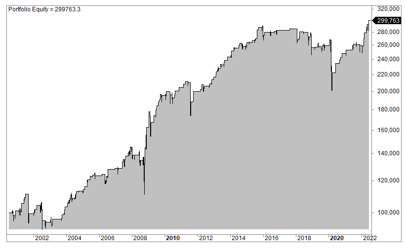

The world of finance is a rich tapestry of interconnected elements that intricately influence market dynamics and investment decisions. This article focuses on three critical components that exemplify such influences: the economic criteria used in financial analysis, the phenomenon associated with the S&P 500 Index, and the transformative role of algorithmic trading. By examining these elements, we aim to shed light on their individual and collective impacts on the modern financial landscape.

The exploration begins with economic criteria, which serve as fundamental tools in financial analysis, helping investors and analysts evaluate company performance and risk. These criteria are instrumental in shaping investment strategies that align with real market conditions. Understanding market capitalization, earnings reports, and liquidity measures is essential for making informed financial decisions.



Next, we examine the S&P phenomenon, where stocks often experience a temporary price increase after their inclusion in the S&P 500 Index. This effect is primarily due to investment vehicles such as index funds and ETFs that replicate the index, subsequently buying shares of newly included companies. Analyzing this phenomenon helps investors anticipate potential stock price movements and refine their market strategies.

Algorithmic trading has brought about significant changes in the way financial markets function, leveraging advanced technology to optimize trading efficiency. Through the automation of trading processes, algorithmic strategies have introduced new levels of speed and agility in market operations, affecting liquidity and volatility. The role of these strategies is essential in understanding the dynamic nature of current financial markets.

By integrating these three elements—economic criteria, the S&P phenomenon, and algorithmic trading—analysts and investors gain a holistic view of market forces. This understanding facilitates the development of robust trading strategies and informed financial analyses. Throughout the article, readers will be guided from fundamental concepts to more sophisticated applications, uncovering the practical implications and theoretical frameworks underpinning these aspects of finance.

## Table of Contents

## Economic Criteria in Financial Analysis

Economic criteria are crucial components of financial analysis, providing the foundation on which investment strategies are built. These criteria not only inform decision-making processes but also help in assessing the overall financial health of firms. Key economic indicators include market capitalization, earnings reports, and liquidity measures, each offering distinct insights into a company's financial status.

**Market Capitalization**

Market capitalization, often referred to as market cap, is a measure of a company's total market value as determined by its stock price multiplied by the number of its outstanding shares. It serves as an indicator of company size and market value, playing a critical role in investment assessment and risk evaluation. Market cap can be expressed using the formula:

$$
\text{Market Cap} = \text{Share Price} \times \text{Number of Outstanding Shares}
$$

This metric helps investors categorize companies into large-cap, mid-cap, and small-cap, each with varying risk and return profiles. Large-cap stocks are usually considered more stable with lower risk, while small-cap stocks may offer higher growth potential but come with greater [volatility](/wiki/volatility-trading-strategies).

**Earnings Reports**

Earnings reports provide a snapshot of a company's profitability over a specific period, typically a quarter or a year. Key components of earnings reports include revenue, net income, earnings per share (EPS), and profit margins. Analysts scrutinize these reports to assess the company's operational efficiency and profit-generating capacity. An important metric derived from earnings reports is the Price-to-Earnings (P/E) ratio, calculated as:

$$
\text{P/E Ratio} = \frac{\text{Market Price per Share}}{\text{Earnings per Share (EPS)}}
$$

The P/E ratio helps investors determine the relative value of a company's shares compared to its earnings, influencing perceptions of whether a stock is overvalued or undervalued.

**Liquidity Measures**

Liquidity measures indicate a company's ability to meet its short-term obligations, with current and quick ratios being commonly used indicators. The current ratio, given by:

$$
\text{Current Ratio} = \frac{\text{Current Assets}}{\text{Current Liabilities}}
$$

assesses overall liquidity by comparing all current assets to current liabilities. The quick ratio, or acid-test ratio, is more stringent, excluding inventory from current assets to evaluate an entity's capacity to cover liabilities without selling inventory:

$$
\text{Quick Ratio} = \frac{\text{Current Assets} - \text{Inventory}}{\text{Current Liabilities}}
$$

A thorough understanding of these metrics is essential for aligning investment objectives with market realities. These economic indicators not only facilitate the evaluation of company performance and risk assessment but also contribute to the development of advanced financial analysis models and tools. They support the identification of trends, inform trading strategies, and enhance predictive accuracy through quantitative methods, such as financial modeling and [machine learning](/wiki/machine-learning) algorithms.

Furthermore, integrating these criteria with technological advancements enables the real-time analysis of financial data, optimizing decision-making processes in an ever-evolving market environment. Analysts employ sophisticated algorithms to process these metrics, offering enhanced insights and fostering more informed investment choices.

In conclusion, economic criteria form the backbone of financial analysis, providing essential data for evaluating company performance and making informed investment decisions. Understanding and leveraging these metrics are vital for navigating the complexities of modern financial markets.

## Exploring the S&P Phenomenon

The S&P phenomenon is a recognized market event where stocks typically exhibit a temporary increase in price following their announcement of inclusion in the S&P 500 Index. This price movement is largely attributed to the automatic buying actions of index funds and exchange-traded funds (ETFs) that seek to replicate the performance of the S&P 500. These funds are mandated to purchase the newly included stocks to mirror the index accurately, creating an immediate surge in demand for these securities.

Historically, the S&P phenomenon has been well-documented, illustrating both the power and limitations of index-driven price movements. For example, research has shown that stocks added to the S&P 500 often experience a price rise of several percentage points shortly after the announcement of inclusion. However, it is important to note that this increase is generally followed by a correction, where prices stabilize and sometimes decline after initial buying activity subsides and market conditions normalize.

The implications of the S&P phenomenon are significant for market participants. For retail investors, understanding the short-term dynamics can present opportunities for strategic timing in buying or selling newly added stocks. Institutional investors, on the other hand, may need to adjust their portfolio strategies to account for the price adjustments driven by index changes, ensuring alignment with investment mandates.

A prominent example of the S&P phenomenon in action occurred when Tesla, Inc. was added to the S&P 500 in December 2020. In anticipation of its inclusion, Tesla's stock price surged significantly, reflecting the heightened demand from index funds needing to incorporate the stock into their portfolios. Such instances highlight the impact of the S&P phenomenon on stock prices and market behavior, emphasizing the role of index fund investing in contemporary financial markets.

The S&P phenomenon underscores the broader complexities of market behavior, revealing how mechanical aspects of trading, such as index fund rebalancing, can induce significant temporary price movements. Thus, it is crucial for investors to critically examine these market events when developing or refining their investment strategies to mitigate potential risks and capitalize on emerging opportunities.

## Algorithmic Trading and Financial Markets

Algorithmic trading, often referred to as algo trading, has significantly transformed financial markets through its ability to analyze vast amounts of data and execute trades with unprecedented precision and speed. This method employs complex algorithms that process market data to make informed trading decisions, capitalizing on micro-movements in price value. 

The core of [algorithmic trading](/wiki/algorithmic-trading) lies in utilizing historical and real-time data to forecast trading opportunities, execute buy or sell orders, and optimize portfolios. Typically, these algorithms are designed to recognize patterns in price movements, [volume](/wiki/volume-trading-strategy) changes, and other market indicators. For instance, a common strategy involves using moving averages to predict future price trends and thereby inform trading decisions.

```python
# Simple example of a moving average strategy in Python
import pandas as pd

def moving_average_strategy(data, short_window, long_window):
    # Calculate moving averages
    data['short_mavg'] = data['price'].rolling(window=short_window, min_periods=1).mean()
    data['long_mavg'] = data['price'].rolling(window=long_window, min_periods=1).mean()

    # Generate trading signals
    data['signal'] = 0
    data['signal'][short_window:] = \
        np.where(data['short_mavg'][short_window:] > data['long_mavg'][short_window:], 1, 0)

    # Create trading orders
    data['positions'] = data['signal'].diff()

    return data
```

Algorithmic trading has become integral to market operations, profoundly impacting [liquidity](/wiki/liquidity-risk-premium), which refers to the ability to conduct trades quickly without causing a significant impact on price. Algo trading ensures tighter spreads between bid and ask prices, fostering a more liquid market environment. Furthermore, algo trading influences market volatility, especially during periods of high-frequency trading where large volumes are transacted in rapid succession, sometimes leading to sudden price swings.

The development of algorithmic trading strategies requires a multifaceted approach where quantitative analysis, statistical models, and machine learning are often combined. The impact of these strategies on financial markets can be profound. Notably, algo trading has given rise to the phenomenon of high-frequency trading ([HFT](/wiki/high-frequency-trading-strategies)), where positions are held for very short durations, and profits are made from barely perceptible price changes over milliseconds.

Despite its advantages, algorithmic trading carries inherent risks, primarily due to technological dependencies. The reliance on algorithms means that technical glitches, erroneous algorithms, or data feed issues can result in substantial financial losses. Moreover, the competitive edge in algorithmic trading often comes from the slight improvements in algorithm efficiency and computational speed, driving firms to continuously innovate.

In summary, algorithmic trading's influence on financial markets is vast, enhancing market reliability while also posing unique challenges. It demands continuous advancement in technology and a profound understanding of market dynamics. The integration of algorithmic trading with other critical market aspects denotes an evolving financial landscape, wherein speed and precision become paramount for competitive advantage.

## Integration: Economic Criteria, S&P Phenomenon, and Algo Trading

Integrating economic criteria, the S&P phenomenon, and algorithmic trading constructs a robust framework for financial analysis and trading strategies. This integration harnesses the strengths of each component to create a comprehensive approach toward understanding and participating in financial markets.

Economic criteria, such as financial ratios, earnings reports, and liquidity measures, form the foundational layer of this framework. These indicators offer insights into a firm's financial health and potential growth prospects. For example, market capitalization provides a snapshot of a company's size in relation to the market, while metrics such as the Price-to-Earnings (P/E) ratio evaluate its valuation against earnings. Analysts rely on these criteria to assess the intrinsic value of stocks, guiding investment decisions based on solid financial footing.

The S&P phenomenon adds another dimension by affecting price dynamics and market behavior. Following the inclusion of a stock in the S&P 500 Index, there is often an observable price rise driven by demands from index funds and ETFs that adjust their portfolios to include the newly added stock. This phenomenon can result in temporary pricing anomalies, offering strategic opportunities for both speculative traders and long-term investors. Recognizing the timing and implications of such events can help investors anticipate market fluctuations and adjust their strategies accordingly.

Algorithmic trading introduces precision and speed, automating the execution of trades based on pre-defined criteria and market signals. By utilizing algorithms that can process vast amounts of data and react instantaneously to market changes, traders can exploit the efficiencies generated by economic criteria and the S&P phenomenon. For instance, algorithms can be programmed to trigger buy or sell orders when a stock enters the S&P 500 or when a company's financial performance meets specific thresholds.

To illustrate the practical application of these integrated elements, consider a scenario where an algorithm is designed to monitor stocks approaching potential inclusion in the S&P 500. By analyzing economic criteria such as improving earnings and expanding market capitalization, the algorithm can anticipate which stocks might be considered for inclusion. Once a stock is added to the S&P 500, the algorithm executes trades to capitalize on the ensuing price increase, while accounting for liquidity and volatility risks. Here is a simplified Python code example that demonstrates this concept:

```python
import yfinance as yf  # For more datasets, visit: https://paperswithbacktest.com/datasets

def analyze_stock(stock_symbol):
    stock = yf.Ticker(stock_symbol)
    financial_data = stock.financials

    # Evaluate economic criteria: Price-to-Earnings ratio
    pe_ratio = financial_data.loc['Net Income', :].mean() / stock.history(period='1y')['Close'].mean()

    # Check for inclusion in S&P 500 based on market cap
    market_cap = stock.info['marketCap']
    if market_cap > threshold_market_cap:  # Assume an arbitrary threshold
        # Consider this stock for potential S&P 500 inclusion
        print(f"{stock_symbol} meets the criteria for potential S&P 500 inclusion with P/E: {pe_ratio}")

    return pe_ratio, market_cap

# Example usage
analyze_stock('AAPL')
```

In conclusion, the intersection of economic criteria, the S&P phenomenon, and algorithmic trading is more than a sum of parts; it is a dynamic interplay that enhances the quality and timeliness of financial decision-making. By understanding and leveraging these interactions, investors and analysts can develop more informed and effective strategies, better adapting to the rapidly evolving financial landscape.

## Conclusion

The dynamic interplay among economic criteria, the S&P phenomenon, and algorithmic trading creates a multifaceted landscape in financial analysis. Each component offers its own insights and advantages. Economic criteria provide foundational metrics that help identify the financial health and potential risks associated with different investment opportunities. Understanding company performance benchmarks allows for more strategic allocation of resources, aligning investment with market dynamics.

Simultaneously, the S&P phenomenon highlights the influence of market indices on stock valuations. When a stock is added to or removed from the S&P 500, the resulting fluctuation in price demonstrates how index changes can affect investor behavior and market trends. Recognizing these patterns enables investors and analysts to anticipate movements, adjust strategies proactively, and take advantage of these temporary market inefficiencies.

Algorithmic trading further enhances this framework by introducing speed and precision into trading strategies. By automating trading processes based on pre-defined rules and real-time data analysis, algorithms can capture opportunities more efficiently than manual methods. This technological advancement not only impacts liquidity and volatility but also levels the playing field, offering sophisticated tools to investors of varying scale.

Grasping the individual roles and collective impact of these elements equips stakeholders with a comprehensive toolkit to better predict market behavior and optimize strategic approaches. A nuanced understanding allows for informed decision-making, thereby enhancing the ability to navigate the intricacies of financial markets. Continued exploration and learning in these areas are crucial for honing skills and developing well-rounded perspectives in financial analysis and trading. Embracing this integrated approach will be invaluable for those looking to refine their abilities and achieve a competitive edge.

## References & Further Reading

[1]: ["The S&P Phenomenon: Indexation and Price Effects"](https://www.supermoney.com/encyclopedia/sp-phenomenon) Financial Analysts Journal, CFA Institute.

[2]: Hendershott, T., Jones, C. M., & Menkveld, A. J. (2011). ["Does Algorithmic Trading Improve Liquidity?"](https://onlinelibrary.wiley.com/doi/full/10.1111/j.1540-6261.2010.01624.x) The Journal of Finance.

[3]: Harris, L. (2003). ["Trading & Exchanges: Market Microstructure for Practitioners"](https://www.amazon.com/Trading-Exchanges-Market-Microstructure-Practitioners/dp/0195144708) Oxford University Press.

[4]: ["Advances in Financial Machine Learning"](https://www.amazon.com/Advances-Financial-Machine-Learning-Marcos/dp/1119482089) by Marcos Lopez de Prado.

[5]: Chan, E. P. (2008). ["Quantitative Trading: How to Build Your Own Algorithmic Trading Business"](https://github.com/ftvision/quant_trading_echan_book) Wiley Trading Series.

[6]: ["The Effects of S&P 500 Index Fund Inclusions on Stock Prices"](https://onlinelibrary.wiley.com/doi/full/10.1002/ijfe.2728) by Campbell, J. Y., & Schlanger, T. 

[7]: Latif, E., & Warren, G. (2018). ["The Index Effect and Market Efficiency: Evidence from S&P 500 Index Changes"](https://www.researchgate.net/profile/Madiha-Latif/publication/261174543_Market_Efficiency_Market_Anomalies_Causes_Evidences_and_Some_Behavioral_Aspects_of_Market_Anomalies/links/00b495336ce78844f9000000/Market-Efficiency-Market-Anomalies-Causes-Evidences-and-Some-Behavioral-Aspects-of-Market-Anomalies.pdf) Financial Management.