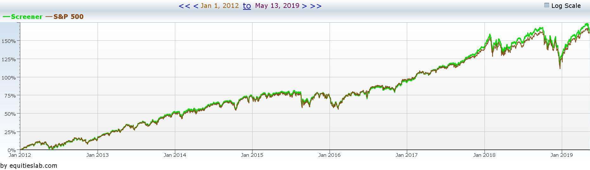

## Table of Contents

## What is the S&P Phenomenon?

The S&P Phenomenon refers to a pattern observed in the stock market where stocks that are added to the S&P 500 index tend to see a rise in their stock prices. The S&P 500 is a stock market index that measures the stock performance of 500 large companies listed on stock exchanges in the United States. When a company is added to this index, it often attracts more investors because many investment funds and portfolios are designed to track the S&P 500. As a result, these funds need to buy the newly added stock, increasing demand and pushing the stock price up.

This phenomenon can create a short-term boost for the stock, but it's important for investors to understand that it doesn't necessarily reflect the long-term value or performance of the company. The increase in stock price is largely driven by the mechanics of index funds and institutional buying rather than changes in the company's fundamentals. Therefore, while the S&P Phenomenon can offer trading opportunities, it should be considered alongside other factors when making investment decisions.

## How does the S&P Phenomenon affect stock market trends?

The S&P Phenomenon can make the stock market go up and down in the short term. When a company gets added to the S&P 500, more people want to buy its stock. This is because big funds that follow the S&P 500 need to buy the new stock to keep their funds the same as the index. So, the demand for the stock goes up, and the price goes up too. This can make the whole market look like it's doing better for a little while.

But, the S&P Phenomenon doesn't change how well a company is doing for real. The price going up is just because of the rules of the big funds, not because the company is making more money or doing better. So, while the stock market might seem to be going up because of this, it's important for people who invest to look at other things too. They should think about if the company is a good investment for the long term, not just because it got added to the S&P 500.

## What are the basic criteria used to identify the S&P Phenomenon?

The S&P Phenomenon is when a stock's price goes up after it gets added to the S&P 500. To spot this, you need to see if the stock price starts to rise right after the announcement that it will be added to the index. This usually happens because big funds that follow the S&P 500 have to buy the stock to keep their funds the same as the index, which makes more people want to buy the stock and pushes the price up.

Another thing to look for is how much the stock price goes up. Usually, the price increase is pretty quick and can be bigger than what you'd expect just from the company's normal business. But remember, this price jump is often just because of the rules of the big funds, not because the company is doing better. So, while the S&P Phenomenon can make the stock price go up, it's important to think about other things too before deciding to invest.

## Can you explain the historical context of the S&P Phenomenon?

The S&P Phenomenon has been around for a long time, starting when the S&P 500 index became really important in the stock market. The S&P 500 was created in 1957, but it wasn't until the 1970s and 1980s that it became a big deal. During this time, more and more people started using the S&P 500 to measure how the market was doing. As more money started following the index, the S&P Phenomenon became more noticeable. When a company was added to the S&P 500, its stock price would often go up because big funds that track the index had to buy the stock.

Over the years, the S&P Phenomenon has stayed a part of the stock market. It became even more important as index funds and ETFs (exchange-traded funds) grew in popularity. These funds are designed to copy the S&P 500, so when a new company is added, these funds have to buy it, which pushes the stock price up. This pattern has been studied a lot, and it's something that investors watch closely. Even though it's a short-term effect, it shows how powerful the S&P 500 is in the world of investing.

## How do different sectors of the economy respond to the S&P Phenomenon?

Different sectors of the economy can react differently to the S&P Phenomenon. When a company from a specific sector gets added to the S&P 500, it can make other companies in that same sector look more interesting to investors. For example, if a tech company gets added, it might make other tech stocks go up a bit too, because people start to think that the whole tech sector is doing well. But, this effect is usually not as strong as the one on the stock that was added to the index.

Sometimes, the S&P Phenomenon can also make investors pay more attention to certain sectors. If a company from a sector that's not usually in the spotlight gets added to the S&P 500, it can bring more eyes to that sector. This can lead to more money flowing into other companies in that sector, even if they're not part of the index. But, like with any stock market trend, it's important to remember that the S&P Phenomenon is mostly about short-term changes and doesn't always mean that a sector is getting better in the long run.

## What are some common misconceptions about the S&P Phenomenon?

One common misconception about the S&P Phenomenon is that it means a company is doing better. When a stock gets added to the S&P 500 and its price goes up, some people think it's because the company is making more money or doing better in its business. But really, the price goes up because big funds that follow the S&P 500 have to buy the stock to keep their funds the same as the index. So, the price increase is more about the rules of these funds than how well the company is doing.

Another misconception is that the S&P Phenomenon will always make a stock go up a lot. While it's true that the stock price usually goes up after being added to the S&P 500, the increase can be small or big. It depends on a lot of things, like how much money is in the funds that follow the index and how many people want to buy the stock. So, it's not a sure thing that the stock will go up a lot just because it's added to the index.

## How can investors use the S&P Phenomenon to make informed decisions?

Investors can use the S&P Phenomenon to make smarter choices by understanding that when a stock gets added to the S&P 500, its price often goes up because big funds need to buy it. This can be a good chance for investors to make some quick money if they buy the stock before it goes up and sell it after the price jumps. But it's important to remember that this price increase is usually just a short-term thing and doesn't mean the company is doing better for real.

So, while the S&P Phenomenon can help investors spot short-term opportunities, they should also look at other things before deciding to invest. They need to think about the company's long-term growth, how much money it's making, and if it's a good fit for their investment goals. By considering all these things, investors can make more informed decisions and not just follow the short-term trend caused by the S&P Phenomenon.

## What advanced metrics should be considered when analyzing the S&P Phenomenon?

When analyzing the S&P Phenomenon, investors should look at the trading [volume](/wiki/volume-trading-strategy) of the stock. This shows how many shares are being bought and sold. If the volume goes up a lot when a stock is added to the S&P 500, it means more people are interested in the stock because of the index change. Another important metric is the stock's beta, which measures how much the stock's price moves compared to the overall market. A high beta means the stock might go up or down more than the market, which can be important to know when trying to predict how the S&P Phenomenon will affect the stock.

Investors should also consider the stock's price-to-earnings (P/E) ratio. This shows how much investors are willing to pay for each dollar of the company's earnings. If the P/E ratio goes up a lot when the stock is added to the S&P 500, it might mean people are getting too excited about the stock because of the index change. Finally, looking at the stock's [liquidity](/wiki/liquidity-risk-premium), or how easy it is to buy and sell the stock, can help investors understand how quickly they can get in and out of the stock if they want to take advantage of the S&P Phenomenon.

## How does global economic policy influence the S&P Phenomenon?

Global economic policy can have a big effect on the S&P Phenomenon. When countries make new rules or change their money policies, it can change how investors feel about the stock market. For example, if a big country like the United States lowers interest rates, it might make more people want to invest in stocks, including those that are part of the S&P 500. This can make the S&P Phenomenon stronger because more money is looking for places to go, and stocks added to the S&P 500 might see even bigger jumps in price.

On the other hand, if global economic policies make investors worried, like if there's a trade war or a big economic slowdown, it can make the S&P Phenomenon weaker. Investors might be less excited about buying stocks, even if they're added to the S&P 500. So, the price increase might not be as big as usual. It's important for investors to keep an eye on what's happening around the world because global economic policies can change how the S&P Phenomenon works.

## What are the limitations of using the S&P Phenomenon as a predictive tool?

The S&P Phenomenon can help investors spot short-term price jumps, but it's not a good tool for predicting what will happen to a stock in the long run. When a stock gets added to the S&P 500, its price might go up because big funds have to buy it. But this doesn't tell us anything about how well the company is doing or if the stock will keep going up after the initial jump. So, if investors only look at the S&P Phenomenon, they might miss important signs that the stock could go down later.

Also, the S&P Phenomenon can be affected by things like global economic policies or how investors feel about the market. If there's a lot of worry or uncertainty in the world, the usual price jump might not happen or might be smaller than expected. This makes it hard to use the S&P Phenomenon to predict what will happen to a stock's price because it depends on so many other things that can change quickly. So, while it can be useful for short-term trading, it's not a reliable way to guess what will happen to a stock over a longer time.

## How do algorithmic trading strategies incorporate the S&P Phenomenon?

Algorithmic trading strategies often use the S&P Phenomenon to make quick trades. When a stock gets added to the S&P 500, these strategies can spot the news and buy the stock before its price goes up. They do this by using computer programs that look at lots of data very fast. The programs know that big funds have to buy the stock to keep their funds the same as the S&P 500, so they try to get in on the action before everyone else. This can help the algorithms make money from the short-term price jump that happens because of the S&P Phenomenon.

But these strategies also have to be careful. They need to sell the stock at the right time to make a profit before the price goes back down. The algorithms use lots of data to figure out the best time to sell. They look at things like how much the stock's price has gone up, how many people are buying and selling it, and what's happening in the market overall. By using all this information, [algorithmic trading](/wiki/algorithmic-trading) strategies can take advantage of the S&P Phenomenon, but they still need to watch out for other things that might change how the stock's price moves.

## What future trends might impact the relevance of the S&P Phenomenon?

Future trends like more use of index funds and ETFs might make the S&P Phenomenon even more important. As more people put their money into these funds, the buying pressure on stocks added to the S&P 500 could get stronger. This means the short-term price jumps we see now might get even bigger. Also, if technology keeps getting better, trading algorithms might get even faster and smarter at spotting and using the S&P Phenomenon. This could lead to more money flowing into stocks right after they're added to the index, making the phenomenon more noticeable.

But, there are also things that might make the S&P Phenomenon less important. If there's more worry about the economy or big changes in how global money works, investors might not react as much to stocks being added to the S&P 500. This could make the price jumps smaller or less common. Also, if more people start to understand that the S&P Phenomenon is just a short-term thing and not a sign of a company doing better, they might not rush to buy the stock as much. So, while the S&P Phenomenon might stay around, how much it matters could change because of these future trends.

## What are the economic criteria used in financial analysis?

Economic criteria are crucial components of financial analysis, providing the foundation on which investment strategies are built. These criteria not only inform decision-making processes but also help in assessing the overall financial health of firms. Key economic indicators include market capitalization, earnings reports, and liquidity measures, each offering distinct insights into a company's financial status.

**Market Capitalization**

Market capitalization, often referred to as market cap, is a measure of a company's total market value as determined by its stock price multiplied by the number of its outstanding shares. It serves as an indicator of company size and market value, playing a critical role in investment assessment and risk evaluation. Market cap can be expressed using the formula:

$$
\text{Market Cap} = \text{Share Price} \times \text{Number of Outstanding Shares}
$$

This metric helps investors categorize companies into large-cap, mid-cap, and small-cap, each with varying risk and return profiles. Large-cap stocks are usually considered more stable with lower risk, while small-cap stocks may offer higher growth potential but come with greater [volatility](/wiki/volatility-trading-strategies).

**Earnings Reports**

Earnings reports provide a snapshot of a company's profitability over a specific period, typically a quarter or a year. Key components of earnings reports include revenue, net income, earnings per share (EPS), and profit margins. Analysts scrutinize these reports to assess the company's operational efficiency and profit-generating capacity. An important metric derived from earnings reports is the Price-to-Earnings (P/E) ratio, calculated as:

$$
\text{P/E Ratio} = \frac{\text{Market Price per Share}}{\text{Earnings per Share (EPS)}}
$$

The P/E ratio helps investors determine the relative value of a company's shares compared to its earnings, influencing perceptions of whether a stock is overvalued or undervalued.

**Liquidity Measures**

Liquidity measures indicate a company's ability to meet its short-term obligations, with current and quick ratios being commonly used indicators. The current ratio, given by:

$$
\text{Current Ratio} = \frac{\text{Current Assets}}{\text{Current Liabilities}}
$$

assesses overall liquidity by comparing all current assets to current liabilities. The quick ratio, or acid-test ratio, is more stringent, excluding inventory from current assets to evaluate an entity's capacity to cover liabilities without selling inventory:

$$
\text{Quick Ratio} = \frac{\text{Current Assets} - \text{Inventory}}{\text{Current Liabilities}}
$$

A thorough understanding of these metrics is essential for aligning investment objectives with market realities. These economic indicators not only facilitate the evaluation of company performance and risk assessment but also contribute to the development of advanced financial analysis models and tools. They support the identification of trends, inform trading strategies, and enhance predictive accuracy through quantitative methods, such as financial modeling and [machine learning](/wiki/machine-learning) algorithms.

Furthermore, integrating these criteria with technological advancements enables the real-time analysis of financial data, optimizing decision-making processes in an ever-evolving market environment. Analysts employ sophisticated algorithms to process these metrics, offering enhanced insights and fostering more informed investment choices.

In conclusion, economic criteria form the backbone of financial analysis, providing essential data for evaluating company performance and making informed investment decisions. Understanding and leveraging these metrics are vital for navigating the complexities of modern financial markets.

## References & Further Reading

[1]: ["The S&P Phenomenon: Indexation and Price Effects"](https://www.supermoney.com/encyclopedia/sp-phenomenon) Financial Analysts Journal, CFA Institute.

[2]: Hendershott, T., Jones, C. M., & Menkveld, A. J. (2011). ["Does Algorithmic Trading Improve Liquidity?"](https://onlinelibrary.wiley.com/doi/full/10.1111/j.1540-6261.2010.01624.x) The Journal of Finance.

[3]: Harris, L. (2003). ["Trading & Exchanges: Market Microstructure for Practitioners"](https://www.amazon.com/Trading-Exchanges-Market-Microstructure-Practitioners/dp/0195144708) Oxford University Press.

[4]: ["Advances in Financial Machine Learning"](https://www.amazon.com/Advances-Financial-Machine-Learning-Marcos/dp/1119482089) by Marcos Lopez de Prado.

[5]: Chan, E. P. (2008). ["Quantitative Trading: How to Build Your Own Algorithmic Trading Business"](https://github.com/ftvision/quant_trading_echan_book) Wiley Trading Series.

[6]: ["The Effects of S&P 500 Index Fund Inclusions on Stock Prices"](https://onlinelibrary.wiley.com/doi/full/10.1002/ijfe.2728) by Campbell, J. Y., & Schlanger, T. 

[7]: Latif, E., & Warren, G. (2018). ["The Index Effect and Market Efficiency: Evidence from S&P 500 Index Changes"](https://www.researchgate.net/profile/Madiha-Latif/publication/261174543_Market_Efficiency_Market_Anomalies_Causes_Evidences_and_Some_Behavioral_Aspects_of_Market_Anomalies/links/00b495336ce78844f9000000/Market-Efficiency-Market-Anomalies-Causes-Evidences-and-Some-Behavioral-Aspects-of-Market-Anomalies.pdf) Financial Management.