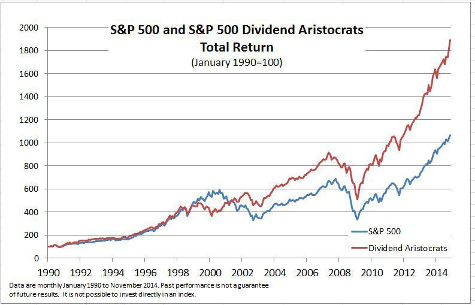

The S&P 500 Dividend Aristocrats are an esteemed group of companies recognized for their commitment to increasing dividends over extended periods. These firms have maintained a remarkable track record, consistently enhancing their dividends annually for at least 25 consecutive years. Such financial discipline and stability underscore the reliability of Dividend Aristocrats, making them attractive to investors seeking dependable income streams and potential growth.

Within this article, we will examine the prominent companies that constitute the S&P 500 Dividend Aristocrats, evaluating their performance in the current market climate and assessing their ability to withstand various economic conditions. These firms often demonstrate resilience, proving their capability to thrive in diverse environments, contributing further to their appeal among conservative investors.



In addition to evaluating current market performance, we will investigate the role of algorithmic trading strategies when engaging with Dividend Aristocrats. Algorithmic trading utilizes pre-defined computations to execute trades, and when applied to the stability of these firms, it can enhance investment outcomes by optimizing dividend yields, identifying mean reversion opportunities, and exploiting market inefficiencies.

Whether you are an investor primarily interested in generating income or one focused on capital growth, a comprehensive understanding of Dividend Aristocrats can significantly influence your investment strategies. These companies provide a unique blend of stability and growth potential, positioning them as a vital component of a well-rounded investment portfolio.

## Table of Contents

## Understanding Dividend Aristocrats

Dividend Aristocrats are a distinguished group of companies within the S&P 500 index, recognized for their commitment to consistently increasing dividends over a minimum period of 25 years. These companies must adhere to strict criteria to earn and maintain this status. Primarily, they must be constituents of the S&P 500, the prominent U.S. stock market index composed of 500 leading large-cap companies. In addition, Dividend Aristocrats are subject to market capitalization requirements, ensuring they are significant players within their industries. The maintenance of substantial trading volumes is also critical, reflecting strong market interest and [liquidity](/wiki/liquidity-risk-premium).

These companies are typically characterized as large-cap, blue-chip firms, a term denoting well-established companies with a history of financial stability and an ability to generate consistent cash flows. Such characteristics contribute to their capability to sustain and grow dividend payments over time. Blue-chip companies are often leaders in their respective markets and sectors, known for their reliability and solid performance, making them attractive to investors.

Investing in Dividend Aristocrats is considered a relatively safe strategy for those who are risk-averse and seek steady income. Their long-standing track record of increasing dividends speaks to an underlying financial robustness that can provide a buffer during economic downturns. The historical performance of these stocks suggests a defensive edge, meaning they may experience less [volatility](/wiki/volatility-trading-strategies) compared to the broader market, which is appealing to investors prioritizing income stability over aggressive growth.

Overall, the continuous commitment to growing dividends by Dividend Aristocrats highlights their operational excellence and management's confidence in future earnings growth, making them an attractive proposition for income-focused investors.

## Top Dividend Aristocrats in the S&P 500

Companies like Pentair PLC, Stanley Black & Decker Inc, and Caterpillar Inc are distinguished members of the S&P 500 Dividend Aristocrats. This group's robust performance is notable for its reliability and financial stability, making them appealing to investors.

Pentair PLC operates primarily in the Industrials sector, offering water treatment and sustainable solutions which are increasingly vital in today's environmentally-conscious market. The company's unique market position allows it to benefit from increasing demand for water and environmental systems. Pentair's consistent dividend payouts are attributed to its strategic investments and technological advancements, which enable sustainable revenue growth and strong cash flows.

Stanley Black & Decker Inc is another prominent member of the Industrials sector, specializing in tools, storage, and commercial electronic security. The firm has consistently increased its dividends, supported by the strong global demand for its products and innovative R&D efforts that keep its product line competitive. Stanley Black & Decker's expansive global footprint and diversified product offerings enhance its financial resilience, allowing it to maintain stable dividend distributions even in fluctuating economic conditions.

Caterpillar Inc., a leader in construction and mining equipment, diesel and natural gas engines, and industrial gas turbines, exemplifies financial robustness within the Industrials sector. The company's strategic operations in over 190 countries and focus on sustainable innovation enable it to sustain growth trajectories. Caterpillar Inc. leverages business cycles in the mining and construction industries to optimize its financial performance, thereby ensuring a consistent increase in dividends reflective of its balanced operational approach.

The solid financial health of these companies can be attributed to several key elements: prudent management practices, strategic market positioning, and diversification of revenue streams. Their growth trajectories are supported by a continuous commitment to innovation and efficiency improvements, crucial factors in maintaining their status as Dividend Aristocrats. As a result, these entities stand as paragons of fiscal stability, translating into dependable dividend increases for investors.

## Algorithmic Trading with Dividend Aristocrats

Algorithmic trading leverages computer algorithms to execute trades based on pre-defined strategies, offering the potential for increased efficiency and decision precision in financial markets. When applied to S&P 500 Dividend Aristocrats, these algorithms can be particularly effective due to the predictable dividend patterns and financial stability these firms typically exhibit.

One viable algorithmic strategy for Dividend Aristocrats is dividend yield optimization. This approach focuses on maximizing the yield from dividend payments relative to the stock price. Algorithms can be designed to scan the market for optimal buying opportunities based on historical yield data and set thresholds. For example, a simple Python script could be employed to monitor dividend yield fluctuations and automate transactions when a stock's yield surpasses a pre-set target:

```python
import yfinance as yf  # For more datasets, visit: https://paperswithbacktest.com/datasets

def monitor_dividend_yield(ticker, target_yield):
    stock = yf.Ticker(ticker)
    dividend_yield = stock.info['dividendYield']
    if dividend_yield > target_yield:
        # Execute trade logic here
        print(f"Buy signal for {ticker} at yield: {dividend_yield}")

monitor_dividend_yield('CAT', 0.025)  # Example for Caterpillar Inc.
```

Another strategy is mean reversion, which assumes that stock prices will revert to their historical mean over time. This can be particularly useful for Dividend Aristocrats, which traditionally have stable performance metrics. Algorithms can identify when stock prices deviate significantly from historical averages, offering buy or sell signals.

Market inefficiencies present another area where algorithms excel, especially given the regular structural patterns present in Dividend Aristocrats. For instance, algorithms can capitalize on short-term price movements that do not align with the long-term financial health of these companies. By incorporating volatility metrics into trading models, investors can make informed decisions with a higher likelihood of success.

Enhancing algorithmic models requires a comprehensive understanding of the historical performance and volatility patterns of Dividend Aristocrats. Backtesting strategies using historical data ensures that they can withstand past market conditions. Analysts and programmers can utilize libraries such as `[backtrader](/wiki/backtrader)` in Python to test and optimize their algorithms based on [backtesting](/wiki/backtesting) results.

Moreover, leveraging algorithms not only automates the trading process but also reduces transaction costs and allows for rapid responses to market changes. Trades can be executed without the delay associated with human intervention, providing a strategic advantage in fast-paced environments. This speed and efficiency, combined with the reliability of Dividend Aristocrats, create a compelling case for integrating [algorithmic trading](/wiki/algorithmic-trading) into a broader investment strategy focused on these stocks.

## Case Study: Automatic Data Processing Inc.

Automatic Data Processing Inc. (ADP) is a prominent entity within the S&P 500 Dividend Aristocrats due to its consistent ability to increase dividends, showcasing a robust financial foundation and reliable cash flow management. ADP operates predominantly in providing human capital management solutions, making it a market leader in this sector. This strategic positioning enables ADP to generate stable revenues, attributed to its vast client base and comprehensive service offerings.

Historically, ADP has demonstrated a strong commitment to returning value to its shareholders through uninterrupted dividend growth. For over four decades, ADP has increased its dividend payouts annually, reflecting its operational efficiency and prudent financial management. This long-term growth in dividends highlights ADP's capability to generate sufficient earnings and maintain a healthy payout ratio, ensuring there is adequate reinvestment into the business for sustained growth.

The future prospects for ADP remain favorable due to ongoing digital transformation and increasing demand for cloud-based human capital solutions. Its investment in innovative technologies and services positions ADP to tap into new growth opportunities, further enhancing shareholder value. Moreover, its conservative financial approach ensures a solid balance sheet with low leverage ratios, providing financial flexibility and resilience in volatile markets.

ADP's suitability for algorithmic trading is underscored by its predictable cash flows and strong balance sheet. These characteristics reduce the risk of unpredictability and support the creation of algorithmic models that aim to capitalize on consistent dividend yield trends. Such models might employ strategies focusing on dividend yield optimization, whereby an algorithm buys ADP shares when the dividend yield reaches a predetermined threshold indicative of undervaluation, or mean reversion strategies that utilize historical price and volatility data to forecast short-term price movements.

Algorithmic trading in ADP can be further optimized using Python, allowing the implementation of strategies based on ADP's financial data and market behavior. Automating trades based on real-time data inputs can effectively lower transaction costs and enhance the scalability of investment strategies, ensuring swift reactions to market developments without the need for constant manual oversight. By focusing on companies like ADP, where financial metrics exhibit stability and predictability, traders can develop algorithms that are both robust and adaptable to various market conditions.

## How to Invest in Dividend Aristocrats

Investing in Dividend Aristocrats offers two primary approaches: directly purchasing individual stocks or opting for Exchange Traded Funds (ETFs) that focus on these consistent dividend-paying companies. 

Direct investment in individual stocks allows investors to select specific companies within the S&P 500 Dividend Aristocrats. This method provides greater control over the portfolio composition and the ability to tailor investments based on personal preferences or specific industry exposure. Investors can choose companies that align with their investment strategy and financial goals, whether prioritizing yield, growth, or sector-wise diversification.

On the other hand, ETFs like the ProShares S&P 500 Dividend Aristocrats [ETF](/wiki/etf-trading-strategies) (NOBL) provide a structured and diversified way to invest in these companies. By purchasing shares in an ETF, investors gain exposure to a wide range of Dividend Aristocrats, reducing the risk associated with any single company's performance. ETFs usually track an index representing the S&P 500 Dividend Aristocrats, ensuring a balanced and automatic readjustment aligned with the index composition.

The benefits of investing through ETFs include:

1. **Diversification**: Buying into an ETF spreads investment across multiple companies, significantly reducing the impact of poor performance from any single stock.
2. **Risk Reduction**: As a diversified investment vehicle, ETFs inherently carry lower risk than direct stock purchases, offering a buffer against market volatility.
3. **Cost-Effectiveness**: ETFs typically have lower management fees compared to mutual funds, and buying a single ETF incurs fewer transaction costs than acquiring numerous individual stocks. This makes ETFs an attractive choice for cost-conscious investors.

When choosing between individual stocks and ETFs, investors should consider their investment objectives and risk tolerance. Those who prefer to actively manage their investment portfolio, enjoy making specific stock selections, and have the time and resources to conduct thorough research may opt for individual stocks. Conversely, investors looking for a more passive approach with inherent diversification and lower risk may find ETFs more suitable.

In conclusion, whether selecting individual Dividend Aristocrats for direct investment or choosing an ETF for diversified exposure, it is crucial for investors to align their choice with their broader financial plan, investment horizon, and risk appetite. By doing so, they can effectively incorporate Dividend Aristocrats into a balanced and well-structured portfolio that meets their long-term financial goals.

## Conclusion

Dividend Aristocrats represent a unique investment opportunity by combining both growth and income potential. These companies are distinguished by their long-standing history of increasing dividend payouts annually for over 25 years, reflecting their financial stability and commitment to returning value to shareholders. This track record positions them as ideal investments for those who value not only consistent returns but also the potential for financial growth over time.

The integration of Dividend Aristocrats into algorithmic trading strategies can significantly enhance investment outcomes. Algorithmic trading allows for the automation of trades based on predefined strategies, which can be particularly effective when applied to the stable and often predictable performance of Dividend Aristocrats. Strategies such as dividend yield optimization, mean reversion, or exploiting market inefficiencies can be employed to maximize returns. Additionally, the historical performance data of these companies can inform algorithms, helping to anticipate market movements and make informed trading decisions.

For both seasoned and novice investors, incorporating Dividend Aristocrats into a portfolio can offer a blend of reliability and opportunity for growth. These companies, with their proven resilience and dedication to dividend increases, provide a solid foundation, enabling investors to balance risk while positioning for steady returns. Understanding the characteristics and performance history of Dividend Aristocrats, coupled with strategic use of algorithmic trading, empowers investors to achieve a well-rounded and potentially lucrative portfolio.

## References & Further Reading

[1]: ["The S&P 500 Dividend Aristocrats"](https://www.marketbeat.com/dividends/aristocrats/) by S&P Dow Jones Indices

[2]: ["Advances in Financial Machine Learning"](https://www.amazon.com/Advances-Financial-Machine-Learning-Marcos/dp/1119482089) by Marcos Lopez de Prado

[3]: ["Algorithmic Trading and DMA"](https://www.amazon.com/Algorithmic-Trading-DMA-introduction-strategies/dp/0956399207) by Barry Johnson

[4]: ["Evidence-Based Technical Analysis: Applying the Scientific Method and Statistical Inference to Trading Signals"](https://www.amazon.com/Evidence-Based-Technical-Analysis-Scientific-Statistical/dp/0470008741) by David Aronson

[5]: ["Investing in Dividend Growth Stocks: The Ultimate Guide"](https://www.forbes.com/advisor/investing/dividend-investing/) by Chuck Carlson

[6]: ["Quantitative Trading: How to Build Your Own Algorithmic Trading Business"](https://www.amazon.com/Quantitative-Trading-Build-Algorithmic-Business/dp/1119800064) by Ernest P. Chan