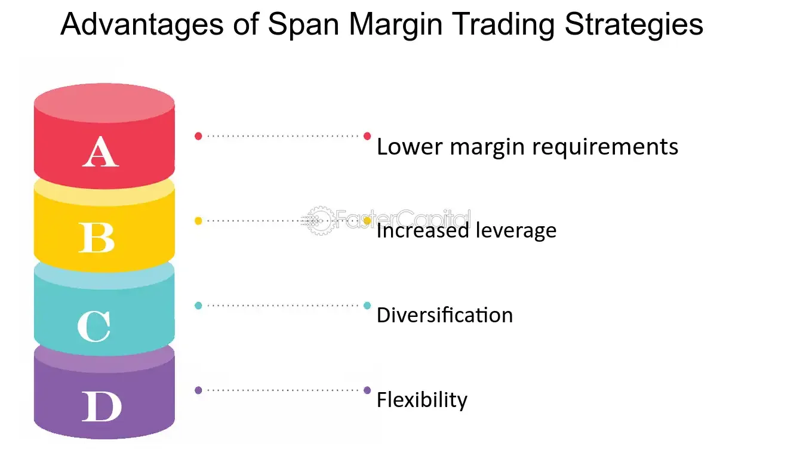

## Table of Contents

## What is SPAN margin?

SPAN margin, or Standard Portfolio Analysis of Risk margin, is a system used by many exchanges to calculate the margin requirements for futures and options trading. It helps to determine the minimum amount of funds that a trader must have in their account to cover potential losses. The SPAN system assesses the overall risk of a portfolio by considering various factors such as price changes, volatility, and the relationships between different contracts. This method allows for a more accurate and efficient way of managing risk compared to traditional methods that calculate margins for each contract separately.

The SPAN margin system works by simulating how different market scenarios could affect the value of a trader's portfolio. It uses a set of predefined scenarios to estimate potential gains or losses over a specified time period, usually one trading day. By doing this, the system can determine the worst-case scenario for the portfolio and set the margin requirement accordingly. This approach not only helps protect the trader from significant losses but also benefits the exchange by reducing the likelihood of default. Overall, SPAN margin provides a more dynamic and responsive way to manage risk in trading.

## How does SPAN margin differ from traditional margin systems?

SPAN margin and traditional margin systems differ in how they calculate the amount of money a trader needs to have in their account. Traditional systems look at each contract separately and set a fixed margin for each one. This means if you have multiple contracts, you need to have enough money to cover the margin for each one, even if some of them might offset each other's risk. On the other hand, SPAN margin looks at your whole portfolio together. It considers how different contracts might affect each other and sets a margin based on the overall risk of your entire portfolio.

The key advantage of SPAN margin is that it can be more accurate and fair. Because it looks at the whole portfolio, it can take into account that some contracts might reduce the risk of others. This means you might need less money in your account compared to traditional systems. For example, if you have a futures contract and an options contract that balance each other out, SPAN margin might require less money than if you were using a traditional system that doesn't consider this balance. This makes trading more efficient and can help traders manage their funds better.

## What are the key components of the SPAN margin system?

The SPAN margin system has a few key parts that help it work well. One important part is the risk arrays, which are lists of possible price changes and how they might affect the value of contracts. These arrays help the system figure out the worst-case scenarios for a trader's portfolio. Another part is the scanning ranges, which are the different market scenarios the system uses to see how prices might move. By looking at these scenarios, SPAN can find out how much money a trader might lose in a day.

Another key part of the SPAN system is the concept of offsets, which looks at how different contracts can balance each other out. For example, if a trader has contracts that might lose value but also has contracts that might gain value at the same time, the system can see this and lower the margin requirement. The system also uses a thing called the SPAN risk parameter file, which has all the details about how to calculate the margin for different contracts. Together, these parts help the SPAN system set a fair and accurate margin for a trader's whole portfolio.

## How is the SPAN margin calculated?

The SPAN margin is calculated by looking at the whole portfolio of a trader and figuring out the worst thing that could happen to it in one day. The system uses something called risk arrays, which are lists of possible price changes for contracts. It also uses scanning ranges, which are different market scenarios to see how prices might move. By looking at these scenarios, the system can find out how much money a trader might lose in a day. This helps set the margin at a level that covers the biggest possible loss.

Another important part of the SPAN margin calculation is the concept of offsets. This means the system looks at how different contracts can balance each other out. For example, if a trader has contracts that might lose value but also has contracts that might gain value at the same time, the system can see this and lower the margin requirement. The system also uses a SPAN risk parameter file, which has all the details about how to calculate the margin for different contracts. By considering all these parts together, the SPAN system can set a fair and accurate margin for the trader's whole portfolio.

## What are the benefits of using SPAN margin for traders?

Using SPAN margin can help traders in a big way. One main benefit is that it looks at the whole portfolio instead of each contract by itself. This means if a trader has contracts that can balance each other out, they might need less money in their account. For example, if one contract might lose value but another might gain value at the same time, SPAN margin can see this and lower the amount of money needed. This makes trading more efficient and helps traders manage their money better.

Another benefit of SPAN margin is that it can be more accurate and fair. Traditional margin systems might ask for too much money because they don't consider how different contracts can affect each other. SPAN margin looks at different market scenarios and finds the worst thing that could happen to the whole portfolio in one day. By doing this, it sets a margin that is just right to cover the biggest possible loss. This helps protect traders from big losses and also helps the exchange because it lowers the chance that a trader won't be able to pay.

## Can you explain the risk arrays used in SPAN margin calculations?

Risk arrays are a key part of the SPAN margin system. They are lists of possible price changes for different contracts. The system uses these arrays to figure out how much money a trader might lose if prices go up or down. Each risk array has several numbers that show different scenarios, like if the price goes up a little, goes down a lot, or stays the same. By looking at all these scenarios, the SPAN system can find the worst-case scenario for the trader's portfolio.

These risk arrays help make the margin calculation more accurate. They consider not just one price change but many different ones. This means the system can see the full range of what might happen to the contracts in the portfolio. By using risk arrays, the SPAN system can set a margin that is fair and covers the biggest possible loss. This helps traders know exactly how much money they need to have in their account to keep trading safely.

## How does SPAN margin help in managing portfolio risk?

SPAN margin helps traders manage their portfolio risk by looking at the whole set of contracts they own, not just each one by itself. This means the system can see how different contracts might affect each other. For example, if a trader has some contracts that might lose value but others that might gain value at the same time, the SPAN system can take this into account. By doing this, it can set a lower margin requirement because the risk is spread out across the portfolio. This makes it easier for traders to manage their money and helps them avoid having to put up too much cash.

The system uses something called risk arrays, which are lists of possible price changes for different contracts. These arrays help the SPAN system figure out the worst thing that could happen to the portfolio in one day. By looking at many different scenarios, the system can set a margin that is just right to cover the biggest possible loss. This way, traders know exactly how much money they need to keep in their account to cover potential losses, which helps them trade more safely and efficiently.

## What are the specific advantages of SPAN margin for institutional investors?

SPAN margin helps institutional investors a lot because it looks at their whole portfolio, not just each contract by itself. This means if they have contracts that can balance each other out, they might need less money in their account. For example, if one contract might lose value but another might gain value at the same time, SPAN margin can see this and lower the amount of money needed. This makes it easier for big investors to manage their money and trade more efficiently. They can use their funds better because they don't have to keep as much money aside for margins.

Another advantage is that SPAN margin is more accurate and fair. Traditional margin systems might ask for too much money because they don't consider how different contracts can affect each other. SPAN margin looks at different market scenarios and finds the worst thing that could happen to the whole portfolio in one day. By doing this, it sets a margin that is just right to cover the biggest possible loss. This helps institutional investors know exactly how much money they need to have in their account to keep trading safely. It also helps the exchange because it lowers the chance that an investor won't be able to pay.

## How is SPAN margin applied across different asset classes?

SPAN margin can be used for different types of investments like stocks, bonds, futures, and options. It looks at the whole set of investments a trader has, not just each one by itself. This means if a trader has some investments that might lose value but others that might gain value at the same time, the SPAN system can see this and set a lower margin. This helps traders manage their money better because they don't have to keep as much money aside for margins. For example, if a trader has futures contracts and options that balance each other out, SPAN margin can take this into account and lower the amount of money needed.

The system uses risk arrays, which are lists of possible price changes for different investments. These arrays help the SPAN system figure out the worst thing that could happen to the portfolio in one day. By looking at many different scenarios, the system can set a margin that is just right to cover the biggest possible loss. This way, traders know exactly how much money they need to keep in their account to cover potential losses, no matter what type of investment they are trading. This makes trading safer and more efficient across different asset classes.

## What are the potential drawbacks or limitations of using SPAN margin?

SPAN margin can be tricky because it needs a lot of information and calculations to work right. It looks at many different scenarios to figure out the worst thing that could happen to a portfolio. This means traders need good computers and software to use SPAN margin. If they don't have these, it can be hard to use the system correctly. Also, because SPAN margin looks at the whole portfolio, it can be complicated to understand and use, especially for new traders who might not know how all their investments work together.

Another problem with SPAN margin is that it might not always be perfect. The system uses past data and guesses about the future to set the margin. But the future can be different from what the system expects. If the market changes a lot in a way that the system didn't predict, the margin might not be enough to cover losses. This means traders still need to be careful and watch their investments closely. Even though SPAN margin can help manage risk, it's not a guarantee against losing money.

## How has the implementation of SPAN margin evolved over time?

The SPAN margin system started in the 1980s when the Chicago Mercantile Exchange (CME) wanted a better way to figure out how much money traders needed to have in their accounts. Before SPAN, exchanges used simple methods that looked at each contract by itself. But SPAN was different because it looked at the whole portfolio. This made it more accurate and fair. Over time, more and more exchanges around the world started using SPAN margin because it helped traders manage their money better and made trading safer.

As technology got better, the SPAN system also improved. Computers became faster and could handle more data, so the system could look at more scenarios and be even more accurate. Exchanges also started using SPAN for more types of investments, like stocks and options, not just futures. This made the system more useful for all kinds of traders. Even though SPAN margin is more complicated than older methods, it has become a standard way to manage risk in trading because it helps traders and exchanges work together more safely and efficiently.

## What future developments can we expect in SPAN margin methodologies?

In the future, SPAN margin methodologies might get even better with new technology. Computers and software keep getting faster and smarter, so the system can look at more scenarios and be more accurate. This means traders might get even better at managing their risk. Also, as more types of investments like cryptocurrencies and other new assets become popular, SPAN margin might be used for these too. This would help traders who invest in lots of different things manage their money more easily.

Another thing that might happen is that SPAN margin could become easier to use. Right now, it can be hard for new traders to understand because it's complicated. But if the system gets simpler, more people might use it. This could mean better tools and guides to help traders learn how to use SPAN margin. Overall, as trading changes and grows, SPAN margin will probably keep getting better to help traders manage their portfolios in a safe and smart way.

## References & Further Reading

[1]: Chance, Don M. (2018). ["An Introduction to Derivatives and Risk Management"](https://www.amazon.com/Introduction-Derivatives-Management-Stock-Trak-Coupon/dp/130510496X). Cengage Learning.

[2]: Hull, John C. (2014). ["Options, Futures, and Other Derivatives"](https://www.amazon.com/Options-Futures-Other-Derivatives-9th/dp/0133456315). Pearson.

[3]: Goodman, A. (2008). ["Understanding SPAN Margin"](https://fastercapital.com/content/Margin-Calls--Understanding-Margin-Calls-and-the-Importance-of-Span-Margin.html). Traders Press Inc.

[4]: CME Group. ["SPAN Margin Calculation Guide"](https://www.cmegroup.com/solutions/risk-management/performance-bonds-margins/span-reference-documents.html) (PDF).

[5]: Aldridge, Irene. (2013). ["High-Frequency Trading: A Practical Guide to Algorithmic Strategies and Trading Systems"](https://www.ahmetbeyefendi.com/wp-content/uploads/2020/07/High-Frequency-Trading-Irene-Aldridge.pdf). Wiley.

[6]: Lopez de Prado, Marcos. (2018). ["Advances in Financial Machine Learning"](https://www.amazon.com/Advances-Financial-Machine-Learning-Marcos/dp/1119482089). Wiley. 

[7]: Das, Sanjiv Ranjan. (2011). ["Derivatives: Principles and Practice"](https://www.academia.edu/94069601/Derivatives_principles_and_practice). McGraw-Hill Education.