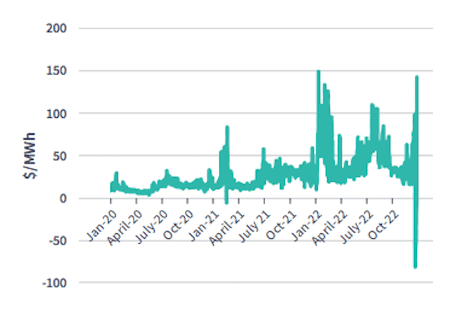

## Table of Contents

## What is the basic definition of spark spread in energy markets?

Spark spread is a term used in energy markets to describe the difference between the price of electricity and the cost of the natural gas needed to produce that electricity. It's an important measure for power generators because it helps them understand how profitable it will be to generate electricity using natural gas. If the price of electricity is much higher than the cost of the gas, the spark spread is wide, and generating electricity is more profitable.

In simple terms, the spark spread shows whether it's a good financial decision to turn on a gas-fired power plant. Power companies look at the spark spread to decide when to run their plants. If the spread is narrow, meaning the cost of gas is close to the price of electricity, it might not be worth running the plant because the profit margin is too small. This concept helps energy traders and power plant operators make better decisions about when and how to generate electricity.

## How is spark spread calculated?

Spark spread is calculated by taking the price of electricity and subtracting the cost of the natural gas needed to produce that electricity. You need to know the efficiency of the power plant, which is usually measured in terms of heat rate. The heat rate tells you how much natural gas is needed to produce one megawatt-hour (MWh) of electricity. If you know the heat rate and the price of natural gas, you can figure out the cost of the gas needed to produce one MWh of electricity.

For example, let's say the price of electricity is $50 per MWh, and the price of natural gas is $3 per million British thermal units (MMBtu). If the power plant's heat rate is 7 MMBtu per MWh, then the cost to produce one MWh of electricity is $3 per MMBtu times 7 MMBtu, which equals $21. The spark spread would then be the electricity price minus the gas cost, so $50 minus $21, which equals $29 per MWh. This $29 is the profit margin for the power plant, before considering other costs like operation and maintenance.

## Why is spark spread important for energy traders and producers?

Spark spread is really important for energy traders and producers because it helps them see if it's a good time to make electricity using natural gas. By looking at the spark spread, they can tell if the price they will get for the electricity is high enough compared to what they have to pay for the gas. If the spark spread is big, that means they can make more money, so they might decide to start up their power plants. But if the spark spread is small, it might not be worth it because they won't make much profit.

Energy traders use spark spread to make smart choices about buying and selling electricity. They can use it to figure out the best times to buy gas and sell electricity. This helps them make more money and manage their risks better. For producers, knowing the spark spread helps them plan when to run their plants and how much electricity to make, which is key to keeping their business profitable.

## What factors influence the spark spread?

The spark spread can change because of many things. One big thing is the price of natural gas. If the price of gas goes up, it costs more to make electricity, so the spark spread gets smaller. Another thing is the price of electricity. If people want more electricity and the price goes up, the spark spread can get bigger. The weather can also affect it. If it's really hot or cold, people use more electricity for heating or cooling, which can make the price of electricity go up and change the spark spread.

Another [factor](/wiki/factor-investing) is how well the power plant works. Some plants are better at turning gas into electricity, and this can make the spark spread bigger. Also, rules from the government can change things. If there are new rules about how much pollution power plants can make, it might cost more to run them, which can make the spark spread smaller. Finally, what other kinds of energy are available, like wind or solar, can affect the spark spread. If there's a lot of cheap electricity from other sources, it can make the price of electricity go down and change the spark spread.

## Can you explain the difference between spark spread and dark spread?

Spark spread and dark spread are both used to figure out how much money power plants can make, but they look at different kinds of fuel. Spark spread is about the difference between the price of electricity and the cost of natural gas used to make that electricity. It helps people who run gas-fired power plants know if it's a good time to make electricity. If the price of electricity is a lot higher than the cost of the gas, the spark spread is big, and it's a good time to run the plant.

Dark spread, on the other hand, is about coal. It's the difference between the price of electricity and the cost of coal needed to make that electricity. Just like with spark spread, a bigger dark spread means it's more profitable to make electricity using coal. Power plant operators and energy traders use dark spread to decide when to run coal-fired plants. Both spreads help them make smart choices about when to make electricity and which type of fuel to use.

## How does the efficiency of a power plant affect the spark spread?

The efficiency of a power plant is really important for the spark spread. Efficiency is about how much electricity a plant can make from a certain amount of natural gas. If a power plant is very efficient, it can make more electricity with less gas. This means the cost to make each unit of electricity goes down. When the cost of making electricity is lower, the spark spread gets bigger. A bigger spark spread means the power plant can make more money because the price they get for selling electricity is a lot more than what they paid for the gas.

For example, imagine two power plants. One plant is old and not very efficient, so it needs a lot of gas to make electricity. The other plant is new and very efficient, so it uses less gas to make the same amount of electricity. If both plants sell their electricity at the same price, the efficient plant will have a bigger spark spread because its costs are lower. This makes the efficient plant more profitable. So, when people who run power plants are looking at the spark spread, they also think about how efficient their plant is to see if it's a good time to make electricity.

## What role do natural gas prices play in determining the spark spread?

Natural gas prices are a big part of figuring out the spark spread. The spark spread is the difference between what you can sell electricity for and how much it costs to make it with natural gas. If the price of natural gas goes up, it costs more to make electricity, so the spark spread gets smaller. This means power plants might not make as much money because the cost of the gas they need is higher.

On the other hand, if natural gas prices go down, it costs less to make electricity, and the spark spread gets bigger. This is good for power plants because they can make more money selling electricity. Power plant operators and energy traders always keep an eye on natural gas prices because it helps them decide when it's a good time to make electricity and how much profit they can expect.

## How do electricity prices impact the spark spread?

Electricity prices have a big effect on the spark spread. The spark spread is the difference between the price of electricity and the cost of the natural gas needed to make it. If the price of electricity goes up, the spark spread gets bigger. This means power plants can make more money because they can sell their electricity for more than it costs to make it. When electricity prices are high, it's a good time for power plants to run because they can make a bigger profit.

On the other hand, if electricity prices go down, the spark spread gets smaller. This makes it harder for power plants to make money because they're selling electricity for less than before, while the cost of the gas stays the same or goes up. When electricity prices are low, power plants might decide not to run because it's not worth it if they can't make enough profit. So, keeping an eye on electricity prices is really important for power plant operators and energy traders who want to make smart decisions about when to make electricity.

## What are the typical strategies used by traders to hedge against spark spread risks?

Traders use different strategies to protect themselves from the risks that come with changes in the spark spread. One common way is to use financial tools like futures and options. Futures contracts let traders agree to buy or sell electricity or natural gas at a set price in the future. This can help them lock in prices and avoid losing money if the spark spread changes a lot. Options give traders the right, but not the obligation, to buy or sell at a set price, which can be useful if they want to protect themselves but also keep some flexibility.

Another strategy is to use a portfolio approach, where traders balance their investments in different types of energy. For example, they might invest in both natural gas and electricity. By doing this, they can reduce the risk that comes from big changes in the spark spread. If the price of one goes up and the other goes down, their overall risk is lower. This way, they can make sure they don't lose too much money if the market changes suddenly.

## How does regulatory policy affect the spark spread in different regions?

Regulatory policies can change the spark spread in different places by making rules about how power plants can work and what they have to pay. For example, some places might have strict rules about pollution. If a power plant has to spend more money to meet these rules, it costs more to make electricity. This means the spark spread can get smaller because the cost of making electricity goes up, even if the price of electricity stays the same. Different regions might have different rules, so the spark spread can be bigger or smaller depending on where you are.

Also, some governments might give money or other help to power plants that use certain types of energy, like natural gas. This can make it cheaper to make electricity with gas, which can make the spark spread bigger. But if the rules change and it becomes more expensive to use gas, the spark spread can get smaller. So, people who run power plants and trade energy need to keep an eye on the rules in different places to understand how the spark spread might change.

## Can you discuss a historical case where spark spread significantly impacted the energy market?

In the early 2000s, the California energy crisis was a big example of how the spark spread can shake up the energy market. At that time, the price of natural gas went way up because there wasn't enough gas to go around. At the same time, the rules in California made it hard for power plants to raise the price of electricity quickly. This made the spark spread really small, which meant power plants were losing money every time they made electricity. Some power plants even decided to stop running because it wasn't worth it to keep going when they were losing money.

This situation caused a big problem in California. There were blackouts because there wasn't enough electricity to go around. People were upset, and the government had to step in to fix things. The crisis showed everyone how important the spark spread is. When the cost of making electricity is too high compared to what you can sell it for, it can cause big problems in the energy market. It also showed that the rules about how energy is bought and sold can make a big difference in the spark spread and how well the energy market works.

## What advanced models are used to predict future spark spread and how accurate are they?

To predict future spark spread, people use fancy math models that look at a lot of different things like the price of natural gas, the price of electricity, how well power plants work, and even the weather. These models use something called time series analysis, which looks at past data to guess what will happen next. They also use something called [machine learning](/wiki/machine-learning), where computers learn from past data to make better predictions. These models can be pretty good at guessing what the spark spread will be, but they're not perfect. They can get things wrong if something unexpected happens, like a sudden change in the law or a big storm that knocks out power plants.

The accuracy of these models can change a lot. Sometimes, they can predict the spark spread really well, especially when things stay pretty normal. But if there are big surprises, like a sudden jump in gas prices or a new rule from the government, the models might not guess right. So, people who use these models always have to be ready for the predictions to be off sometimes. They use the models as a helpful tool, but they also keep an eye on what's happening in the real world to make the best decisions they can.

## What is the Spark Spread and how can it be understood?

The spark spread is a key metric for assessing the profitability of gas-fired electricity generation. It represents the difference between the market price of electricity ($P_e$) and the cost of natural gas required to produce that electricity, often referred to as the fuel cost ($C_g$). The basic formula for the spark spread is:

$$
\text{Spark Spread} = P_e - C_g
$$

Where:
- $P_e$ is the price of electricity typically measured in dollars per megawatt-hour (MWh).
- $C_g$ is the cost of natural gas, which can be adjusted by the heat rate of the power plant (i.e., the efficiency with which the plant converts fuel into electricity).

For practical calculations, the heat rate is factored into the equation as follows:

$$
\text{Spark Spread} = P_e - \left( H_r \times P_g \right)
$$

Where:
- $H_r$ is the heat rate, usually expressed in MMBtu/MWh, indicating the amount of natural gas (in MMBtu) needed to produce one MWh of electricity.
- $P_g$ is the price of natural gas per MMBtu.

When the spark spread is positive, gas-fired power generation is profitable since the revenue from electricity sales exceeds the fuel costs. Conversely, a negative spark spread indicates that production costs surpass earnings, making generation financially unviable.

Several factors can influence the spark spread, including:
1. **Fuel Costs**: The price of natural gas is subject to market fluctuations, influenced by supply and demand dynamics, geopolitical factors, and natural events. An increase in natural gas prices can erode profit margins unless offset by rising electricity prices.

2. **Electricity Demand**: Higher demand, especially during peak periods, typically leads to higher electricity prices, thereby potentially increasing the spark spread. Electricity demand can be influenced by seasonal weather patterns, economic activity, and the integration of renewable energy sources.

3. **Wholesale Electricity Prices**: These prices are affected by the broader energy market conditions, including regulatory changes, grid reliability, and the entry of new generation capacity, particularly renewable energy, which can suppress wholesale prices during periods of high supply.

Understanding the interplay between these factors is essential for energy market participants looking to optimize their operations and hedge against price [volatility](/wiki/volatility-trading-strategies). By monitoring spark spreads, traders and generators can make informed decisions regarding when to operate and how to manage their fuel procurement strategies effectively.

## What is the pricing of electricity in energy markets?

Electricity pricing in energy markets is complex and influenced by various factors. Key among these are production costs, market demand, and regulatory influences.

Production costs constitute the baseline for electricity pricing. These costs encompass fuel expenses, maintenance, and operational costs associated with power plants. For example, in thermal power plants, the cost of fuel such as coal or natural gas is a major component. Renewable energy sources, while having negligible fuel costs, incur significant initial capital expenditure and maintenance costs.

Market demand significantly impacts electricity pricing. Demand fluctuations are often tied to the time of day, weather conditions, and economic activities. During peak periods, such as hot summer afternoons when air conditioning usage is high, electricity prices tend to spike due to increased demand. Conversely, during off-peak times, prices often decrease. This variability is crucial for grid operators who must balance supply and demand in real-time.

Incorporating demand fluctuations into pricing, electricity markets often employ spot pricing mechanisms. These mechanisms adjust prices in response to real-time changes in supply and demand. The spot price, $p_s$, at any given time can be modeled as a function of supply, $S$, and demand, $D$, such that:

$$
p_s = f(S, D)
$$

This function ensures that prices reflect the equilibrium between supply and demand dynamics.

Regulatory policies and government interventions also play substantial roles in electricity pricing. Governments may impose price caps to protect consumers from excessively high prices, or offer subsidies to support renewable energy adoption. Furthermore, regulations can mandate costs related to environmental compliance, impacting overall pricing structures.

For instance, carbon pricing mechanisms can lead to increased operational costs for fossil fuel-based power generation, indirectly affecting electricity prices. Similarly, renewable energy incentives might lower prices in markets with high renewable penetration by reducing overall production costs.

In summary, electricity pricing is influenced by an interplay of production costs, demand fluctuations, and regulatory frameworks. Understanding these variables is essential for stakeholders to navigate and strategize effectively within energy markets.

## References & Further Reading

[1]: "Spark Spread" on Investopedia. [Link](https://www.investopedia.com/terms/s/sparkspread.asp)

[2]: Burgess, M., "Algorithms Rule the World – What It Means for the Future of Trading". World Economic Forum. [Link](https://www.ebrd.com/news/2019/should-algorithms-rule-the-world.html)

[3]: Vogt, S., "Algorithmic trading and its implications on stock, bond, and commodity markets". Journal of Business Economics. [Link](https://www.sciencedirect.com/science/article/pii/S0261517724001894)

[4]: Sewalk, C., Tiwari, S., & Kumar, R. (2021). "Algorithmic trading and its impact on financial markets". Journal of Economics and Business. [Link](https://scholar.google.com/citations?user=wB5cAJAAAAAJ)

[5]: "Renewable Energy and Electricity". World Nuclear Association. [Link](https://www.world-nuclear.org/information-library/)

[6]: Pindyck, R. S. (2001). The Dynamics of Commodity Spot and Futures Markets: A Primer. The Energy Journal, 22(3), [Link](https://web.mit.edu/rpindyck/www/commodej.pdf)

[7]: Jansen, S., "Machine Learning for Algorithmic Trading: Predictive models to extract signals from market and alternative data". Packt Publishing, (2018). [Link](https://www.amazon.com/Machine-Learning-Algorithmic-Trading-alternative/dp/1839217715)

[8]: Chan, E. P., "Algorithmic Trading: Winning Strategies and Their Rationale". Wiley Trading, (2013). [Link](https://github.com/NehrenD/algo_trading_and_quant_strategies)

[9]: "Regulatory Framework in Algorithmic Trading". Financial Stability Institute. [Link](https://www.science.org/doi/10.1126/science.aad0299)

[10]: "Renewable Integration in Power Grids". International Energy Agency. [Link](https://www.irena.org/publications/2015/Apr/Renewable-energy-integration-in-power-grids)