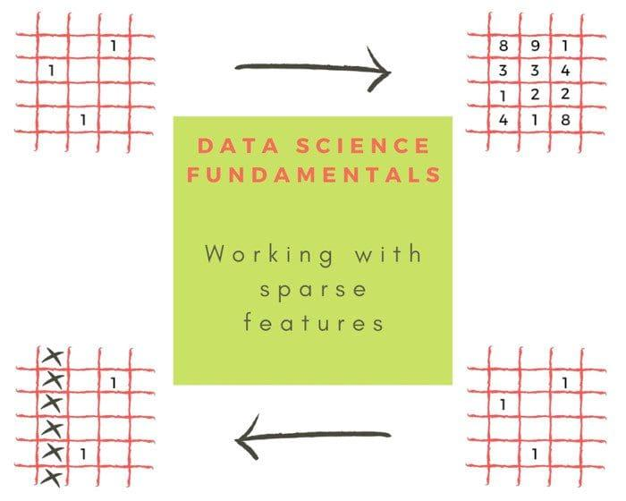

## Table of Contents

## What are sparse features in the context of machine learning?

Sparse features in machine learning refer to data where most of the feature values are zero or missing. Imagine you have a large dataset with many columns, but for most rows, only a few of these columns have non-zero values. These non-zero values are what we call sparse features. For example, in text analysis, if you're looking at the frequency of words in a document, most words will not appear in any given document, making the feature vector mostly zeros.

Dealing with sparse features can be challenging but also beneficial. They can help reduce the computational load because you only need to process the non-zero values. This can make algorithms run faster and use less memory. However, you need special techniques to handle them effectively. For instance, algorithms like Lasso regression are designed to work well with sparse data because they can shrink less important feature coefficients to zero, effectively selecting the most relevant features.

## Why are sparse features important in machine learning models?

Sparse features are important in machine learning because they help make models more efficient and effective. When data is sparse, it means that most of the feature values are zero or missing. This can save a lot of computational power and memory because the model only needs to focus on the non-zero values. For example, if you're working with a dataset that has thousands of features but only a few are non-zero for each example, you don't need to process all the zeros, which speeds up the training and prediction processes.

Moreover, sparse features can help in feature selection. Some algorithms, like Lasso regression, are designed to work well with sparse data. They can automatically set the coefficients of less important features to zero, which means the model can focus on the most relevant features. This not only simplifies the model but can also improve its performance by reducing overfitting. In simple terms, sparse features help make machine learning models faster, more memory-efficient, and potentially more accurate by focusing on what really matters in the data.

## How do sparse features differ from dense features?

Sparse features and dense features are two different ways data can be organized in machine learning. Sparse features have a lot of zeros or missing values. Imagine a big table where most of the boxes are empty. For example, if you're looking at words in a book, most words won't appear in every page, so the table showing word counts will have a lot of zeros. This is useful because it saves space and makes calculations faster since you only need to work with the non-zero numbers.

On the other hand, dense features have more filled-in values. In a dense feature table, most of the boxes have numbers in them. For example, if you're measuring things like height, weight, and age for a group of people, you'll have a number for each person in each category. Dense features can be easier to work with in some ways because every feature is important, but they can also take up more space and slow down calculations.

In summary, sparse features are great for when you have a lot of data but only a few important pieces in each example, while dense features are better when most of your data is relevant and you need to consider all of it.

## What types of data commonly result in sparse features?

Sparse features often come from data where most values are zero or missing. A common example is text data. When you count how often words appear in a document, most words won't show up, so the table showing word counts will have a lot of zeros. Another example is in recommendation systems, where you might have a huge list of items, but each user has only rated or interacted with a few of them. This makes the data sparse because most of the user-item interactions are zeros.

Another type of data that results in sparse features is in genomics, where you might be looking at gene expression levels. Most genes are not active in any given cell, so the data about gene activity has a lot of zeros. In network analysis, if you're looking at connections between nodes, like friendships on a social network, most pairs of nodes don't have a connection, making the data sparse. These examples show how sparse features come up in different fields when you're dealing with data where most entries are not relevant or active.

## What are the advantages of using sparse features in machine learning?

Sparse features help make machine learning models work faster and use less memory. When data is sparse, it means most of the values are zeros or missing. This is good because the computer only needs to focus on the non-zero numbers, which saves time and space. For example, if you have a big table with thousands of columns but only a few have numbers in them for each row, the computer doesn't have to look at all the empty spaces. This can make the model run much quicker and use less memory, which is especially helpful when dealing with large datasets.

Another advantage of sparse features is that they can help pick out the most important pieces of data. Some machine learning methods, like Lasso regression, are made to work well with sparse data. They can automatically ignore the less important features by setting their values to zero. This helps the model focus on what really matters and can make it more accurate. By only keeping the important features, the model becomes simpler and less likely to overfit, which means it will work better on new data.

## What challenges do sparse features present in machine learning algorithms?

Sparse features can make machine learning algorithms more difficult to work with. One challenge is that some algorithms are not designed to handle sparse data well. For example, traditional algorithms like ordinary least squares regression might struggle because they treat all features the same, even if most are zeros. This can slow down the computation and use more memory than needed. To handle sparse data better, you might need to use special algorithms or adjust the existing ones, which can be tricky and time-consuming.

Another challenge is that sparse features can make it harder to find patterns in the data. With so many zeros, it's easy to miss the important non-zero values that carry the most information. This can lead to overfitting, where the model pays too much attention to the few non-zero values and doesn't generalize well to new data. To avoid this, you might need to use techniques like regularization, such as Lasso regression, which helps by shrinking less important feature coefficients to zero. This way, the model focuses on the most relevant features, but figuring out the right amount of regularization can be a challenge in itself.

## How can sparse features be effectively represented in data structures?

Sparse features can be effectively represented using special data structures that save space and make calculations faster. One common way to do this is by using a sparse matrix. Instead of storing all the zeros, a sparse matrix only stores the non-zero values and their positions. This is great for big datasets where most of the values are zeros because it uses much less memory. For example, in a sparse matrix, you might have a list of the row and column numbers where the non-zero values are, along with the values themselves. This way, you don't waste space on zeros, and it's quicker to work with the data.

Another way to represent sparse features is by using dictionaries or hash tables. In this approach, each non-zero feature is stored as a key-value pair, where the key is the feature's index and the value is the feature's value. This makes it easy to look up and work with the non-zero values without having to go through a lot of zeros. For example, if you're working with text data where most words don't appear in a given document, you can use a dictionary to store only the words that do appear and their counts. This makes the data easier to handle and speeds up the processing.

## What are some common techniques for handling sparse features in machine learning models?

One common technique for handling sparse features is using regularization methods like Lasso regression. Lasso regression adds a penalty to the model's coefficients, which can shrink less important feature coefficients to zero. This helps the model focus on the most relevant features and can make it simpler and more accurate. For example, if you have a dataset with many features but only a few are important, Lasso can help by setting the coefficients of the unimportant features to zero, effectively ignoring them. This is especially useful with sparse data because it helps the model handle the zeros better and avoid overfitting.

Another technique is feature selection, where you choose only the most important features to include in your model. This can be done using methods like mutual information or chi-squared tests to see which features are most related to the target variable. By selecting only the important features, you can reduce the dimensionality of your data and make it less sparse, which can make the model easier to train and more accurate. For example, if you're working with text data, you might select only the most common words to use as features, which can help simplify the model and improve its performance.

A third approach is to use algorithms specifically designed to handle sparse data, like decision trees or random forests. These algorithms can work well with sparse features because they split the data based on feature values, and zeros don't affect the splits as much as non-zero values. This means they can focus on the important features without being distracted by the zeros. For example, in a decision tree, if a feature is mostly zeros but has a few important non-zero values, the tree can still use that feature to make good splits and improve the model's accuracy.

## How do algorithms like decision trees and neural networks handle sparse features differently?

Decision trees handle sparse features by focusing on the non-zero values when making splits. When a decision tree is built, it looks at each feature to see if it can split the data in a way that separates different classes or outcomes. If a feature is mostly zeros but has a few important non-zero values, the tree can still use that feature to make good splits. This means decision trees can work well with sparse data because they are not affected much by the zeros. For example, if you're predicting whether someone will buy a product based on their browsing history, a decision tree can focus on the few pages they visited (non-zero values) without being distracted by all the pages they didn't visit (zeros).

Neural networks, on the other hand, can struggle with sparse features because they treat all inputs the same, including the zeros. This can make training slower and less efficient because the network has to process a lot of zeros that don't carry much information. To handle sparse features better, neural networks often use techniques like dropout, which randomly sets some of the neuron outputs to zero during training, mimicking the sparsity of the input data. Another approach is to use specialized architectures like sparse autoencoders, which are designed to work well with sparse inputs by learning to represent the data more efficiently. For example, if you're working with text data where most words don't appear in a given document, a neural network with dropout can help it focus on the important words and ignore the zeros.

## What are the computational benefits of using sparse matrices for sparse feature data?

Sparse matrices are great for handling sparse feature data because they save a lot of space and make calculations faster. When you use a sparse matrix, you only store the non-zero values and their positions, instead of storing all the zeros. This means you use much less memory. For example, if you have a big table with thousands of columns but only a few have numbers in them for each row, a sparse matrix will only store those few numbers and where they are, not all the empty spaces. This can make the computer run much quicker because it doesn't have to look at all the zeros.

Another benefit of using sparse matrices is that they can speed up certain math operations. When you do calculations like matrix multiplication, you only need to work with the non-zero values. This can make the calculations a lot faster because the computer doesn't have to waste time on zeros. For example, if you're doing $$A \times B$$ where $$A$$ and $$B$$ are sparse matrices, the computer only needs to multiply the non-zero elements, which can save a lot of time compared to doing the same operation with dense matrices.

## How can feature selection techniques be applied to sparse data to improve model performance?

Feature selection techniques can help improve model performance when working with sparse data by picking out the most important features and ignoring the rest. When data is sparse, most of the feature values are zeros or missing, so it's important to focus on the non-zero values that carry the most information. One way to do this is by using methods like mutual information or chi-squared tests, which measure how much each feature is related to the thing you're trying to predict. By selecting only the features that are strongly related to the target variable, you can reduce the number of zeros in your data and make your model simpler and more accurate. For example, if you're working with text data, you might use mutual information to pick out the words that are most useful for predicting the document's category, and ignore the rest.

Another way to apply feature selection to sparse data is by using regularization techniques like Lasso regression. Lasso regression adds a penalty to the model's coefficients, which can shrink the coefficients of less important features to zero. This helps the model focus on the most relevant features and can make it simpler and more accurate. For example, if you have a dataset with many features but only a few are important, Lasso can help by setting the coefficients of the unimportant features to zero, effectively ignoring them. This is especially useful with sparse data because it helps the model handle the zeros better and avoid overfitting. By using feature selection techniques, you can make your model work better with sparse data by focusing on what really matters.

## What advanced methods exist for optimizing machine learning models specifically designed for sparse feature sets?

One advanced method for optimizing machine learning models with sparse feature sets is using specialized algorithms like sparse linear models. These models are designed to work well with data where most values are zeros. For example, Lasso regression adds a penalty to the model's coefficients that can shrink less important feature coefficients to zero, helping the model focus on the most relevant features. This is useful because it makes the model simpler and can improve its accuracy by reducing overfitting. Another approach is using sparse autoencoders, which are neural networks designed to efficiently represent sparse data. They learn to compress the input data into a smaller representation and then reconstruct it, focusing on the non-zero values.

Another method is using dimensionality reduction techniques like Principal Component Analysis (PCA) or t-SNE, but tailored for sparse data. These techniques can help reduce the number of features while keeping the most important information. For sparse data, you might use sparse PCA, which finds principal components that are also sparse. This means the new features created by sparse PCA will also have many zeros, which can make the data easier to handle and the model faster to train. Additionally, using tree-based algorithms like Random Forests or Gradient Boosting Machines can be effective because they naturally handle sparse data well. These algorithms split the data based on feature values, and zeros don't affect the splits as much as non-zero values, allowing them to focus on the important features.