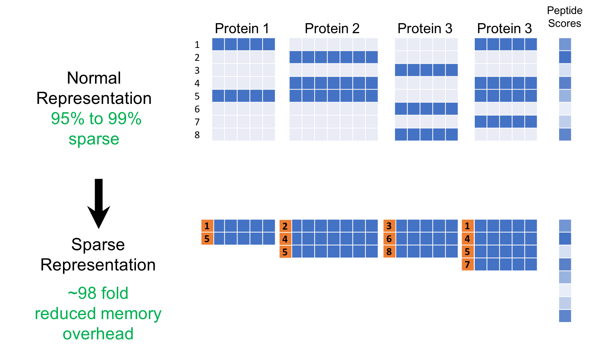

## Table of Contents

## What is Sparse Representation in machine learning?

Sparse Representation in machine learning is a technique where data is represented using only a small number of non-zero elements. Imagine you have a big list of numbers, but most of them are zeros. In sparse representation, we focus on the few numbers that are not zero because they carry the most important information. This method is useful because it makes calculations faster and uses less memory. It's like finding the key pieces of a puzzle that help you solve it quickly.

In practice, sparse representation is often used in areas like image processing and signal processing. For example, when you take a photo, it contains a lot of data, but not all of it is essential for understanding the image. By using sparse representation, we can identify and use only the most important parts of the image data. This not only speeds up the processing but also helps in tasks like image compression and noise reduction. It's a powerful tool that helps machines understand and work with data more efficiently.

## Why is sparsity important in machine learning models?

Sparsity is important in machine learning models because it helps make them simpler and faster. When a model is sparse, it means that it uses fewer non-zero values to represent data. This is like having a big list where most numbers are zero, and only a few numbers matter. By focusing on these important numbers, the model can work more quickly and use less memory. This is really helpful when you're dealing with big datasets, because it makes everything run smoother and faster.

Another reason sparsity is important is that it can help make models more accurate. When a model uses fewer, but more important, pieces of data, it can sometimes do a better job at understanding and predicting things. This is because it's not getting distracted by a lot of unimportant information. For example, in image processing, a sparse model might focus on the key parts of an image that help identify what's in it, rather than getting bogged down by every little detail. This can lead to better results and more reliable predictions.

## How does Sparse Representation differ from traditional representation methods?

Sparse representation differs from traditional representation methods mainly in how it handles data. In traditional methods, every piece of data is treated as important, so if you have a list of numbers, all of them are used to build the model. This can make the model complex and slow because it has to consider every single number. On the other hand, sparse representation focuses on just a few key numbers, the ones that aren't zero. By doing this, it makes the model simpler and faster because it only uses the most important pieces of data. Think of it like finding the key pieces of a puzzle; you don't need all the pieces to see the picture, just the important ones.

Another way sparse representation is different is in how it can improve the accuracy of models. Traditional methods might get bogged down by a lot of unimportant data, which can make the model less accurate. Sparse representation, however, zeroes in on the essential data points, which can lead to better predictions. For example, in image processing, a sparse model might focus on the edges and shapes in an image, rather than every pixel. This helps the model understand the image better and make more accurate decisions. By using fewer but more meaningful data points, sparse representation can make [machine learning](/wiki/machine-learning) models both faster and more precise.

## What are the key algorithms used for achieving Sparse Representation?

One of the key algorithms for achieving Sparse Representation is called LASSO (Least Absolute Shrinkage and Selection Operator). LASSO works by adding a penalty to the model that makes some of the coefficients zero. This penalty is based on the absolute value of the coefficients, and it helps to create a sparse model. The formula for LASSO can be written as $$ \text{minimize} \quad \frac{1}{2n} \sum_{i=1}^n (y_i - \sum_{j=1}^p x_{ij} \beta_j)^2 + \lambda \sum_{j=1}^p |\beta_j| $$, where $$ \lambda $$ is the penalty parameter, and the goal is to find the best coefficients $$ \beta_j $$ that make the model both accurate and sparse.

Another important algorithm is called Orthogonal Matching Pursuit (OMP). OMP is a greedy algorithm that builds the sparse representation step by step. It starts with an empty set of coefficients and adds one at a time, choosing the one that best fits the data at each step. This process continues until a stopping criterion is met, like reaching a certain number of non-zero coefficients. OMP is useful because it's fast and can handle large datasets well, making it a popular choice for achieving sparse representation in practice.

A third algorithm worth mentioning is the Basis Pursuit (BP) method. BP aims to find the sparsest solution to an underdetermined linear system. It does this by solving an optimization problem that minimizes the $$ l_1 $$-norm of the coefficients, which encourages sparsity. The formula for Basis Pursuit can be written as $$ \text{minimize} \quad \| \mathbf{x} \|_1 \quad \text{subject to} \quad \mathbf{Ax} = \mathbf{b} $$, where $$ \mathbf{x} $$ is the vector of coefficients, $$ \mathbf{A} $$ is the design matrix, and $$ \mathbf{b} $$ is the observed data. This method is particularly useful in signal processing and compressed sensing applications where finding the sparsest solution is crucial.

## Can you explain the concept of the L1 norm in the context of Sparse Representation?

The L1 norm is a way to measure the size of a set of numbers by adding up the absolute values of all the numbers. In the context of Sparse Representation, it's really helpful because it encourages the model to use as few non-zero numbers as possible. This is because the L1 norm, written as $$ \|\mathbf{x}\|_1 = \sum_{i=1}^n |x_i| $$, pushes some of the numbers in the model to become zero. When we use the L1 norm in our calculations, it helps to make the model simpler by focusing only on the most important numbers.

This idea is used in algorithms like LASSO, which stands for Least Absolute Shrinkage and Selection Operator. LASSO uses the L1 norm to make some of the model's coefficients zero, which creates a sparse model. The formula for LASSO is $$ \text{minimize} \quad \frac{1}{2n} \sum_{i=1}^n (y_i - \sum_{j=1}^p x_{ij} \beta_j)^2 + \lambda \sum_{j=1}^p |\beta_j| $$, where $$ \lambda $$ is a penalty parameter that controls how much the L1 norm affects the model. By adjusting $$ \lambda $$, we can control how sparse the model becomes, making it a powerful tool for achieving Sparse Representation in machine learning.

## How does the Lasso algorithm utilize Sparse Representation?

The Lasso algorithm uses Sparse Representation by making some of the numbers in a model zero. It does this by adding a special penalty to the model that's based on the L1 norm. The L1 norm is just a way to add up all the numbers in a list, but only counting the positive values. The formula for Lasso is $$ \text{minimize} \quad \frac{1}{2n} \sum_{i=1}^n (y_i - \sum_{j=1}^p x_{ij} \beta_j)^2 + \lambda \sum_{j=1}^p |\beta_j| $$. Here, $$ \lambda $$ is a number that controls how much the L1 norm affects the model. By making this penalty bigger, Lasso pushes more numbers to zero, which makes the model simpler and faster.

When you use Lasso, it helps the model focus on the most important numbers. Imagine you have a big list of numbers, but only a few of them really matter for understanding the data. Lasso finds these important numbers and ignores the rest. This not only makes the model easier to work with but can also make it more accurate. By using fewer but more meaningful numbers, Lasso helps the model make better predictions and work more efficiently.

## What are the applications of Sparse Representation in image processing?

Sparse Representation is really helpful in image processing because it helps make images simpler and easier to work with. When you take a picture, it has a lot of data, but not all of it is important for understanding what's in the picture. Sparse Representation finds the most important parts of the image, like the edges and shapes, and ignores the rest. This makes it easier to compress the image, which means you can store it using less space. It's also useful for cleaning up the image by removing noise, which are tiny random changes that can make the picture look messy.

Another way Sparse Representation is used in image processing is for recognizing objects in pictures. By focusing on the key parts of an image, like the outline of a car or the shape of a face, the computer can figure out what's in the picture more easily. This is done using algorithms like LASSO, which helps the model use fewer but more important pieces of data. The formula for LASSO is $$ \text{minimize} \quad \frac{1}{2n} \sum_{i=1}^n (y_i - \sum_{j=1}^p x_{ij} \beta_j)^2 + \lambda \sum_{j=1}^p |\beta_j| $$. By using this formula, the model can find the most important features in an image and make better guesses about what it's seeing.

## How can Sparse Representation be used for feature selection in machine learning?

Sparse Representation is a great way to pick out the most important features in machine learning. Imagine you have a big list of features, but not all of them are helpful for making predictions. Sparse Representation helps by making some of these features zero, so the model only uses the important ones. This is done using algorithms like LASSO, which adds a special penalty to the model. The formula for LASSO is $$ \text{minimize} \quad \frac{1}{2n} \sum_{i=1}^n (y_i - \sum_{j=1}^p x_{ij} \beta_j)^2 + \lambda \sum_{j=1}^p |\beta_j| $$. By adjusting the penalty parameter $$ \lambda $$, you can control how many features are set to zero, making the model simpler and more focused on what really matters.

Using Sparse Representation for feature selection also makes the model faster and can sometimes make it more accurate. When the model uses fewer features, it's easier to understand and work with, especially when you have a lot of data. This method is helpful in many areas, like predicting house prices or recognizing objects in pictures. By focusing on the key features, the model can make better predictions and work more efficiently.

## What are the challenges faced when implementing Sparse Representation in high-dimensional data?

When dealing with high-dimensional data, implementing Sparse Representation can be tricky. High-dimensional data means you have a lot of features, and finding the important ones among them can be like searching for a needle in a haystack. The LASSO algorithm, which uses the formula $$ \text{minimize} \quad \frac{1}{2n} \sum_{i=1}^n (y_i - \sum_{j=1}^p x_{ij} \beta_j)^2 + \lambda \sum_{j=1}^p |\beta_j| $$, helps by setting some of these features to zero. But choosing the right value for $$ \lambda $$ can be hard because it controls how many features are kept. If $$ \lambda $$ is too small, you might not get a sparse enough model, and if it's too big, you might miss important features.

Another challenge is that high-dimensional data can make calculations slow and memory-intensive. Sparse Representation tries to solve this by using fewer features, but the process of finding these features can still take a lot of time and resources. Algorithms like Orthogonal Matching Pursuit (OMP) can help speed things up, but they still need to handle a lot of data at once. This means you need powerful computers to make Sparse Representation work well with high-dimensional data. Despite these challenges, Sparse Representation is still a powerful tool for making sense of complex data and improving machine learning models.

## How does Sparse Representation contribute to model interpretability?

Sparse Representation helps make machine learning models easier to understand by focusing on the most important pieces of data. When you use Sparse Representation, it makes some of the numbers in the model zero, so the model only uses the key features. This is like finding the most important pieces of a puzzle to solve it quickly. By using fewer but more meaningful numbers, the model becomes simpler and clearer. For example, the LASSO algorithm helps do this by adding a special penalty to the model. The formula for LASSO is $$ \text{minimize} \quad \frac{1}{2n} \sum_{i=1}^n (y_i - \sum_{j=1}^p x_{ij} \beta_j)^2 + \lambda \sum_{j=1}^p |\beta_j| $$. This formula helps the model pick out the important features and ignore the rest, making it easier to see what's really affecting the predictions.

When a model is more interpretable, it's easier for people to trust and use it. Imagine you're trying to predict house prices, and the model tells you that the number of bedrooms and the size of the house are the most important factors. This is much easier to understand than a model that uses hundreds of different features. Sparse Representation helps by making the model simpler and more focused on what really matters. This not only makes the model work faster but also helps people see why the model makes certain predictions. By using Sparse Representation, you can make machine learning models that are both powerful and easy to understand.

## What advancements have been made in Sparse Representation techniques in recent years?

In recent years, there have been some cool advancements in Sparse Representation techniques. One big step forward is the development of new algorithms that can handle even bigger and more complex data. For example, researchers have come up with ways to make the LASSO algorithm, which uses the formula $$ \text{minimize} \quad \frac{1}{2n} \sum_{i=1}^n (y_i - \sum_{j=1}^p x_{ij} \beta_j)^2 + \lambda \sum_{j=1}^p |\beta_j| $$, work faster and better with high-dimensional data. These new methods help the model find the most important features more quickly, making it easier to use Sparse Representation in areas like image processing and genetics.

Another advancement is the use of [deep learning](/wiki/deep-learning) to help with Sparse Representation. Deep learning models, like neural networks, can learn to find the most important parts of data on their own. By combining deep learning with Sparse Representation, researchers have been able to create models that are both powerful and easy to understand. This is really helpful in fields like medical imaging, where you need to find the key features in a picture to make a diagnosis. These advancements show that Sparse Representation is still a growing field, with new ideas and techniques being developed all the time.

## Can you discuss the role of Sparse Representation in deep learning architectures?

Sparse Representation plays an important role in deep learning architectures by helping to make models simpler and more efficient. In deep learning, neural networks often have many layers and a lot of parameters. By using Sparse Representation, these models can focus on the most important features and ignore the rest. This is done using techniques like LASSO, which adds a penalty to the model to make some of the weights zero. The formula for LASSO is $$ \text{minimize} \quad \frac{1}{2n} \sum_{i=1}^n (y_i - \sum_{j=1}^p x_{ij} \beta_j)^2 + \lambda \sum_{j=1}^p |\beta_j| $$. By applying this formula, the model can find the key features in the data, making it easier to train and use, especially with big datasets.

Another way Sparse Representation is used in deep learning is through the design of sparse neural networks. These networks are built to have fewer connections between neurons, which makes them faster and more memory-efficient. This is really helpful in applications like image recognition, where the model needs to find the important parts of a picture without getting bogged down by all the details. By using Sparse Representation, deep learning models can become more powerful and easier to understand, making them better at tasks like recognizing objects or making predictions.

## References & Further Reading

[1]: Tibshirani, R. (1996). ["Regression Shrinkage and Selection via the Lasso."](https://academic.oup.com/jrsssb/article/58/1/267/7027929) Journal of the Royal Statistical Society: Series B (Methodological), 58(1), 267-288.

[2]: Mallat, S. (1999). ["A Wavelet Tour of Signal Processing."](https://www.sciencedirect.com/book/9780123743701/a-wavelet-tour-of-signal-processing) Academic Press.

[3]: Elad, M. (2010). ["Sparse and Redundant Representations: From Theory to Applications in Signal and Image Processing."](http://www.stat.ucla.edu/~ywu/research/documents/BOOKS/EladSparseLand.pdf) Springer.

[4]: Donoho, D. L. (2006). ["Compressed sensing."](https://ieeexplore.ieee.org/document/1614066) IEEE Transactions on Information Theory, 52(4), 1289-1306.

[5]: Tropp, J. A., & Gilbert, A. C. (2007). ["Signal Recovery From Random Measurements Via Orthogonal Matching Pursuit."](https://ieeexplore.ieee.org/document/4385788) IEEE Transactions on Information Theory, 53(12), 4655-4666. 

[6]: Candès, E. J., & Wakin, M. B. (2008). ["An Introduction to Compressive Sampling."](https://ieeexplore.ieee.org/document/4472240) IEEE Signal Processing Magazine, 25(2), 21-30.

[7]: Hastie, T., Tibshirani, R., & Friedman, J. (2009). ["The Elements of Statistical Learning: Data Mining, Inference, and Prediction."](https://link.springer.com/book/10.1007/978-0-387-84858-7) Springer.