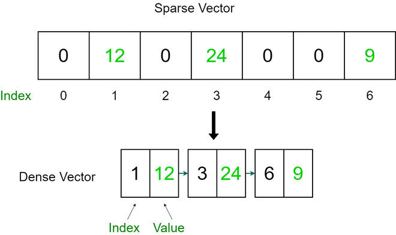

## Table of Contents

## What is a sparse vector in the context of machine learning?

In machine learning, a sparse vector is a vector where most of its elements are zero. Imagine you have a long list of numbers, but only a few of them are not zero. This kind of vector is called sparse because it's mostly empty, like a sparse forest with few trees. Sparse vectors are very useful when dealing with high-dimensional data, where you have many features but only a few of them matter for a specific example.

For example, think about a dictionary where each word is a feature. If you're looking at a short sentence, most of the words in the dictionary won't be in that sentence, so their values would be zero in the vector representing the sentence. This makes the vector sparse. Using sparse vectors can save a lot of memory and make computations faster because you only need to store and process the non-zero elements.

To represent a sparse vector, you can use special data structures that only keep track of the non-zero values and their positions. For instance, in Python, you might use a dictionary or a specialized library like `scipy.sparse`. This approach is much more efficient than storing a full vector with many zeros, especially when dealing with very large datasets.

## How does a sparse vector differ from a dense vector?

A sparse vector and a dense vector differ mainly in how many of their elements are zero. A sparse vector has most of its elements as zero, which means it's mostly empty. Imagine a long list where only a few numbers are not zero. This is useful when you're working with data that has a lot of features, but only a few of them matter for each example. For instance, in text analysis, if you have a dictionary of words, a sentence will only use a few of those words, so the vector representing the sentence will be sparse.

On the other hand, a dense vector has most of its elements as non-zero values. This means the vector is full of numbers that are important. Think of a list where almost every number counts. Dense vectors are useful when every feature or most features are relevant to the data you're working with. For example, in image processing, each pixel might have a value, so the vector representing the image would be dense.

In practice, using sparse vectors can save a lot of memory and make computations faster because you only need to work with the non-zero elements. For example, in Python, you might use a dictionary or a specialized library like `scipy.sparse` to represent a sparse vector efficiently. Here's a simple example of how you might create a sparse vector in Python:

```python
from scipy import sparse

# Create a sparse matrix
row = [0, 3, 1, 0]
col = [0, 3, 1, 2]
data = [4, 5, 7, 9]
sparse_matrix = sparse.csr_matrix((data, (row, col)), shape=(4, 4))

print(sparse_matrix)
```

This code creates a sparse matrix, which is essentially a collection of sparse vectors. You can see that it only stores the non-zero values and their positions, making it much more efficient than storing a full matrix with many zeros.

## What are the advantages of using sparse vectors in machine learning?

Using sparse vectors in [machine learning](/wiki/machine-learning) can save a lot of memory. When you have a lot of data with many features, but only a few of those features matter for each example, sparse vectors help by only storing the important numbers. Instead of keeping a long list full of zeros, you just keep track of the non-zero values and where they are. This means you use less space on your computer, which is great when you're working with big datasets. For example, if you're analyzing text, a dictionary might have thousands of words, but a single sentence only uses a few of them. By using sparse vectors, you can represent that sentence efficiently.

Sparse vectors also make calculations faster. When you're doing math with vectors, you usually need to go through every number in the list. But with sparse vectors, you only need to work with the non-zero numbers, which can speed things up a lot. This is especially helpful in algorithms like those used in recommendation systems or natural language processing, where you might have to deal with millions of features but only a few are relevant at any given time. By focusing on the important numbers, you can process your data more quickly and efficiently.

In programming, using sparse vectors can be done easily with special tools. For example, in Python, you might use the `scipy.sparse` library to create and work with sparse vectors. Here's a simple way to create a sparse vector:

```python
from scipy import sparse

# Create a sparse matrix
row = [0, 3, 1, 0]
col = [0, 3, 1, 2]
data = [4, 5, 7, 9]
sparse_matrix = sparse.csr_matrix((data, (row, col)), shape=(4, 4))

print(sparse_matrix)
```

This code shows how you can create a sparse matrix, which is a collection of sparse vectors. It only stores the non-zero values and their positions, making it efficient for big data tasks.

## In which types of machine learning algorithms are sparse vectors commonly used?

Sparse vectors are commonly used in machine learning algorithms that deal with high-dimensional data, where most of the features are zero for any given example. One common use is in natural language processing (NLP), where you might have a large vocabulary but only a few words are used in each document. For example, in text classification tasks like spam detection or sentiment analysis, sparse vectors help represent text data efficiently. Algorithms like Naive Bayes, Support Vector Machines (SVMs), and logistic regression often work well with sparse data because they can handle the high dimensionality and focus on the relevant features.

Another area where sparse vectors are useful is in recommender systems. These systems often deal with user-item interaction data, where each user might have interacted with only a small subset of items. Sparse vectors help represent these interactions efficiently, allowing algorithms like collaborative filtering to make recommendations based on the sparse data. For instance, matrix factorization techniques used in recommender systems can benefit from the sparsity of the data, making computations faster and more memory-efficient.

In addition, sparse vectors are crucial in certain optimization algorithms and feature selection methods. For example, in L1 regularization, also known as Lasso, sparse vectors help in selecting the most important features by driving the coefficients of less important features to zero. This is useful in tasks where you want to reduce the complexity of your model and focus on the most predictive features. Algorithms like sparse coding and dictionary learning also rely on sparse representations to find compact and meaningful representations of data.

## How can sparse vectors improve the efficiency of machine learning models?

Sparse vectors can make machine learning models more efficient by saving memory and speeding up calculations. When you have a lot of data with many features, but only a few of those features are important for each example, using sparse vectors helps a lot. Instead of keeping a big list full of zeros, you only store the numbers that matter. This means you use less space on your computer, which is great when you're working with huge datasets. For example, if you're analyzing text, a dictionary might have thousands of words, but a single sentence only uses a few of them. By using sparse vectors, you can represent that sentence without wasting space on zeros.

Sparse vectors also make calculations faster. When you do math with vectors, you usually have to go through every number in the list. But with sparse vectors, you only need to work with the non-zero numbers, which can speed things up a lot. This is especially helpful in algorithms like those used in recommendation systems or natural language processing, where you might have to deal with millions of features but only a few are relevant at any given time. By focusing on the important numbers, you can process your data more quickly and efficiently. In programming, you can use special tools like the `scipy.sparse` library in Python to create and work with sparse vectors, making your machine learning tasks more efficient.

## What are the common formats for storing sparse vectors?

Sparse vectors are stored in special formats that save space by only keeping track of the non-zero values and their positions. One common format is the Coordinate Format (COO), which lists the row and column indices of the non-zero elements along with their values. For example, if you have a sparse vector, you might store it as a list of tuples like `[(row1, col1, value1), (row2, col2, value2), ...]`. This format is easy to understand and use, but it can be slow for some operations because it doesn't store the data in a way that's quick to access.

Another popular format is the Compressed Sparse Row (CSR) format. This format compresses the data by storing the values and column indices in separate arrays, and it uses another array to keep track of where each row starts. This makes it faster to perform operations like matrix multiplication because you can quickly find the non-zero elements in each row. For example, in Python, you can use the `scipy.sparse` library to create a CSR matrix like this:

```python
from scipy import sparse

# Create a sparse matrix in CSR format
row = [0, 3, 1, 0]
col = [0, 3, 1, 2]
data = [4, 5, 7, 9]
csr_matrix = sparse.csr_matrix((data, (row, col)), shape=(4, 4))

print(csr_matrix)
```

A third format is the Compressed Sparse Column (CSC) format, which is similar to CSR but compresses the data by column instead of by row. This can be useful if your algorithms often need to access data by column. Both CSR and CSC formats are efficient for different kinds of operations, so choosing the right format depends on what you need to do with your data.

## How do you preprocess data to convert it into sparse vectors?

To convert data into sparse vectors, you first need to identify which features are important and which ones are not. For example, in text analysis, you might use a dictionary of words and count how many times each word appears in a document. If a word doesn't appear at all, its count will be zero, making the vector sparse. You can do this by creating a list where each position represents a word, and the value at that position is the word's count. If most words don't appear, the list will have many zeros, making it a sparse vector.

Once you have identified the non-zero elements, you can use special formats to store them efficiently. For example, you might use the Coordinate Format (COO) where you keep a list of the positions and values of the non-zero elements. Another option is the Compressed Sparse Row (CSR) format, which stores the values and their column positions in separate arrays, along with an array that tells you where each row starts. This makes it easier to work with the data because you only need to focus on the important numbers, not the zeros. Here's an example of how you might create a sparse vector in Python using the `scipy.sparse` library:

```python
from scipy import sparse

# Create a sparse matrix in CSR format
row = [0, 3, 1, 0]
col = [0, 3, 1, 2]
data = [4, 5, 7, 9]
csr_matrix = sparse.csr_matrix((data, (row, col)), shape=(4, 4))

print(csr_matrix)
```

## What are the challenges associated with using sparse vectors in machine learning?

Using sparse vectors in machine learning can be tricky because they need special ways to be stored and handled. When you have a lot of data with many features, but only a few of those features matter for each example, you end up with a lot of zeros in your vectors. This can make things like storing the data and doing calculations more complicated. You need to use special formats like the Coordinate Format (COO) or Compressed Sparse Row (CSR) format to keep track of where the non-zero numbers are. This can be harder to work with than regular, full vectors because you need to learn how to use these special formats and make sure your algorithms can handle them correctly.

Another challenge is that some machine learning algorithms might not work well with sparse data. For example, algorithms that are designed to work with dense vectors might have trouble when most of the numbers are zero. This means you might need to change the algorithms or use different ones that are better at handling sparse data. Also, even though sparse vectors can save space and make some calculations faster, they can make other operations slower. For instance, if you need to find a specific value in a sparse vector, it might take longer because you have to search through the list of non-zero values and their positions. So, you need to think carefully about whether using sparse vectors will really help with your specific machine learning task.

## How can one implement sparse vector operations in popular programming languages like Python?

In Python, you can implement sparse vector operations using the `scipy.sparse` library, which provides efficient ways to work with sparse data. To create a sparse vector, you can use the Compressed Sparse Row (CSR) format, which is one of the most common formats for sparse matrices. For example, if you want to create a sparse vector, you can specify the non-zero values and their positions using lists for the row, column, and data. Here's how you might do it:

```python
from scipy import sparse

# Create a sparse matrix in CSR format
row = [0, 3, 1, 0]
col = [0, 3, 1, 2]
data = [4, 5, 7, 9]
csr_matrix = sparse.csr_matrix((data, (row, col)), shape=(4, 4))

print(csr_matrix)
```

Once you have your sparse vector, you can perform various operations like addition, multiplication, and other linear algebra tasks. The `scipy.sparse` library includes functions to handle these operations efficiently, focusing only on the non-zero elements. For instance, to add two sparse vectors, you can use the `+` operator, and the library will take care of combining the non-zero elements correctly. This approach saves memory and speeds up computations because it avoids dealing with unnecessary zeros, making it ideal for large-scale machine learning tasks where you have many features but only a few are relevant for each example.

## What are the best practices for handling sparse vectors in large-scale machine learning?

When working with sparse vectors in large-scale machine learning, it's important to use the right formats and tools to save memory and make calculations faster. One good way to do this is by using special formats like the Compressed Sparse Row (CSR) format. This format helps by only storing the numbers that are not zero and where they are in the vector. In Python, you can use the `scipy.sparse` library to create and work with these sparse vectors easily. For example, if you have a big dataset with many features but only a few of them matter for each example, using sparse vectors can help you handle the data without wasting space on zeros.

Another important practice is to choose the right algorithms that can handle sparse data well. Some algorithms, like Naive Bayes or Support Vector Machines, work better with sparse vectors because they can focus on the important features and ignore the zeros. It's also a good idea to use techniques like L1 regularization, which can help select the most important features by making less important ones zero. This can make your models simpler and faster. By using these best practices, you can make your large-scale machine learning tasks more efficient and effective.

## How do sparse vectors impact the performance of deep learning models?

Sparse vectors can have a big impact on the performance of [deep learning](/wiki/deep-learning) models, especially when it comes to memory usage and computation speed. In deep learning, models often deal with high-dimensional data, like images or text. If you use sparse vectors, you only need to store and process the non-zero elements, which can save a lot of memory. This is really helpful when you're working with big datasets where most of the features are zero for any given example. For example, in natural language processing, a document might only use a small part of a large vocabulary, so using sparse vectors to represent it can make your model more efficient.

However, using sparse vectors in deep learning can also present some challenges. Some deep learning algorithms and architectures are not designed to handle sparse data very well. For instance, neural networks typically expect dense input, so you might need to use special techniques or different model architectures to work with sparse vectors effectively. Techniques like sparse coding or using specific layers that can handle sparse inputs can help, but they might also make your model more complex. So, while sparse vectors can improve efficiency, you need to carefully consider whether they fit well with the specific deep learning task you're working on.

## What advanced techniques exist for optimizing machine learning algorithms with sparse vectors?

One advanced technique for optimizing machine learning algorithms with sparse vectors is using sparse coding. Sparse coding aims to represent data as a linear combination of a few basis vectors, which helps in reducing the dimensionality of the data while preserving important features. This can be particularly useful in tasks like image processing or natural language processing, where you want to find a compact representation of your data. By focusing on the non-zero elements, sparse coding can make your algorithms run faster and use less memory, which is crucial for large-scale machine learning tasks.

Another technique is using L1 regularization, also known as Lasso. L1 regularization adds a penalty term to the loss function that encourages the model to set some feature weights to zero. This helps in feature selection by identifying and keeping only the most important features. For example, if you have a model with many features but only a few of them are truly predictive, L1 regularization can help you find those important features and ignore the rest, resulting in a simpler and more efficient model. This technique is especially useful when working with sparse vectors because it naturally aligns with the idea of focusing on the non-zero elements.

## References & Further Reading

[1]: Olshausen, B. A., & Field, D. J. (2004). ["Sparse coding of sensory inputs."](https://pubmed.ncbi.nlm.nih.gov/15321069/)00099-6) Neuron, 46(2), 333-346.

[2]: Jurafsky, D., & Martin, J. H. (2020). ["Speech and Language Processing: An Introduction to Natural Language Processing, Computational Linguistics, and Speech Recognition."](https://www.researchgate.net/publication/200111340_Speech_and_Language_Processing_An_Introduction_to_Natural_Language_Processing_Computational_Linguistics_and_Speech_Recognition) Draft of 3rd Edition.

[3]: Hastie, T., Tibshirani, R., & Friedman, J. (2009). ["The Elements of Statistical Learning: Data Mining, Inference, and Prediction."](https://link.springer.com/book/10.1007/978-0-387-84858-7) Springer.

[4]: Aggarwal, C. C. (2018). ["Neural Networks and Deep Learning: A Textbook."](https://link.springer.com/book/10.1007/978-3-031-29642-0) Springer.

[5]: Pedregosa, F., Varoquaux, G., Gramfort, A., Michel, V., Thirion, B., Grisel, O., ... & Duchesnay, É. (2011). ["Scikit-learn: Machine Learning in Python."](https://dl.acm.org/doi/10.5555/1953048.2078195) Journal of Machine Learning Research, 12, 2825-2830.