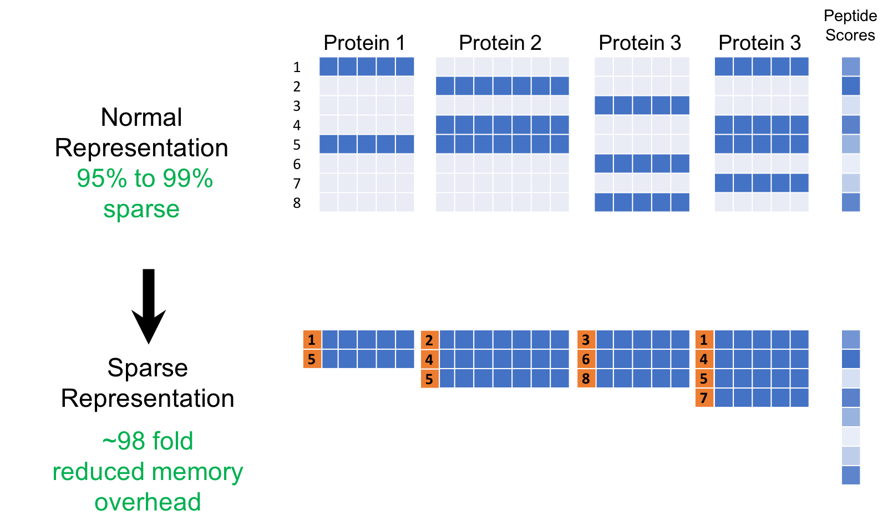

## Table of Contents

## What is sparsity in the context of machine learning?

Sparsity in machine learning refers to the idea that many data points or features in a dataset can be zero or close to zero, meaning they don't contribute much to the model. This is important because it can help make models simpler and more efficient. Imagine you have a big list of numbers, but most of them are zeros. By focusing on the non-zero numbers, you can save time and computer resources.

In practice, sparsity is often used in techniques like Lasso regression, where the goal is to shrink some coefficients to zero. This helps in selecting only the most important features for the model. For example, in a dataset about house prices, not all features like the number of windows might be relevant. By using sparsity, the model can ignore less important features and focus on key ones like the size of the house or its location. This not only improves the model's performance but also makes it easier to understand and explain.

## Why is sparsity important in machine learning models?

Sparsity is important in machine learning because it helps make models simpler and faster. When a model is sparse, it means that many of the features or data points are zero or close to zero. This allows the model to focus only on the most important information, ignoring the rest. For example, in a model predicting house prices, not every feature like the color of the walls might matter. By using sparsity, the model can concentrate on key factors like the size of the house or its location, making the model more efficient and easier to run on computers.

Another reason sparsity is important is that it helps prevent overfitting. Overfitting happens when a model is too complex and fits the training data too well, including the noise. By encouraging sparsity, techniques like Lasso regression can shrink some coefficients to zero, which means the model will use fewer features. This makes the model more general and better at predicting new data. For instance, in a dataset about customer behavior, sparsity can help identify the few key behaviors that really matter, rather than trying to use every little detail, which might not be relevant for future predictions.

## How does sparsity affect the performance of machine learning algorithms?

Sparsity can make [machine learning](/wiki/machine-learning) algorithms run faster and use less memory. When a model is sparse, it means that many of the features or data points are zero or close to zero. This allows the model to ignore these unimportant parts and focus on the key information. For example, if you're trying to predict house prices, not every detail like the color of the walls matters. By using sparsity, the model can concentrate on important factors like the size of the house or its location. This makes the model simpler and quicker to run on a computer.

Sparsity also helps prevent overfitting, which is when a model fits the training data too well, including the noise. By encouraging sparsity, techniques like Lasso regression can shrink some coefficients to zero. This means the model will use fewer features, making it more general and better at predicting new data. For instance, in a dataset about customer behavior, sparsity can help identify the few key behaviors that really matter, rather than trying to use every little detail, which might not be relevant for future predictions. This way, the model performs better on new, unseen data.

## What are common techniques used to induce sparsity in machine learning models?

One common technique to make machine learning models sparse is called Lasso regression. Lasso stands for Least Absolute Shrinkage and Selection Operator. It works by adding a penalty to the model's coefficients, which makes some of them shrink to zero. This penalty is based on the absolute value of the coefficients, and it's controlled by a parameter called lambda. The bigger lambda is, the more coefficients will be pushed to zero, making the model more sparse. For example, if you're trying to predict house prices, Lasso can help the model focus on important features like the size of the house and ignore less important ones like the color of the walls.

Another technique is called Elastic Net, which combines Lasso and Ridge regression. Ridge regression adds a penalty based on the square of the coefficients, which doesn't make them zero but makes them smaller. Elastic Net uses both penalties, which helps when you have a lot of features that are correlated with each other. This method can be more flexible and can handle different types of data better. For instance, if you're analyzing customer behavior, Elastic Net can help the model pick out the most important behaviors while still considering other related factors.

A third method is called pruning, which is often used in decision trees and neural networks. Pruning involves removing parts of the model that don't contribute much to the predictions. In decision trees, this means cutting off branches that don't improve the model's accuracy. In neural networks, it can mean removing neurons or connections that have small weights. This makes the model simpler and faster. For example, if you're using a [neural network](/wiki/neural-network) to recognize images, pruning can help the model focus on the most important features of the image, like the shape of an object, and ignore less important details.

## Can you explain the concept of L1 regularization and its role in creating sparsity?

L1 regularization is a technique used in machine learning to make models simpler and more focused. It does this by adding a penalty to the model's coefficients, which encourages some of them to become zero. This penalty is based on the absolute value of the coefficients, and it's controlled by a parameter called lambda. The bigger lambda is, the more the coefficients are pushed towards zero. This process is called L1 regularization, and it's often used in methods like Lasso regression. For example, if you're trying to predict house prices, L1 regularization can help the model focus on important features like the size of the house and ignore less important ones like the color of the walls.

The mathematical formula for L1 regularization is simple. If you have a model with coefficients $$ \beta_1, \beta_2, ..., \beta_n $$, the L1 penalty added to the loss function is $$ \lambda \sum_{i=1}^n |\beta_i| $$. This means that the model tries to minimize not just the error in its predictions but also the sum of the absolute values of its coefficients. By doing this, L1 regularization helps create sparsity in the model. Sparsity means that many of the coefficients become zero, so the model uses fewer features. This makes the model simpler, faster, and less likely to overfit the data. For instance, in a dataset about customer behavior, L1 regularization can help identify the few key behaviors that really matter, rather than trying to use every little detail.

## How does L2 regularization differ from L1 in terms of inducing sparsity?

L2 regularization, also known as Ridge regression, works differently from L1 regularization when it comes to making models sparse. While L1 regularization adds a penalty based on the absolute value of the coefficients, L2 regularization adds a penalty based on the square of the coefficients. The mathematical formula for L2 regularization is $$ \lambda \sum_{i=1}^n \beta_i^2 $$. This means that L2 regularization doesn't make the coefficients zero but instead makes them smaller. So, if you're trying to predict house prices, L2 regularization will shrink all the coefficients a bit, but it won't ignore any features completely like L1 might.

Because L2 regularization doesn't push coefficients to zero, it doesn't create sparsity in the same way L1 does. Instead, L2 helps to make the model more stable by reducing the impact of all features a little bit. This can be useful when you have a lot of features that are all somewhat important. For example, if you're analyzing customer behavior, L2 regularization can help the model consider all the behaviors but make sure none of them have too much influence. This can prevent overfitting and make the model perform better on new data, but it won't make the model as simple and focused as L1 regularization does.

## What are sparse models and how do they differ from dense models?

Sparse models are machine learning models where many of the features or coefficients are zero or close to zero. This means the model focuses on just a few important pieces of information and ignores the rest. For example, if you're trying to predict house prices, a sparse model might only use the size of the house and its location, ignoring less important details like the color of the walls. Sparse models are created using techniques like L1 regularization, which adds a penalty to the model's coefficients based on their absolute value. The formula for L1 regularization is $$ \lambda \sum_{i=1}^n |\beta_i| $$. This penalty pushes some coefficients to zero, making the model simpler and faster.

Dense models, on the other hand, use all the features or most of them. In a dense model, all the coefficients are non-zero, and the model tries to use every piece of information available. For example, in predicting house prices, a dense model would consider every detail, including the color of the walls, the number of windows, and more. Dense models are often created using techniques like L2 regularization, which adds a penalty based on the square of the coefficients. The formula for L2 regularization is $$ \lambda \sum_{i=1}^n \beta_i^2 $$. This penalty makes all the coefficients smaller but doesn't make them zero, so the model remains complex and uses all the features.

## How can sparsity be measured in a machine learning model?

Sparsity in a machine learning model can be measured by looking at how many of the model's features or coefficients are zero or close to zero. One common way to do this is to count the number of zero coefficients and divide it by the total number of coefficients. This gives you a sparsity ratio, which is a number between 0 and 1. A sparsity ratio close to 1 means the model is very sparse, using only a few important features. For example, if a model has 100 coefficients and 90 of them are zero, the sparsity ratio would be $$ \frac{90}{100} = 0.9 $$, indicating a very sparse model.

Another way to measure sparsity is to look at the distribution of the coefficients. You can use a histogram to see how many coefficients are small or zero. If the histogram shows a lot of coefficients clustered around zero, the model is likely sparse. This visual approach can help you understand how the model is using the data. For instance, if you see that most coefficients are very small, it suggests that the model is focusing on just a few key features, which is a sign of sparsity.

## What are the benefits of using sparse representations in neural networks?

Using sparse representations in neural networks makes them run faster and use less memory. When a neural network is sparse, it means that many of the connections between neurons are zero or close to zero. This allows the network to ignore these unimportant connections and focus on the key ones. For example, if you're trying to recognize images, a sparse neural network can concentrate on the most important parts of the image, like the shape of an object, and ignore less important details. This makes the network simpler and quicker to run on a computer, which is especially helpful when you're working with big datasets.

Sparse representations also help prevent overfitting, which is when a neural network fits the training data too well, including the noise. By encouraging sparsity, techniques like L1 regularization can make some of the connections between neurons zero. The formula for L1 regularization is $$ \lambda \sum_{i=1}^n |w_i| $$, where $$ w_i $$ are the weights of the connections. This means the network will use fewer connections, making it more general and better at recognizing new images or data. For instance, in a neural network for predicting customer behavior, sparsity can help identify the few key behaviors that really matter, rather than trying to use every little detail, which might not be relevant for future predictions.

## How do sparse matrices help in improving computational efficiency in machine learning?

Sparse matrices help make machine learning faster and use less computer memory. When you have a big list of numbers where most are zeros, using a sparse matrix means you only store and work with the non-zero numbers. This saves a lot of space because you don't need to keep track of all the zeros. For example, if you're trying to predict house prices and you have a lot of features, but many of them don't matter, a sparse matrix can help the computer focus on the important features and ignore the rest. This makes calculations quicker because the computer doesn't have to go through all the zeros.

Sparse matrices also help make machine learning models run faster. When you use a sparse matrix, the computer can skip over the zeros and only do math with the numbers that matter. This means that operations like multiplying matrices or solving equations can be done much faster. For instance, in a neural network for recognizing images, using sparse matrices can help the network focus on the important parts of the image and ignore the rest, making the whole process more efficient. This is especially useful when you're working with big datasets where speed and memory are important.

## What challenges might arise when implementing sparsity in large-scale machine learning systems?

Implementing sparsity in large-scale machine learning systems can be tricky because it involves handling big datasets where many numbers are zero. One challenge is that even though sparse matrices save space and speed up calculations, they can be hard to work with when the data is constantly changing. For example, if you're using a neural network to recognize images in real-time, the sparsity pattern might change with each new image, which means the computer has to keep updating how it stores and processes the data. This can slow things down if not managed carefully.

Another challenge is making sure that the sparse model works well on new data. When you use techniques like L1 regularization, which adds a penalty $$ \lambda \sum_{i=1}^n |\beta_i| $$ to make some coefficients zero, you have to find the right balance. If you make the model too sparse, it might miss important information and not predict well. On the other hand, if it's not sparse enough, the model can be slow and use too much memory. Finding this balance is harder in large-scale systems because there's so much data to consider, and small changes can have big effects on how the model performs.

## Can you discuss advanced techniques for optimizing sparsity in deep learning models?

One advanced technique for optimizing sparsity in [deep learning](/wiki/deep-learning) models is called pruning. Pruning involves removing parts of the neural network that don't contribute much to the predictions. For example, in a neural network for image recognition, you might remove neurons or connections with small weights. This makes the model simpler and faster. Pruning can be done in different ways, like magnitude-based pruning, where you remove the smallest weights, or iterative pruning, where you prune the network a little bit at a time and then retrain it to see if it still works well. The goal is to make the model sparse without losing too much accuracy.

Another technique is called knowledge distillation. This involves training a smaller, sparse model to mimic the behavior of a larger, more complex model. The idea is to transfer the knowledge from the big model to the small one, so the small model can make good predictions even though it's simpler. For example, you might train a big neural network to recognize images and then use its predictions to train a smaller, sparse network. This way, the smaller network can learn to focus on the most important features and ignore the rest, making it faster and more efficient. Knowledge distillation helps balance sparsity and accuracy, which is especially useful in large-scale systems where speed and memory are important.