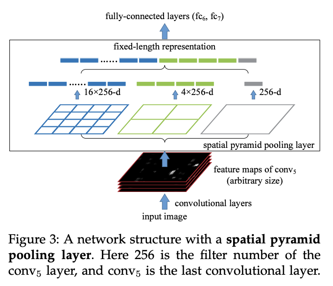

## Table of Contents

## What is spatial pooling in the context of machine learning?

Spatial pooling is a technique used in machine learning, especially in convolutional neural networks (CNNs), to reduce the size of the data while keeping important information. Imagine you have a big picture, and you want to make it smaller but still be able to recognize what's in it. Spatial pooling does this by taking small sections of the picture and turning them into a single value, like finding the biggest number in a group of numbers. This helps the computer process the data faster and makes the model simpler.

In practice, spatial pooling often uses a method called max pooling, where the largest value in each small section (or "pool") of the data is chosen to represent that section. For example, if you have a 4x4 section of an image, max pooling might turn it into a single value by picking the highest number in that section. This not only reduces the amount of data but also helps the model focus on the most important features, like edges or specific patterns in an image. By doing this, the model can learn to recognize objects more efficiently and with less computational power.

## How does spatial pooling differ from other pooling techniques?

Spatial pooling is a specific type of pooling used in machine learning, particularly in convolutional neural networks (CNNs), where it focuses on reducing the spatial dimensions of the data. Unlike other pooling methods, spatial pooling works directly on the spatial layout of the data, such as images. It does this by taking small sections of the image, called "pools," and summarizing them into a single value, usually through max pooling where the highest value in each pool is chosen. This helps in reducing the data size while retaining important features like edges or patterns, making it easier for the model to process and learn from the data.

Other pooling techniques might not focus solely on spatial dimensions. For example, global pooling, which can be either global average pooling or global max pooling, takes the entire feature map and reduces it to a single value. Global average pooling calculates the average of all values in the feature map, while global max pooling picks the highest value across the entire map. These methods are useful in different contexts, like reducing the risk of overfitting or simplifying the model's architecture. In contrast, spatial pooling is more localized, working on smaller sections of the data, which helps maintain spatial relationships within the data that are crucial for tasks like image recognition.

## What are the primary goals of using spatial pooling in neural networks?

The primary goal of using spatial pooling in neural networks is to reduce the size of the data while keeping the important information. Imagine you have a big picture, and you want to make it smaller but still be able to recognize what's in it. Spatial pooling helps by taking small sections of the picture and turning them into a single value, like finding the biggest number in a group of numbers. This makes the data smaller and easier for the computer to process. By doing this, the neural network can work faster and use less memory, which is really helpful when dealing with big datasets.

Another important goal is to make the model more robust to small changes in the input data. For example, if you move an object in a picture a little bit, the model should still be able to recognize it. Spatial pooling helps with this because it focuses on the most important features, like edges or patterns, instead of the exact position of every pixel. This way, even if the image changes slightly, the model can still understand what it's looking at. This is especially useful in tasks like image recognition, where the position of objects might not be exact but the overall features are what matter.

## Can you explain the process of spatial pooling in a convolutional neural network?

Spatial pooling in a convolutional neural network is like zooming out on a picture but still trying to see the important parts. Imagine you have a big image, and you want to make it smaller without losing the key details. Spatial pooling does this by dividing the image into small sections called "pools." For each pool, it picks out the most important value, usually the biggest number. This process is called max pooling. So, if you have a 4x4 section of the image, max pooling might take the highest number in that section and use it to represent the whole pool. This makes the image smaller but keeps the important features like edges or shapes that help the computer recognize what's in the picture.

By using spatial pooling, the neural network can process the data faster and with less memory. It's like summarizing a big book into a shorter version but still keeping the main ideas. This helps the computer focus on the important parts of the image, like the outline of a cat or the shape of a car, instead of every tiny detail. This way, even if the image changes a little bit, like if the cat moves slightly, the computer can still recognize it. Spatial pooling makes the model more robust and efficient, which is really helpful when working with large datasets or complex images.

## What are the common types of spatial pooling operations?

Spatial pooling operations in neural networks are like ways to make a picture smaller but keep the important parts. The most common type is max pooling. Imagine you have a big picture divided into small squares. Max pooling looks at each square and picks the biggest number in it. This big number represents the whole square. So, if you have a 4x4 section of the picture, max pooling will find the highest number in that section and use it to represent the whole section. This makes the picture smaller but still shows important details like edges or shapes.

Another common type is average pooling. Instead of picking the biggest number in each square, average pooling calculates the average of all the numbers in the square. So, if you have a 4x4 section, average pooling will add up all the numbers in that section and divide by 16 (the total number of numbers). This gives you a single number that represents the whole square. Average pooling can be useful when you want to smooth out the details and focus on the overall pattern in the picture.

There's also a type called L2 pooling, which is less common but still used sometimes. L2 pooling takes the square root of the sum of the squares of all the numbers in each section. So, if you have a 4x4 section, L2 pooling will square all the numbers, add them up, take the square root, and use that number to represent the section. This type of pooling can help highlight strong features in the picture while reducing the impact of smaller details.

## How does max pooling compare to average pooling in spatial pooling?

Max pooling and average pooling are two ways to make a picture smaller while keeping the important parts. Max pooling looks at small sections of the picture and picks the biggest number in each section. Imagine you have a 4x4 section of the picture. Max pooling will find the highest number in that section and use it to represent the whole section. This helps the computer focus on strong features like edges or shapes, making it easier to recognize what's in the picture even if it changes a little bit.

Average pooling, on the other hand, calculates the average of all the numbers in each section. So, if you have the same 4x4 section, average pooling will add up all the numbers and divide by 16 (the total number of numbers). This gives you a single number that represents the whole section. Average pooling can be useful when you want to smooth out the details and focus on the overall pattern in the picture. It's like taking a step back and looking at the bigger picture instead of focusing on every little detail.

## What impact does the size of the pooling window have on the spatial pooling process?

The size of the pooling window in spatial pooling is like deciding how big the pieces of a puzzle should be when you're trying to make the puzzle smaller. If you choose a bigger window, you'll end up with fewer pieces but each piece will cover more of the original picture. For example, using a 2x2 window means you're looking at smaller sections and keeping more details, while a 4x4 window means you're looking at larger sections and keeping fewer details. A larger window size can make the model simpler and faster because it reduces the data more, but it might also lose important details that are spread out over a smaller area.

On the other hand, a smaller window size keeps more of the original information because it looks at smaller sections of the picture. This can be helpful if the details you need to recognize are small, like the fine lines in a face or the texture of an object. However, using smaller windows means the model will have more data to process, which can make it slower and require more memory. So, choosing the right window size is a balance between keeping enough detail to recognize what's in the picture and making the model efficient enough to work quickly.

## How does spatial pooling contribute to the reduction of overfitting in models?

Spatial pooling helps reduce overfitting in models by making them simpler and more focused on the important parts of the data. When you use spatial pooling, like max pooling or average pooling, you're turning big sections of the data into smaller, summarized pieces. This means the model has less detailed information to work with, which can stop it from learning the noise or small, unimportant changes in the data. Instead, the model learns to recognize the bigger patterns and features that are more likely to be important for making good predictions.

For example, if you're trying to recognize pictures of cats, spatial pooling helps the model focus on the shape of the cat's ears or the pattern of its fur, rather than the exact position of every pixel. This makes the model better at recognizing cats even if the pictures are a bit different from what it was trained on. By reducing the amount of detail the model needs to remember, spatial pooling helps it generalize better to new, unseen data, which is the opposite of overfitting where the model remembers too much about the training data and doesn't perform well on new data.

## What are the considerations for choosing the stride in spatial pooling?

When choosing the stride in spatial pooling, you're deciding how much the pooling window moves across the image. A smaller stride, like 1, means the window moves one pixel at a time, which keeps more details but makes the data larger. A larger stride, like 2, means the window moves two pixels at a time, which reduces the data size more but might lose some important details. The right stride depends on what you want the model to do. If you need to keep a lot of details, a smaller stride is better. But if you want the model to be simpler and faster, a larger stride might be a good choice.

The stride also affects how much the model can generalize. A larger stride can help reduce overfitting by making the model focus on bigger patterns instead of small details. But if the stride is too big, the model might miss important features that are spread out over a smaller area. So, choosing the right stride is a balance between keeping enough detail to recognize what's in the image and making the model efficient enough to work quickly.

## How can spatial pooling be implemented to enhance feature detection in image processing?

Spatial pooling can enhance feature detection in image processing by reducing the size of the data while keeping the important parts. Imagine you have a big picture and you want to find the edges or shapes that make it recognizable. Spatial pooling does this by breaking the picture into small sections, called pools, and then picking out the most important value from each section. For example, max pooling looks at each pool and chooses the biggest number, which often represents strong features like edges. By doing this, the computer can focus on these key features instead of every tiny detail, making it easier to detect and recognize objects in the image.

Choosing the right type of spatial pooling and its parameters is crucial for enhancing feature detection. Max pooling is often used because it highlights the strongest features in each section, which is helpful for tasks like recognizing the outline of a cat or the shape of a car. However, average pooling can also be useful if you want to smooth out the details and focus on the overall pattern in the image. The size of the pooling window and the stride also matter. A smaller window and stride can keep more details, which might be necessary for detecting fine features, while a larger window and stride can make the model simpler and faster but might miss some important details. By carefully adjusting these settings, you can enhance the model's ability to detect and recognize features in images.

## What are some advanced techniques or variations of spatial pooling used in deep learning?

In deep learning, there are advanced techniques and variations of spatial pooling that go beyond the basic max and average pooling. One such technique is called "fractional max pooling," which uses non-integer pooling regions to increase the model's robustness to small changes in the input. This method helps the model generalize better by introducing randomness in the pooling process, allowing it to capture more diverse features. Another advanced method is "stochastic pooling," which randomly selects the values to pool based on their probabilities, reducing overfitting by introducing variability in the pooling operation. These techniques enhance the model's ability to detect and recognize features more effectively.

Another variation is "overlapping pooling," where the pooling regions overlap each other. This can help preserve more information from the input data, potentially improving feature detection. For instance, if you use a 3x3 pooling window with a stride of 2, you might end up with more detailed features than if you used non-overlapping pooling. Additionally, "spatial pyramid pooling" (SPP) is a technique that applies pooling at different scales and combines the results. This allows the model to capture features at various levels of detail, which can be particularly useful in tasks like object detection where understanding the context at different scales is important. By using these advanced techniques, models can become more robust and effective in processing and understanding complex data.

## How does spatial pooling affect the computational efficiency and performance of a neural network?

Spatial pooling makes neural networks more computationally efficient by reducing the size of the data they need to process. Imagine you have a big picture and you want to make it smaller but still keep the important parts. Spatial pooling does this by taking small sections of the picture and turning them into a single value, like finding the biggest number in a group of numbers. This makes the data smaller, so the computer can process it faster and use less memory. For example, if you use a 2x2 pooling window with a stride of 2, you can reduce the size of the feature map by half in each dimension, which means the network has to handle much less data. This can be really helpful when working with big datasets or when you want the model to run quickly.

The performance of a neural network can also improve with spatial pooling because it helps the model focus on the most important features in the data. By picking out the biggest or average values in each small section, spatial pooling helps the network recognize patterns like edges or shapes, even if the image changes a little bit. This makes the model more robust and better at generalizing to new data. However, if the pooling window is too big or the stride is too large, the model might lose important details that are spread out over smaller areas. So, choosing the right size and stride for spatial pooling is a balance between keeping enough detail to recognize what's in the image and making the model efficient enough to work quickly.