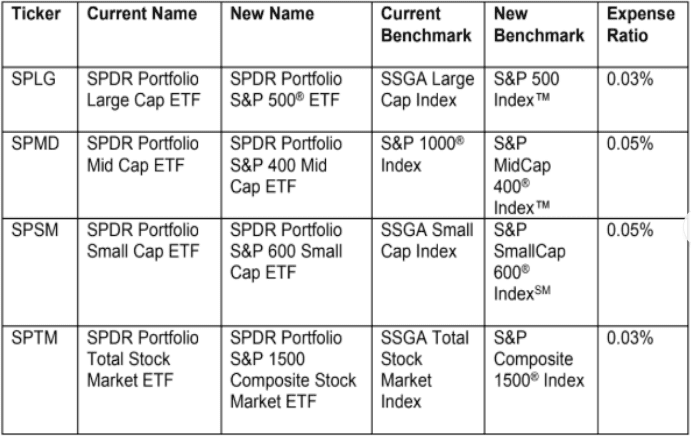

Exchange-traded funds (ETFs) are investment funds traded on stock exchanges, much like stocks. They have gained significant popularity in the financial markets due to their ability to offer diversified exposure to various asset classes, sectors, or indices. ETFs enable investors to gain access to a broad range of investments, from stocks and bonds to commodities and currencies, without needing to buy each asset individually. This efficiency, combined with features such as cost-effectiveness, liquidity, and transparency, has made ETFs a preferred choice for both institutional and retail investors.

Among the many ETFs available, SPDR ETFs, which are managed by State Street Global Advisors, hold a prominent position. The SPDR S&P 500 ETF Trust (SPY), launched in 1993, was the first ETF listed in the United States and remains one of the largest and most traded in the world. SPDR ETFs are known for their strategic design, targeting various market segments, and providing investors with numerous options to tailor their portfolios according to investment goals and risk tolerance.



Algorithmic trading refers to the use of computer algorithms to automate trading strategies. These algorithms make buy or sell decisions based on predefined criteria, minimizing human intervention. The use of algorithmic trading has revolutionized modern investing strategies, offering increased trading speed, precision, and the ability to scan vast amounts of data. Algorithms can identify patterns and execute trades at speeds unachievable by humans, contributing to improved market efficiency and liquidity.

This article examines the intersection of SPDR ETFs and algorithmic trading, two powerful financial innovations. By understanding their interplay, investors can potentially enhance their portfolio performance. As both areas continue to evolve, their combined application opens new opportunities for strategic investment decisions.

Investors keen on optimizing their portfolio must grasp these concepts, as they represent significant components of the modern financial landscape. With the continuous advancing technology and changing market dynamics, a well-grounded understanding of SPDR ETFs and algorithmic trading can provide a robust framework for achieving diversified and strategic growth within investment portfolios.

## Table of Contents

## Understanding Exchange-Traded Funds (ETFs)

Exchange-Traded Funds (ETFs) are a popular financial instrument that combines characteristics of both stocks and mutual funds, providing investors with a diversified portfolio that is traded on stock exchanges. ETFs are composed of a collection of securities, such as stocks or bonds, and are designed to track the performance of a specific index, sector, commodity, or asset class. Each share of an ETF represents a proportional interest in the total assets of the fund, offering investors exposure to a wide range of markets and investment themes.

ETFs differ from mutual funds in several key aspects. Unlike mutual funds, which are bought and sold at the end of the trading day at their net asset value (NAV), ETFs can be traded throughout the trading day at market prices, similar to individual stocks. This intraday trading ability provides greater flexibility and [liquidity](/wiki/liquidity-risk-premium), allowing investors to react quickly to market changes. Additionally, ETFs generally have lower expense ratios compared to mutual funds, partly due to their passive management style.

One of the primary advantages of ETFs is diversification. By investing in an [ETF](/wiki/etf-trading-strategies), investors gain access to a broad array of underlying securities, reducing the risk associated with individual asset [volatility](/wiki/volatility-trading-strategies). Furthermore, ETFs are highly liquid, offering easy entry and [exit](/wiki/exit-strategy) points for investors, thus enhancing their appeal in financial markets. Cost-effectiveness is another noteworthy benefit of ETFs; the low expense ratios and absence of sales loads make them an economical choice for both individual and institutional investors.

ETFs are instrumental in both passive and active investment strategies. In a passive strategy, ETFs are commonly used to replicate the performance of a market index, thereby enabling investors to achieve market-average returns with minimal management intervention. Conversely, in active strategies, ETFs can be utilized for tactical asset allocation or to gain targeted exposure to specific sectors or geographies.

The market for ETFs has experienced significant growth in recent years, reflecting their increasing popularity among investors. This expansion is characterized by a diverse selection of ETFs, catering to various investment preferences and objectives. Investors can choose from equity-based ETFs, fixed-income ETFs, commodity ETFs, and international ETFs, among others. The proliferation of thematic and niche ETFs has further broadened the scope for investors seeking tailored investment solutions.

In summary, ETFs represent a versatile and efficient investment vehicle, offering a range of benefits that have contributed to their growing prominence in the global financial landscape. Their unique structure, advantageous features, and adaptability to different investment strategies underscore their significance as a tool for portfolio construction and management.

 to SPDR ETFs

SPDR ETFs, or Standard & Poor's Depositary Receipts, were pioneered by State Street Global Advisors (SSGA) and have become integral to the landscape of exchange-traded funds. The inception of SPDR ETFs dates back to 1993 with the launch of the SPDR S&P 500 ETF Trust (SPY), which is one of the earliest and most widely recognized ETFs. This product was designed to track the performance of the S&P 500 Index, offering investors a straightforward way to gain exposure to a broad segment of the U.S. equities market. SPY has significantly influenced the investment community by enhancing access to diversified portfolios at relatively low costs.

SPDR ETFs stand out alongside other major ETF providers such as Vanguard and iShares, each bringing unique attributes and competitive offerings to the market. Vanguard is renowned for its low-cost index funds, while iShares, managed by BlackRock, provides an extensive range of ETFs that cater to various investment needs. SPDR ETFs, distinguished by their early market entry and innovation, boast a comprehensive portfolio covering diverse market segments. This includes sector-specific ETFs, emerging market funds, fixed-income options, and thematic investments targeting environmental, social, and governance ([ESG](/wiki/esg-investing)) criteria.

The diversity of SPDR ETFs is strategically focused on tapping into various sectors within the financial markets. This variety gives investors the flexibility to tailor their portfolios to align with specific investment strategies and market outlooks. By offering such a wide array of choices, SPDR enables both institutional and retail investors to efficiently allocate assets and execute diversified investment strategies.

Several factors contribute to the widespread popularity of SPDR ETFs among investors. One of the primary reasons is their association with the esteemed S&P 500 Index, which serves as a benchmark for U.S. stock market performance. SPDR ETFs provide liquidity and transparent pricing, which are critical features that appeal to different classes of investors. Institutional investors favor SPDR ETFs for their large-scale trading capabilities without significantly impacting market prices, while retail investors appreciate the accessibility and relatively modest expense ratios.

Overall, the historical significance, strategic diversity, and investor-centric features of SPDR ETFs underscore their status as pivotal components in modern investment portfolios. Their continued evolution and adaptability to market dynamics ensure they remain relevant to a wide range of investors seeking to optimize portfolio performance.

## Exploring Algorithmic Trading

Algorithmic trading involves the use of computer algorithms to automate and execute trading decisions in financial markets. It relies on a predefined set of rules and mathematical models to [carry](/wiki/carry-trading) out trades with minimal human intervention. By utilizing algorithms, traders can execute orders at speeds and frequencies that are impossible for a human trader, thereby optimizing trade executions and enhancing market efficiency.

One of the primary advantages of [algorithmic trading](/wiki/algorithmic-trading) is its capacity to execute trades rapidly, capitalizing on short-lived market opportunities. These strategies often optimize order execution by capitalizing on different market dynamics, leading to better pricing and reduced transaction costs. The precision of algorithms also helps in minimizing human error and emotions, which can adversely affect trading outcomes.

Algorithmic trading encompasses various strategies, each tailored to specific market conditions or objectives. Some of the most prevalent types include:

1. **Trend Following**: This strategy involves identifying and capitalizing on long-term upward or downward trends. It typically uses indicators such as moving averages to generate buy or sell signals based on the direction of the trend.

2. **Mean Reversion**: This strategy assumes that asset prices will revert to their historical mean over time. Algorithms using this approach might buy an asset when its price is below the historical average and sell when it is above.

3. **Arbitrage**: This involves taking advantage of price discrepancies between markets or related instruments. For example, if an ETF is trading at different prices on two exchanges, an algorithm might buy on the lower-priced exchange and sell on the higher-priced one to profit from the difference.

The technological advancements in computing power and data availability have played a significant role in the proliferation of algorithmic trading. High-frequency trading ([HFT](/wiki/high-frequency-trading-strategies)), a subset of algorithmic trading, uses powerful computers to transact a large number of orders at extremely fast speeds, often in milliseconds. This technology-driven approach considerably benefits liquidity and price discovery in the markets.

Despite its numerous benefits, algorithmic trading also presents certain challenges. The implementation of these strategies requires sophisticated infrastructure and knowledge of programming and quantitative techniques. Additionally, market anomalies or unexpected events can lead to significant losses if the algorithms are not designed to handle such scenarios. Continuous monitoring and adaptive learning are crucial to maintaining and refining the effectiveness of trading algorithms. Moreover, the evolving regulatory landscape necessitates compliance with financial regulations to prevent market manipulation or unfair trading practices.

In conclusion, the integration of algorithmic trading strategies represents a significant evolution in the financial markets, driven by the synergy between technology and financial innovation. Understanding and effectively implementing these strategies can offer traders and investors enhanced precision, efficiency, and potential profitability.

## The Intersection of SPDR ETFs and Algorithmic Trading

Algorithmic trading strategies have become integral to the efficient trading of SPDR Exchange-Traded Funds (ETFs), offering precision and speed that manual methods cannot achieve. These strategies are typically implemented using complex algorithms that analyze market data to identify trading opportunities, execute trades, and manage portfolios with minimal human intervention.

### Application of Algorithmic Trading Strategies to SPDR ETFs

Algorithmic trading often employs strategies such as statistical [arbitrage](/wiki/arbitrage), [trend following](/wiki/trend-following), and [market making](/wiki/market-making). SPDR ETFs, known for their high liquidity and broad market exposure, are particularly suitable for such strategies due to their predictable pricing behavior and [volume](/wiki/volume-trading-strategy). 

In [statistical arbitrage](/wiki/statistical-arbitrage), for example, traders use algorithms to exploit price inefficiencies between SPDR ETFs and underlying indices or correlated assets. This requires precise quantitative models that can quickly identify and act upon fleeting arbitrage opportunities.

### Key Considerations for Integration

Several key considerations must be addressed when integrating SPDR ETFs into an algorithmic trading system:

1. **Liquidity**: SPDR ETFs are favored in algorithmic systems due to their liquidity. However, algorithmic traders must ensure that their strategies can cope with potential liquidity shocks.

2. **Volatility and Pricing**: Algorithms need to account for the price dynamics and volatility of SPDR ETFs. This can involve using volatility forecasts and real-time data feeds to adjust trading parameters dynamically.

3. **Execution**: Optimal execution strategies must minimize the market impact of trades, focusing on achieving the best possible price efficiently. This could involve slicing orders into smaller trades or using dark pools to mask the trading intent.

### Examples of Successful Strategies

Successful algorithmic trading strategies with SPDR ETFs often leverage their diverse nature and liquidity. For instance, [momentum](/wiki/momentum) strategies that capitalize on short-term price trends have benefited from the liquidity of the SPDR S&P 500 ETF Trust (SPY), enabling large trades without significant price disruption.

Python has become a preferred language for implementing such strategies due to its robust libraries like pandas for data manipulation and [backtesting](/wiki/backtesting) frameworks such as Backtrader or Zipline:

```python
import pandas as pd
import numpy as np
from backtrader import Cerebro, Strategy

class MomentumStrategy(Strategy):
    # Define parameters for momentum threshold and periods
    params = (('threshold', 0.01), ('period', 14))

    def __init__(self):
        self.momentum = pd.Series(dtype=float)

    def next(self):
        # Calculate returns and apply momentum strategy
        if len(self.data) > self.params.period:
            returns = np.log(self.data.close.get(size=self.params.period)).diff().dropna()
            self.momentum = (returns[-1] - returns.mean()) / returns.std()

            if self.momentum > self.params.threshold:
                self.buy()  # Buy signal
            elif self.momentum < -self.params.threshold:
                self.sell()  # Sell signal

cerebro = Cerebro()
cerebro.addstrategy(MomentumStrategy)
```

### Potential Risks and Risk Management

The integration of SPDR ETFs into algorithmic trading systems does not come without risks. High-frequency anomalies, unforeseen market events, or algorithmic errors can lead to significant losses. Risk management practices are essential and often include diversification, using stop-loss orders, and conducting rigorous backtesting to ensure the strategy is robust under different market conditions.

Moreover, maintaining transparency and following regulatory standards are crucial for mitigating compliance risks. Continuous monitoring and iterative refinement of algorithms are necessary to adapt to changing market conditions and ensure the system functions optimally. 

Overall, incorporating algorithmic trading with SPDR ETFs provides significant advantages but requires careful planning and management to effectively mitigate potential risks. This strategic integration can offer enhanced execution capabilities, contribute to efficient market dynamics, and support informed investment decisions.

## Advantages of Algorithmic Trading with SPDR ETFs

Algorithmic trading with SPDR ETFs offers significant advantages, enhancing investment strategies through precision and speed. Algorithms facilitate rapid execution of trades, capitalizing on minute price fluctuations that might lose value over longer periods. This speed is crucial in exploiting fleeting opportunities, allowing traders to enter and exit positions at optimal prices. The precision afforded by algorithms means trading decisions are based on predefined criteria, reducing emotional biases and making the execution consistent with the strategy’s objectives.

Arbitrage opportunities in SPDR ETF markets are another advantage. Due to the nature of ETFs, which aim to mirror the performance of indices, discrepancies between an ETF’s market price and its net asset value (NAV) can occur. Algorithmic trading systems can quickly identify and exploit these discrepancies to achieve efficient price discovery, ensuring that prices more accurately reflect the underlying assets.

Reduced transaction costs and improved trade efficiency are critical benefits as well. Algorithmic trading minimizes human intervention, reducing the likelihood of errors and the associated costs. Additionally, algorithms can break down large orders into smaller, strategically timed trades, minimizing the market impact and ensuring better prices. This efficiency also means managing more positions simultaneously, which can optimize the portfolio’s overall return.

Another important feature is the ability to backtest and refine trading strategies using historical data. Backtesting allows traders to evaluate the potential effectiveness of their strategies over previous market conditions, providing insights into potential pitfalls and areas for improvement. This iterative process helps in refining strategies to adapt to various market scenarios and enhances confidence in their predictive capabilities.

Finally, algorithmic trading with SPDR ETFs is adaptable to various market conditions and investment objectives. Whether the market is bullish, bearish, volatile, or stable, algorithms can be designed to execute strategies that align with the prevailing market environment. This adaptability ensures that trading strategies remain relevant and capable of achieving targeted investment objectives, offering a dynamic approach to portfolio management. 

Overall, algorithmic trading with SPDR ETFs not only leverages technological advancements but also brings a disciplined, efficient, and strategic dimension to modern investing.

## Challenges and Considerations

Implementing algorithmic trading, particularly with SPDR ETFs, presents numerous challenges and considerations that investors and developers must navigate to optimize performance and mitigate risks. Understanding these challenges is essential for effectively utilizing algorithmic strategies in conjunction with SPDR ETFs.

Technological and infrastructural challenges are among the foremost considerations in algo trading. High-frequency trading systems require robust infrastructure capable of processing vast amounts of data in real-time. Any latency, data lags, or system failures can lead to suboptimal trading decisions or missed opportunities. Investors need to invest in cutting-edge technology, including fast processors, reliable data feeds, and efficient trading platforms, to maintain a competitive edge.

Market events and anomalies can significantly impact algorithmic trading performance. Events such as sudden market crashes, geopolitical upheavals, or unexpected economic indicators can cause volatility that might not be accounted for by pre-programmed algorithms. These anomalies require algorithms to adapt swiftly to mitigate potential losses. Backtesting strategies on historical data that include these anomalies can help prepare, but adaptability and real-time analysis remain crucial.

Continuous monitoring and adjustment of trading algorithms are necessary to ensure they remain effective. Financial markets are dynamic, with constant shifts in trends, liquidity, and pricing structures. Consequently, algorithms must be regularly reviewed and tweaked to match current market conditions. Advanced [machine learning](/wiki/machine-learning) techniques can assist in autonomously updating algorithms to reflect new data, but human oversight is essential to catch unforeseen errors or biases.

Regulatory considerations also play a vital role in algorithmic trading. Financial markets are governed by stringent regulations designed to ensure fairness, transparency, and stability. Algorithmic traders must ensure that their strategies adhere to regulations such as the European Union's Markets in Financial Instruments Directive (MiFID II) or the United States' Securities and Exchange Commission (SEC) regulations. Failure to comply can result in severe penalties or exclusion from trading activities.

Finally, integrating [fundamental analysis](/wiki/fundamental-analysis) with algorithmic trading strategies ensures a balanced approach to investing. While algorithms excel in processing quantitative data and spotting patterns, fundamental analysis provides qualitative insights into market conditions, company valuations, and macroeconomic trends. Combining these approaches allows for a comprehensive assessment of market opportunities and risks, fostering more informed and strategic investment decisions.

By addressing these challenges, investors can harness the full potential of algorithmic trading with SPDR ETFs, paving the way for enhanced portfolio performance and strategic growth in an ever-evolving financial landscape.

## Conclusion

The evolution of financial markets has underscored the significance of SPDR ETFs and algorithmic trading as transformative tools in modern investing. SPDR ETFs, introduced by State Street Global Advisors, have democratized access to a broad spectrum of market segments, providing investors with diversified portfolios that can be traded like individual stocks. Algorithmic trading has further enhanced this landscape by offering sophisticated methods for executing trades with precision and speed. It optimizes trade executions, capitalizes on arbitrage opportunities, and ensures efficient price discovery, ultimately contributing to market liquidity and reduced transaction costs.

Investors stand to benefit significantly by integrating algorithmic strategies with SPDR ETFs. Algorithmic trading allows for systematic and disciplined investing, leveraging large data sets and advanced algorithms to make informed decisions. This integration not only improves trading efficiency but also allows for backtesting on historical data, enabling the refinement of strategies to adapt to varying market conditions. The dynamic nature of technology and evolving market environments necessitate continuous adaptation, making it imperative for investors to stay informed and agile.

To harness the full potential of these tools, investors are encouraged to deepen their knowledge and consider seeking professional guidance. As the financial markets continue to evolve, the strategic importance of SPDR ETFs and algorithmic trading cannot be understated. These elements offer robust mechanisms for portfolio diversification and growth, empowering investors to align their strategies with long-term investment objectives. By embracing these technologies and remaining vigilant of market changes, investors can position themselves advantageously in an increasingly competitive financial landscape.

## References & Further Reading

[1]: ["Exchange-Traded Funds Manual"](https://onlinelibrary.wiley.com/doi/book/10.1002/9781118266946) by Gary L. Gastineau

[2]: Poterba, J. M., & Shoven, J. B. (2002). ["Exchange-Traded Funds: A New Investment Option for Taxable Investors"](https://economics.mit.edu/sites/default/files/publications/Exchange-Traded%20Funds%20A%20New%20Investment%20Option.pdf). The Journal of Economic Perspectives, 16(3), 151-164.

[3]: ["ETF Investment Strategies: Best Practices from Leading Experts on Constructing a Winning ETF Portfolio"](https://www.amazon.com/ETF-Investment-Strategies-Practices-Constructing/dp/0071815341) by Aniket Ullal

[4]: Hendershott, T., Jones, C. M., & Menkveld, A. J. (2011). ["Does Algorithmic Trading Improve Liquidity?"](https://onlinelibrary.wiley.com/doi/full/10.1111/j.1540-6261.2010.01624.x) The Review of Financial Studies, 24(3), 744-784.

[5]: ["High-Frequency Trading: A Practical Guide to Algorithmic Strategies and Trading Systems"](https://www.ahmetbeyefendi.com/wp-content/uploads/2020/07/High-Frequency-Trading-Irene-Aldridge.pdf) by Irene Aldridge

[6]: {"Advances in Financial Machine Learning"](https://www.amazon.com/Advances-Financial-Machine-Learning-Marcos/dp/1119482089) by Marcos Lopez de Prado