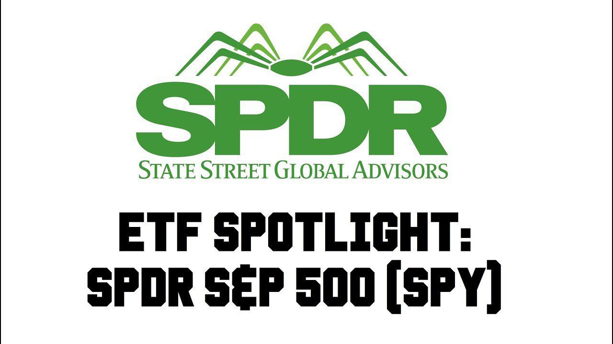

Investment funds play a critical role in financial markets by allowing individuals and institutional investors to pool their resources for investment in a diversified portfolio of assets. These funds can include stocks, bonds, and other securities, and are managed by professional fund managers. The primary advantage of investment funds is diversification, which reduces risk by spreading investments across various asset classes and sectors.

Exchange Traded Funds (ETFs) have become a significant component of investment strategies due to their cost-effectiveness, tax efficiency, and liquidity. An ETF is a type of investment fund that is traded on stock exchanges, similar to individual stocks. ETFs typically track an index, sector, commodity, or other asset classes, providing investors with a broad exposure to markets while maintaining the flexibility to buy and sell shares throughout the trading day.

SPDR (Standard & Poor's Depositary Receipts) ETFs are among the most recognized brands in the ETF landscape. They were introduced by State Street Global Advisors in 1993 with the launch of the SPDR S&P 500 ETF (SPY), which is designed to track the S&P 500 index. This ETF has become one of the largest and most liquid ETFs in the world, serving as a benchmark for many investors.

Algorithmic trading, or algo trading, refers to the use of algorithms—automated sets of rules and calculations executed by computers—to make trading decisions and execute trades on behalf of investors. This method is increasingly prevalent in fund management due to its ability to efficiently process vast amounts of data and execute trades at high speeds. It optimizes trading by managing costs, reducing human error, and identifying arbitrage opportunities.

The purpose of this article is to explore the intersection of investment funds, SPDR ETFs, and algorithmic trading. It will provide insights into how these elements work together in modern financial markets, and how investors and traders can leverage these tools to enhance their investment strategies.

## Table of Contents

## Understanding Investment Funds

Investment funds are collective investment vehicles that pool capital from multiple investors to purchase a diversified portfolio of assets, managed according to specific investment objectives. The main types of investment funds are mutual funds, hedge funds, and exchange-traded funds (ETFs).

**Mutual Funds** are investment vehicles that aggregate money from many investors to invest in securities such as stocks, bonds, and other assets. Managed by professional fund managers, mutual funds offer economies of scale, diversification, and professional management. They are priced at the end of each trading day and shares are redeemed or purchased at their net asset value (NAV).

**Hedge Funds** are private investment funds that employ diverse and complex strategies, including leveraging and derivatives, to achieve high returns. Typically accessible only to accredited investors, they are less regulated than mutual funds. Hedge funds aim for absolute returns, regardless of market conditions, and often charge a management fee plus a performance fee.

**Exchange-Traded Funds (ETFs)** are similar to mutual funds but trade on stock exchanges like individual stocks. ETFs offer diversification, tax efficiency, and low-cost access to a range of asset classes, sectors, or investment strategies. Unlike mutual funds, ETFs can be bought or sold throughout the trading day at market prices.

**Advantages of Investing in Funds**

Investment funds provide significant benefits, primarily diversification and professional management. Diversification reduces risk by spreading investments across various asset classes and securities, thus minimizing the impact of any single security's poor performance. Professional management means investors benefit from the expertise of fund managers who conduct research and make informed investment decisions.

**Comparison: Actively Managed vs. Passive Funds**

Actively managed funds, such as certain mutual funds and hedge funds, employ managers to select securities with the goal of outperforming the market. These funds often incur higher costs due to management fees and transaction costs. 

In contrast, passive funds, which often include ETFs, aim to replicate the performance of a specific index by holding all or a representative sample of securities within the index. Passive funds usually have lower fees and expenses compared to actively managed funds. ETFs, being a prominent type of passive investment, offer investors a cost-effective and flexible way to achieve market returns.

**Investment Funds in Portfolios**

Investment funds serve as foundational components of both individual and institutional portfolios, providing broad market exposure and risk mitigation. Individuals may use funds for retirement savings, education, or other financial goals, benefiting from the inherent advantages of diversification and professional oversight. Institutions, such as pension funds and insurance companies, use funds to meet long-term liability matching or income generation strategies. By including a mix of different fund types, portfolios can be optimized for various risk appetites and investment horizons.

## An Overview of ETFs

Exchange-Traded Funds (ETFs) have emerged as a significant innovation in the investment landscape, providing investors with a flexible and cost-effective means to access a diverse range of asset classes. An [ETF](/wiki/etf-trading-strategies) is a type of investment fund that holds a collection of assets, such as stocks or bonds, and is traded on stock exchanges, much like individual stocks. Unlike mutual funds, ETFs are bought and sold throughout the trading day at market prices, allowing for greater trading flexibility.

**Benefits of ETFs**

ETFs offer several advantages that have contributed to their popularity among investors. One of the primary benefits is lower costs. ETFs typically have lower expense ratios compared to mutual funds because they are often passively managed, tracking an underlying index, which reduces management fees. Additionally, the structure of ETFs allows for in-kind creation and redemption processes, which minimize taxable events and enhance tax efficiency.

Trading flexibility is another significant advantage of ETFs. Investors can trade ETFs at any point during market hours, use stop orders, limit orders, and even options for strategic purposes. This flexibility is not available with mutual funds, which are typically settled only at the close of trading at the net asset value.

**Comparison Between ETFs and Mutual Funds**

While both ETFs and mutual funds serve the fundamental purpose of pooling investor capital to invest in a diversified portfolio, they differ in several key aspects. As mentioned, ETFs are traded on exchanges, providing intraday [liquidity](/wiki/liquidity-risk-premium) and price transparency, whereas mutual funds are priced at the end of the trading day. The fee structure is generally more favorable for ETFs due to their passive management style.

Mutual funds, on the other hand, often offer more varied investment strategies, including active management, where fund managers actively select stocks or bonds in an effort to outperform a particular benchmark. This management style can lead to higher costs and tax implications due to frequent trading within the fund.

**Market Trends in ETF Growth and Popularity**

The ETF market has experienced significant growth over recent decades. This expansion is partly driven by a shift towards passive investing, where investors seek to match the performance of specified indices rather than outperform them. According to the Investment Company Institute, global ETF assets have consistently increased and are projected to continue growing as investors prioritize liquidity, cost efficiency, and transparency.

Technological advancements and increased adoption of [algorithmic trading](/wiki/algorithmic-trading) strategies have further propelled ETFs’ growth. Algorithms facilitate efficient trading and [arbitrage](/wiki/arbitrage) opportunities, ensuring that ETF prices remain close to their net asset values, enhancing market stability. Additionally, the increasing availability of theme-based and sector-specific ETFs, such as those focused on technology, healthcare, or environmental, social, and governance ([ESG](/wiki/esg-investing)) criteria, has attracted diverse investor interest.

In conclusion, ETFs represent a crucial component of modern investment strategies, offering a blend of cost efficiency, tax advantages, and trading versatility that is particularly appealing in today's fast-evolving financial markets. Their differentiated structure compared to mutual funds, coupled with technological innovations in trading, have cemented their role as a staple in both individual and institutional investment portfolios.

 to SPDR ETFs

SPDR ETFs, also known as Standard & Poor's Depositary Receipts, have been instrumental in shaping the landscape of exchange-traded funds. Established by State Street Global Advisors in 1993, the SPDR S&P 500 ETF Trust (SPY) was the pioneering ETF, designed to track the S&P 500 Index. This innovation provided investors with a novel means of gaining diversified exposure to the U.S. equity market, combining the flexibility of stock trading with the diversification benefits of mutual funds.

The evolution of SPDR ETFs has seen the expansion of the product range to include various asset classes and sectors, catering to a wide spectrum of investment strategies. For instance, beyond the flagship SPDR S&P 500 ETF (SPY), SPDR ETFs cover sectors such as technology (e.g., Technology Select Sector SPDR Fund, XLK), real estate (e.g., Real Estate Select Sector SPDR Fund, XLRE), and emerging markets (e.g., SPDR Portfolio Emerging Markets ETF, SPEM). This broad array of offerings enables investors to tailor their portfolios according to their specific risk tolerance and market outlook.

One of the key advantages of SPDR ETFs is their cost-effectiveness. SPDR ETFs typically have lower expense ratios compared to actively managed mutual funds, making them an attractive option for cost-conscious investors. Additionally, SPDR ETFs offer tax efficiency, as their structure allows for the in-kind creation and redemption process, minimizing capital gains distributions. This is particularly beneficial for investors in taxable accounts seeking to defer tax liabilities.

Furthermore, SPDR ETFs provide enhanced trading flexibility. They can be bought and sold throughout the trading day at market prices, similar to individual stocks. This intraday liquidity offers investors the ability to execute trades in real-time, capitalize on short-term market movements, and implement tactical asset allocation strategies with ease.

In summary, SPDR ETFs have played a pivotal role in democratizing access to diverse investment opportunities. With their origins rooted in the introduction of the SPY, SPDR ETFs have grown to encompass a variety of sectors and asset classes, offering investors a combination of cost efficiency, tax advantages, and trading flexibility. These attributes make SPDR ETFs a compelling choice for both individual and institutional investors seeking to optimize their investment portfolios. 

For more information on SPDR ETFs, investors can refer to resources such as the [State Street Global Advisors website](https://www.ssga.com).

## Algo Trading in Financial Markets

Algorithmic trading, commonly known as algo trading, is an advanced method of executing trades using pre-programmed instructions or algorithms. These algorithms are designed to account for a wide range of variables, including timing, price, and [volume](/wiki/volume-trading-strategy). The central goal of algorithmic trading is to leverage the speed and efficiency of computers to perform high-frequency trading operations, often beyond human capability.

At its core, algo trading utilizes algorithms to automate complex trading strategies. These algorithms can be constructed using a variety of mathematical models and [statistical arbitrage](/wiki/statistical-arbitrage) tactics that analyze market data and identify trading opportunities. For example, an algorithm might be designed to execute a trade when a particular asset reaches a certain price or when a specific market pattern emerges.

In practice, algorithmic trading significantly enhances the speed and efficiency of trade execution. By relying on pre-set criteria, algorithms can make rapid decisions and perform operations at lightning speed, often within milliseconds. This is particularly advantageous in high-frequency trading ([HFT](/wiki/high-frequency-trading-strategies)) environments, where the ability to transact quickly can lead to substantial profit margins.

However, algo trading does bring about certain challenges and risks. One of the most prominent examples is the phenomenon known as a flash crash, where the market faces sudden and drastic price drops due to large volumes of automated orders being executed simultaneously. Such events highlight the potential [volatility](/wiki/volatility-trading-strategies) and systemic risk introduced by algorithmic trading.

Additionally, regulatory issues are a significant concern. The opaque nature of certain algorithms can make it difficult for regulatory bodies to monitor and regulate the fairness and legality of trading activities. This has prompted calls for more stringent oversight and transparency in algo trading practices.

Despite these challenges, the benefits of algo trading, such as increased market liquidity and reduced transaction costs, continue to drive its adoption across global financial markets. As technology advances, the sophistication and capabilities of these algorithms are expected to grow, raising further discussions on the balance between innovation and regulation in financial markets.

## The Intersection of SPDR ETFs and Algorithmic Trading

Algorithmic trading is increasingly utilized in the management and trading of SPDR ETFs due to its ability to enhance trading efficiency, reduce costs, and exploit arbitrage opportunities. Algorithmic trading involves the use of complex mathematical models and automated systems to execute trades at high speed, based on predefined criteria and market conditions. 

In the context of SPDR ETFs, such as the SPDR S&P 500 ETF Trust (SPY), algorithmic trading can be highly effective in several ways. For instance, it can be used to maintain the ETF's benchmark index replication, ensuring that the fund accurately tracks the performance of the underlying index. This involves rebalancing the fund's holdings as necessary to match the weightings of the constituent securities in the index.

The application of algorithmic trading in managing SPDR ETFs offers several benefits:

1. **Efficiency and Speed**: Algorithms can process vast amounts of market data in real-time to identify trading opportunities or the need for adjustments in ETF holdings. This capability is crucial for SPDR ETFs as they are required to manage large portfolios and track indices accurately. Algorithms execute trades faster than any human, ensuring timely reactions to market movements.

2. **Cost Minimization**: By automating trading decisions, ETFs can significantly reduce transaction costs associated with human errors, slippage, and timing delays. Furthermore, algorithms can optimize trade execution by determining the most cost-effective manner to execute large orders, such as breaking them into smaller parts to minimize market impact.

3. **Arbitrage Opportunities**: Algorithmic trading systems can detect and capitalize on arbitrage opportunities that arise when an ETF's market price deviates from its net asset value (NAV). Algorithms can buy undervalued shares or sell overvalued ones to exploit these discrepancies, helping to maintain market efficiency and close the price-NAV gap.

### Case Studies and Industry Insights

Several industry examples highlight the successful implementation of algorithmic trading in conjunction with SPDR ETFs. For instance, [quantitative trading](/wiki/quantitative-trading) firms often employ sophisticated algorithms specifically designed for trading large volumes of ETFs like SPY. These algorithms use statistical arbitrage techniques to identify price inefficiencies across different exchange venues and execute trades to lock in profits from small price discrepancies.

A notable case is the use of execution algorithms by institutional investors to accumulate or divest significant positions in SPDR ETFs without substantially affecting the market price. These algorithms incorporate strategies like volume-weighted average price (VWAP) or time-weighted average price (TWAP) to divide orders into smaller chunks, executing them across various liquidity pools over time.

In another example, some asset management firms use [machine learning](/wiki/machine-learning) algorithms to enhance their trading strategies for SPDR ETFs. These algorithms adapt by learning from historical data and market conditions, optimizing trade execution and improving portfolio performance.

In conclusion, the integration of algorithmic trading with SPDR ETFs has proven to be a game-changer, mitigating costs, enhancing execution quality, and maintaining price efficiencies. As financial technologies continue to advance, it is likely that even more sophisticated algorithmic strategies will be developed, further solidifying the role of algorithmic trading in the ETF market.

## Future Trends

Predictions for the growth of SPDR ETFs over the coming years suggest a continued and robust expansion of the market. This growth is driven by several factors, including increasing investor demand for diversified, low-cost, and transparent investment options. As investors become more sophisticated, the allure of Exchange Traded Funds (ETFs), particularly SPDR ETFs known for their reliability and extensive portfolio options, is expected to remain strong.

In parallel, algorithmic trading technology and strategy are poised to undergo significant advancements. The evolution of [artificial intelligence](/wiki/ai-artificial-intelligence) and machine learning algorithms will likely lead to more sophisticated and adaptive trading strategies. These technologies can process vast amounts of market data at unprecedented speeds, identifying and executing trades faster and more accurately than human traders. The use of neural networks and advanced analytics can enhance decision-making processes, enabling better predictions of market movements and more efficient risk management.

Regulatory changes will also play a critical role in shaping the future of both ETFs and algorithmic trading. Globally, regulators are working to adapt existing frameworks to keep pace with technological innovations and to ensure market stability and investor protection. This could involve setting new standards for algorithmic trading systems, particularly in terms of transparency and accountability, to mitigate risks such as flash crashes caused by automated systems. For ETFs, particularly SPDR ETFs, enhancing disclosure requirements and fostering market competition can further improve investor trust and participation.

Emerging trends such as Environmental, Social, and Governance (ESG) ETFs are gaining traction, presenting new opportunities and challenges for algorithmic trading. ESG investing focuses on integrating ethical considerations into investment decisions, and the rise of ESG ETFs reflects a growing demand for socially responsible investment options. Algorithmic trading can be tailored to incorporate ESG criteria, allowing for the rapid assessment of ESG compliance within potential investment targets. However, accurately quantifying ESG factors requires sophisticated data analytics, which may spur further innovation in this area.

Overall, SPDR ETFs are expected to sustain their growth trajectory due to increased market acceptance and innovation in algorithmic trading. The continuous development of trading technologies, alongside a responsive regulatory environment and the rising prominence of ESG considerations, will shape the landscape for both ETFs and algorithmic trading in the years ahead. Investors and financial institutions should remain vigilant and adapt to these evolving trends to capitalize on the opportunities presented.

## Conclusion

In concluding this exploration, it is essential to reinforce the intricate relationship between investment funds, SPDR ETFs, and algorithmic trading within contemporary financial markets. Investment funds, including SPDR ETFs, offer a range of benefits such as diversification and professional management, positioning them as vital components in the portfolios of both individual and institutional investors. The advantages offered by ETFs—lower costs, tax efficiency, and trading flexibility—underscore their increasing popularity and adoption. Among these, SPDR ETFs stand out due to their pioneering history and the broad array of investment options they provide.

Algorithmic trading, with its reliance on sophisticated algorithms to automate trading decisions and executions, represents a technological advancement that continues to shape market dynamics. The application of such technology to the trading of SPDR ETFs enhances operational efficiency, reduces transaction costs, and facilitates the capture of arbitrage opportunities. Nevertheless, as algorithmic trading permeates this segment, it is accompanied by challenges such as potential flash crashes and heightened regulatory scrutiny, which require ongoing vigilance.

Staying abreast of developments within investment funds, SPDR ETFs, and algorithmic trading is critical for investors and traders. As the financial landscape evolves with emerging trends like ESG ETFs and ongoing advancements in algorithmic trading technology, informed decision-making becomes ever more crucial. Therefore, market participants are encouraged to consistently evaluate these factors to optimize their investment strategies and ensure they are well-positioned to capitalize on future growth and opportunities in this dynamic environment.

## References & Further Reading

[1]: ["Advances in Financial Machine Learning"](https://www.amazon.com/Advances-Financial-Machine-Learning-Marcos/dp/1119482089) by Marcos Lopez de Prado

[2]: State Street Global Advisors. [SPDR ETFs Overview](https://www.ssga.com/us/en/individual)

[3]: ["Machine Learning for Algorithmic Trading"](https://github.com/stefan-jansen/machine-learning-for-trading) by Stefan Jansen

[4]: ["Quantitative Trading: How to Build Your Own Algorithmic Trading Business"](https://www.amazon.com/Quantitative-Trading-Build-Algorithmic-Business/dp/1119800064) by Ernest P. Chan

[5]: U.S. Securities and Exchange Commission. ["Exchange-Traded Funds (ETFs)"](https://apnews.com/article/bitcoin-exchange-traded-funds-etf-sec-59a5bb81ab891af57a1bd1765024144f) 

[6]: Financial Conduct Authority. ["Algorithmic Trading Compliance in Investment Management"](https://www.fca.org.uk/publication/multi-firm-reviews/algorithmic-trading-compliance-wholesale-markets.pdf)