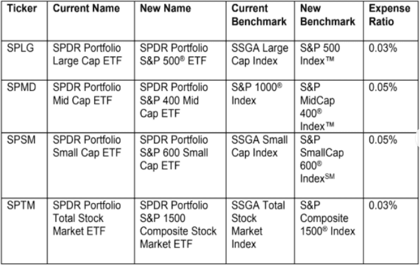

Exchange-traded funds (ETFs) have transformed financial market accessibility for institutional and retail investors alike, providing a versatile investment vehicle that combines the diversification benefits of mutual funds with the trading flexibility of stocks. Among the many types of ETFs available, SPDR ETFs, managed by State Street Global Advisors, stand out due to their comprehensive range of offerings and strategic market influence. These funds are designed to give investors straightforward access to a wide array of asset classes and investment strategies.

The rapid pace and complex nature of modern financial markets have been significantly influenced by algorithmic trading, often referred to as algo trading. This method utilizes sophisticated algorithms to automate trading processes, offering unprecedented speed and accuracy in the execution of trades. The integration of such technology has not only improved the efficiency of trading practices but has also opened new pathways for strategic diversification.



In this article, we explore SPDR ETFs and the technological advances in trading, highlighting how these elements have reshaped investment frameworks. With SPDR ETFs offering low cost and liquid market exposure, and algorithmic trading enhancing precision and speed, their combination presents a powerful toolkit for contemporary investors. Advances in technology and access to vast amounts of market data continue to push the boundaries of what is possible in investment strategy, making it essential for investors to understand and leverage these tools to optimize their portfolio management.

## Table of Contents

## Understanding Exchange-Traded Funds (ETFs)

Exchange-Traded Funds (ETFs) are investment vehicles that aggregate a collection of securities and allow them to be traded on major stock exchanges similar to individual stocks. This dual nature enables ETFs to combine the broad diversification benefits typically associated with mutual funds and the trading flexibility of stocks. This unique structure makes ETFs a popular choice for both individual and institutional investors seeking to diversify their portfolios without the constraints of minimum investment thresholds or redemption fees often tied to mutual funds.

The primary advantages of ETFs include cost-effectiveness, tax efficiency, and transparency. Unlike mutual funds, which are often actively managed and incur higher management fees, many ETFs are passively managed, tracking indices and resulting in lower expense ratios. The tax efficiency of ETFs is attributed to their unique "in-kind" creation and redemption process which helps minimize capital gains distributions. This mechanism facilitates the swapping of ETF shares for the underlying securities, thereby avoiding taxable events that typically arise from buying and selling securities within a mutual fund.

Transparency is another hallmark of ETFs since their holdings are typically disclosed daily. This contrasts with traditional mutual funds, which usually disclose holdings on a quarterly basis. The transparency ensures that investors are well-informed about the precise allocation of assets within the ETF, making it easier to align investment choices with specific financial goals.

ETFs offer a diverse selection, allowing investors substantial flexibility to choose funds that focus on specific asset classes, industries, or geographies. For instance, investors can select from ETFs that target equities, such as the S&P 500 or international stocks, fixed-income securities like government and corporate bonds, or even commodities and real estate. This extensive range allows investors to tailor their portfolios to meet particular investment objectives or risk profiles.

Overall, ETFs' flexibility, combined with their diversified exposure and cost advantages, makes them an attractive option for investors aiming to achieve strategic market exposure while minimizing expenses and maximizing tax efficiency.

## Overview of SPDR ETFs

SPDR ETFs, or Standard & Poor's Depositary Receipts, were introduced by State Street Global Advisors in 1993. They represent a significant innovation in investment vehicles by allowing investors to buy and sell shares representing a slice of an index, much like a traditional stock. The SPDR S&P 500 [ETF](/wiki/etf-trading-strategies) Trust (SPY) is perhaps the most iconic of these ETFs. As one of the original ETFs, SPY provides exposure to the S&P 500 Index, serving as a benchmark for broad market performance in the United States.

SPDR ETFs are diversified across diverse asset classes and sectors, making them attractive for both broad and targeted investment strategies. They include offerings in equities, fixed income, sectors, industries, and commodities, catering to the varied needs of institutional and retail investors. This diversity allows investors to efficiently achieve specific market exposures and strategic objectives.

The cost-effectiveness of SPDR ETFs is one of their most defining features. Typically, they [carry](/wiki/carry-trading) lower expense ratios compared to mutual funds, which translates into higher net returns for investors over time. The trading flexibility of ETFs, including SPDRs, allows investors to execute trades throughout the trading day at market prices, much like stocks, affording opportunities to react swiftly to market news and fluctuations.

Furthermore, SPDR ETFs offer tax advantages. Unlike mutual funds, ETFs typically have structures that minimize capital gains distributions, ensuring that investors assume fewer tax liabilities. This is primarily due to the creation and redemption mechanism of ETFs, which allows for in-kind transactions that do not trigger capital gains.

In conclusion, SPDR ETFs are a cornerstone of modern investment portfolios, offering a blend of innovation, cost efficiencies, trading [liquidity](/wiki/liquidity-risk-premium), and tax advantages that empower both individual and institutional investors to navigate the complexities of financial markets effectively.

## Exploring Algorithmic Trading

Algorithmic trading automates the execution of trades through computers using complex mathematical models and sophisticated algorithms. These pre-programmed instructions take into account several variables such as time, price, and [volume](/wiki/volume-trading-strategy) to identify trading opportunities with minimal human intervention. This automation significantly enhances the execution speed, allowing traders to capture market opportunities that might last only a fraction of a second.

The precision and efficiency inherent in [algorithmic trading](/wiki/algorithmic-trading) arise from its ability to process vast amounts of data swiftly. Algorithms can simultaneously monitor several markets, adapting to fluctuating conditions and making split-second decisions that would be impossible for a human trader. For example, algorithmic trading systems can execute trades when certain criteria are met — say, if a stock surpasses a specified price threshold or if the market as a whole exhibits a particular pattern.

Several common strategies are prevalent in algorithmic trading. Trend-following strategies, which capitalize on the [momentum](/wiki/momentum) of securities, involve algorithms that detect and follow upward or downward trends in market prices. Arbitrage strategies exploit price differentials of the same or similar financial instruments in different markets, aiming to profit from imbalances. Mean reversion strategies assume that the prices of securities will revert to their historical averages over time, initiating trades based on this principle.

Despite the numerous advantages that algorithmic trading offers, there are inherent risks. The very speed and efficiency that characterize algorithmic trades can contribute to increased market [volatility](/wiki/volatility-trading-strategies), as evidenced by events such as the 2010 "Flash Crash". Moreover, the dependency on technology means that any glitches or faults in the algorithms can lead to substantial financial losses. Regulatory scrutiny is also a significant concern, as compliance with the evolving legal framework governing algorithmic trading is essential to avoid sanctions.

Algorithmic trading also raises concerns about fairness and transparency, prompting ongoing debates about its impact on traditional market participants. The sophistication and complexity of these algorithms often necessitate rigorous [backtesting](/wiki/backtesting) and continuous refinement, ensuring that they adapt to new market conditions and comply with regulatory standards.

Overall, while algorithmic trading presents a powerful tool for modern traders—enhancing speed, efficiency, and the ability to exploit fleeting market opportunities—it requires careful management to mitigate associated risks.

## The Intersection of SPDR ETFs and Algorithmic Trading

Integrating SPDR ETFs with algorithmic trading strategies enhances trading efficiency and reduces costs, capitalizing on the distinct attributes of both financial instruments and technological advancements. SPDR ETFs, managed by State Street Global Advisors, are renowned for their liquidity and predictable pricing patterns, making them attractive assets for algorithmic trading, which relies on executing trades based on complex mathematical models and predefined criteria.

One of the primary benefits of combining SPDR ETFs with algorithmic trading is the facilitation of automated rebalancing. Automated rebalancing is a process where the proportion of different assets in a portfolio is adjusted automatically to maintain a desired asset allocation. This is achieved by leveraging algorithms to monitor market movements continuously and execute trades without human intervention, thus ensuring that the investment strategy aligns with the intended risk-return profile. By integrating SPDR ETFs, which cover a wide array of market segments, investors can efficiently manage diversified portfolios with minimal intervention.

Arbitrage opportunities also present significant benefits when utilizing SPDR ETFs in algorithmic trading strategies. Since SPDR ETFs are typically highly liquid with tight spreads, algorithmic traders can exploit discrepancies between the ETF market prices and the net asset value of the underlying assets. By employing [arbitrage](/wiki/arbitrage) strategies, traders can capitalize on these price differences across different market venues or through intra-day fluctuations, enhancing potential returns with reduced manual oversight.

Cost-effective execution is another advantage of deploying algorithmic strategies with SPDR ETFs. Algorithms are designed to optimize trade execution by splitting orders to minimize market impact, thereby reducing transaction costs. Trading SPDR ETFs, known for their lower expense ratios and tight bid-ask spreads, further enhances this cost-efficiency, allowing traders to implement strategies at lower operational costs compared to traditional trading methods.

Despite the potential benefits, there are critical considerations in integrating SPDR ETFs with algorithmic trading methodologies. Ensuring liquidity is paramount; algorithms must be developed with an understanding of the liquidity conditions of both the ETFs and the underlying assets to avoid adverse price movements and slippage during execution. Additionally, risk management mechanisms must be incorporated to mitigate potential losses arising from sudden market anomalies or high market volatility. This includes setting appropriate stop-loss levels and employing risk-control measures to safeguard against unintended outcomes.

Furthermore, adherence to evolving regulations is crucial to prevent inadvertent breaches that might arise due to the fast-paced nature of algorithmic trading. Regulatory compliance requires constant monitoring and updating of algorithms to ensure alignment with legal standards, particularly concerning market manipulation and fair trading practices.

In summary, the intersection of SPDR ETFs and algorithmic trading offers substantial advantages in terms of efficiency, cost reduction, and advanced strategy implementation. However, due diligence in liquidity management, risk mitigation, and regulatory adherence is essential to maximize the benefits while minimizing potential pitfalls.

## Advantages of Algorithmic Trading with SPDR ETFs

Algorithmic trading with SPDR ETFs provides several benefits that can optimize and streamline investment strategies, offering both institutional and retail investors a competitive edge in the financial markets.

One of the primary advantages is the rapid execution of trades. Algorithmic systems operate with minimal latency, enabling swift buying and selling of SPDR ETFs, which is crucial in volatile market conditions. This speed can reduce slippage—the difference between the expected price of a trade and the actual execution price—leading to more favorable investment outcomes. Additionally, the inherent liquidity of SPDR ETFs aligns well with algorithmic systems, which thrive on fast execution and high volume.

Another benefit is the reduction in transaction costs. Algorithms can optimize orders to minimize fees by dynamically adjusting order sizes and strategically timing trades. These cost efficiencies are significant in high-frequency trading environments where margins are tight, and minimizing expenses directly impacts profitability.

Exploiting discrepancies between market prices and net asset values (NAV) is another potential advantage. SPDR ETFs, like other ETFs, sometimes trade at slight premiums or discounts to their NAV. Algorithmic trading can detect and capitalize on these inefficiencies rapidly, executing arbitrage strategies before human traders can react.

Algorithmic trading also facilitates comprehensive backtesting and strategy refinement. By using historical data, traders can simulate various scenarios, allowing them to test the efficacy of their strategies under different market conditions without risking capital. This experimentation is essential for refining algorithms to adapt to the specific behaviors of SPDR ETFs.

Lastly, the adaptability provided by algorithmic trading enhances portfolio management. Algorithms can be programmed to adjust strategies in response to changing market conditions, reallocating investments to maintain a balanced portfolio in real-time. This adaptability can include shifting between different SPDR ETFs based on market trends, optimizing portfolio performance even in unpredictable environments.

Incorporating algorithmic trading with SPDR ETFs thus offers enhanced speed, cost-efficiency, and strategic agility, contributing to effective and responsive investment management.

## Challenges and Considerations

High-frequency algorithmic trading ([HFT](/wiki/high-frequency-trading-strategies)) requires a robust technological infrastructure capable of processing vast volumes of data with minimal latency. The speed at which trades are executed in HFT is crucial; even microsecond delays can lead to significant discrepancies in trade outcomes. Therefore, HFT environments often employ co-location services, allowing trading firms' servers to be physically near exchange servers, reducing signal travel time. High-performance computing systems, equipped with advanced processors and optimized for throughput and low-latency networking, form the backbone of HFT operations.

Market anomalies and sudden events pose significant challenges to algorithmic trading, as these conditions can lead to drastic price movements and increased volatility. Examples include the "flash crash" of May 6, 2010, where algorithmic trading contributed to a rapid market drop. To mitigate such risks, trading algorithms must be equipped with rigorous risk management protocols, such as real-time monitoring systems and the implementation of circuit breakers that halt trading when extreme conditions are detected.

Regulatory compliance is critical to ensure that high-frequency trading firms operate within legal frameworks. Authorities like the U.S. Securities and Exchange Commission (SEC) and the European Securities and Markets Authority (ESMA) have established guidelines to monitor trading activities. Compliance with these regulations requires the continuous updating of trading algorithms to adhere to changing rules, maintaining detailed records of trading activities, and ensuring that systems are resilient against manipulative practices like spoofing or layering.

Combining technical algorithms with [fundamental analysis](/wiki/fundamental-analysis) offers a balanced approach to algorithmic trading. Technical analysis, which relies heavily on historical price data and statistical indicators, can be augmented with fundamental analysis that considers economic indicators, financial statements, and other real-world data. This hybrid strategy can help create more adaptive and robust trading algorithms. For example, incorporating sentiment analysis from news articles or earnings reports can provide context that pure technical strategies might overlook.

# Example of a Python script for backtesting a simple moving average crossover strategy

```python
import pandas as pd
import numpy as np

# Load historical price data into a DataFrame
data = pd.read_csv('historical_prices.csv', parse_dates=['Date'], index_col='Date')

# Calculate short-term and long-term moving averages
data['SMA_short'] = data['Close'].rolling(window=50).mean()
data['SMA_long'] = data['Close'].rolling(window=200).mean()

# Generate signals: 1 for buy, -1 for sell
data['Signal'] = np.where(data['SMA_short'] > data['SMA_long'], 1, -1)

# Calculate daily returns
data['Daily_Return'] = data['Close'].pct_change()

# Calculate strategy returns
data['Strategy_Return'] = data['Signal'].shift(1) * data['Daily_Return']

# Compound strategy returns
strategy_total_return = (data['Strategy_Return'] + 1).cumprod()[-1]

print(f"Total return from the strategy: {strategy_total_return * 100:.2f}%")
```

This script exemplifies how blending technical algorithms with data can be applied in practice, providing a basis for further refinement and decision-making.

## Conclusion

SPDR ETFs and algorithmic trading are vital components of contemporary investment strategies, providing investors with a potent combination of diversification, efficiency, and advanced portfolio management. These instruments offer a dual advantage: the extensive range and low-cost nature of SPDR ETFs and the precision and speed of algorithmic trading. Together, they enable investors to navigate complex markets with greater confidence and accuracy.

Investors are encouraged to explore these financial tools to tailor their strategies to meet specific objectives. By thoroughly understanding the mechanics and benefits of both SPDR ETFs and algorithmic trading, investors can position themselves to optimize gains while managing risks effectively. This involves not only studying the available resources and insights but also actively engaging with the changing market dynamics.

With technological advancements and evolving market conditions, staying informed and adaptable is crucial for long-term success. Investors and financial professionals should ensure their knowledge remains current, encompassing both innovations in algorithmic trading and the expanding array of ETFs available. Mastery of these instruments promises enhanced portfolio outcomes, making them indispensable in today's financial landscape.

## References & Further Reading

Explore in-depth [books](/wiki/algo-trading-books) like "Algorithmic Trading" by Anonymous and "Advances in Financial Machine Learning" by Marcos López de Prado to gain a comprehensive understanding of the underlying principles and techniques utilized in these fields. These texts offer valuable insights into the design and execution of algorithmic trading strategies, along with advanced [machine learning](/wiki/machine-learning) applications that can enhance decision-making processes.

For up-to-date information on SPDR ETFs and the integration of algorithmic trading strategies, consulting resources from State Street Global Advisors is essential. Their reports and publications provide an overview of market conditions, strategic innovations, and regulatory considerations.

Additionally, staying informed about regulatory frameworks and compliance standards is crucial, particularly considering the dynamic nature of financial markets. Regularly review guidelines and publications from regulatory bodies such as the U.S. Securities and Exchange Commission (SEC) and the Financial Industry Regulatory Authority (FINRA).

For practical applications and hands-on experience, various digital resources are available. Online algorithmic trading courses offer training on the implementation of trading strategies using programming languages like Python. Platforms like Coursera, edX, and Udacity provide courses that cover both basic and advanced levels of algorithmic trading.

Digitally accessible datasets, such as those available from Quandl or Kaggle, allow users to perform backtesting and refine trading strategies. Analyzing historical market data can help identify patterns and validate the effectiveness of algorithmic approaches.

Lastly, engaging with financial and investment forums, newsletters, and academic journals can keep investors and professionals abreast of new strategies, technological advancements, and market trends. These platforms facilitate the exchange of ideas and foster collaboration among the global trading community.

